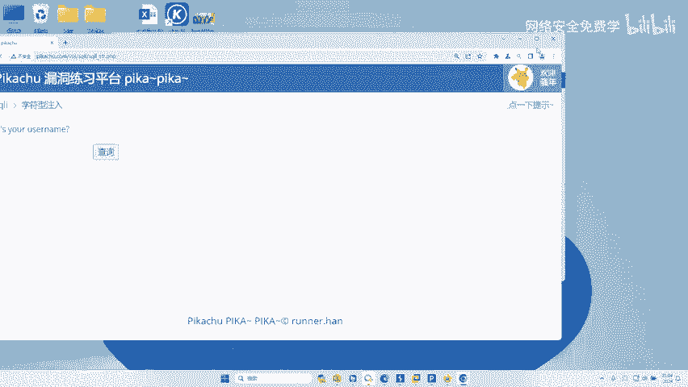
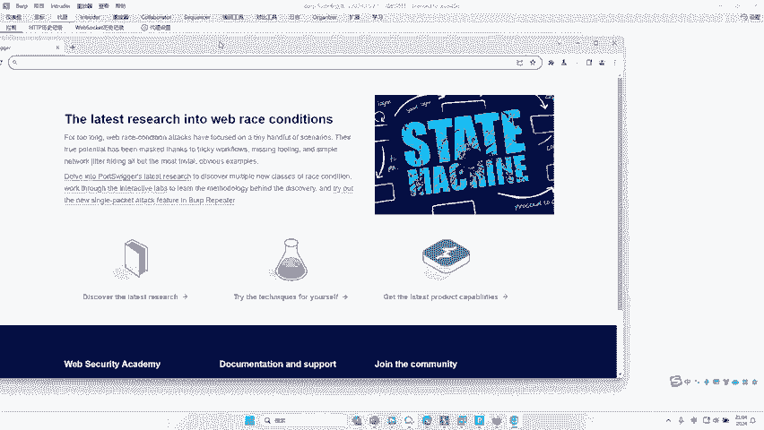
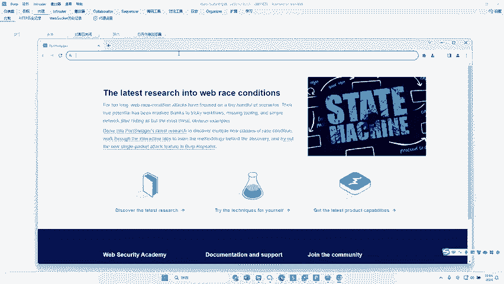
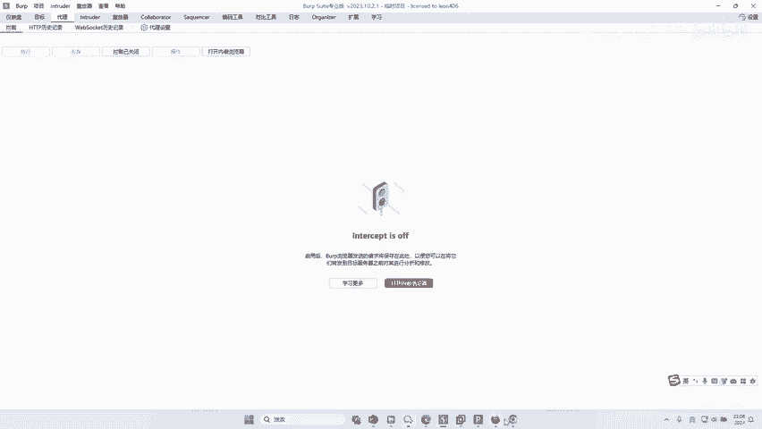
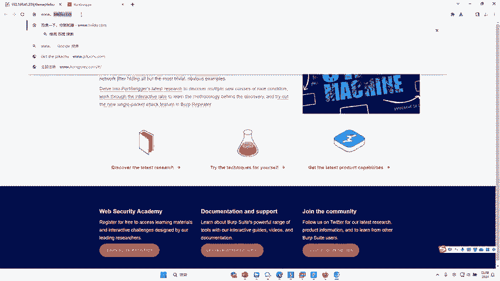
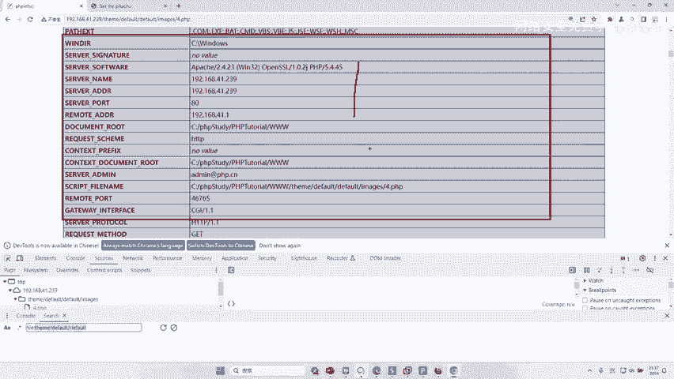
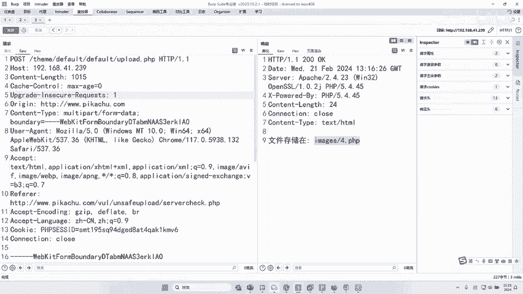

# 网络安全实战：P43：从FUZZ参数到远程RCE漏洞利用

## 概述
在本节课中，我们将通过一个真实的漏洞挖掘案例，学习如何从模糊测试（FUZZ）网站参数开始，逐步发现并利用一个远程代码执行（RCE）漏洞，最终实现对目标服务器的控制。这个案例源于一次真实的渗透测试，并获得了相应的赏金。我们将完整还原漏洞的发现和利用过程。

---

## 漏洞发现背景
上一节我们介绍了模糊测试的基本概念，本节中我们来看看如何在实际场景中应用它。

该漏洞来源于一个真实的实战案例。由于原漏洞点已被修复，我们将其在本地靶场环境中进行了复现。通过此漏洞，我们当时获得了1300美元的赏金。接下来，我们将还原发现这个价值1300美元漏洞的实际过程。

## 初始信息收集与目录发现
在持续对某个网站进行漏洞挖掘约一天多却一无所获后，我们无意中打开了浏览器的开发者工具（F12）。

在检查网站资源时，我们发现了一个特殊的目录。虽然实际目标网站的目录名称不同，但原理一致。我们复制了这个目录路径。

## 对目录进行FUZZ测试
发现目录后，我们直接访问它，但页面是空白的。这提示我们该目录下可能存在隐藏文件。于是，我们决定对该目录下的文件进行模糊测试。

以下是进行FUZZ测试的步骤：
1.  将目标URL导入Burp Suite的Intruder模块。
2.  设置攻击位置，通常对文件扩展名或路径部分进行爆破。
3.  加载合适的字典（Payload），例如包含常见文件名（如 `admin.php`, `upload.php`, `config.ini` 等）的列表。
4.  开始攻击并分析响应。

通过FUZZ，我们发现了一个名为 `upload.php` 的文件。

## 分析并绕过上传接口限制
发现 `upload.php` 后，我们尝试访问它。页面返回错误提示：“The request method is not allowed”。这表明该接口不允许当前的HTTP请求方法（默认为GET）。

我们知道HTTP常见的请求方法有GET和POST。因此，我们需要将请求方法从GET更改为POST。我们使用Burp Suite的Repeater模块修改请求：
*   原始请求：`GET /target_directory/upload.php`
*   修改后：`POST /target_directory/upload.php`

修改后发送请求，服务器返回了“Bad Request”。这是因为POST请求通常需要携带数据体（Body）。我们尝试在Body中添加简单参数，如 `a=1` 或 `b=2`，但依然返回“Bad Request”。

此时我们注意到文件名是 `upload.php`，这很可能是一个文件上传接口。我们猜测，发送普通参数不被接受，但如果发送一个真正的文件上传数据包，或许能通过验证。

## 构造合法的文件上传请求
为了构造一个合法的上传请求，我们需要一个正常网站的文件上传数据包作为模板。

我们访问一个测试用的上传页面，并拦截一个正常的上传图片的HTTP请求包。这个数据包包含了完整的、被服务器认可的文件上传格式。

关键步骤：
1.  在Repeater中，将之前 `upload.php` 的请求地址替换为我们的目标地址。
2.  将正常文件上传数据包的全部内容复制过来。
3.  直接发送可能仍会失败，因为Burp Suite可能未正确识别多部分表单数据。我们需要在请求体顶部**手动添加一行分界符**，或者使用“Paste from file”功能确保格式正确，使`Content-Disposition`等部分显示为**语法高亮**（如红色），这表示Burp Suite已正确解析。

发送构造好的数据包后，响应发生了变化，出现了 “upload_file” 相关的字样，这证明服务器开始处理我们的上传请求了。

## FUZZ关键上传参数
虽然请求格式正确了，但上传仍然失败，提示“Bad Request”。我们观察到响应中的错误信息与数据包里的 `upload_file` 参数值有关。这提示我们，需要找到服务器期望的**正确参数名**。

我们再次使用Intruder模块，对POST数据体中的参数名（即 `upload_file` 这个字段名）进行模糊测试。

以下是FUZZ参数名的过程：
1.  在参数名位置设置攻击点。
2.  使用一个包含各种常见文件上传参数名（如 `file`, `filename`, `upload`, `fileToUpload` 等）的字典作为Payload。
3.  开始攻击并筛选响应。

通过过滤掉包含“bad”的响应，我们找到了一个特殊的参数名 `fi_name`。当使用 `fi_name` 时，错误信息变成了关于图片类型（`image/png`）不被允许。这说明我们找对了参数名，但服务器还对**文件类型（Content-Type）** 有校验。

## FUZZ正确的Content-Type
接下来，我们需要找到服务器允许的Content-Type值。我们针对 `Content-Type` 这个字段进行新一轮的模糊测试。

以下是FUZZ Content-Type的步骤：
1.  在 `Content-Type: image/png` 的 `image/png` 处设置攻击点。
2.  加载一个包含各种MIME类型（如 `image/jpeg`, `application/pdf`, `text/plain` 等）的字典。
3.  **注意**：需要取消Burp Suite对Payload的URL编码，因为`/`符号被编码后会导致校验失败。
4.  开始攻击，并根据**响应长度**或**状态码**排序，寻找与众不同的响应。

我们发现了一个状态码为206的响应，提示“2.png already exists”。这表明我们找到了正确的Content-Type，并且服务器存在**文件已存在**的检测逻辑。

## 上传WebShell并获取RCE
找到正确的参数名和Content-Type后，上传流程就通了。服务器提示“2.png已存在”，我们只需换一个文件名即可。

最终利用步骤：
1.  将上传的文件名改为一个不存在的名字，例如 `4.php`。
2.  最关键的一步：将文件内容替换为PHP WebShell代码，例如：`<?php @eval($_POST[‘cmd’]);?>`。
3.  发送修改后的上传请求。
4.  请求成功，服务器返回文件存储路径。
5.  直接访问上传的 `4.php` 文件，并传递命令参数（如 `?cmd=phpinfo();`），成功执行了PHP代码，证明了远程代码执行漏洞的存在。

至此，我们通过FUZZ发现了隐藏的上传点，通过FUZZ找到了正确的上传参数名和Content-Type，最终上传WebShell并实现了远程代码执行，控制了目标服务器。

## 总结与核心思想
本节课中我们一起学习了如何将模糊测试技术应用于真实的漏洞挖掘场景，从一个不起眼的目录出发，通过层层FUZZ，最终发现并利用了一个远程代码执行漏洞。

整个过程的精髓可以概括为：**“在HTTP请求包中，所有肉眼可见的参数、路径、头信息值，都可以成为模糊测试的对象”**。

*   **核心公式**：`漏洞发现 = 观察 + 猜测 + 系统化的测试（FUZZ）`
*   **关键代码思维**：用自动化工具（如Burp Suite Intruder）替代手工重复测试，对每个可疑点用大量Payload进行验证。

对于初学者，可能对“文件上传漏洞”、“参数校验”等具体漏洞原理感到陌生，这很正常。本节课的首要目的是建立一种**方法论上的认知**：模糊测试是一种强大的、半自动化的漏洞发现手段。它的难点不在于工具使用，而在于：
1.  **知道在哪里用**：识别出哪些地方（如参数、路径、头）值得测试。
2.  **知道用什么字典**：根据上下文准备或选择合适的测试用例（Payload列表）。
3.  **知道如何分析结果**：从海量响应中快速定位异常行为。

技术本身并不复杂，但知道在何时、何地、如何应用这些技术，需要经验的积累。希望本节课为你种下了一颗种子，在未来学习网络安全道路上的某一刻，你能豁然开朗：“原来模糊测试是这么用的！”。

