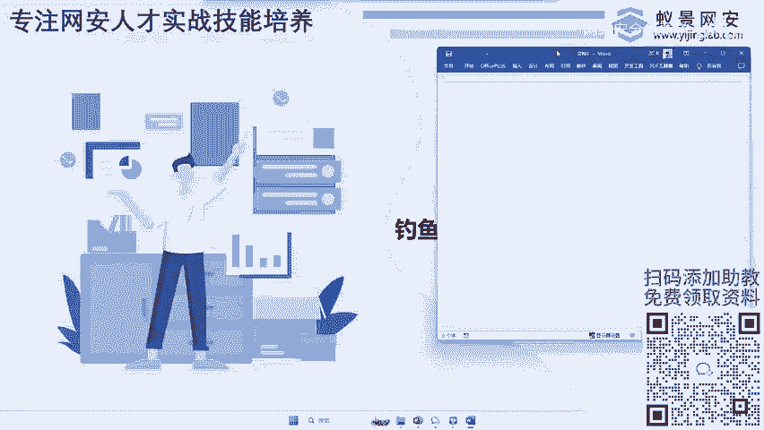
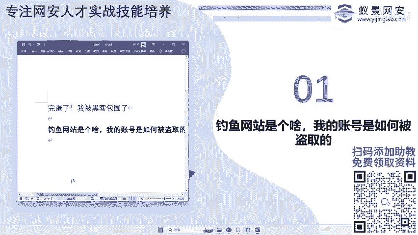
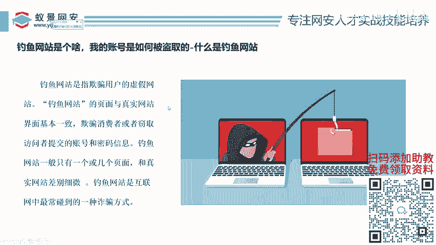
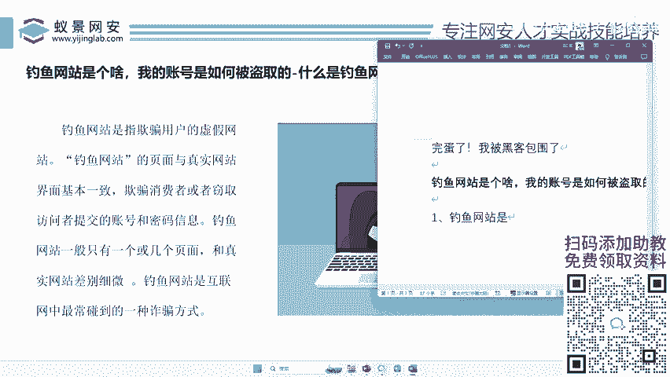
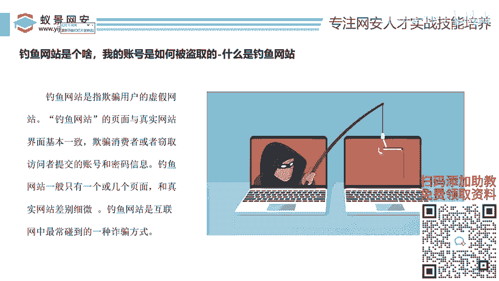
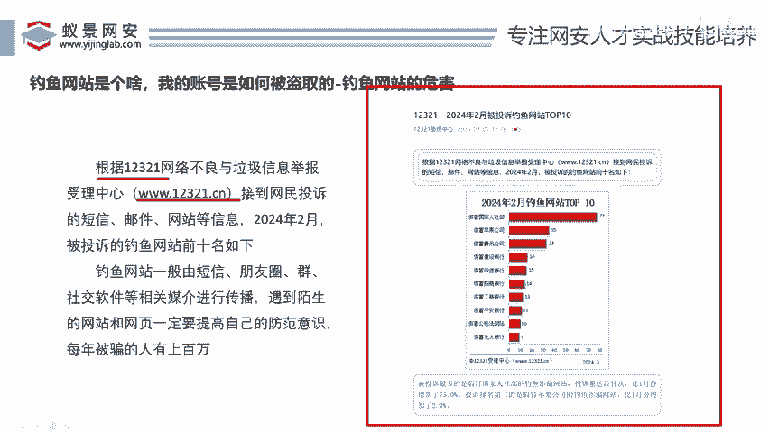
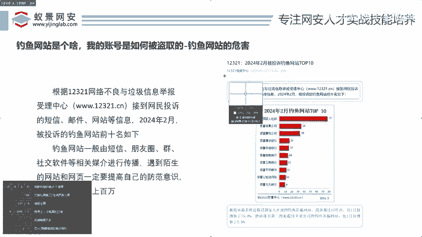
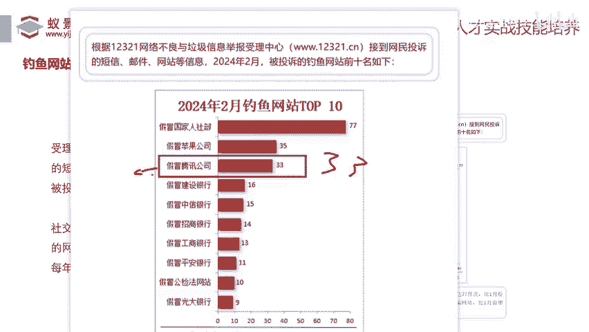
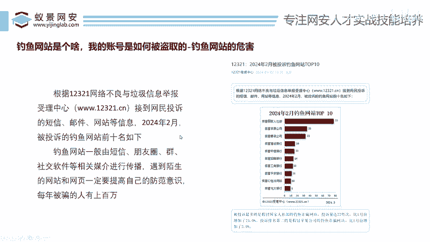

# 网络安全入门：P44：钓鱼网站的传播原理

在本节课中，我们将要学习钓鱼网站的核心概念、其巨大危害以及它如何通过各种渠道进行传播。我们将用简单直白的方式，帮助你理解这种常见的网络攻击手段。

## 钓鱼网站的定义与危害







上一节我们介绍了课程的主题，本节中我们来看看钓鱼网站到底是什么。

钓鱼网站是欺骗用户的虚假网站。它与真实的网站长得一模一样。攻击者利用这种假网站欺骗用户，诱导用户输入微信号、验证码、银行卡号等敏感信息，从而导致账号被盗、钱财损失。

这种攻击方式每天都在发生，影响范围极广。



为了说明其危害，我们可以查看相关投诉数据。例如，在2024年2月，假冒腾讯公司的钓鱼网站就位列投诉榜单前列。这类网站会导致用户的银行卡、各类服务密码被盗，最终造成财产损失。

## 钓鱼网站的常见伪装形式



了解了钓鱼网站的基本危害后，我们来看看它通常以哪些形式出现在我们面前。

以下是几种常见的钓鱼网站传播形式：

*   **假冒官方短信**：例如，收到伪装成“中国移动”的短信，内容为“您的积分可兑换人民币，请登录指定网站领取”，并附上一个仿冒的网址（如 `10086.xxx.com`）。
*   **情感诱导软文**：在社交平台传播类似“回忆你的QQ空间”的软文，附上一个“扫码登录QQ空间”的二维码，诱导用户点击。
*   **虚假客服与申诉**：声称能帮助“找回游戏账号”或“进行账号申诉”，提供所谓的“安全中心”链接或二维码，引导用户进入假冒的官方平台。







这些伪装都非常逼真，利用了用户对官方机构的信任或怀旧情感，令人防不胜防。

## 钓鱼网站的攻击原理

那么，这些看起来和真网站一样的页面，背后的攻击原理是什么呢？

攻击者的核心目标是**窃取用户凭据**。其基本流程可以概括为以下步骤：



1.  **制作仿冒页面**：黑客首先会制作一个与目标网站（如腾讯、银行官网）外观完全一致的登录或信息提交页面。
2.  **部署与传播**：将这个假页面部署到服务器上，并通过短信、邮件、社交群聊、论坛等渠道广泛传播其链接或二维码。
3.  **诱导用户访问**：利用上节提到的各种伪装形式，诱骗目标用户点击链接或扫描二维码，访问这个假网站。
4.  **窃取信息**：当用户在假网站上输入用户名、密码、验证码等信息并点击“提交”时，这些信息并不会发送到真正的服务器，而是被发送到黑客控制的服务器上。
    *   伪代码逻辑示意：
        ```python
        # 假网站后台的简单逻辑（示意）
        def steal_credentials(username, password):
            # 1. 将窃取到的信息保存到黑客的数据库或文件
            save_to_hacker_server(username, password)
            # 2. 同时，可能将用户重定向到真正的官网，掩盖盗窃行为
            redirect_to_real_website()
        ```
5.  **实施侵害**：黑客获得这些信息后，即可登录用户的真实账号，进行盗取资金、窃取数据等非法操作。

## 如何识别与防范钓鱼网站

既然我们知道了钓鱼网站的传播原理，接下来学习如何识别和防范它就至关重要了。

以下是几个关键的识别与防范要点：

*   **仔细检查网址（URL）**：这是最有效的方法。务必确认网址与官方网站完全一致，注意是否存在拼写错误、多余字符或奇怪的域名（如 `tencent.com` 与 `tencént.com`）。
*   **警惕不明链接与二维码**：不要轻易点击来自短信、邮件或陌生人的链接，不要扫描来源不明的二维码。
*   **确认网站安全标识**：正规网站通常使用 HTTPS 协议（地址栏有锁形图标），但请注意，钓鱼网站也可能使用 HTTPS，因此不能仅凭此判断。
*   **不轻信紧急或利诱信息**：对声称“账号异常”、“中奖”、“积分兑换”等制造紧迫感或诱惑性的信息保持高度警惕。
*   **通过官方渠道访问**：手动输入官方网址或通过官方App内的链接访问服务，而非点击他人提供的链接。

本节课中我们一起学习了钓鱼网站的定义、其严重的社会危害、常见的传播形式以及背后的攻击原理。记住，保持警惕，仔细核实网址和信息来源，是保护自己免受钓鱼攻击最有效的盾牌。