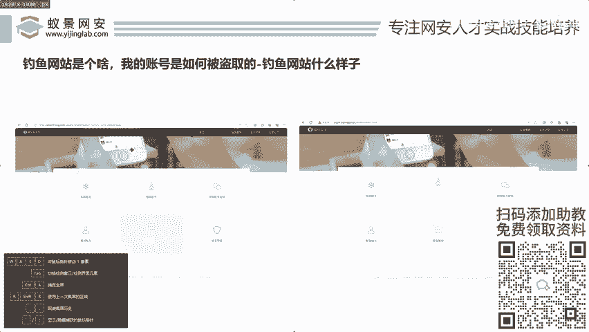
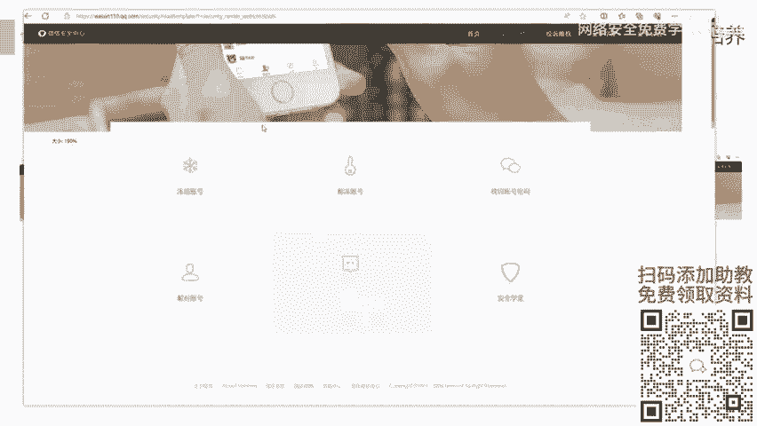
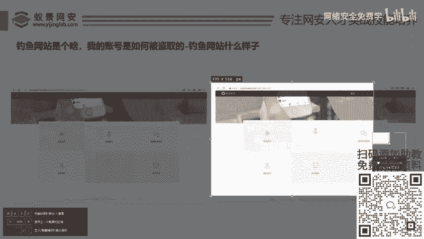
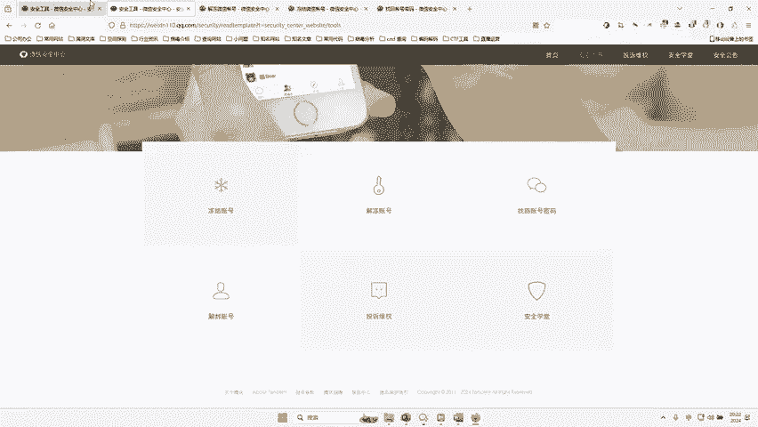
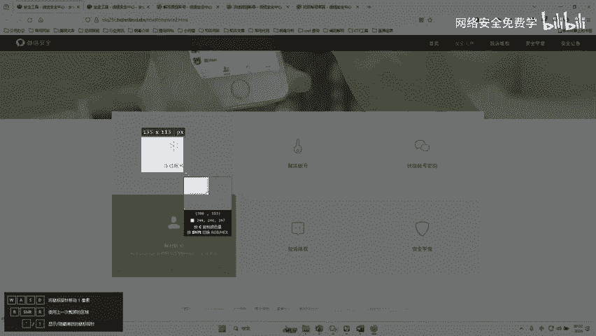
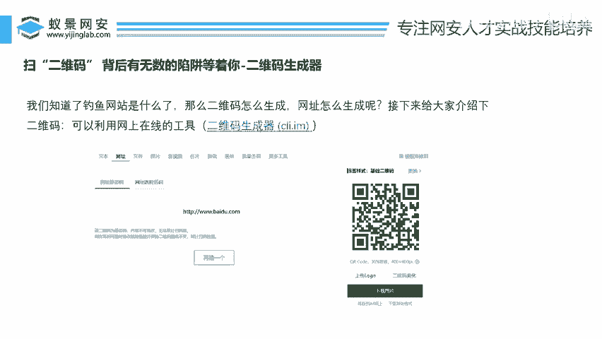

# 网络安全入门：P45：钓鱼网站揭秘与防范 🎣

在本节课中，我们将要学习钓鱼网站的基本概念、识别方法以及其背后的技术原理。通过对比真实与虚假网站，你将直观地理解钓鱼攻击的伪装手段，并了解如何部署一个简单的钓鱼网站用于安全测试，从而提高自身的安全防范意识。

## 钓鱼网站的外观对比

上一节我们介绍了钓鱼攻击的常见诱饵，如扫码、短信等。本节中我们来看看用户点击这些链接后，最终看到的钓鱼页面具体是什么样子。



以下是两张关于微信账号解封的页面截图。请你尝试辨别哪一张是真实的，哪一张是伪造的。







对于没有安全基础的用户而言，这两张图片几乎无法区分。有人猜测左边为真，有人猜测右边为真，甚至有人认为两者都是假的。实际上，右边是真实的微信页面，而左边是一个高度仿真的钓鱼网站。这个钓鱼网站仿冒腾讯公司，其界面与真实页面几乎完全一致。

## 钓鱼网站的细节分析

那么，钓鱼网站与真实网站究竟有何不同？我们通过对比来深入观察。

首先，我们打开一个真实的钓鱼网站案例。以下是上个月出现的一个用于盗取微信账号的钓鱼网站网址。





这个网站页面声称可以帮助用户“解冻账号”或“找回密码”，诱导用户输入自己的账号和密码信息。

接下来，我们对比真实的微信安全中心页面。





通过对比可以发现，除了**浏览器地址栏的域名**不同之外，两个页面的视觉设计几乎一模一样。其中一个细微的差别是，钓鱼页面中“账号”的“账”字可能使用了不同的字体，但这在匆忙之中很难被察觉。**核心区别在于URL（统一资源定位符）**。

钓鱼网站的域名通常是伪造的，与官方网站的域名相似但不相同。例如，可能使用 `weixin.com` 来仿冒 `weixin.qq.com`。

## 钓鱼网站源码获取与部署

为了更深入地理解其原理，我们可以研究钓鱼网站的源代码。以下是提供的两套用于教育目的源码：

1.  QQ空间钓鱼网站源码。
2.  微信身份验证钓鱼网站源码。

这些源码已包含在课程资料中。你可以将其部署在本地环境进行学习，但**仅可用于合法的安全测试和教育目的**，以提高自己和他人的安全意识。


以下是部署一个简单钓鱼页面的基本步骤：

1.  **环境准备**：确保你的计算机上安装了Web服务器软件，例如Apache或Nginx，或者使用简单的Python HTTP服务器。
    ```bash
    # 使用Python快速启动一个本地HTTP服务器（在源码目录下执行）
    python -m http.server 8080
    ```
2.  **放置源码**：将下载的钓鱼网站源码文件复制到你的Web服务器根目录下。
3.  **访问页面**：在浏览器中访问 `http://localhost:8080`（端口号根据你的设置调整），即可看到本地部署的钓鱼页面。

通过动手部署，你可以直观地看到钓鱼网站是如何构建和运行的。

## 钓鱼链路的完成：二维码生成

我们已经了解了钓鱼网站本身的样子。那么，攻击者如何将用户引导至这些网站呢？一个常见的方式就是利用二维码。

假设我们已经部署好了一个钓鱼网站，其地址是 `http://your-server.com/fake-login`。如何将它变成一个可扫描的二维码呢？

以下是生成二维码的基本方法：

1.  **使用在线工具**：许多免费网站提供二维码生成服务，只需输入你的钓鱼网站URL即可生成二维码图片。
2.  **使用编程库**：在项目中，可以使用如 `qrcode`（Python）等库动态生成二维码。
    ```python
    # Python示例：使用qrcode库生成二维码
    import qrcode
    # 创建二维码对象
    qr = qrcode.QRCode()
    # 设置二维码内容（即钓鱼链接）
    qr.add_data('http://your-server.com/fake-login')
    qr.make()
    # 生成并保存二维码图片
    img = qr.make_image()
    img.save('phishing_qr.png')
    ```
3.  **短域名服务**：为了隐藏冗长或可疑的原始URL，攻击者常使用短域名服务（如 bit.ly）将钓鱼链接缩短，然后再将短链接生成二维码。这进一步增加了识别难度。

攻击者会将生成的二维码图片嵌入到海报、邮件或替换正常的二维码，诱骗用户扫描。

## 如何防范钓鱼网站

了解了攻击手段后，我们更需要知道如何保护自己。以下是关键的防范措施：

*   **仔细检查网址**：在输入任何敏感信息前，务必确认浏览器地址栏中的域名是官方网站的域名。
*   **警惕不明链接和二维码**：不要随意点击短信、邮件或社交软件中的不明链接，也不要扫描来源不明的二维码。
*   **启用双重验证**：为你的重要账户（如微信、QQ、邮箱）开启双重身份验证（2FA），即使密码泄露，账户也多一层保障。
*   **保持软件更新**：确保操作系统、浏览器和安全软件保持最新状态，以防范已知漏洞。
*   **核实信息**：对于声称来自官方（如银行、腾讯、支付宝）的紧急通知，应通过官方APP或客服电话进行核实。

## 总结



本节课中我们一起学习了钓鱼网站的典型外观，知道了其与真实网站的核心区别在于**域名**。我们通过对比案例加深了理解，并简要了解了钓鱼网站的源码部署以及其传播途径——特别是通过**二维码生成技术**。最后，我们掌握了识别和防范钓鱼网站的基本方法。记住，保持警惕，仔细核实，是应对网络钓鱼最有效的武器。