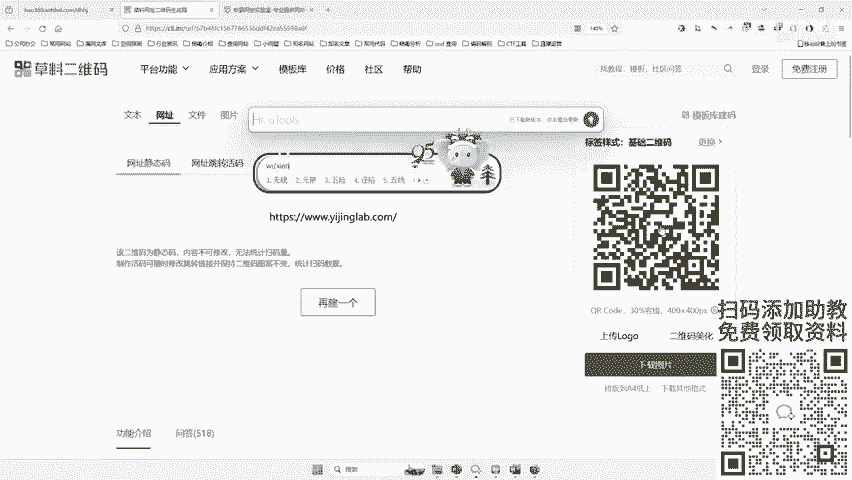
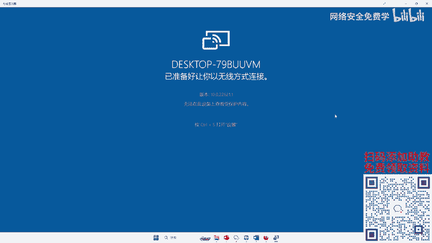
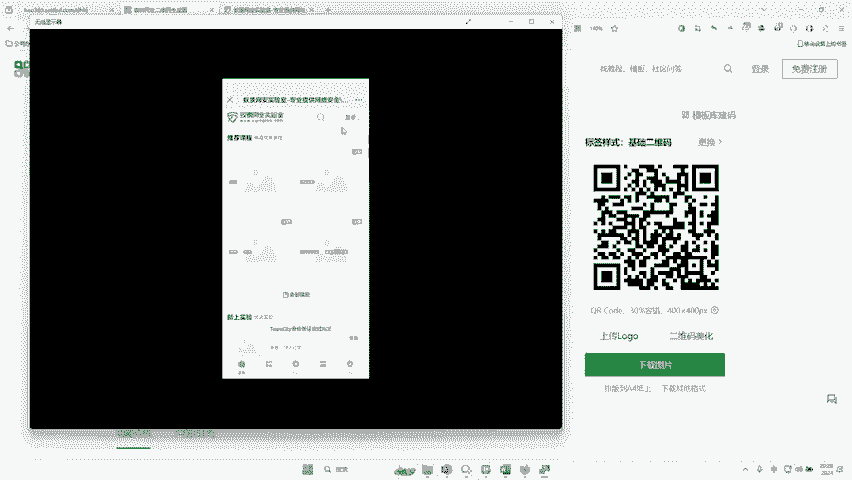
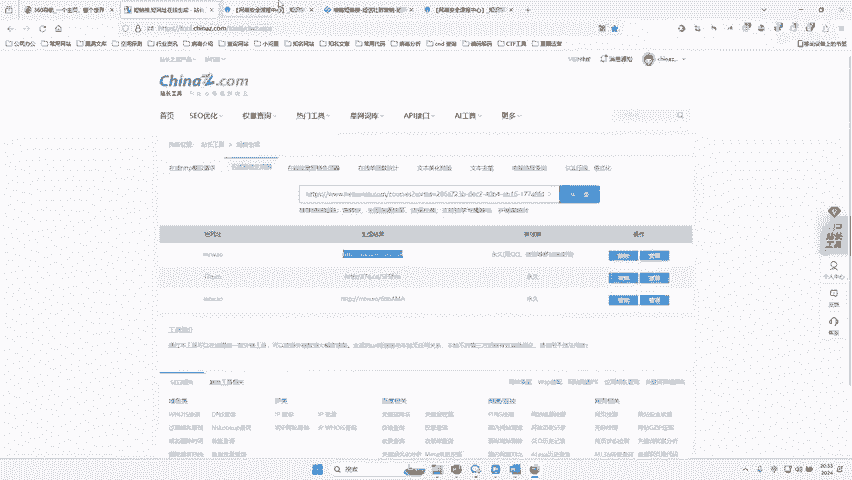
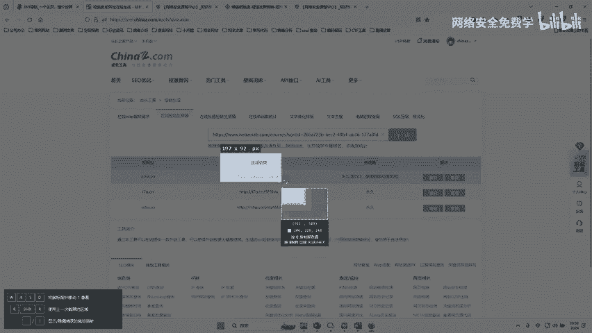

# 网络安全：P46：二维码背后的陷阱 🔍

在本节课中，我们将要学习二维码的生成原理，以及攻击者如何利用二维码和短链接技术进行网络钓鱼攻击。我们将通过实际操作演示，了解这些常见陷阱的实现方式，从而提高安全防范意识。

## 二维码的生成与演示 📱

上一节我们介绍了二维码在攻击中的潜在风险，本节中我们来看看二维码是如何生成的。

二维码的生成可以借助在线工具快速完成。例如，我们可以访问“草料二维码生成器”这类网站。

以下是生成二维码的具体步骤：
1.  复制目标网站的网址。
2.  将网址粘贴到在线生成器的“网址”输入框中。
3.  点击生成按钮，右侧便会生成对应的二维码。

例如，将“和天网安实验室”的网址生成二维码后，使用手机扫描该二维码，即可直接访问该网站。这个过程演示了如何将任意网址转换为二维码形式，便于嵌入到文章、海报等媒介中进行传播。

## 二维码的美化与伪装 🎨

除了基本的生成功能，许多二维码生成平台还提供美化选项。

以下是常见的二维码美化功能：
*   **更换模板**：可以选择不同风格的二维码边框和样式。
*   **嵌入图片**：可以在二维码中央嵌入Logo等图片。
*   **调整颜色**：可以修改二维码的颜色以符合视觉需求。

这些美化功能可以让二维码看起来更正规、更具吸引力，从而降低受害者的警惕性。攻击者可以利用这些功能，将恶意链接的二维码伪装成签到表、优惠券领取入口或文章分享等看似无害的形式。

## 短链接：域名的伪装术 🔗

我们已经了解了二维码如何隐藏真实网址。那么，在直接发送链接的场景（如短信、群聊）中，攻击者又是如何伪装网址的呢？这就要引入“短链接”的概念。

**域名**是由一串用点分隔的字符组成的互联网上某一台计算机或计算机组的名称，例如 `www.baidu.com`。而**短链接**服务可以将冗长的原始网址压缩成一个非常简短的链接。

例如，一个复杂的钓鱼网址可能非常长，容易引起怀疑。通过短链接平台，可以将其转换为类似 `3w.taobao.com` 这样看似可信的简短链接。受害者点击这个短链接后，会被重定向到真实的恶意网站。

以下是使用短链接平台的步骤：
1.  访问一个在线短链接生成器网站。
2.  将长的目标网址粘贴到输入框。
3.  点击生成，即可获得一个简短的链接。

生成的新链接虽然域名不同，但访问后与原始长链接的页面内容完全一致。免费的短链接平台会提供固定的短域名（如 `mr.so`）。若想绑定更具欺骗性的独享域名（如模仿知名网站），则通常需要付费购买相关服务。

作为安全从业者或普通用户，我们需要认识到：**简短的链接并不代表安全**，它可能只是通往恶意网站的“快捷方式”。

## 总结 📝

本节课中我们一起学习了网络钓鱼中常见的两种伪装技术。
*   我们了解了二维码的生成原理，以及攻击者如何通过美化二维码来降低受害者的防备心理。
*   我们探讨了短链接技术，明白了攻击者如何利用它将可疑的长网址伪装成简短、看似可信的链接。

核心要点在于：**无论是二维码还是短链接，都是信息的载体或转换器，其本身并无好坏，关键在于它们所指向的最终内容。** 在扫码或点击链接前，务必保持警惕，核实来源，切勿轻易访问不明链接或扫描来路不明的二维码。