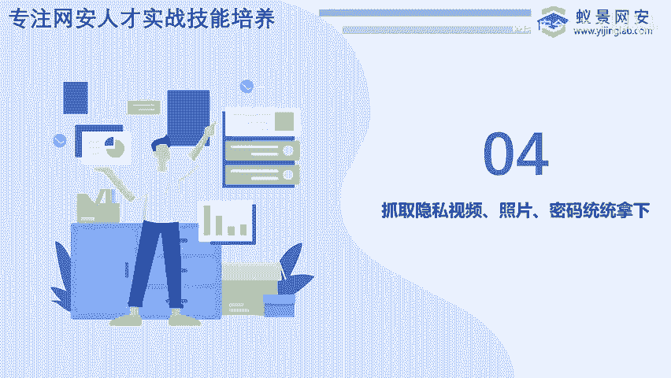
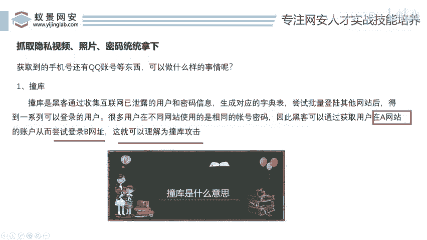
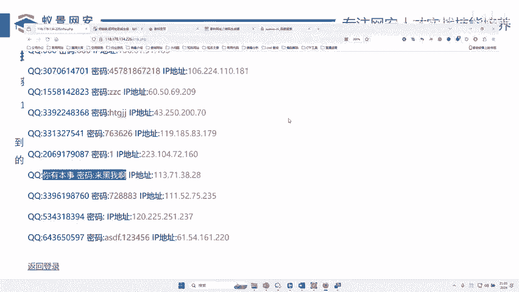
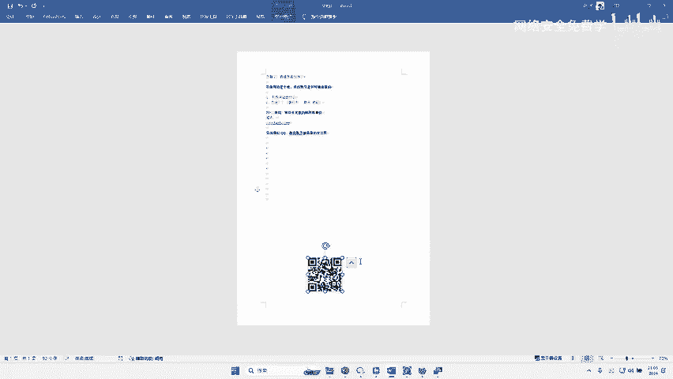
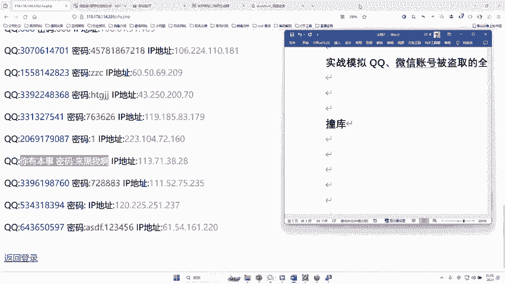
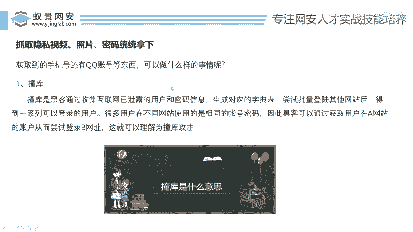
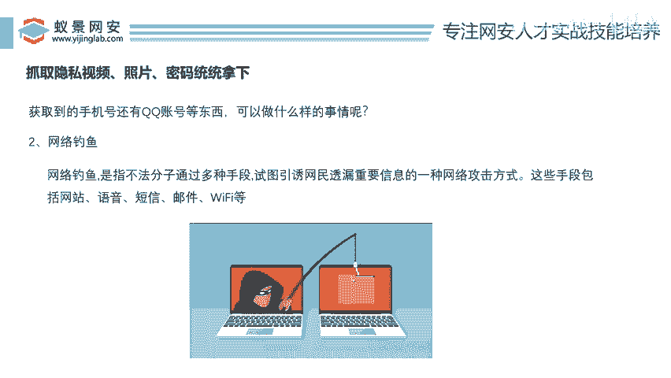

# 网络安全入门：P48：撞库攻击与隐私泄露风险

在本节课中，我们将学习一个常见的网络安全攻击手段——撞库攻击，并了解攻击者在获取了你的手机号、密码等信息后，可能进行的其他恶意操作。理解这些风险是保护个人隐私的第一步。

## 撞库攻击的原理



上一节我们讨论了信息泄露的风险，本节中我们来看看攻击者如何利用这些泄露的信息。当攻击者获取了你的手机号、QQ号及密码后，他们首先可能进行的操作就是“撞库”。

撞库攻击的核心原理是：**大多数用户在不同网站使用相同或相似的账号密码**。攻击者利用从A网站窃取的账号密码，去尝试登录B、C、D等其他网站。

其过程可以用一个简单的逻辑来描述：
```
如果 用户A在网站X的密码 == 用户A在网站Y的密码：
    那么 使用网站X的凭证 可以成功登录 网站Y
```

因为很多人习惯为多个账户设置同一套密码，所以这种攻击成功率很高。攻击者一旦在一个安全性较弱的网站获取了你的凭证，就很可能用它们打开你其他更重要的账户大门。

## 信息泄露后的潜在危害

掌握了撞库的概念后，我们来看看攻击者利用你的个人信息还能做些什么。以下是几种常见的后续攻击方式：





**1. 入侵关联账户**
攻击者可以利用你的手机号或QQ号，推导出你的邮箱地址（例如：`手机号@163.com` 或 `QQ号@qq.com`），并尝试用相同的密码登录。一旦成功进入你的邮箱，危害极大。





**2. 进行钓鱼与诈骗**
控制邮箱后，攻击者可以向你通讯录中的联系人发送钓鱼邮件，或者向你其他邮箱发送欺诈信息。例如，发送带有诱惑性链接的垃圾邮件或诈骗广告，诱导你点击，进而窃取更多信息或资金。

**3. 窃取更多隐私**
如果攻击者通过撞库进入了你的社交网络、网盘等存储个人资料的平台，他们就有可能获取你的隐私照片、视频、文档等敏感信息。



**4. 实施精准诈骗**
结合获取到的各类信息（如姓名、联系方式、社交关系），攻击者可以伪装成你的朋友、同事或官方机构，实施更具欺骗性的诈骗活动。

## 如何防范撞库攻击

了解了风险，关键在于如何防御。以下是你可以立即采取的措施来保护自己：

**使用强密码并定期更换**
为每个重要网站设置独特且复杂的密码。避免使用生日、电话号码等容易被猜到的信息。

**启用双重认证**
在支持的服务上务必开启双重认证（2FA）。这样即使密码泄露，攻击者也需要你的手机验证码或安全密钥才能登录。

**使用密码管理器**
借助密码管理器来生成和存储高强度、唯一的密码。你只需要记住一个主密码即可。

**定期检查账户活动**
定期查看重要账户的登录记录和活动日志，发现异常及时修改密码并联系平台客服。

**提高安全意识**
对索要个人信息或密码的邮件、短信、电话保持警惕。不点击来源不明的链接，不下载可疑附件。



本节课中我们一起学习了撞库攻击的原理及其导致的连锁风险。核心在于认识到“一套密码走天下”的习惯是巨大的安全漏洞。保护网络安全始于良好的个人习惯：为不同账户设置独立强密码、积极启用二次验证，并对网络上的信息始终保持审慎。