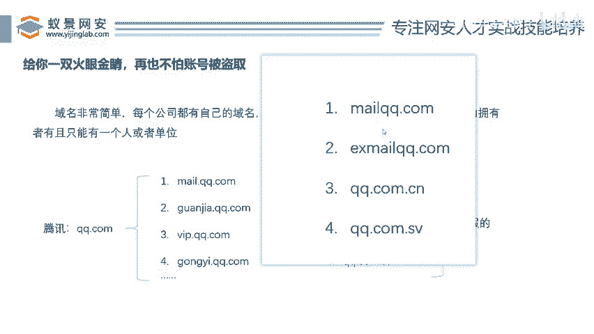
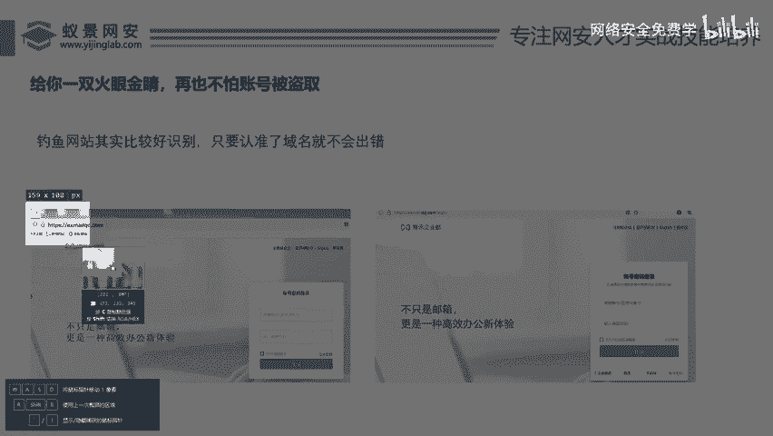
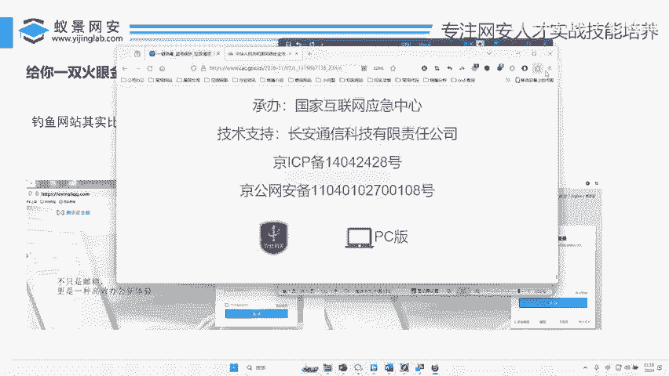

# 网络安全入门：P49：如何识别钓鱼网站与防范账号被盗

在本节课中，我们将学习如何识别虚假的钓鱼网站，从而有效保护自己的账号不被盗取。核心在于理解并识别网站的唯一标识——域名。

上一节我们介绍了网络安全的基本概念，本节中我们来看看如何具体识别钓鱼网站。

## 🔍 识别钓鱼网站的核心：域名

有人说，到底应该如何识别虚假网站？其实方法很简单：只要认准了域名，就不会出错。

**域名**是每个网站在互联网上的唯一地址标识。公司或个人要建立网站，必须购买一个域名。这个域名在全球范围内是**唯一**的。在中国，域名还需要进行**公安备案**。

例如，腾讯公司购买了域名 `qq.com`。那么，全世界只有腾讯公司能使用以 `qq.com` 结尾的域名。

## 🌐 理解域名结构

域名通常由多部分组成。以腾讯的邮箱服务为例：

*   `mail.qq.com` 是腾讯的邮箱网站。
*   这里的 `qq.com` 是**一级域名**（或主域名）。
*   前面的 `mail` 是腾讯公司自己设置的**子域名**。

我们可以这样理解：`qq.com` 是“父亲”，而 `mail.qq.com`、`guanjia.qq.com` 等都是它的“儿子”（子域名）。只要是以 `qq.com` 结尾的网站，都属于腾讯公司。

## 🚨 如何辨别真假网站

以下是辨别网站真伪的关键步骤：

1.  **检查域名结尾**：忽略前面的所有部分，直接看网址的最后几位。
2.  **对比官方域名**：将你看到的域名与你知道的官方域名进行精确对比。
3.  **警惕细微差别**：骗子会注册与官方域名极其相似的域名进行伪装。

让我们通过几个例子来实践：

*   **真域名**：`mail.qq.com` (以 `qq.com` 结尾)
*   **假域名示例**：
    *   `mailqq.com` (缺少了 `qq.com` 前面的点)
    *   `exmailqq.com` (同样缺少关键的点)
    *   `qq.com.cn` (在 `qq.com` 后面添加了 `.cn`)
    *   `qq.com.sv` (在 `qq.com` 后面添加了 `.sv`)

另一个经典案例是苹果官网：
*   **真域名**：`apple.com`
*   **假域名**：`app1e.com` (将字母 `l` 替换为数字 `1`)

## ⚖️ 网络安全的法律边界

学习这些知识是为了防御，而非攻击。我们必须清楚行为的法律边界。

我国有《网络安全法》，明确规定了个人和组织在网络空间的行为准则。例如：
*   任何个人和组织不得窃取或以其他非法方式获取个人信息。
*   不得非法出售或非法向他人提供个人信息。
*   不得利用网络从事诈骗、传授犯罪方法等活动。

想从事网络安全相关工作，首先需要学习《网络安全法》，明确什么能做，什么不能做，确保自己的技术用在合法的道路上。

---

本节课中我们一起学习了识别钓鱼网站的核心方法——检查域名，并通过实例加深了理解。记住，保护账号安全的第一步，就是养成检查浏览器地址栏域名是否正确的习惯。同时，我们再次强调了遵守《网络安全法》的重要性，技术应用必须在法律框架内进行。