# 网络安全入门：P4：HTTP超文本传输协议—请求消息

在本节课中，我们将要学习HTTP协议的核心组成部分之一：请求消息。我们将拆解一个HTTP请求的原始数据，了解其结构、关键组成部分以及不同请求方式的区别，特别是GET和POST请求的差异。

上一节我们介绍了HTTP协议的基本概念，本节中我们来看看一个具体的HTTP请求是如何在网络中传输的。例如，当你访问百度或打开一个网页时，浏览器向服务器发送的就是一个HTTP请求消息。

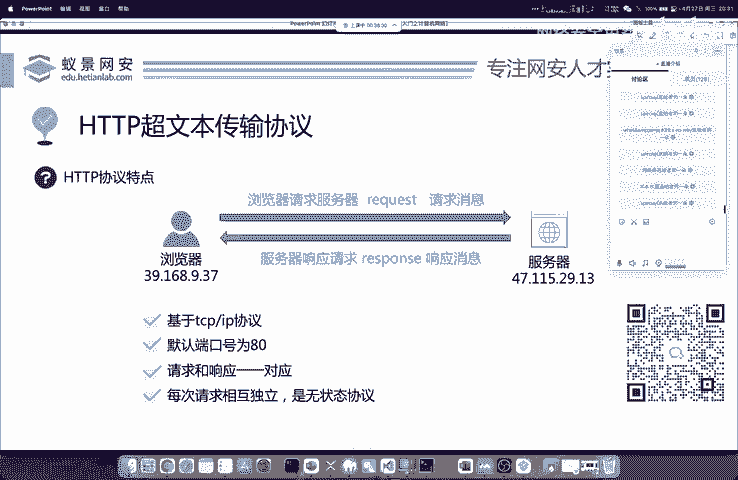

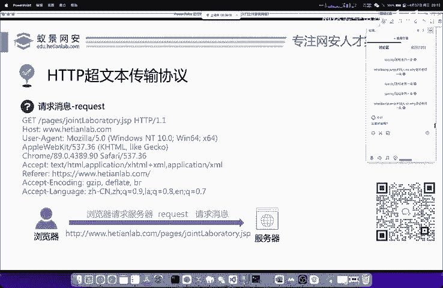

## 请求消息的结构

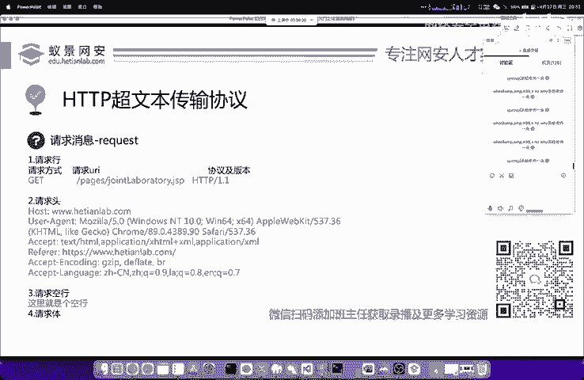

原始的HTTP请求报文可能看起来复杂，但其格式是标准化的，我们可以逐一分析。它本质上是基于TCP/IP协议的再次封装。

以下是一个访问网页时，浏览器发送的典型HTTP请求消息示例。我们将以此为例进行拆分讲解。

```
GET /course.jsp?wk=123 HTTP/1.1
Host: www.hetianlab.com
User-Agent: Mozilla/5.0...
Accept: text/html,application/xhtml+xml...
Accept-Language: zh-CN,zh;q=0.9
Connection: keep-alive
```

### 请求行

请求消息的第一行称为“请求行”，它包含了三个核心部分：请求方式、请求的URI以及协议版本。

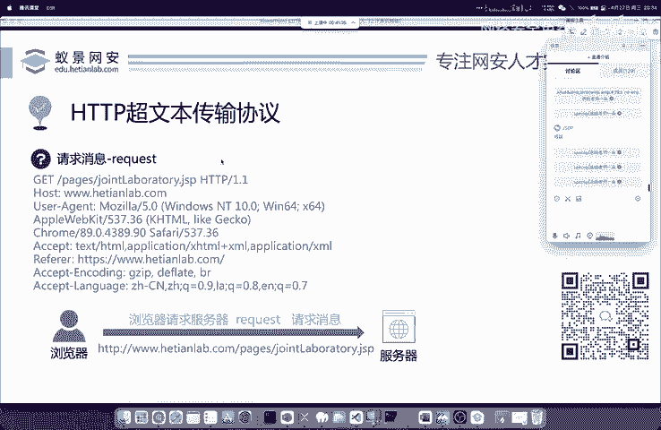

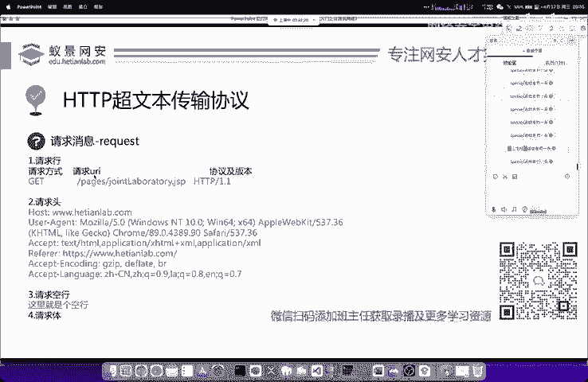

*   **请求方式**：例如 `GET`，表示获取资源。
*   **请求的URI**：统一资源标识符，指定要访问的具体页面或资源路径，例如 `/course.jsp`。
*   **协议及版本**：使用的协议名称和版本号，例如 `HTTP/1.1`。

### 请求头

请求行之后的部分是“请求头”。它由多行“键-值”对组成，提供了关于请求或客户端的附加信息。

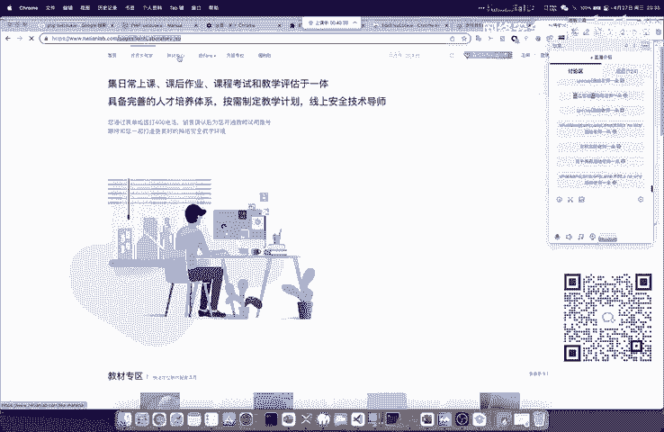

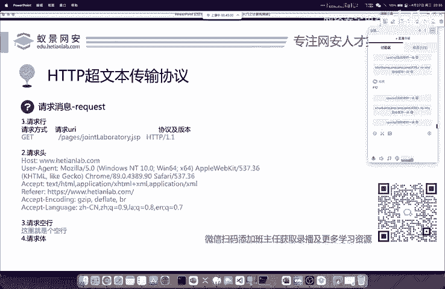

以下是常见的请求头字段及其作用：
*   **Host**：指定请求的目标服务器域名。
*   **User-Agent**：标识发出请求的客户端（浏览器）类型和版本。
*   **Accept**：告知服务器客户端能够处理的内容类型。
*   **Accept-Language**：告知服务器客户端优先接收的语言。
*   **Connection**：控制本次连接是否在请求完成后关闭，`keep-alive` 表示保持连接。

### 请求体

对于某些请求方式（如POST），在请求头之后会有一个空行，空行之后的内容就是“请求体”。请求体用于携带要发送给服务器的数据，例如表单提交的用户名和密码。

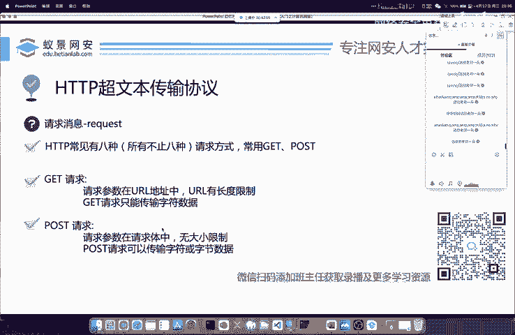

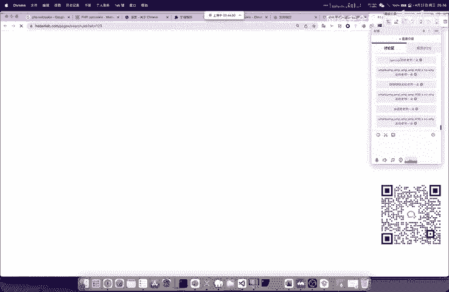

## HTTP请求方式：GET vs POST

HTTP协议定义了许多请求方式，但最常用的是 **GET** 和 **POST**。它们在面试和实际应用中经常被问及区别。

以下是GET与POST请求的主要区别：

1.  **参数位置**：
    *   **GET** 请求的参数附加在URL地址后面，格式为 `?key1=value1&key2=value2`。
    *   **POST** 请求的参数放在**请求体**中，不会显示在URL里。

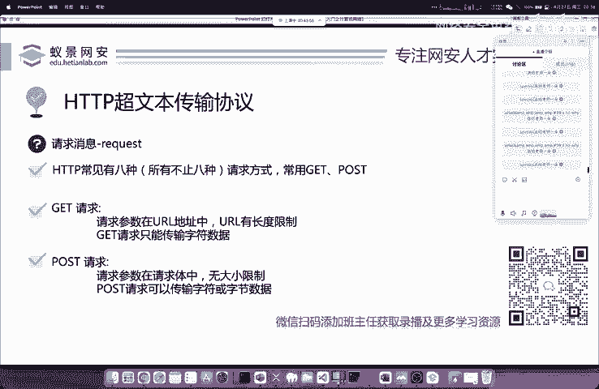

2.  **数据长度与类型限制**：
    *   **GET** 请求由于参数在URL中，受URL长度限制，且只能传输文本（字符）数据。
    *   **POST** 请求通过请求体传输数据，没有长度限制，且可以传输二进制数据（如图片、视频文件）。

3.  **安全性（表象）**：
    *   **GET** 请求的参数在URL中明文可见，不适合传输敏感信息（如密码）。
    *   **POST** 请求的参数在请求体中，相对更隐蔽，但本身并不加密，安全性需依靠HTTPS等协议保障。

4.  **幂等性与缓存**：
    *   **GET** 请求是**幂等**的（多次执行相同操作结果一致），且通常可被浏览器缓存。
    *   **POST** 请求是**非幂等**的（可能改变服务器状态，如提交订单），通常不会被缓存。

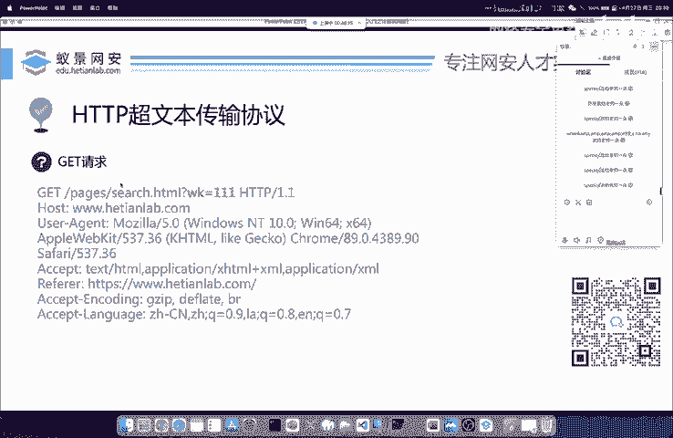

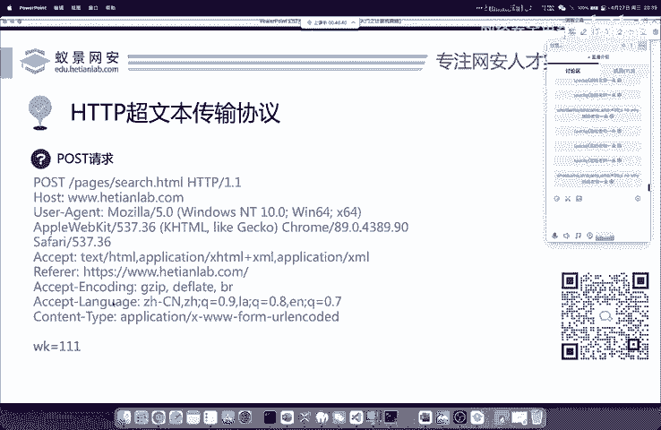

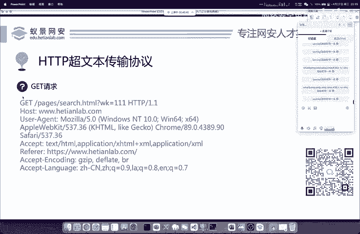

5.  **一个关键的头字段**：
    *   在 **POST** 请求中，请求头通常必须包含 **`Content-Type`** 字段，用于说明请求体的数据格式（如 `application/x-www-form-urlencoded` 或 `multipart/form-data`）。缺少此字段可能导致服务器无法正确解析请求。这是区分POST请求是否规范的一个重要标志。

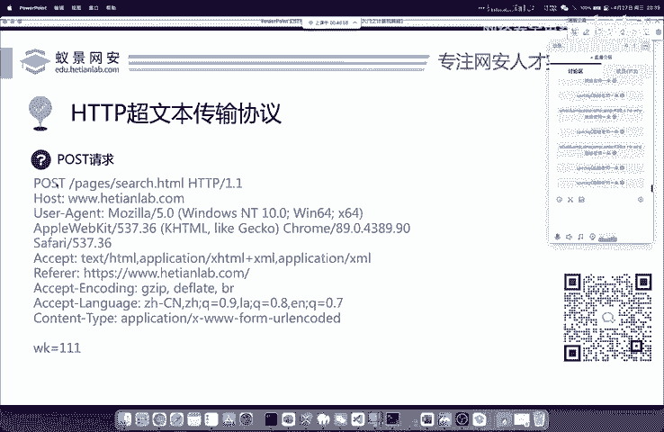

**GET请求示例**：
```
GET /search?q=keyword HTTP/1.1
Host: www.example.com
```

**POST请求示例**：
```
POST /login HTTP/1.1
Host: www.example.com
Content-Type: application/x-www-form-urlencoded
Content-Length: 27

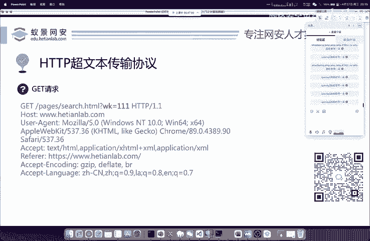

username=admin&password=123456
```

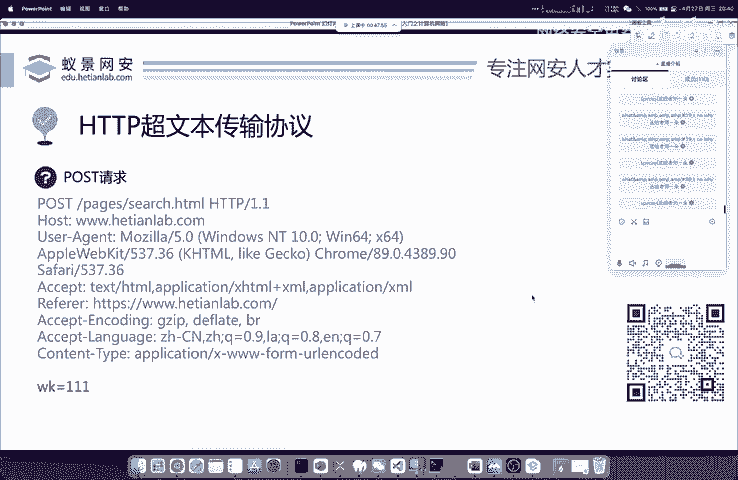

本节课中我们一起学习了HTTP请求消息的完整结构，包括请求行、请求头和请求体。我们重点剖析了GET和POST这两种最常用请求方式的五大核心区别：参数位置、数据限制、安全性表象、幂等性以及`Content-Type`头字段的重要性。理解这些基础知识是后续学习Web安全、渗透测试的必经之路。