# 网络安全入门：P50：黑客的盈利模式与攻击流程剖析 🔍

在本节课中，我们将通过一个真实的新闻案例，剖析黑客团伙如何利用网络安全技术非法牟利。我们将学习其背后的技术原理和操作流程，并强调合法学习技术的重要性。请注意，本教程仅用于教育目的，旨在帮助大家了解攻击原理以更好地进行防御，所有技术都应在合法授权的范围内学习和使用。

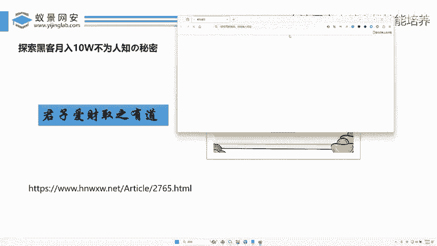

## 概述：一则新闻案例的启示

上一节我们介绍了网络安全的基本概念，本节中我们来看看一个具体的案例。2019年，江苏警方破获了一起利用黑客技术非法牟利的案件。该团伙在半年内涉案金额高达1000多万元。

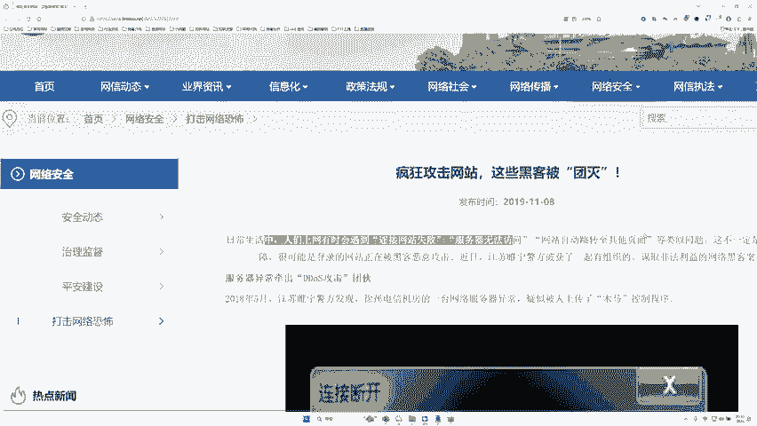

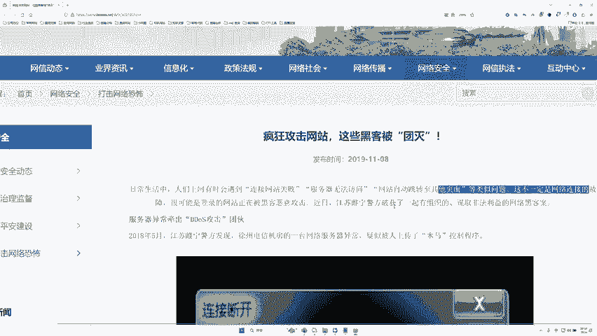

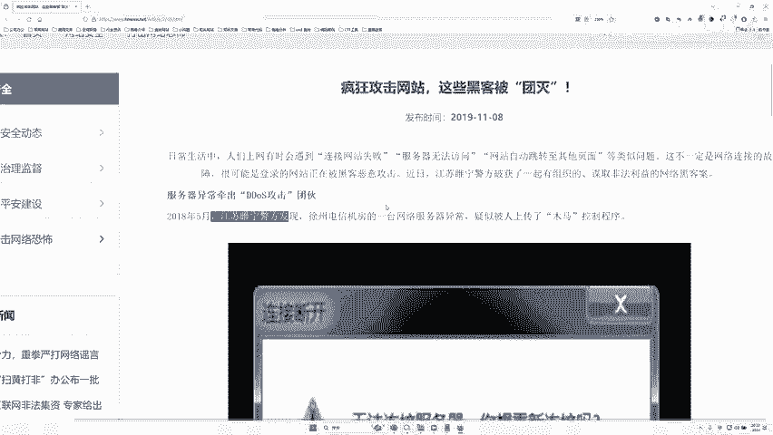

在日常生活中，我们上网时可能会遇到“服务器无法访问”、“网站自动断开或跳转”等情况。这些现象不一定是你电脑的问题，而有可能是网站遭到了攻击。

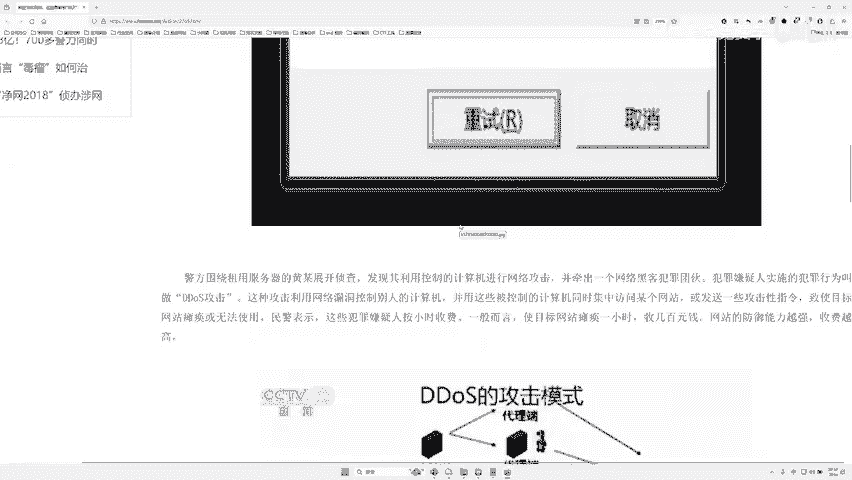

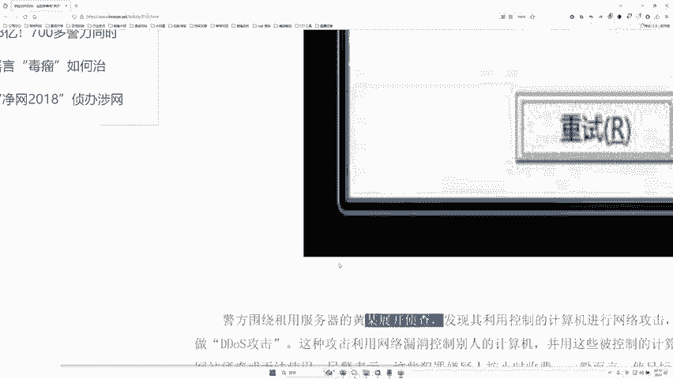

## 攻击团伙的三大盈利手段

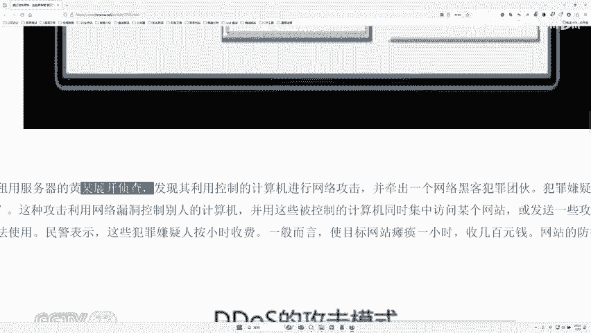

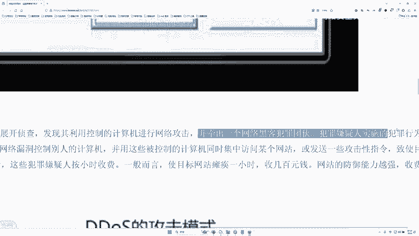

通过警方的调查，我们得以了解该黑客团伙的主要作案手法。以下是他们非法获利的三种核心方式：

### 1. DDoS攻击服务

该团伙利用网络漏洞控制了大量他人的电脑（这些电脑被称为“肉鸡”或“僵尸主机”）。他们集中这些被控制的电脑同时访问某个目标网站，导致目标网站因流量过载而瘫痪。然后，他们按小时向有需求的客户（例如商业竞争对手）收取攻击费用。

**核心概念**：DDoS（分布式拒绝服务）攻击。其本质是耗尽目标服务器的资源（如带宽、连接数、处理能力），使其无法为正常用户提供服务。
**简单理解公式**：`海量伪造请求 -> 目标服务器资源耗尽 -> 服务瘫痪`

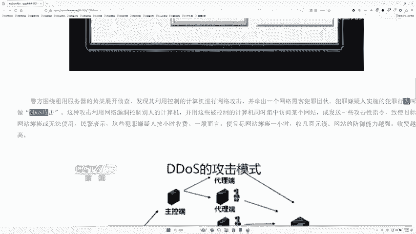

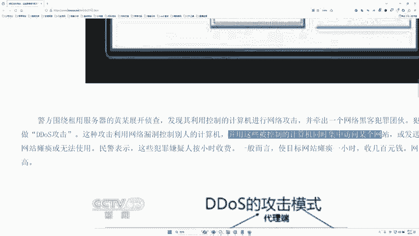

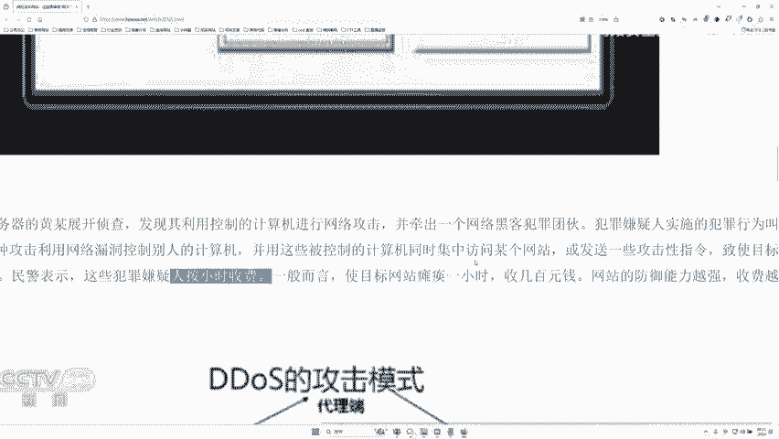

### 2. 售卖服务器控制权

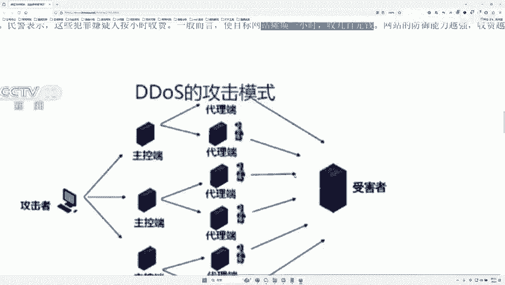

该团伙不仅自己发起攻击，还将已控制的电脑或服务器的“控制权”作为商品进行售卖。购买者可以利用这些被控制的设备进行自己的非法活动。

### 3. 植入恶意链接进行“引流”

这是该团伙另一个重要的收入来源。他们入侵并控制了一些正常的政府或企业网站后，在这些网站的页面中植入赌博、色情、诈骗等非法网站的链接。

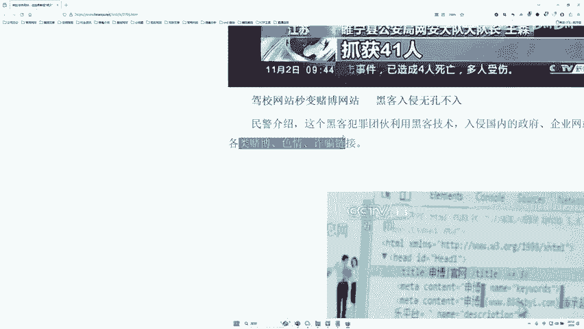

例如，一个正常的网站 `www.example.com` 被入侵后，其页面代码中被加入了指向 `www.888.sbl.com`（赌博网站）的隐藏链接。这样，访问正常网站的用户就可能被引导至非法网站，从而为后者“引流”，黑客则从中收取推广费用。

**核心概念**：网站篡改与恶意SEO。通过修改目标网站的源代码，插入外部链接，提升非法网站在搜索引擎中的权重或直接获取流量。
**代码示例（简化）**：
```html
<!-- 正常网站页面 -->
<body>
  <h1>欢迎访问正规企业官网</h1>
  ...
  <!-- 黑客植入的隐藏链接 -->
  <a href="http://www.非法网站.com" style="display:none;">赌博</a>
</body>
```

## 黑客攻击的通用流程解析

通过以上案例，我们可以总结出一个典型的以牟利为目的的黑客攻击流程。上一节我们了解了他们的目的，本节中我们来看看他们实现目的的具体步骤。

以下是攻击流程的三个关键阶段：

**第一步：寻找合适的目标与漏洞**
黑客并非随机攻击，而是有目的地筛选目标网站。他们会使用各种技术手段（如网络扫描、搜索引擎语法）寻找存在安全漏洞的网站。不同漏洞的危害程度不同，他们会重点寻找那些能直接获取网站控制权的高危漏洞。这项技术正是渗透测试的核心部分。


**第二步：利用漏洞控制网站**
找到漏洞后，黑客会编写或使用现成的攻击代码（Exploit）来利用该漏洞。成功利用后，他们就能在目标服务器上执行命令，从而完全控制该网站或服务器，将其变为“肉鸡”。

**第三步：利用“肉鸡”实现盈利**
控制了大量“肉鸡”后，黑客便可以利用这些资源进行盈利活动，主要包括我们之前提到的三种方式：发起DDoS攻击、转卖控制权、为非法网站挂马引流。

## 法律风险与正确学习路径

需要严重强调的是，上述所有行为均属违法犯罪。案例中的犯罪团伙成员最终被判处有期徒刑，并处罚金。我国《网络安全法》及相关刑法条款对破坏计算机信息系统、非法控制计算机信息系统等行为有明确的量刑标准，最高可判处七年以上有期徒刑。

网络安全技术是一把双刃剑。学习它的正确目的应该是：
1.  **成为安全工程师**：帮助企业发现并修复漏洞，保护资产安全。
2.  **参与合法授权测试**：通过“渗透测试”或“众测”平台，在授权范围内测试系统安全性并获取奖金。
3.  **参加CTF竞赛**：在竞技比赛中锻炼和展示自己的技术能力。

## 总结

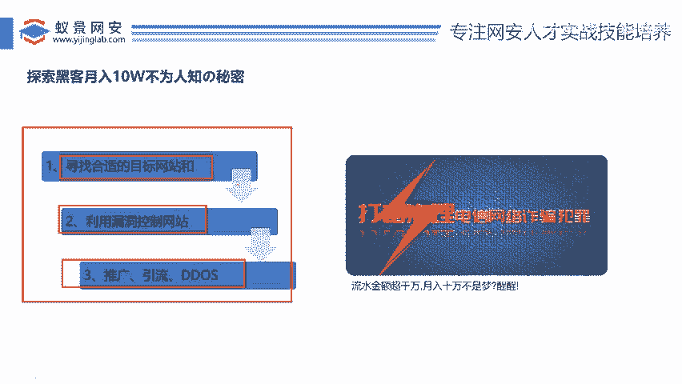

本节课中，我们一起学习了一个黑客团伙利用DDoS攻击、售卖控制权和恶意引流三种手段非法牟利的案例，并剖析了其“寻找目标-利用漏洞-控制盈利”的通用攻击流程。我们再次重申，所有技术的学习和应用都必须在法律和道德的框架内进行。了解攻击者的手法，是为了更好地构建防御。希望你能将所学知识用于正途，成为一名守护网络空间安全的“白帽子”黑客。