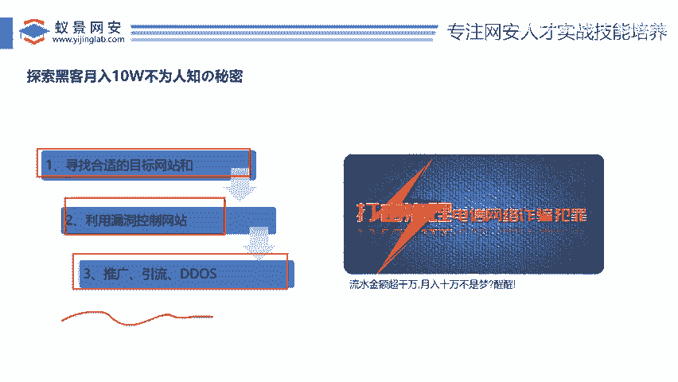
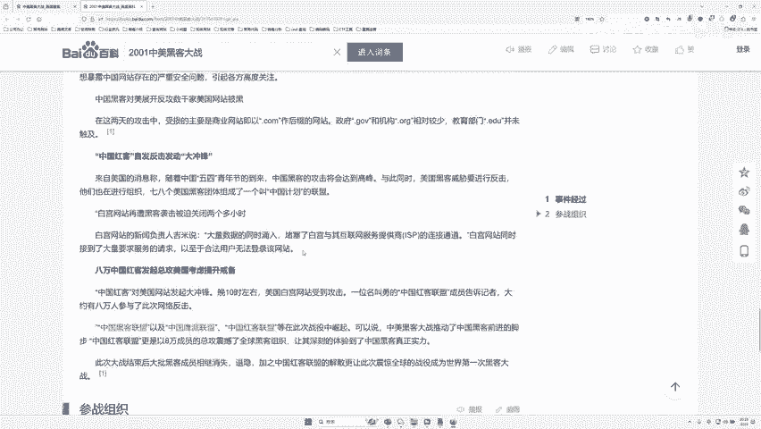
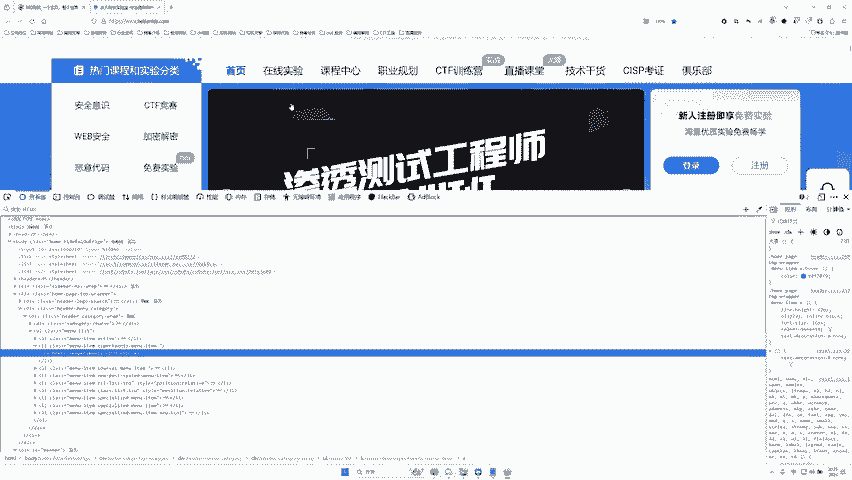
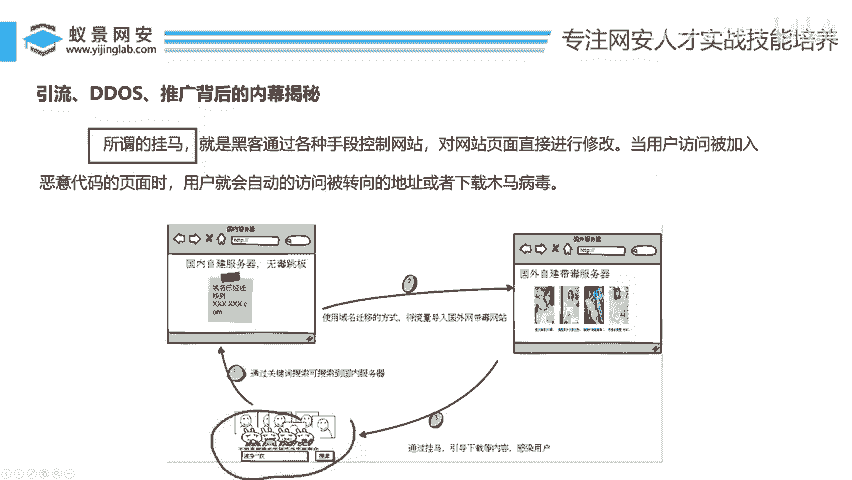
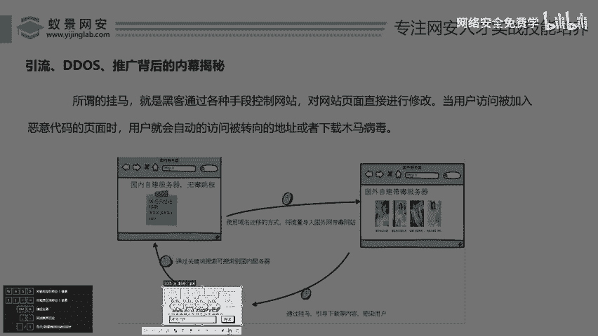
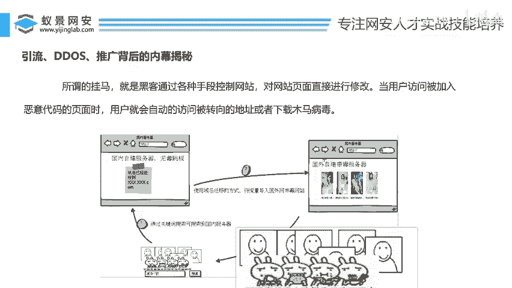
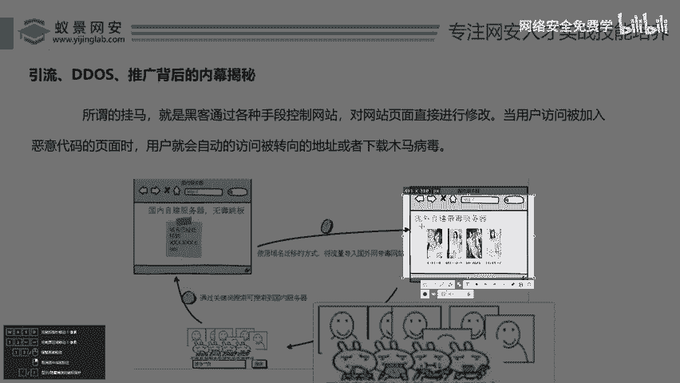
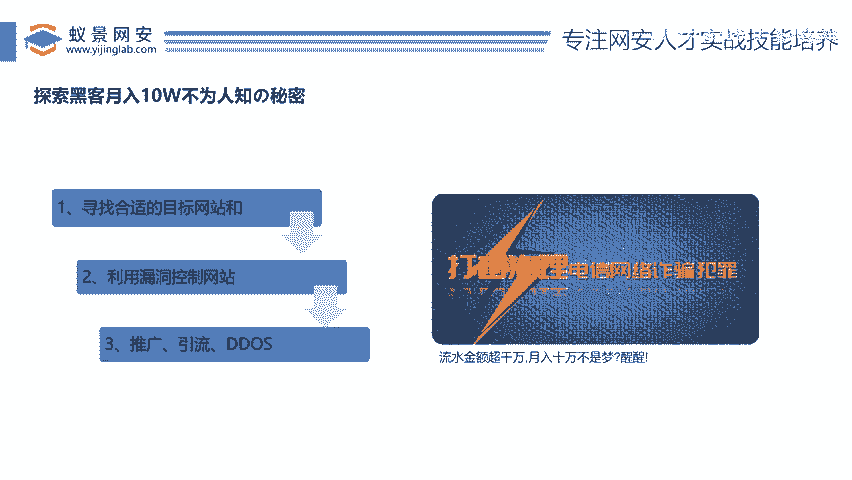

# 网络安全入门：P51：引流、DDOS、推广背后的内幕揭秘 🔍




在本节课中，我们将要学习网络黑产中几个核心概念：DDoS攻击、黑链与挂码。我们将了解这些术语的具体含义、运作方式以及它们如何被用于非法牟利。内容将尽可能简单直白，让初学者能够看懂。

## 核心概念解析

在深入探讨之前，我们需要先理解几个关键术语。本节中，我们来看看“推广引流”、“挂码”和“DDoS”这些行业黑话到底是什么意思。

### 什么是DDoS攻击？💥

上一节我们介绍了基本术语，本节中我们来看看DDoS攻击。DDoS攻击，中文名为**分布式拒绝服务攻击**。其核心目的是通过海量请求压垮目标服务器，使其无法提供正常服务。

**分布式**意味着攻击源分布在不同的地方，由多台计算机（或设备）同时发起攻击。这可以理解为“多对一”的群殴。

以下是DDoS攻击的基本模型：

```
[攻击者控制的成千上万台“肉鸡”（被控制的电脑）]
                ↓ (同时发起海量访问请求)
[目标网站服务器] → 因超出承载能力而瘫痪
```

举个例子：假设一个购物网站服务器最多只能支撑100个人同时访问。如果黑客控制了成千上万台电脑，在同一时间向该网站发起访问请求，服务器就会因无法处理而崩溃。这就好比一扇门一次只能进一个人，突然有100个人同时往里挤，门就会被挤坏。

与DDoS相关的还有一个概念叫**DoS攻击**（拒绝服务攻击）。两者的区别在于：
*   **DoS攻击**：是一台电脑对一台服务器发起攻击（一对一单挑）。
*   **DDoS攻击**：是多台电脑对一台服务器发起攻击（多对一群殴）。



在黑色产业中，控制了大量“肉鸡”的黑客可以对外提供DDoS攻击服务，例如“让目标网站瘫痪一小时收费300元”。

**一个著名的历史案例是2001年的“中美黑客大战”**。当时，许多中国网民自发地访问美国网站（如白宫官网），导致其服务器因流量过大而暂时瘫痪，这本质上是一次大规模的DDoS攻击。

### 什么是黑链？⛓️



了解了流量攻击，我们再来看看内容篡改。**黑链**是指黑客入侵一个正常网站后，在网页中植入隐藏的非法链接（如赌博、色情、外挂网站链接）。

以下是黑链的工作原理：

1.  黑客发现并利用网站漏洞，获取了网站的控制权。
2.  黑客在网站的源代码中，篡改或添加一个指向非法网站的链接。这个链接可能被伪装成正常的按钮或文字。
3.  当用户访问该正常网站，点击被篡改的链接时，就会跳转到非法网站。

例如，一个在线教育网站的“实验课程”按钮，其原本的代码是：
```html
<a href=“/experiments”>在线实验</a>
```
被黑客篡改后，变成了：
```html
<a href=“http://非法外挂网站.com”>在线实验</a>
```
用户点击“在线实验”，结果却进入了外挂网站。

**黑链的主要目的有两个：**
1.  **引流**：将正常网站的流量引导至非法网站，增加后者的访问量和潜在客户。
2.  **提高搜索引擎权重（SEO作弊）**：搜索引擎（如百度）的排名机制会考虑一个网站被其他网站链接的数量和质量。黑客通过在许多高权重网站上植入黑链，可以快速提升非法网站在搜索引擎中的排名，使其在相关关键词搜索中排在靠前位置。这是一种违法但暴利的“黑帽SEO”手段。

### 什么是挂码（网站劫持）？🦠

最后，我们来看看另一种常见的攻击形式。**挂码**，也叫网站劫持，是指黑客在网站中植入恶意代码（木马、病毒脚本）。当用户访问被挂马的网站时，会自动跳转到非法网站或悄悄下载病毒。





以下是挂码的典型场景：
你搜索一个正常关键词（如某位名人的名字），点击进入一个看似正常的网页。但页面加载后，会**自动、迅速地跳转**到一个赌博或色情网站。这就是因为该正常网站被黑客“挂了马”。



其危害在于：
*   **诱导与欺诈**：将用户引导至非法网站进行消费或诈骗。
*   **传播病毒**：可能在跳转过程中或目标网站上，让用户的电脑感染木马病毒，进而可能被控制成为“肉鸡”。



## 总结

本节课中我们一起学习了网络黑产中三种常见的技术手段：

1.  **DDoS攻击**：通过控制大量计算机（肉鸡）同时向目标发送海量请求，使其服务器瘫痪。公式可简化为：**海量请求 > 服务器承载能力 = 服务瘫痪**。
2.  **黑链**：通过入侵并篡改正常网站的代码，植入隐藏的非法链接，以达到引流和作弊提高搜索引擎排名的目的。
3.  **挂码（网站劫持）**：在网站中植入恶意代码，使用户访问时被强制跳转到非法网站或感染病毒。



这些技术本身是网络安全领域的知识，但被不法分子利用后，就构成了危害网络秩序、侵犯他人权益的黑色产业链。理解这些内幕，有助于我们更好地认识网络威胁，并提高自身的安全防范意识。