# 网络安全入门：P53：一秒实现网站恶意跳转 🚀

在本节课中，我们将学习一种常见的网络攻击手法——网站恶意跳转。我们将了解其背后的原理、实现步骤以及如何进行防御。整个过程将使用简单的语言和直观的演示，让初学者也能轻松理解。

## 概述：从复现漏洞开始

上一节我们介绍了如何发现和利用摄像头漏洞。对于网络安全初学者而言，第一步往往不是自己发现全新的漏洞，而是**复现漏洞**。这就像学习走路一样，是必须经历的基础阶段。通过批量复现已知漏洞，可以积累经验，为后续独立挖掘漏洞打下坚实基础。

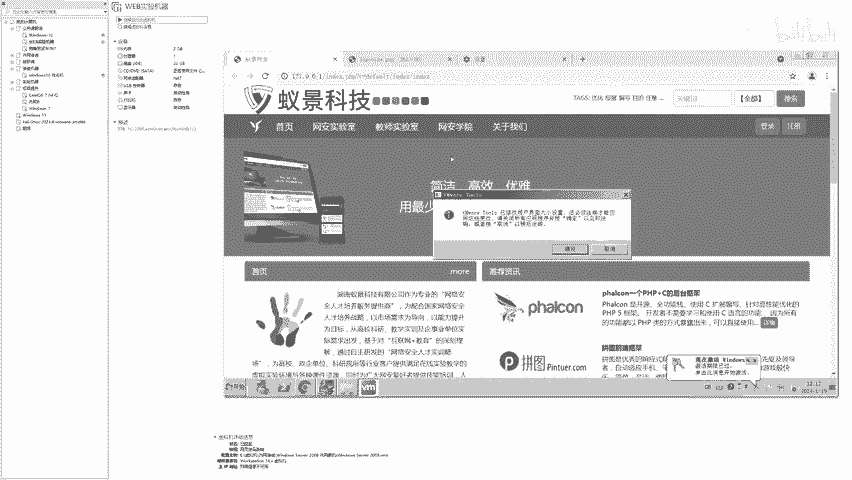

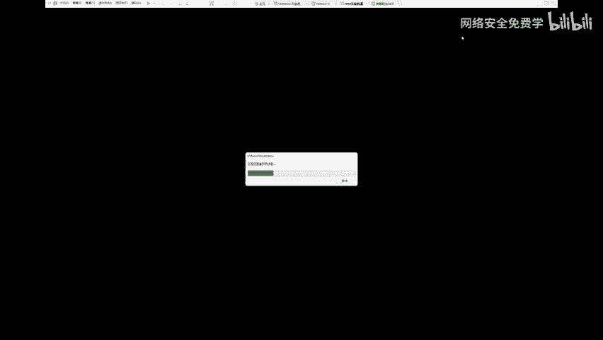

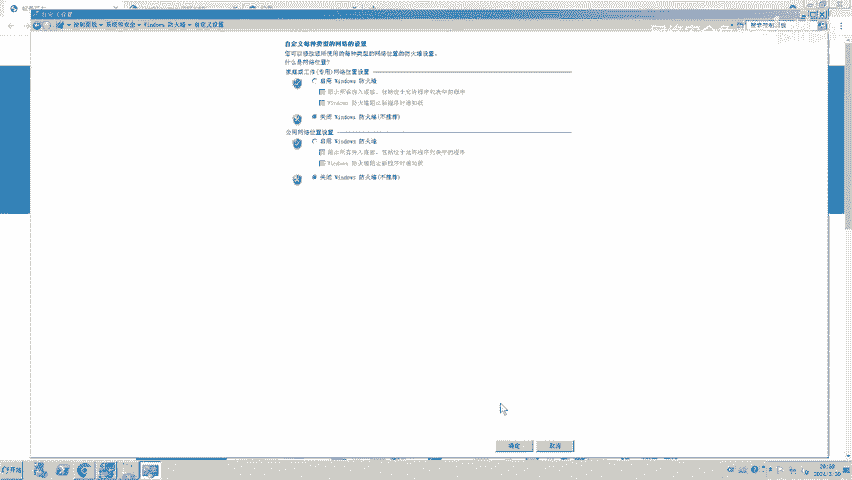

## 恶意跳转的实现原理

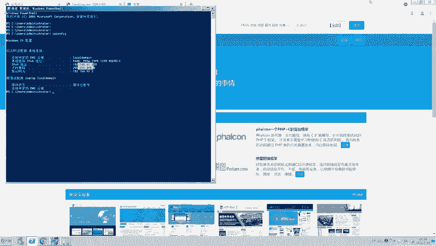

那么，攻击者是如何实现让一个正常网站跳转到赌博或色情网站的呢？其核心流程可以概括为：**控制目标服务器 -> 植入恶意跳转代码**。

以下是实现此攻击的关键步骤：


1.  **发现并利用漏洞**：首先，需要找到目标网站存在的安全漏洞（例如，通过搜索引擎批量查找已知漏洞）。利用该漏洞获取对网站服务器的控制权。
2.  **上传Webshell木马**：通过漏洞，将一种称为“Webshell”的木马文件上传到服务器上。这个木马就像一个后门，允许攻击者远程管理服务器文件。
3.  **植入跳转代码**：通过Webshell，找到网站的主页文件（通常是`index.html`或`index.php`），并在其中插入一段特定的JavaScript跳转代码。
4.  **代码生效**：当普通用户再次访问该网站时，浏览器会执行被插入的恶意代码，自动跳转到攻击者设定的恶意网址。

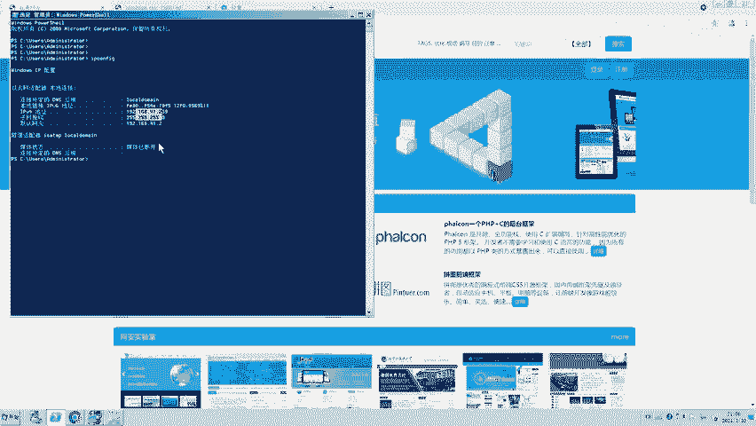

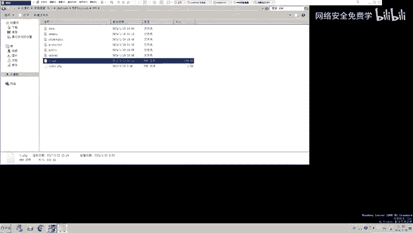


## 实战演示：植入跳转代码

接下来，我们通过一个模拟环境（靶场）来演示这个过程。请注意，所有操作均在合法授权的测试环境中进行，切勿对真实网站进行非法测试。

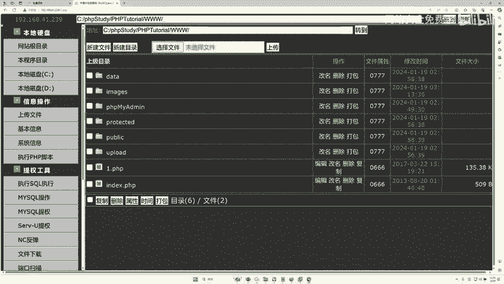

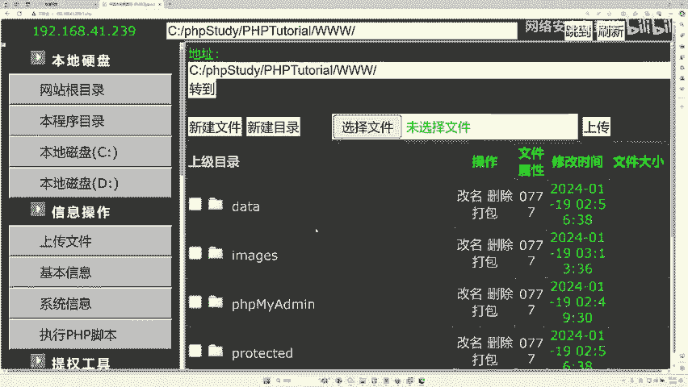

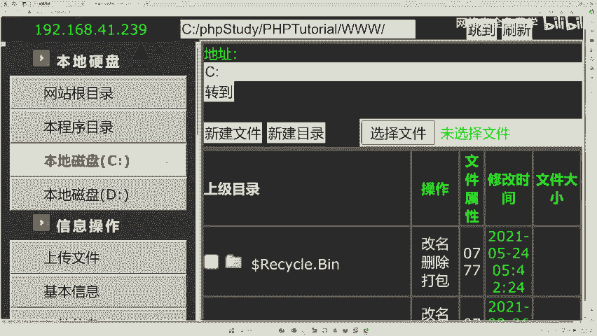

### 第一步：访问并控制靶场网站


我们首先访问一个用于演示的靶场网站 `192.168.41.239`。假设我们已经通过某种漏洞，将Webshell木马文件（例如`1.php`）上传到了该服务器。

通过浏览器访问这个木马地址：`http://192.168.41.239/1.php`，我们便进入了Webshell管理界面。在这里，我们可以浏览、删除、修改服务器上的任何文件。

### 第二步：理解恶意跳转代码

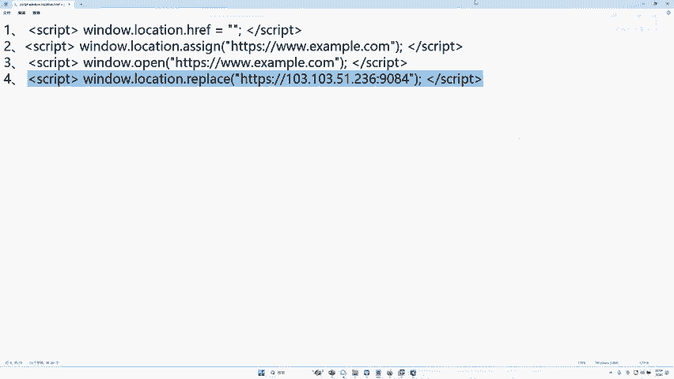

实现跳转的核心是一段简单的JavaScript代码。攻击者通常会准备多种形式的代码，其本质相同。以下是一个典型示例：

```html
<script>
window.location.href = “http://恶意网站地址.com”;
</script>
```

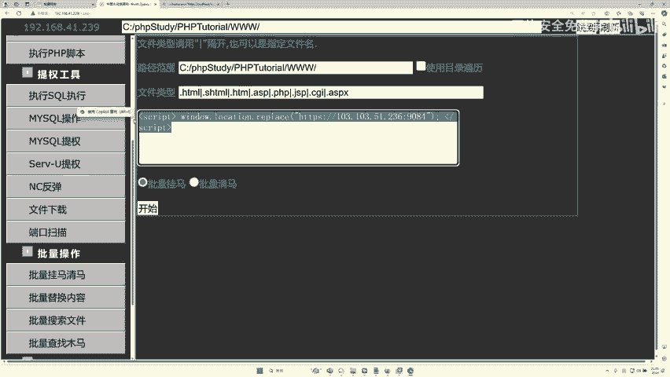


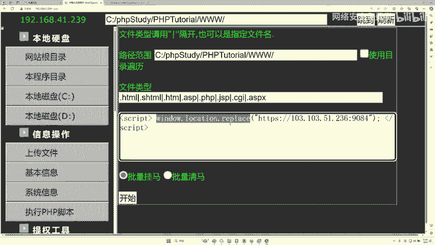

**代码解释**：
*   `<script>` 标签表示其中包含的是JavaScript脚本。
*   `window.location.href` 是JavaScript中用于控制浏览器地址的属性。
*   等号后面的引号内，就是想要跳转到的**目标网址**。攻击者会将其替换为赌博、色情等恶意网站的链接。

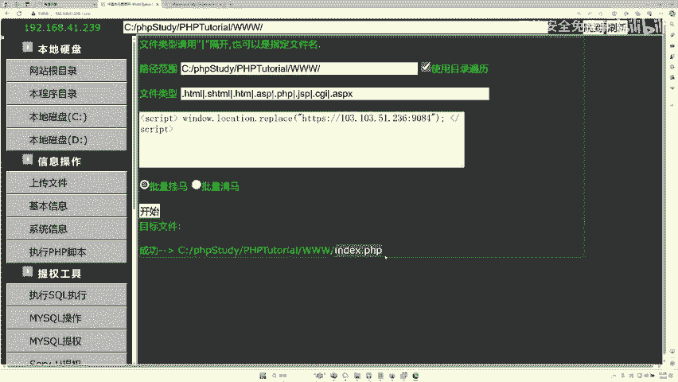


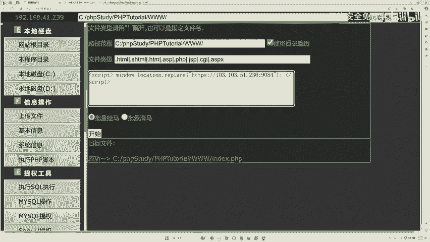

### 第三步：植入代码并验证效果

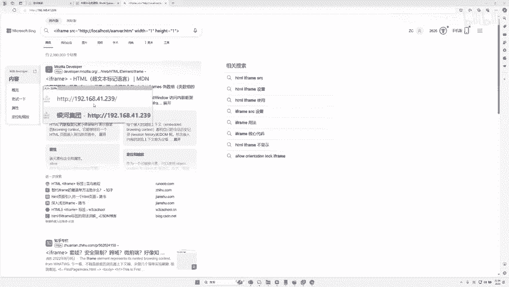

在Webshell工具中，通常有“批量挂马”或“插入代码”的功能。我们将上述跳转代码（目标地址替换为演示用的博彩页面地址）填入，并指定要篡改的网站根目录文件（如`index.html`）。

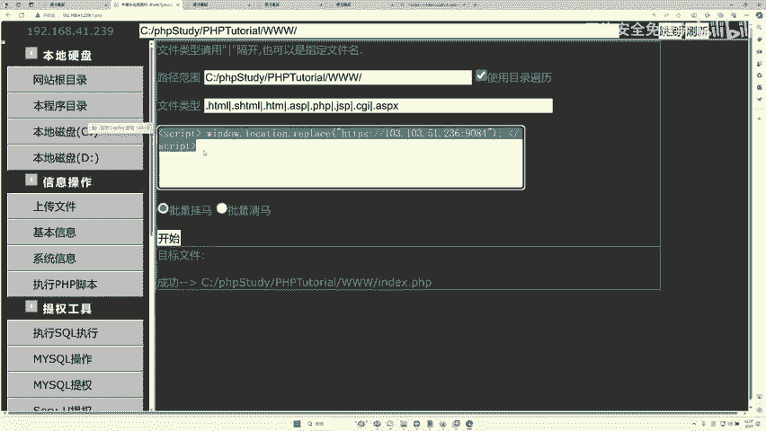

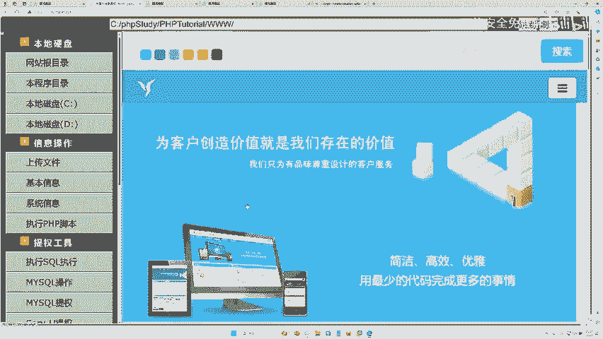

点击执行后，工具会自动在`index.html`文件的末尾插入这段恶意代码。

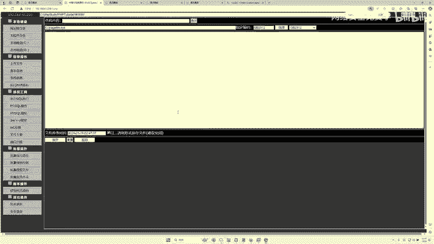

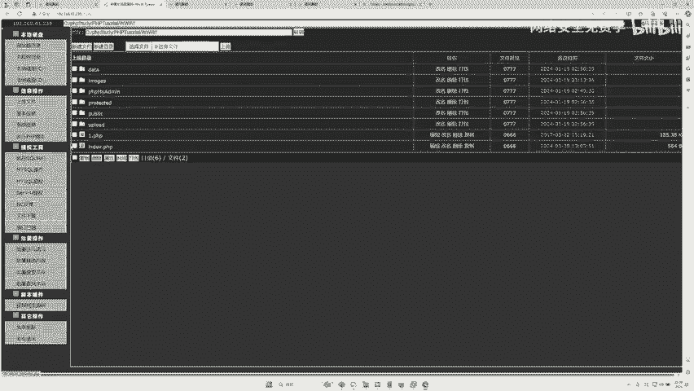

**效果验证**：再次访问原网站 `192.168.41.239`。你会发现，页面在加载后瞬间自动跳转到了我们设定的博彩页面。攻击目的就此达成。

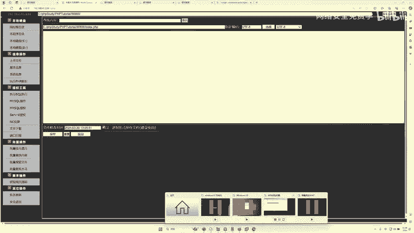

### 第四步：分析被篡改的页面

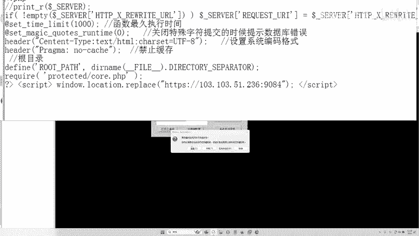

要理解原理，我们可以通过Webshell查看被修改后的`index.html`源代码。你会发现在文件末尾，确实多出了我们植入的那段`<script>`代码。正是这行代码导致了跳转行为。

## 防御与排查：如何应对此类攻击

作为网站管理员或安全人员，如何防御和排查这种攻击呢？

以下是基本的排查与修复步骤：

1.  **检查网站文件**：定期检查网站核心文件（如首页文件）的源代码，查看是否有可疑的、非自身业务添加的JavaScript代码，特别是含有 `window.location.href` 的代码段。
2.  **清理恶意代码**：一旦发现，立即删除这些恶意插入的代码。
3.  **修补漏洞**：这是根本解决方案。必须找到攻击者最初利用的上传漏洞（可能是文件上传漏洞、SQL注入获取后台权限等）并进行彻底修复。
4.  **使用安全工具**：部署Web应用防火墙（WAF），可以有效拦截大部分自动化攻击工具和恶意请求。
5.  **加强安全意识**：避免使用弱口令，及时更新系统和应用补丁。

## 课程总结与安全倡导

本节课中，我们一起学习了网站恶意跳转攻击的完整流程：从**复现漏洞**获取权限，到利用**Webshell**控制服务器，最后植入**JavaScript跳转代码**实现攻击。我们也了解了如何通过检查代码和修复漏洞来进行防御。

**重要提示**：网络安全技术是一把双刃剑。本节内容仅用于教学目的，旨在帮助大家理解攻击原理，从而更好地进行防护。所有未经授权的网络攻击行为都是**违法**的。

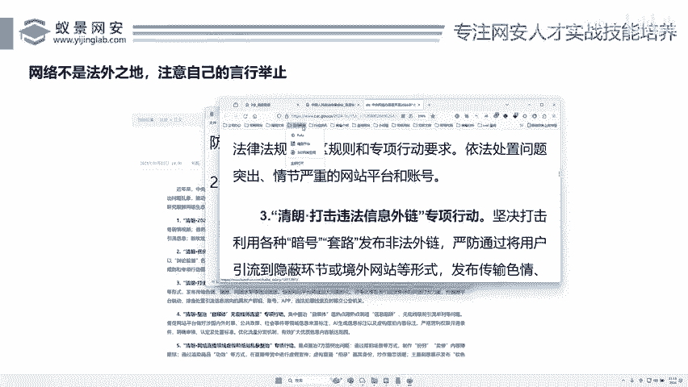

国家相关部门（如网信办）连年开展“清朗”系列专项行动，重点整治包括“色情赌博网站推广”、“网络水军”、“黑产外链”在内的各类网络乱象。作为网络安全的学习者和从业者，我们应致力于利用所学知识**维护网络空间安全**，共同建设清朗的网络环境，切勿以身试法。

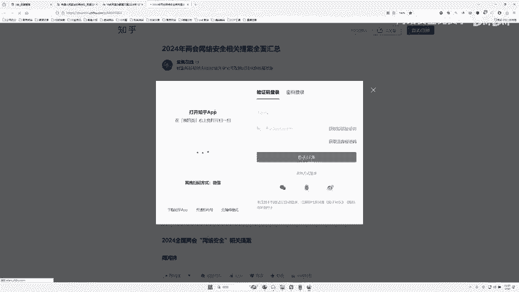

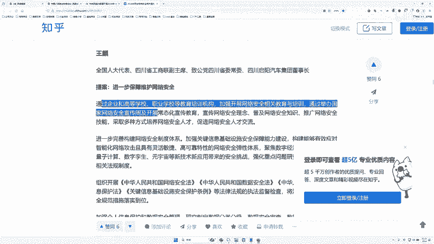

---
**总结**：本节课我们掌握了恶意跳转的原理与实现，更明确了学习网络安全应以**防御**为目的。保持警惕，合法合规地运用技术，才能在这个领域行稳致远。