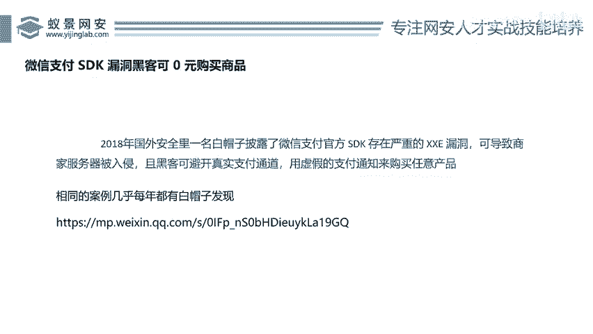
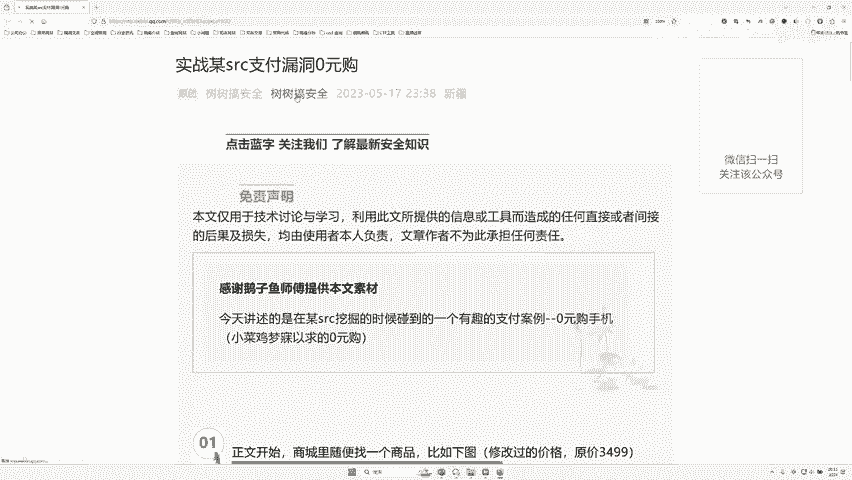
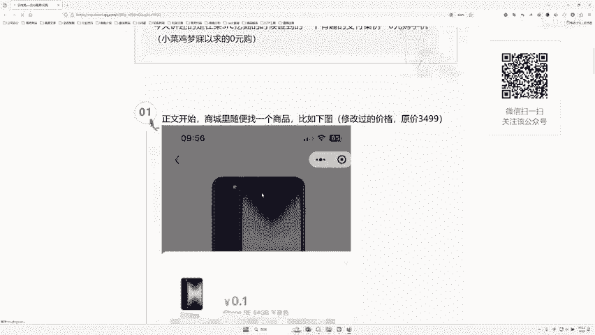
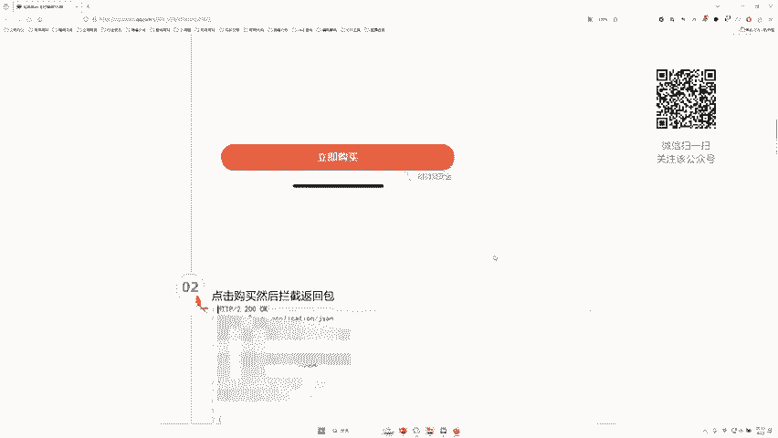
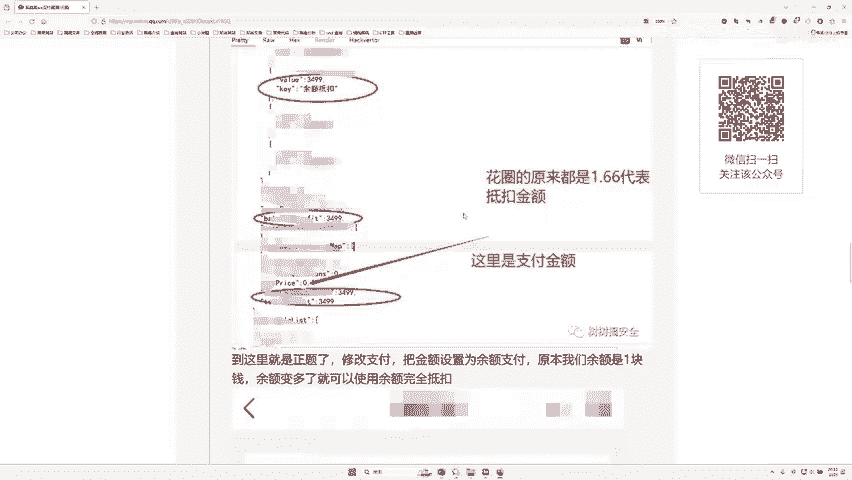
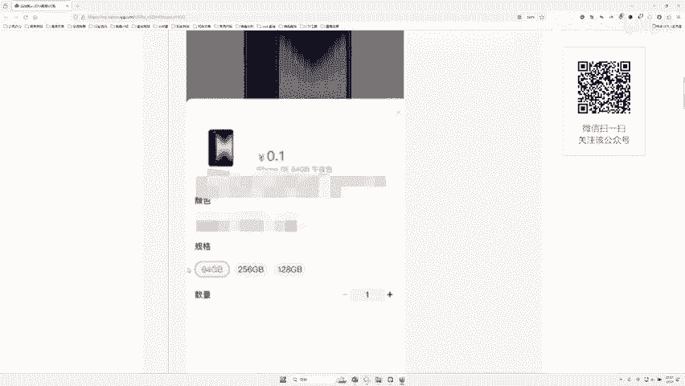
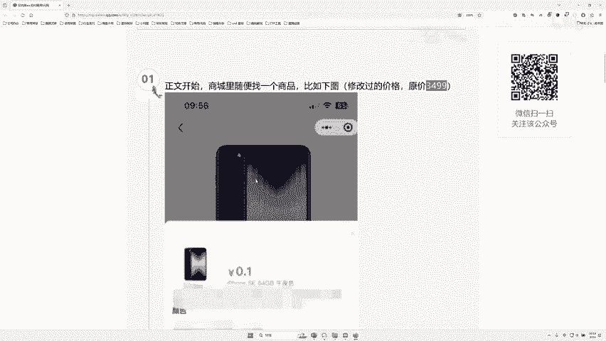
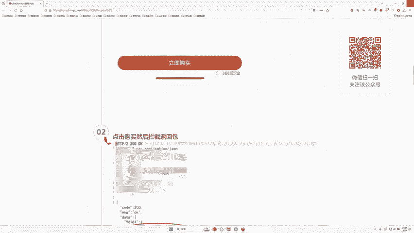
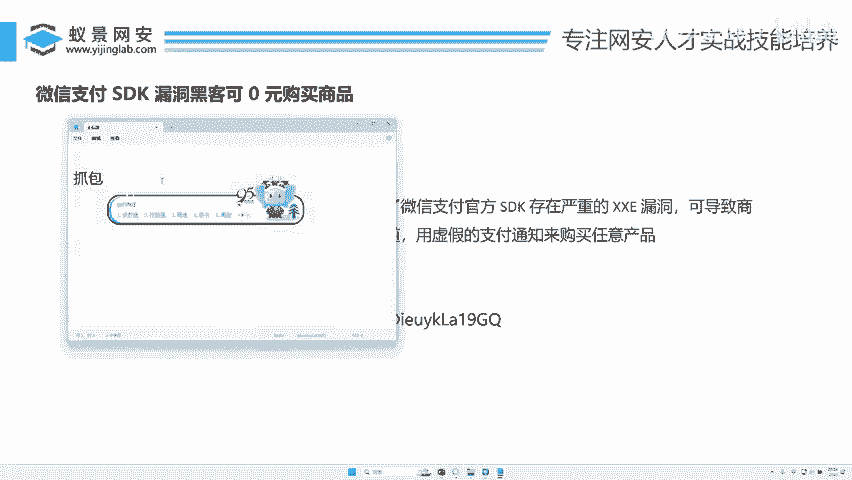

# 网络安全：P54：微信支付SDK漏洞分析

在本节课中，我们将要学习一种典型的支付逻辑漏洞。我们将通过分析一个历史案例，了解攻击者如何通过修改数据包实现“0元购”，并探讨其背后的技术原理与防范思路。

## 概述：支付漏洞引子


2018年，有安全研究员发现微信支付SDK存在一个漏洞。该漏洞允许攻击者通过构造虚拟支付请求，以0元购买任意商品。这只是一个引子，类似的支付逻辑漏洞每年都会出现，只是很多并未公开披露。

为了理解这种漏洞，我们先来看一个具体案例。

## 案例分析：0元购手机

以下是支付漏洞的一个典型操作流程。攻击者目标是原价3499元的手机。

1.  **选购商品**：攻击者首先在购物平台选中目标商品，其价格为3499元。
2.  **拦截请求**：在提交订单或支付环节，使用抓包工具拦截应用程序发送到服务器的网络数据包。
3.  **修改数据**：在拦截到的数据包中，定位到代表价格、优惠抵扣或支付金额的关键字段。例如，将 `price=3499` 修改为 `price=0` 或 `coupon_discount=3499`。
4.  **重放请求**：将修改后的数据包发送给服务器。
5.  **达成目的**：如果服务器后端没有对支付金额进行严格的二次校验，就会接受这个被篡改的请求，最终导致攻击者以极低价格（如1元）甚至0元完成支付。




这个案例展示了攻击的核心：**抓包**与**改包**。去年，笔者在“网易严选”平台也曾发现过类似的运费修改漏洞。在合法授权范围内（如漏洞赏金计划）发现并提交此类漏洞，是安全研究员的常规工作。





## 技术原理：漏洞成因浅析




上一节我们看了攻击案例，本节中我们来看看漏洞产生的根本原因。支付漏洞通常属于**业务逻辑漏洞**，其核心问题在于服务器过于信任客户端提交的数据。

一个健康的支付流程，其金额应在多个环节进行校验，用伪代码表示如下：

```python
# 不安全的逻辑（存在漏洞）
def process_payment(order_data_from_client):
    # 直接使用客户端提交的金额进行扣款
    final_amount = order_data_from_client[‘final_price‘]
    charge_user(final_amount)

# 安全的逻辑
def process_payment(order_id, user_submitted_amount):
    # 1. 根据订单ID，从服务器数据库查询商品真实价格
    real_price = database.query(‘SELECT price FROM orders WHERE id = %s‘, order_id)
    # 2. 查询该用户有效的优惠券、积分等抵扣信息
    discount = calculate_user_discount(order_id, user_id)
    # 3. 在服务端计算最终应付金额
    server_calculated_amount = real_price - discount
    # 4. 将客户端提交的金额与服务端计算的金额进行严格比对
    if user_submitted_amount == server_calculated_amount:
        charge_user(server_calculated_amount)
    else:
        return ‘支付金额校验失败‘
```

漏洞产生的关键在于：程序只执行了不安全的逻辑，缺失了服务端的重新计算与校验步骤。攻击者正是利用了这个信任缺口。




## 实践方法：如何发现此类漏洞




了解原理后，你可能会问如何寻找这类漏洞。以下是进行安全测试（必须在合法授权前提下）的基本步骤：





1.  **环境准备**：安装抓包工具，如 Burp Suite、Fiddler 或 Charles。
2.  **配置代理**：将测试设备（手机或电脑）的网络流量代理到抓包工具。
3.  **业务流程遍历**：在目标App或网站中，完整走一遍购买支付流程。
4.  **流量分析**：在抓包工具中，记录所有与“订单”、“支付”、“金额”、“优惠”相关的HTTP请求。
5.  **参数修改测试**：尝试修改疑似金额、折扣、数量等参数，观察服务器响应及最终订单状态。

**重要警告**：未经授权对任何网站或应用进行测试是**非法**的。请在厂商公开的漏洞赏金平台、授权测试环境或自己搭建的靶场中进行练习。

## 总结与思考



本节课中我们一起学习了支付逻辑漏洞。我们从一个历史案例入手，理解了攻击者通过“抓包-改包”实现0元购的基本流程。随后分析了漏洞根源在于**服务端缺失对支付金额的二次校验**。最后，我们探讨了在合法范围内发现此类漏洞的方法。


支付安全是业务系统的基石。对于开发者而言，必须牢记**“不要信任客户端传来的任何数据”**这一原则，所有关键逻辑，尤其是金额计算，必须在服务端完成。对于安全爱好者而言，理解这些漏洞模式有助于更好地从事安全测试与防御工作。