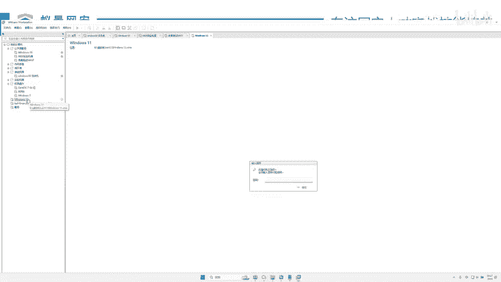
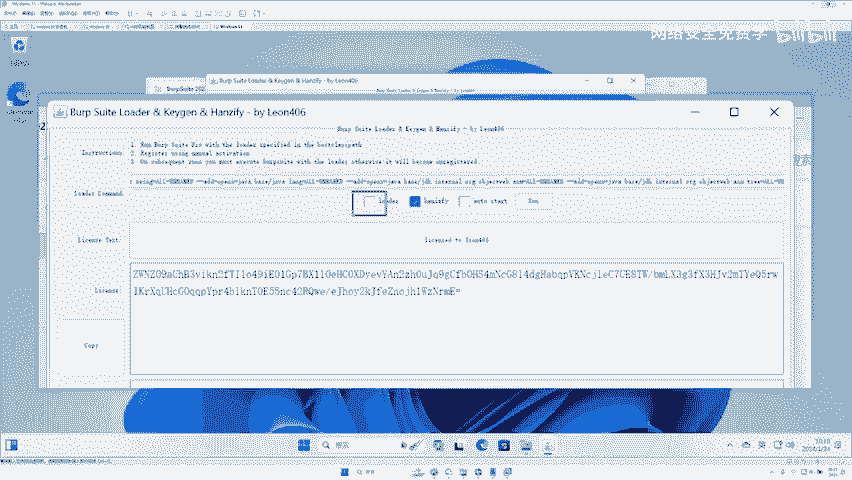
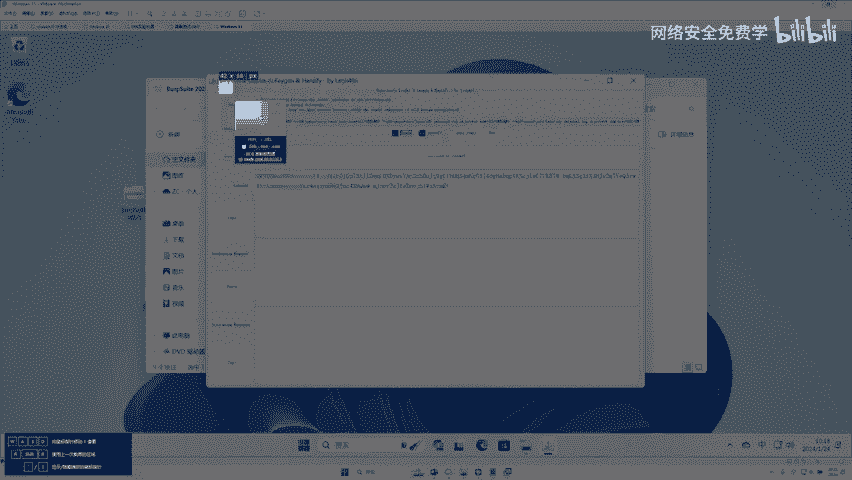
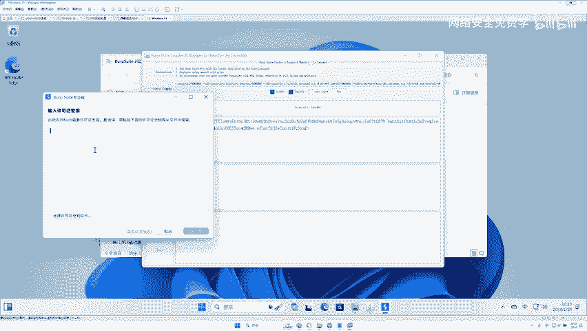
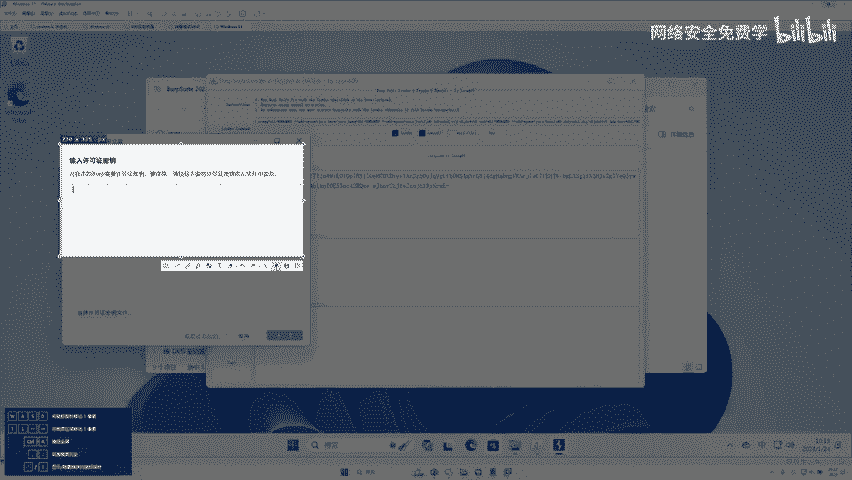

# 网络安全入门：P55：黑客工具BP安装与使用指南 🛠️

在本节课中，我们将要学习一款在网络安全领域至关重要的工具——Burp Suite（简称BP）。我们将了解它的核心作用，并完成从下载、安装、激活到基础使用的全过程。通过本教程，你将能够独立运行BP，并理解其作为“中间人”代理的基本工作原理。

## BP工具简介与核心概念

上一节我们概述了本课程的目标，本节中我们来看看BP到底是什么。



BP是一款用于Web应用程序安全测试的集成平台。它的核心功能是充当浏览器和目标网站服务器之间的“中间人”（Man-in-the-Middle，简称MITM）代理。

**核心概念：中间人代理**
这个过程可以用一个简单的模型来描述：
```
你的浏览器 <---> BP代理 <---> 目标网站服务器
```
或者，用更生活化的比喻：
*   **你**：想要购物的用户。
*   **你的女朋友**：BP代理（中间人）。
*   **商店**：目标网站服务器。


你把钱（请求数据）给女朋友，她可以选择原样传递、修改金额（篡改数据）、甚至不传递（丢弃请求），然后再将商品（响应数据）带回给你。BP正是扮演了这个“中间人”的角色，允许我们拦截、查看和修改浏览器与服务器之间流通的所有HTTP/HTTPS数据包。

## BP工具下载与安装步骤

理解了BP的作用后，本节我们将一步步完成它的安装。我们使用的是免Java环境的一键安装包，过程非常简单。

以下是详细的安装与激活步骤：





1.  **下载工具包**
    从提供的网盘链接中下载名为 `b suite2023` 的压缩包文件。

2.  **解压文件**
    将下载的压缩包解压到本地电脑的任意目录。请确保将整个文件夹解压出来，而不是直接在压缩包内运行程序。





3.  **运行激活程序**
    进入解压后的文件夹，你会看到几个关键文件：
    *   `Start Activator.exe`：激活程序。
    *   `Start Chinese.bat`：中文版启动脚本。
    *   `Start English.bat`：英文版启动脚本。
    首先，双击运行 `Start Activator.exe`。

4.  **激活BP工具**
    激活程序启动后，请按顺序操作：
    *   勾选界面上的协议复选框。
    *   点击 **`Run`** 按钮启动BP。
    *   在BP启动后的许可证窗口，将激活程序界面上的 **许可证密钥** 复制粘贴进去，点击“下一步”。
    *   选择 **“手动激活”**。
    *   将BP界面中 **“复制请求”** 框内的内容，粘贴到激活程序的 **“请求”** 框内。
    *   点击“下一步”后，激活程序会生成响应。将激活程序 **“响应”** 框内的内容，复制粘贴回BP界面的 **“粘贴响应”** 框内。
    *   点击“下一步”直至完成激活。

5.  **启动BP工具**
    激活完成后，关闭激活程序。在BP主界面点击“启动Burp”，等待片刻即可进入BP的主工作区。今后使用只需运行 `Start Chinese.bat`（中文版）或 `Start English.bat`（英文版）即可。

## BP核心界面与代理功能详解

安装激活成功后，本节我们来看看BP的核心界面，并重点学习最常用的“代理”模块。

BP主界面包含多个模块，如仪表盘、目标、代理等。对于初学者，掌握 **“代理”** 和 **“重放器”** 两个模块，就足以应对大部分基础测试场景。

现在，我们深入了解一下“代理”模块的核心——拦截功能。

在“代理”标签页下，找到“拦截”子标签。这里有一个控制拦截开关的按钮和几个操作按钮：
*   **拦截开关**：控制BP是否拦截经过的流量。
    *   **拦截已关闭**：数据包直接通过，不被截留。这就像你的女朋友二话不说直接帮你去买东西。
    *   **拦截已开启**：所有经过BP的请求或响应会被暂停截留。这就像你的女朋友先把你拦下“教育”一番，然后再决定如何处理你的请求。
*   **操作按钮**（当拦截开启时可用）：
    *   **放行**：将当前拦截的数据包发送出去（可修改后发送）。
    *   **丢弃**：直接丢弃当前拦截的数据包，不发送。
    *   **拦截响应**：切换为拦截服务器返回的响应包。

通过开启拦截，我们可以详细查看浏览器发送的每一个请求细节，并能够对其中的参数、内容进行修改，从而测试网站可能存在的漏洞，例如修改商品价格、绕过身份验证等。

## 总结与展望

本节课中，我们一起学习了网络安全审计中的关键工具Burp Suite。
*   我们首先理解了BP作为 **“中间人代理”** 的核心工作原理。
*   随后，我们完成了从下载、解压到激活的一站式安装流程。
*   最后，我们熟悉了BP的主界面，并重点掌握了 **“代理”模块中的拦截功能**，明白了如何通过开启/关闭拦截来控制数据流的通过与否。


掌握BP的安装和基础代理拦截，是你迈向实战漏洞挖掘的第一步。在接下来的学习中，我们将利用已安装好的BP，结合“重放器”等功能，进行实际的抓包、改包操作，去发现和验证简单的Web漏洞。请确保你的BP已成功安装并运行，为后续的实战练习做好准备。