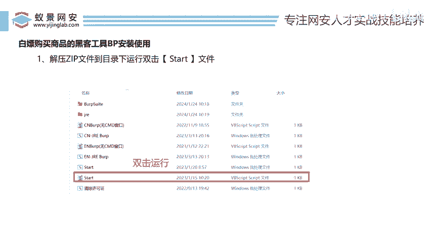
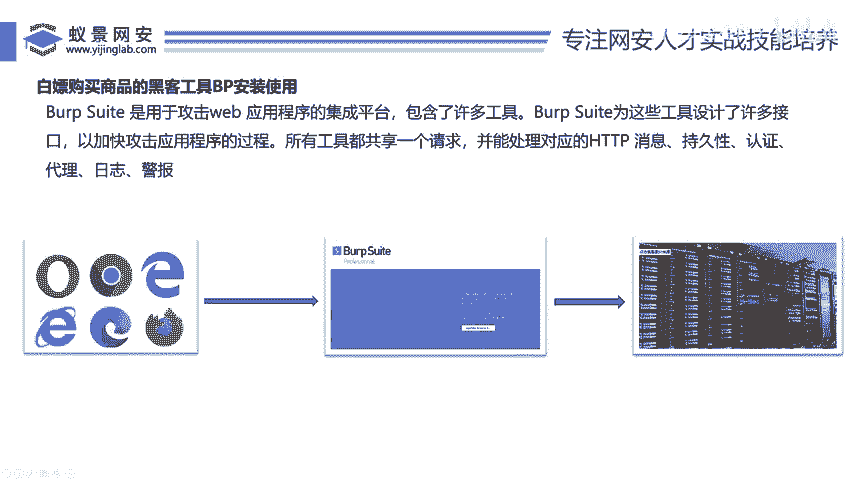
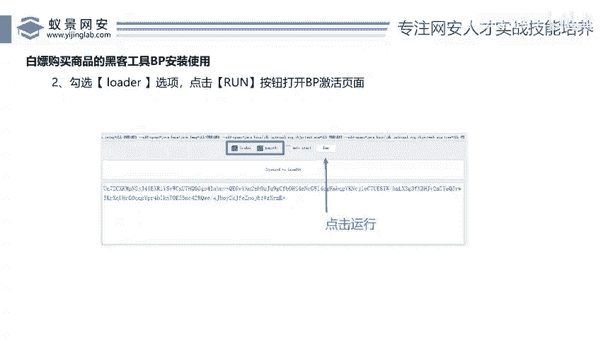
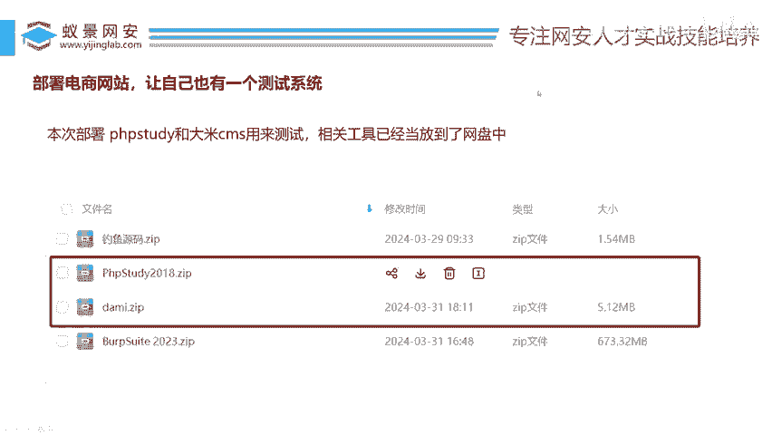

# 网络安全入门：P56：部署自己的电商网站

在本节课中，我们将学习如何快速部署一个用于渗透测试练习的电商网站。这是进行后续实战操作的基础。

上一节我们介绍了Burp Suite（BP）工具，本节中我们来看看如何搭建一个供我们练习的目标网站。

## 准备工具

为了搭建网站，我们需要使用两个工具。以下是所需的工具列表：

*   **PhpStudy**：一个集成了Apache、MySQL、PHP等环境的软件，用于在本地快速搭建Web服务器。
*   **大米的电商系统**：一个开源的电商网站源码，我们将用它作为我们的目标测试网站。

这两个工具已提供在配套的百度网盘中，请下载到本地。

## 部署步骤

接下来，我们开始部署电商网站。请按照以下步骤操作：

1.  **安装PhpStudy**：运行PhpStudy安装程序，按照向导完成安装。安装完成后，启动PhpStudy，并确保Apache和MySQL服务已正常运行。
2.  **放置网站源码**：将下载的“大米的电商系统”源码文件夹，复制到PhpStudy的网站根目录下（通常是 `www` 目录）。
3.  **配置数据库**：在PhpStudy中打开MySQL管理器，创建一个新的数据库（例如命名为 `shop`）。然后，根据电商系统源码的说明，导入其提供的SQL文件来初始化数据库表结构。
4.  **修改配置文件**：找到电商源码中的数据库配置文件（通常是 `config.php` 或类似名称），将其中的数据库连接信息（如数据库名、用户名、密码）修改为你在PhpStudy中设置的信息。
5.  **访问网站**：打开浏览器，在地址栏输入 `http://localhost/你的网站文件夹名`，如果能看到电商网站的首页，说明部署成功。

完成以上步骤后，你的本地电商网站就搭建好了。现在，我们拥有了一个可以安全、合法地进行渗透测试练习的真实环境。

本节课中我们一起学习了如何使用PhpStudy和开源电商系统源码在本地快速搭建一个测试网站。有了这个环境，我们就可以在接下来的课程中，结合Burp Suite等工具，进行实际的渗透测试技术练习了。