# 网络安全入门：P57：支付漏洞挖掘实战教程

在本节课中，我们将学习如何搭建一个本地测试环境，并利用Burp Suite工具，对一个模拟的电商网站进行支付漏洞的实战挖掘。我们将重点学习两种常见的支付漏洞：**任意金额修改漏洞**和**负数购买漏洞**。

## 环境搭建：部署测试网站

上一节我们介绍了支付漏洞的基本概念，本节中我们来看看如何搭建一个用于实战测试的本地环境。我们需要准备两个核心组件：网站服务器（PHPStudy）和靶场系统（大米CMO）。

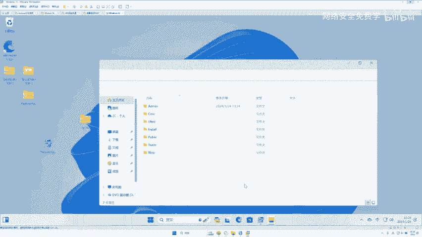

以下是部署步骤：

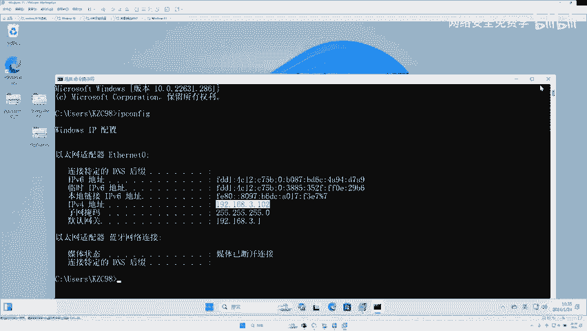

1.  **安装PHPStudy**：首先，我们需要安装PHPStudy来搭建本地Web服务器环境。
    *   将下载好的PHPStudy安装包复制到电脑中。
    *   双击安装包进行安装，安装路径可以自定义（例如D盘）。
    *   等待安装完成，过程中弹出的任何安全提示都选择“允许”。

2.  **部署大米CMO靶场**：安装好服务器环境后，接下来部署我们的测试网站（靶场）。
    *   打开已安装的PHPStudy，点击界面上的“其他选项菜单”。
    *   在弹出的菜单中，选择“网站根目录”。这会打开一个文件夹窗口。
    *   **关键操作**：将此文件夹内的**所有现有文件删除**。如果之前没有部署过其他系统，直接全选删除即可。
    *   打开下载好的“大米CMO”文件夹，将其中的**所有文件复制**到刚才清空的网站根目录文件夹中。

3.  **启动网站并访问**：文件复制完成后，即可启动网站进行测试。
    *   在PHPStudy主界面点击“启动”按钮，启动Apache和MySQL服务。
    *   打开浏览器，在地址栏输入本机IP地址（如`192.168.3.102`）或本地回环地址`127.0.0.1`。
    *   如果看到大米CMO的安装/配置页面，说明网站部署成功。按照页面提示完成数据库配置（通常数据库用户和密码均为`root`，数据库名可自定义如`dami`）即可进入网站首页。

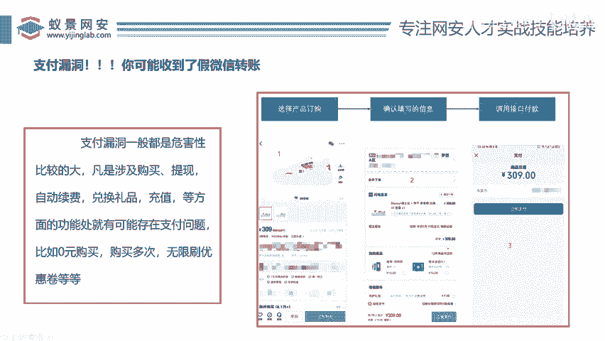

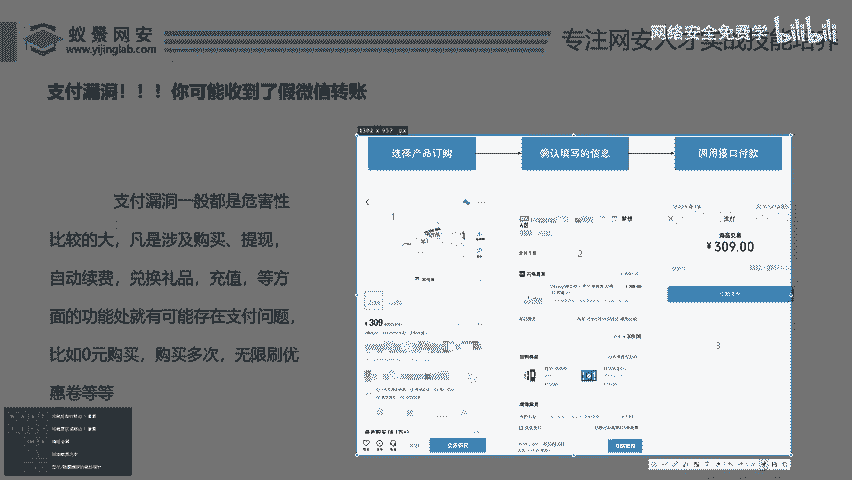

至此，我们的测试靶场就搭建完毕了。这是一个模拟的购物网站，我们可以在这里进行商品浏览、注册、登录和购买操作。

## 漏洞原理：理解支付流程与攻击点

在开始实战之前，我们必须理解电商支付的典型流程，这有助于我们定位可能存在的漏洞点。

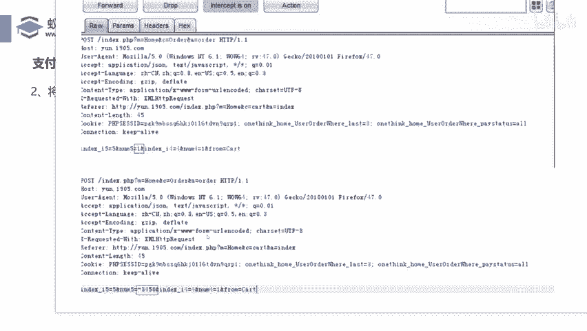

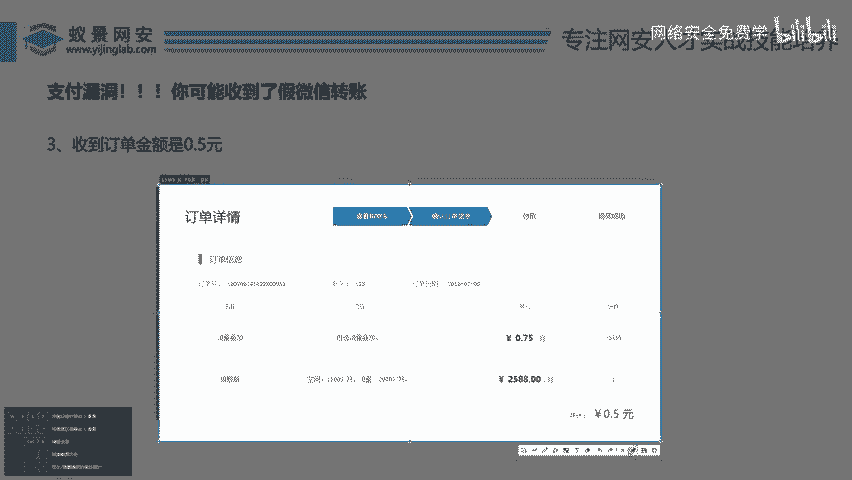

一个标准的在线购物流程通常包含以下步骤：
1.  **选择商品**：浏览商品页面，点击“立即购买”或“加入购物车”。
2.  **确认订单**：进入订单确认页面，填写收货地址、选择优惠券等，系统计算总价。
3.  **发起支付**：点击“立即支付”，跳转到第三方支付平台完成付款。

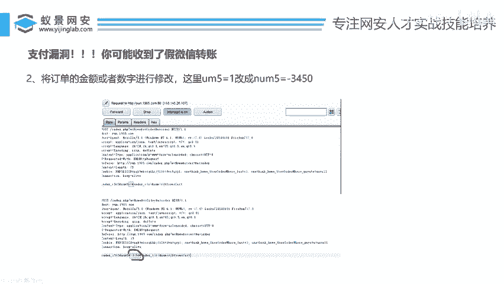

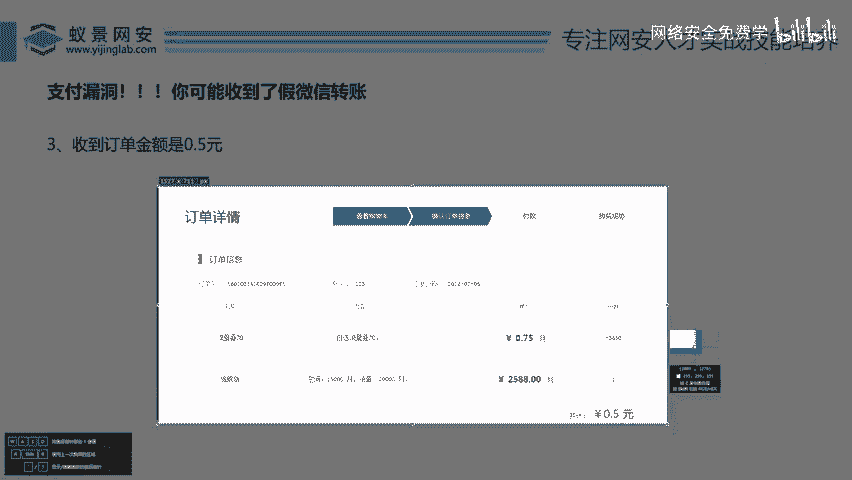

在这个过程中，有两个关键环节会产生网络数据包，也是我们测试支付漏洞的主要切入点：
*   **点击“立即购买”时**：产生的数据包通常包含商品ID、数量、单价等信息。
*   **点击“立即支付/提交订单”时**：产生的数据包通常包含最终订单金额、收货信息等。

**支付漏洞的核心思路**就是拦截这些数据包，并尝试修改其中与金额相关的参数（如单价、数量、总价、运费、优惠券金额等），然后放行数据包，观察后端是否接受了我们修改后的异常值，并生成了异常的订单。

## 实战演练：任意金额修改漏洞

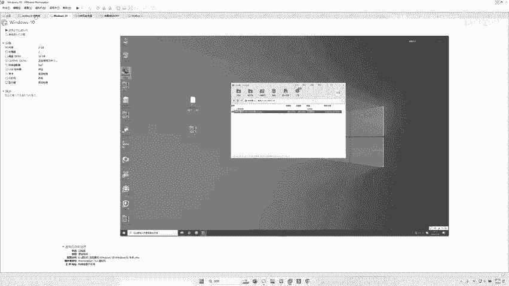

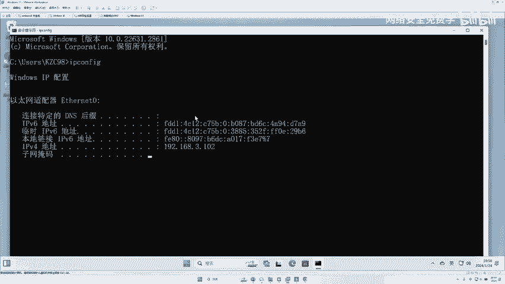

现在，我们利用搭建好的靶场和Burp Suite工具，来实战演示第一种漏洞：将商品价格修改为任意金额（例如1元）。

以下是操作步骤：

1.  **准备工作**：确保网站运行正常，并在网站上注册一个账号并登录。
2.  **配置Burp Suite**：打开Burp Suite，进入`Proxy` -> `Intercept`选项卡，确保拦截功能是开启状态（按钮显示`Intercept is on`）。
3.  **开始测试**：
    *   在网站中选择一个商品（例如“大米手机”），点击“立即购买”。
    *   此时，Burp Suite会拦截到产生的数据包。我们查看这个数据包的内容。
    *   在数据包中，我们寻找与价格和数量相关的参数。例如，可能会发现 `price=5400` 和 `quantity=1` 这样的字段。
    *   我们将 `price` 的值从 `5400` 修改为 `1`。
    *   点击`Forward`按钮放行被修改的数据包。
4.  **观察结果**：浏览器会继续加载，进入订单确认页面。如果漏洞存在，你会看到订单的总金额已经变成了修改后的值（例如1元）。这意味着我们成功利用了任意金额修改漏洞。

**核心概念**：此漏洞的成因是后端服务器在生成订单时，过于信任前端提交的数据，未对金额类参数进行二次校验或签名验证。

## 实战演练：负数购买漏洞

接下来，我们演示第二种漏洞：通过修改购买数量为负数，使订单总价变为极低值甚至负数。

以下是操作步骤：

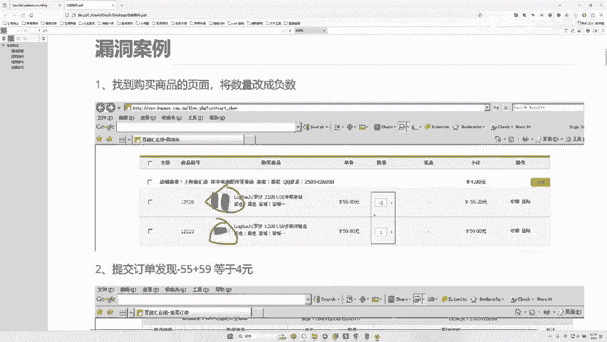

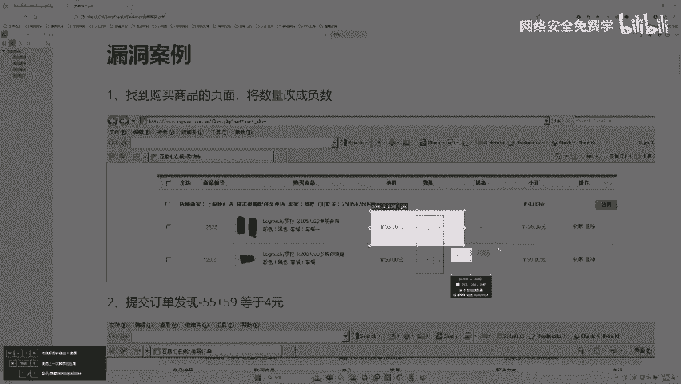

1.  **重复拦截**：同样在商品页面点击“立即购买”，让Burp Suite拦截数据包。
2.  **修改参数**：这次我们寻找代表购买数量的参数，例如 `quantity` 或 `qty`。将其值从正数（如 `1`）修改为一个负数（如 `-1`）。
3.  **放行并观察**：放行数据包后，进入订单确认页面。如果系统没有对负数进行有效限制，订单小计可能会显示为负值（例如 `-5400`），从而导致订单总价异常降低。
4.  **深入测试**：在后续的“提交订单”环节，同样可以拦截数据包，尝试修改其中的金额或数量参数，进行二次测试。有些漏洞可能只在流程的某个特定环节生效。

**核心概念**：此漏洞的成因是后端程序在计算订单总价时 `总价 = 单价 × 数量`，直接使用了用户传入的数量值，当数量为负数时，导致逻辑错误。在极端情况下，甚至可能出现“越买账户余额越多”的严重漏洞。

## 知识扩展与总结

本节课中我们一起学习了支付漏洞的基本原理和两种最常见类型的实战挖掘方法。我们通过搭建本地靶场，使用Burp Suite拦截并修改HTTP请求包，实现了对商品金额和数量的篡改。

支付漏洞的危害性通常很高，因为它直接关系到企业的资金安全。除了本节课演示的漏洞，支付环节还可能存在其他多种问题，例如：
*   **重复提交/并发攻击**：利用极短时间内的并发请求，绕过次数限制，多次使用同一优惠券或享受同一折扣。
*   **优惠券无限刷取**：拦截领取或使用优惠券的请求，修改参数实现无限领取或扩大优惠券面额。
*   **运费篡改**：修改订单数据包中的运费金额字段。

对于开发者而言，防御此类漏洞的关键在于：**服务器端必须对所有涉及金额、数量、身份的关键业务参数进行严格的校验**，不能信任任何来自客户端（前端）的数据。应采用服务端计算最终价格、使用数字签名或令牌（Token）防止数据篡改、对业务逻辑进行并发控制等手段。

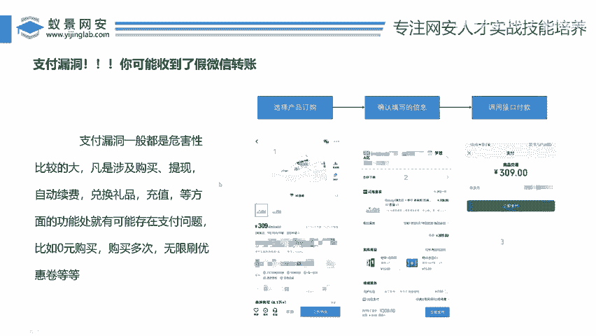

对于安全学习者，理解业务流程、熟练使用抓包改包工具、保持对参数的敏感度，是挖掘此类逻辑漏洞的基础。请务必在合法授权的靶场或测试环境中进行练习。