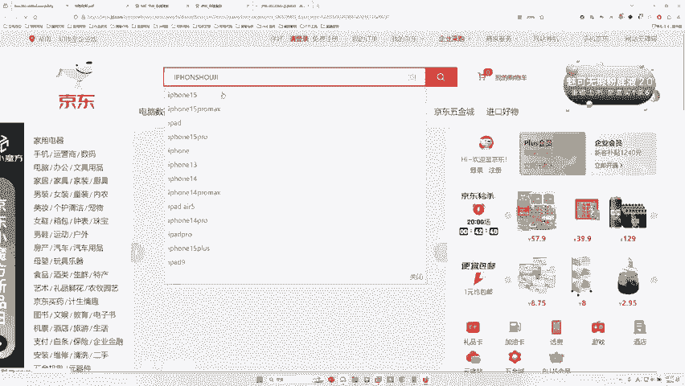
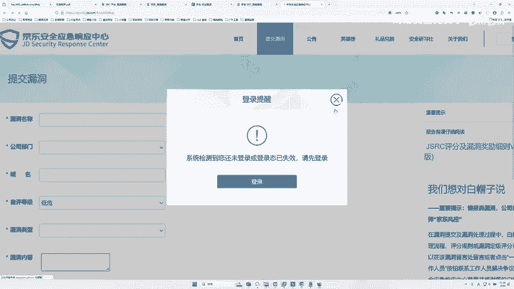
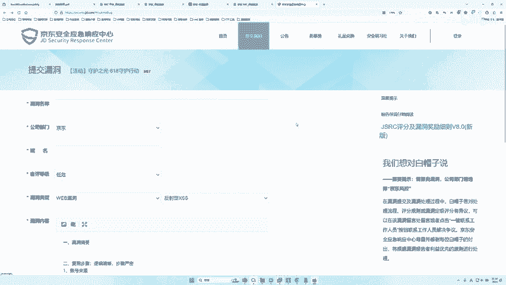
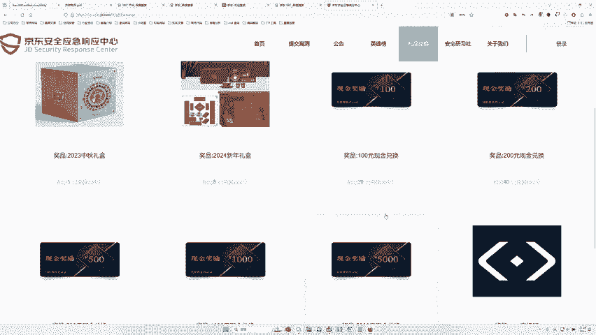
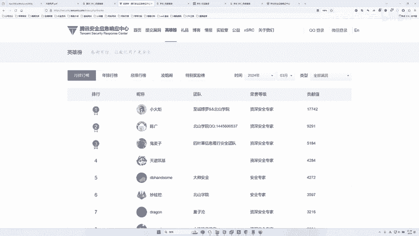
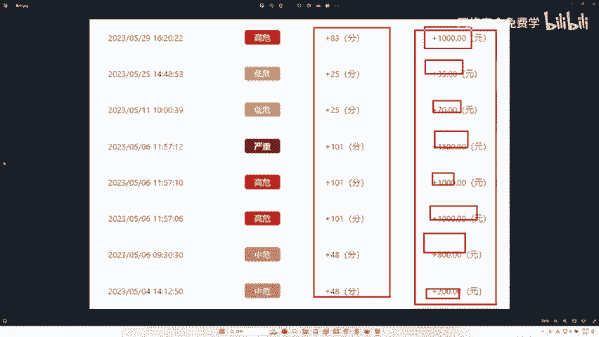
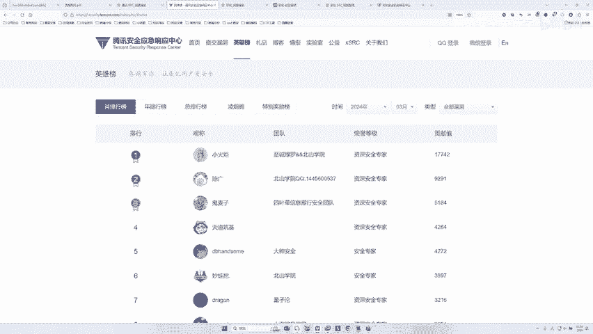
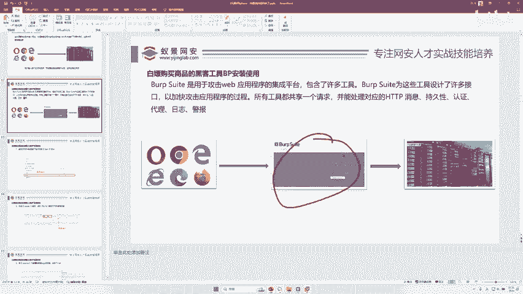

# 网络安全入门：P58：发现了漏洞该怎么办 🛡️

在本节课中，我们将学习当你在实际环境中发现一个安全漏洞时，应该如何正确、合法地处理。这包括保护自己的步骤、如何向平台报告漏洞，以及如何通过合法渠道获得奖励。

---

## 发现漏洞后的标准操作流程

上一节我们介绍了漏洞挖掘的基本概念，本节中我们来看看发现漏洞后的具体操作步骤。以下是发现漏洞后应遵循的三个核心步骤。

### 第一步：开启录屏 📹

如果你发现一个漏洞，第一步是开启电脑屏幕录制功能。将你发现和验证漏洞的整个过程录下来，包括如何操作、如何支付等关键步骤。这个录屏是你的重要证据。一旦被他人误解或污蔑，录屏可以证明你的行为是出于安全测试目的，而非恶意攻击。

### 第二步：进行小额测试购买 💳

接下来，可以进行一次测试性购买。购买金额应控制在1万元人民币以内，例如购买一部手机或一个家电。避免购买价值过高（如10万元）的商品，因为金额过大会引起平台高度关注，增加风险。在购买过程中，务必保持录屏开启。

### 第三步：撰写报告并提交给平台 📝

完成测试购买后，将整个过程的录屏整理好，并撰写一份详细的漏洞报告。将报告提交给对应平台的“安全响应中心”（SRC）。例如，在京东发现的漏洞就提交给京东SRC。提交后，等待平台处理。

很多时候，由于平台订单量巨大，你的测试订单可能不会被立即发现并取消，商品可能会正常发出。如果商品发出，则归你所有。如果平台发现并取消了订单，你就应停止进一步测试。关键在于，我们有录屏作为合法测试的证据。

---

## 什么是SRC平台？💰

上一节我们介绍了处理漏洞的流程，本节中我们来看看提交漏洞的核心平台——SRC。SRC是“安全响应中心”（Security Response Center）的缩写。各大互联网公司都设有自己的SRC平台，用于接收和处理外部安全研究人员提交的漏洞报告。



如果你想通过网络安全技能赚取报酬，SRC平台是一个合法且重要的渠道。平台会根据漏洞的严重程度和影响范围，向报告者支付奖金。


### 如何提交漏洞？

以下是提交漏洞到SRC平台的一般步骤：


1.  **访问平台SRC**：例如，搜索“京东SRC”或“腾讯SRC”。
2.  **找到提交入口**：在SRC网站上找到“提交漏洞”或“漏洞报告”按钮。
3.  **填写报告详情**：按照要求，详细描述漏洞的发现过程、复现步骤、潜在危害，并上传你的录屏证据。
4.  **等待审核与奖励**：平台安全团队会审核你的报告。确认漏洞有效后，会根据其漏洞评级体系向你发放奖金。奖金数额从几百到数万元不等。



**核心提交流程公式**：
`发现漏洞 -> 录屏取证 -> 提交至[对应平台]SRC -> 等待审核 -> 获得奖金/奖励`



### 主流SRC平台举例



国内主要的互联网公司基本都建立了SRC平台，例如：
*   **京东SRC**
*   **阿里SRC**（涵盖淘宝、支付宝等）
*   **字节跳动SRC**（涵盖抖音等）
*   **百度SRC**
*   **腾讯SRC**
*   **华为SRC**

你只需要搜索“公司名+SRC”，通常就能找到官方的漏洞提交平台。

---

## 漏洞挖掘实战技巧与工具 🛠️

了解了流程和平台后，你可能会问：挖掘漏洞难吗？需要什么工具？本节将解答这些疑问。

漏洞挖掘并没有想象中那么困难。许多成功的漏洞报告者也是在校学生或初学者。关键在于动手实践和持续学习。

### 核心挖掘工具



对于Web安全漏洞挖掘（如逻辑漏洞、支付漏洞等），最常用、最核心的工具是 **Burp Suite**。

**核心工具代码/名称**：
```text
主要工具：Burp Suite (简称BP)
```
大约80%的常见Web漏洞，都可以通过熟练使用Burp Suite来发现和验证。它用于拦截、查看和修改浏览器与服务器之间的网络请求，是测试逻辑漏洞的利器。

### 从简单开始





不要担心自己实力不够。你可以从简单的漏洞类型（如某些信息泄露、低危的XSS等）开始尝试。许多SRC平台都有低危漏洞奖励，虽然奖金可能只有几十到几百元，但这是宝贵的入门经验。

通过不断实践、提交报告、学习他人案例，你的挖掘能力会逐步提升。每天进步一点点，积累下来就是强大的实力。

---

## 总结 📚

本节课中我们一起学习了发现安全漏洞后的正确处理方法。我们明确了三个关键步骤：**录屏取证**、**小额测试**和**通过SRC平台提交报告**。我们认识了SRC平台作为合法漏洞提交通道的作用，并了解了核心的测试工具Burp Suite。



记住，网络安全的核心精神是**建设而非破坏**。通过合法、合规的渠道报告漏洞，不仅能帮助企业提升安全性，还能为自己带来荣誉和报酬，实现双赢。