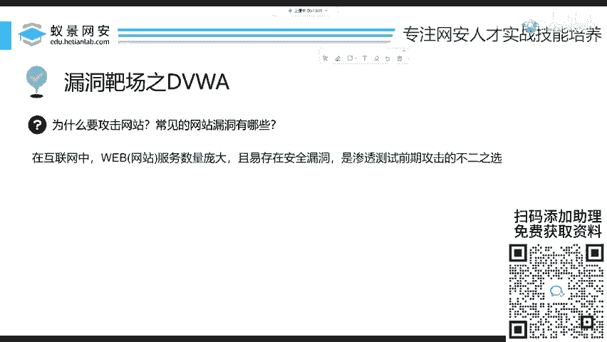
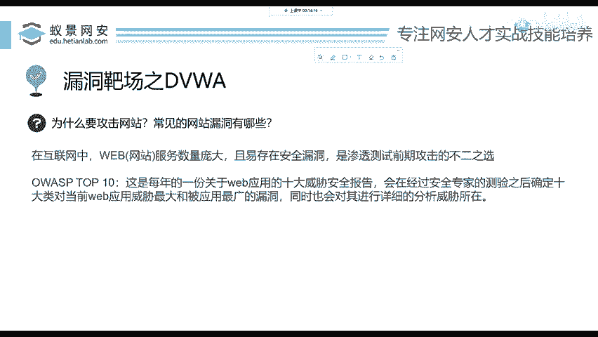
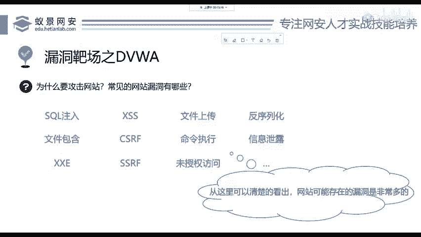
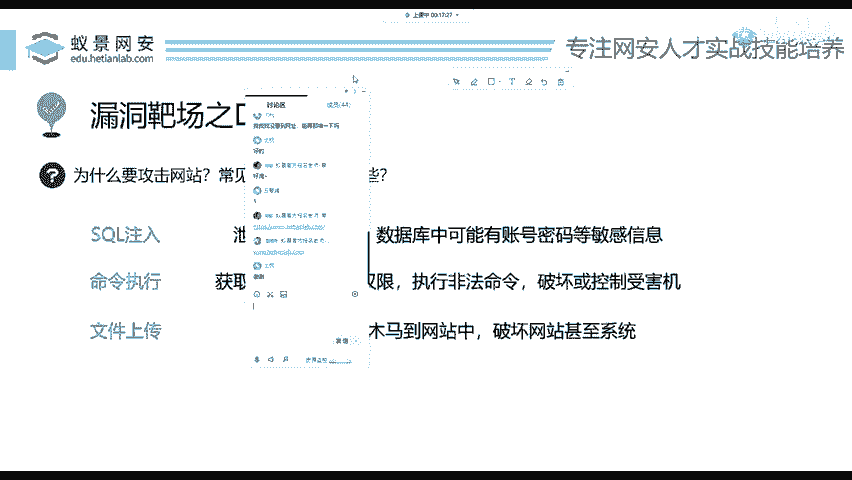
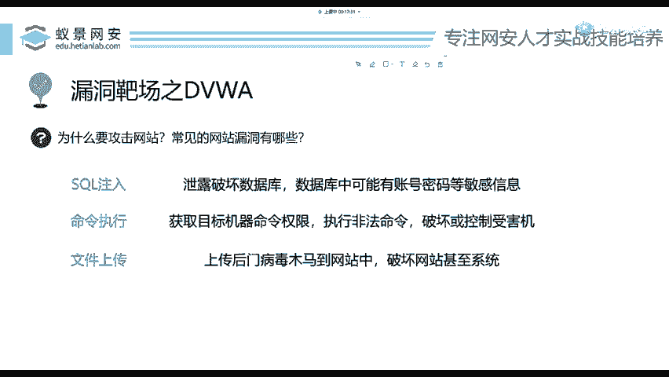
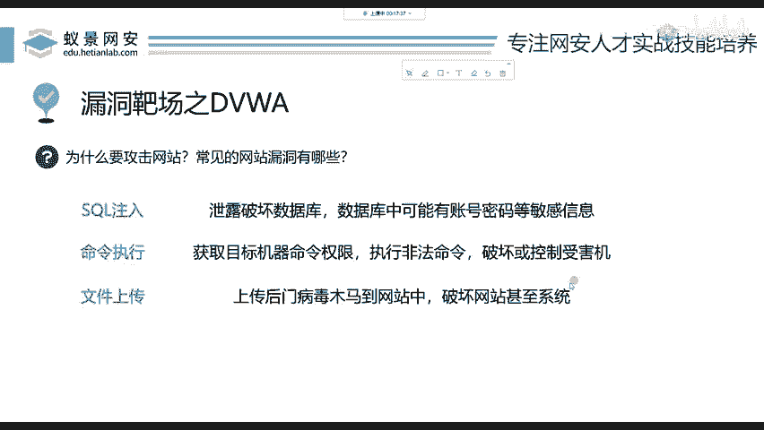

# 网络安全入门：P59：常见的网站漏洞有哪些？ 🔍

在本节课中，我们将要学习常见的网站漏洞类型，理解为何在渗透测试中网站是首要攻击目标，并了解从零开始搭建一个漏洞靶场的基本步骤。课程的核心将聚焦于一个典型且重要的漏洞——命令执行（RCE），我们将探讨其攻击原理与防御方法。

## 为什么要攻击网站？ 🌐

上一节我们介绍了课程概述，本节中我们来看看为何渗透测试常以网站为起点。


在互联网中，网站的数量非常庞大，大到政府企业，小到公司、个人网站，甚至小学都有自己的网站。因此，网站是整个互联网中资产面最为广泛的组成部分。数量庞大意味着存在漏洞的可能性更高。这类似于黑客更倾向于攻击用户基数庞大的Windows系统，而非相对用户较少的苹果系统。因此，网站漏洞是渗透测试前期攻击的不二之选。


## 认识OWASP Top 10 📊

在深入学习具体漏洞前，你需要知道一个名为OWASP（开放式Web应用程序安全项目）的组织。该组织每三年会公布一份关于网站十大安全威胁的报告。这份报告列出了当年在互联网上暴露最多的漏洞排行榜。

以下是2021年OWASP Top 10报告中的部分漏洞类型，如果你是完全的初学者，这些名词可能很陌生，但请不要着急，我们将一步步探讨。

*   SQL注入
*   文件包含
*   文件上传
*   命令执行



从这些类型可以清楚地发现，网站可能存在的漏洞非常多。相较于其他目标，网站通常是我们更容易“拿捏”的切入点。



## 三种核心漏洞简介 🎯

本节我们将从众多漏洞中，挑选出三个基础、重要且对渗透测试及内网渗透至关重要的漏洞进行简要介绍。它们分别是：SQL注入、命令执行和文件上传。

以下是这三种漏洞的简单概括：

1.  **SQL注入**：这是针对数据库的漏洞。数据库存储了诸如用户账户、密码、搜索记录等关键信息。SQL注入能够破坏或操纵数据库，其危害性极大，我们将在后续课程中详细讲解。
2.  **命令执行（RCE）**：顾名思义，攻击者能够获取在目标服务器上执行系统命令的权限。一旦获得此权限，攻击者几乎可以为所欲为，例如关闭服务器、删除网站文件等，危害非常大。
3.  **文件上传**：用户在网站上常进行上传操作，如上传头像或附件。如果网站开发者未对上传文件进行严格的安全检查，攻击者就可能上传木马病毒，从而控制服务器。



## 聚焦：命令执行漏洞详解 ⚙️

上一节我们介绍了三种核心漏洞，本节中我们重点深入探讨命令执行漏洞。

命令执行漏洞，常被称为RCE（Remote Code Execution），允许攻击者在远程服务器上执行任意系统命令。其核心原理在于，应用程序在调用系统函数（如`system()`、`exec()`）处理用户输入时，未对输入进行充分的过滤和验证。

**攻击原理示例（代码）**：
假设一个网站存在一个功能，通过`ping`命令来检测网络连通性，代码如下：
```php
<?php
$ip = $_GET[‘ip‘];
system(“ping -c 4 “ . $ip);
?>
```
如果攻击者输入的参数不是IP地址，而是一条拼接的命令，例如：
```
127.0.0.1 && whoami
```
那么服务器实际执行的命令将是：
```
ping -c 4 127.0.0.1 && whoami
```
这会导致在执行完`ping`命令后，继续执行`whoami`命令并返回当前系统用户信息，从而造成命令注入。

**防御方法**：
开发人员应始终对用户输入保持怀疑，并采取以下措施：
1.  **输入验证**：严格限制输入格式，例如，如果期望是IP地址，就只允许数字和点的组合。
2.  **避免直接拼接命令**：尽量使用安全的API替代直接调用系统命令。
3.  **使用白名单机制**：只允许执行预定义的安全命令。
4.  **对输入进行转义**：在使用命令前，对特殊字符（如`&`、`|`、`;`）进行转义处理。

## 如何搭建漏洞靶场？ 🧪

了解漏洞后，实践是巩固知识的关键。搭建一个漏洞靶场用于合法学习与测试非常简单。

以下是搭建一个基础Web漏洞靶场（例如DVWA）的简要步骤：
1.  安装一个集成的Web服务器环境，例如XAMPP或PHPStudy。
2.  下载漏洞靶场源码（如DVWA）。
3.  将靶场源码放置到Web服务器的根目录（如`htdocs`）下。
4.  根据靶场提供的配置说明，修改数据库连接等配置文件。
5.  通过浏览器访问本地服务器地址，按照安装向导完成初始化设置。





## 总结 📝



本节课中我们一起学习了网站安全的基础知识。我们首先理解了网站作为广泛互联网资产，是渗透测试的常见入口。接着，我们认识了权威的OWASP Top 10安全报告。然后，我们简要概述了SQL注入、命令执行和文件上传这三种核心漏洞。最后，我们深入剖析了命令执行漏洞的原理与防御方法，并了解了搭建本地漏洞靶场进行实践学习的简易步骤。掌握这些基础知识是迈向更深入网络安全领域的第一步。