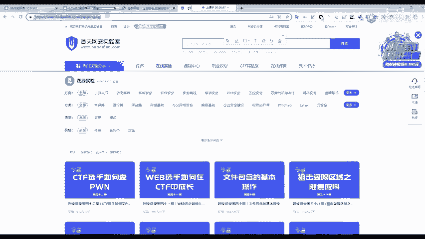
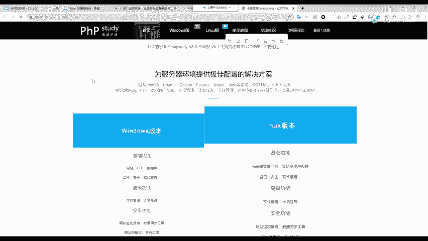
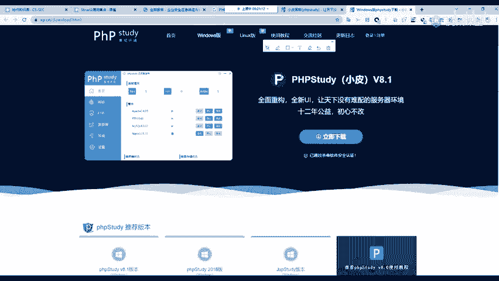
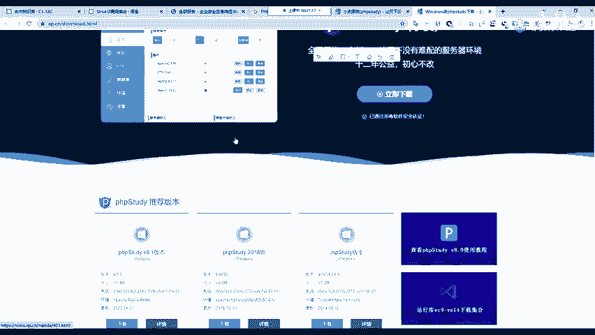
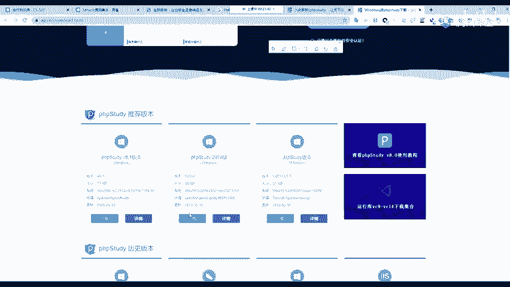
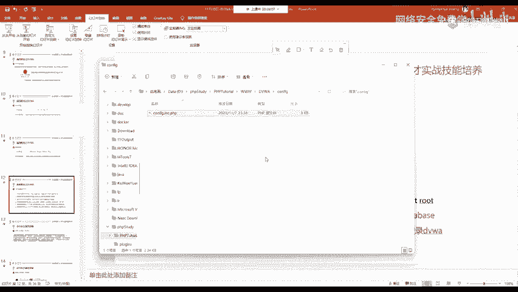
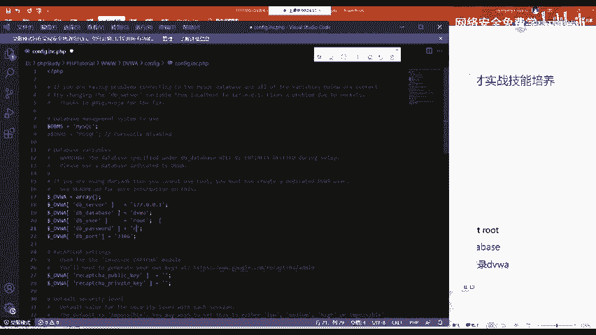
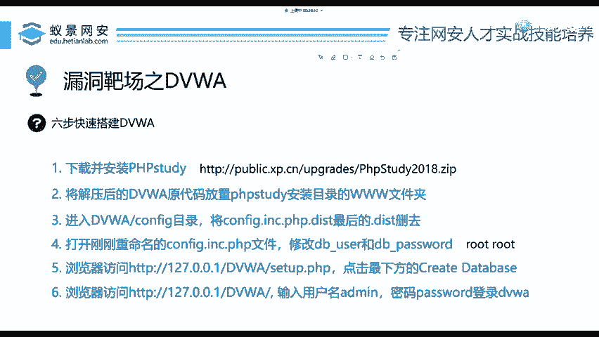

# 网络安全入门：P60：DVWA靶场搭建 🛡️

在本节课中，我们将学习如何搭建一个名为DVWA的漏洞靶场。DVWA是一个基于PHP的、包含多种常见Web漏洞的练习平台，非常适合网络安全初学者进行安全攻防技术的学习和实验。

## 概述

我们将分步完成DVWA靶场的本地环境搭建。整个过程主要涉及两个核心组件的获取与配置：PHP集成环境（WIMP）和DVWA源代码。

---

## 环境准备：WIMP与DVWA

首先，我们需要准备运行DVWA所需的环境。对于一个新手，只需要下载并配置以下两个部分：

1.  **PHP集成环境（WIMP）**：这是一个集成了Windows操作系统、Apache服务器、MySQL数据库和PHP解析器的软件包，为运行PHP网站提供一站式环境。
2.  **DVWA源代码**：这是DVWA靶场的程序文件，我们无需自己编写代码，直接下载使用即可。

以下是具体的操作步骤。

### 第一步：下载并安装PHP集成环境

我们选择使用“PHPStudy”这款软件来快速搭建WIMP环境。它简化了环境配置过程，非常适合初学者。





**操作步骤如下：**







1.  打开浏览器，访问百度搜索引擎。
2.  搜索关键词“**PHPStudy**”。
3.  进入官网，下载适用于Windows系统的客户端。
4.  在下载页面，建议选择“**PHPStudy 2018**”版本进行下载，该版本界面相对传统，对新手更友好。
5.  下载完成后，你会得到一个压缩包文件。
6.  解压该压缩包，然后双击其中的安装程序。
7.  在安装向导中，选择你希望安装到的磁盘目录（例如 `D:\phpstudy`），然后按照提示完成安装。此过程与安装普通软件无异。

### 第二步：下载并部署DVWA源代码

接下来，我们需要获取DVWA的程序文件并将其放置到正确的位置。

**操作步骤如下：**

1.  通过百度搜索“**DVWA**”或访问教程提供的链接，下载DVWA的源代码压缩包。
2.  找到PHPStudy的安装目录（例如 `D:\phpstudy`）。
3.  进入该目录，找到名为“**www**”的文件夹。这是网站文件的默认根目录。
4.  将下载的DVWA压缩包直接拖入“www”文件夹内。
5.  在“www”文件夹内，将DVWA压缩包**解压到当前文件夹**。
6.  解压后，你会看到一个名为“DVWA-master”的文件夹。为了方便访问，可以将其重命名为简单的“**DVWA**”。

---

## 配置DVWA连接数据库

部署好文件后，我们需要配置DVWA，使其能够连接MySQL数据库。

上一节我们完成了文件的部署，本节中我们来看看如何进行关键配置。



**操作步骤如下：**



1.  进入“www”文件夹下的“**DVWA**”目录（即你重命名后的文件夹）。
2.  再进入其中的“**config**”目录。
3.  你会看到一个名为 `config.inc.php.dist` 的文件。我们需要将其重命名，去掉最后的 `.dist` 后缀。重命名后的文件应为 `config.inc.php`。
4.  使用文本编辑器（如系统自带的“记事本”）打开 `config.inc.php` 文件。
5.  在文件中找到关于数据库配置的两行代码：
    ```php
    $_DVWA[ 'db_user' ] = 'root';
    $_DVWA[ 'db_password' ] = 'p@ssw0rd';
    ```
6.  将这两行的值修改为PHPStudy中MySQL数据库的默认账号和密码（通常都是 `root`）：
    ```php
    $_DVWA[ 'db_user' ] = 'root';
    $_DVWA[ 'db_password' ] = 'root';
    ```
7.  保存并关闭文件。

---

## 启动服务并初始化靶场

所有配置完成后，即可启动服务并完成DVWA的最终设置。

**操作步骤如下：**

1.  在桌面上找到并双击运行“**PHPStudy**”软件。
2.  在软件界面中，点击“**启动**”按钮，运行Apache和MySQL服务。
3.  打开任意浏览器，在地址栏输入本地回环地址：`http://127.0.0.1`。如果页面显示“Hello World”等信息，说明环境运行正常。
4.  在地址栏后追加你的DVWA目录名，例如：`http://127.0.0.1/DVWA/`。此时将打开DVWA的安装设置页面。
5.  滚动页面到底部，点击“**Create / Reset Database**”按钮。系统将自动创建所需的数据库和数据表。
6.  数据库创建成功后，页面会自动跳转到DVWA的登录界面。
7.  使用默认凭证登录：
    *   **用户名**：`admin`
    *   **密码**：`password`
8.  登录成功后，即可进入DVWA主界面，开始你的安全学习之旅。

---

## 总结



本节课中我们一起学习了DVWA漏洞靶场的完整搭建流程。我们首先理解了需要WIMP环境和DVWA源代码这两个核心部分，然后逐步完成了PHPStudy的安装、DVWA源代码的部署、数据库连接配置，以及最终的服务启动和数据库初始化。通过这个实践，你不仅成功搭建了一个安全的攻防练习环境，也掌握了在Windows系统下快速部署PHP网站的基本方法。请牢记，所有安全技术的学习和实验都应在像DVWA这样的授权靶场中进行，未经授权攻击真实系统是违法行为。