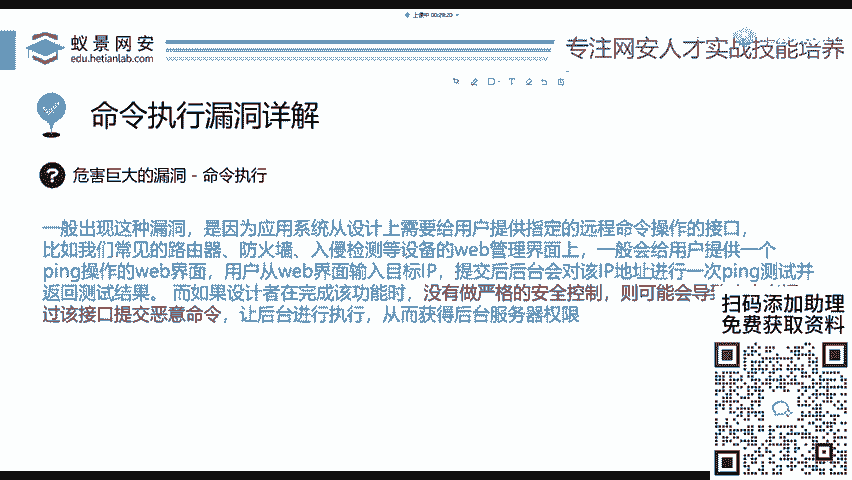
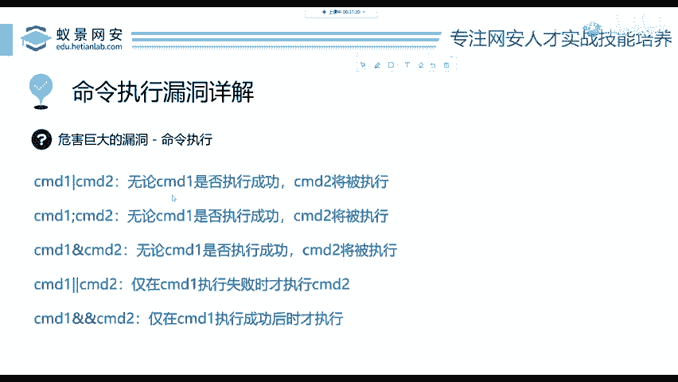
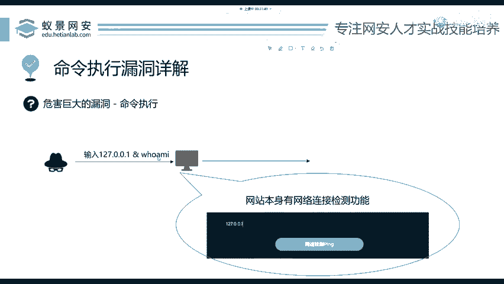
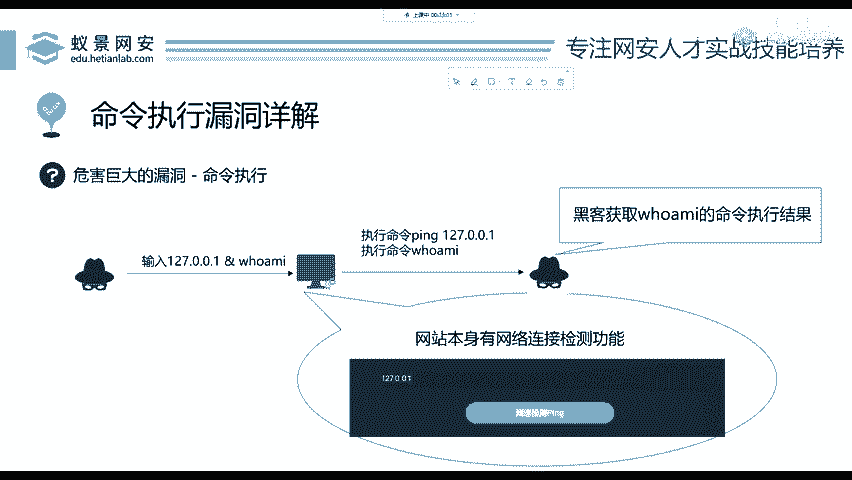

# 网络安全入门：P61：命令执行漏洞详解 🔓

在本节课中，我们将要学习命令执行漏洞。这是一种危害巨大的安全漏洞，攻击者可以利用它执行任意系统命令，从而删除文件、关闭服务器，甚至完全控制目标系统。我们将从漏洞成因、常见场景到攻击原理，一步步为你解析。

## 漏洞概述与成因

上一节我们介绍了实验环境的搭建，本节中我们来看看命令执行漏洞。命令执行漏洞的危害性极大。攻击者可以删除你的电脑文件，可以删除你的网站数据，也可以让你的电脑关机。

这个漏洞产生的原因是开发者没有实施严格的安全控制。攻击者通过输入精心构造的恶意数据，可以绕过正常逻辑，导致系统执行了非预期的命令。请记住第一点：任何漏洞的根源都在于安全控制的缺失。

如果一个网站没有任何交互功能，例如只是一个静态图片展示站，没有任何用户输入点，那么它基本上是安全的。因为攻击者需要一个可以“进入”的地方。

## 漏洞常见场景

我不给大家读抽象的概念，我们直接看一个典型例子。

许多网站具备类似“网络连接检测”的功能，这在家庭路由器（如华为、小米路由器）的管理界面中非常常见。请看PPT中的示意图。

该功能让用户输入一个IP地址或网址来检测网络连通性。那么，这个功能背后实际执行了什么呢？例如，用户输入 `127.0.0.1` 来检测本机连通性。

网站后端在收到这个输入后，会忠实地执行一条系统命令：`ping 127.0.0.1`。如果能`ping`通，就代表目标可达。有同学会问，为什么是执行`ping`命令？因为这是开发者在编写网站代码时实现的功能逻辑，他们预设了用`ping`命令来检测连通性。

## 攻击原理：命令连接符

在这种场景下，攻击者如何实施攻击呢？

要理解攻击方法，首先需要了解一个关键概念：**命令连接符**。它允许我们在同一行中连接多条命令。

以下是五个常用的命令连接符：
*   `|`：管道符，将前一个命令的输出作为后一个命令的输入。
*   `;`：分号，按顺序执行多条命令，无论前一条是否成功。
*   `&`：`Command1 & Command2`，无论`Command1`是否成功，都会执行`Command2`。
*   `||`：`Command1 || Command2`，仅当`Command1`执行失败时，才执行`Command2`。
*   `&&`：`Command1 && Command2`，仅当`Command1`执行成功时，才执行`Command2`。

它们的含义可以从PPT中初步了解。如果看不懂没关系，我们马上通过实例来理解。

## 漏洞利用演示

现在，我们来看攻击者是如何具体利用这个漏洞的。

假设攻击者灵机一动，他不只输入一个IP地址，而是输入：`127.0.0.1 & whoami`。

这里的 `&` 代表什么意思？我们回顾上一页PPT，`&` 表示：**无论前一条命令是否成功执行，都会执行 `&` 符号后面的命令**。这个逻辑非常简单明了。

那么，网站收到用户输入的 `127.0.0.1 & whoami` 后会发生什么？
1.  它会执行第一条指令：`ping 127.0.0.1`，这是它原本的功能。
2.  接着，它会执行 `&` 后面的第二条指令：`whoami`。这是一条用于查询当前系统用户名的命令。

于是，攻击者就能在返回结果中看到 `whoami` 命令的执行结果，从而获取系统信息。

试想，如果把 `whoami` 命令换成 `shutdown -s -t 0`（Windows立即关机命令），那么目标服务器就会立刻关机。`&` 符号在键盘上是 **Shift + 7**。

本节课中我们一起学习了命令执行漏洞。我们了解了该漏洞因缺乏输入过滤而产生，常见于具有命令交互功能（如网络检测）的场景。攻击者通过使用命令连接符（如 `&`），可以在执行正常功能命令的同时，注入并执行恶意系统命令，从而造成严重危害。理解这些基本原理是识别和防范此类漏洞的第一步。