# 网络安全入门：P62：DVWA之命令执行漏洞

在本节课中，我们将学习命令执行漏洞的原理、利用方法以及防御策略。我们将使用DVWA靶场作为实验环境，从最简单的攻击开始，逐步深入到漏洞的成因和高级防御机制，确保初学者也能完全理解。

## 概述

命令执行漏洞是一种高危安全漏洞，它允许攻击者在目标服务器上执行任意系统命令。本节课我们将通过DVWA靶场的“Command Injection”模块，亲手实践如何发现并利用此漏洞，同时理解开发人员应如何编写安全的代码来防御此类攻击。

---

## 常见的Windows指令

在利用命令执行漏洞前，需要了解一些基础的Windows命令。以下是几个最常用的命令：

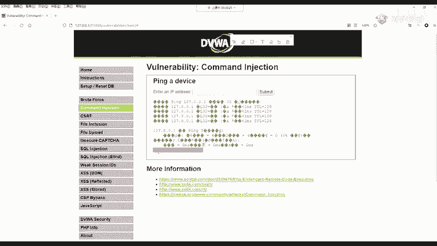

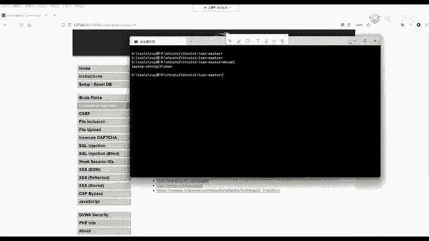

*   **`whoami`**：查看当前登录系统的用户名。
*   **`ipconfig`**：查看网络配置信息，包括IP地址、网关和子网掩码。
*   **`shutdown -s -t 0`**：立即关闭计算机。`-s`表示关机，`-t 0`表示等待0秒。
*   **`net user`**：用于管理用户账户。例如，`net user 张三 123456 /add` 可以创建一个用户名为“张三”、密码为“123456”的新用户。
*   **`type`**：用于显示文本文件的内容。例如，`type C:\Users\Desktop\notes.txt` 可以读取指定路径下的文件。

---

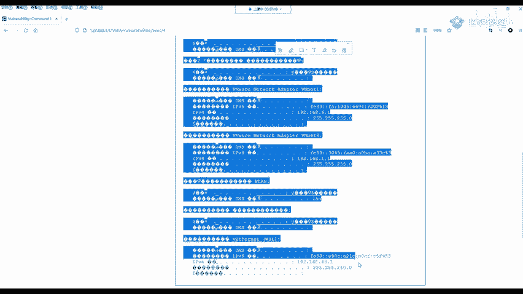

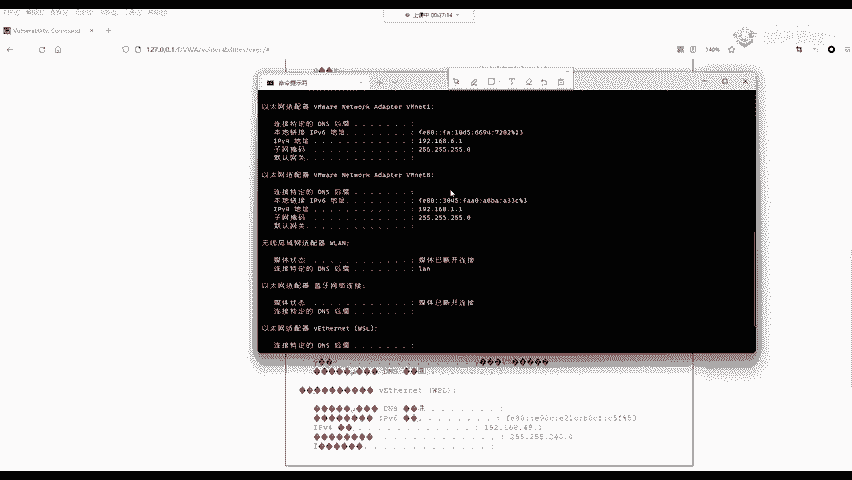

## 在DVWA中利用命令执行漏洞

上一节我们介绍了基础的Windows命令，本节中我们来看看如何在DVWA靶场中利用命令执行漏洞。

首先，需要将DVWA的安全级别设置为“Low”，以关闭所有防御机制，便于我们理解最基础的攻击方式。

1.  访问DVWA首页，点击左侧“DVWA Security”菜单。
2.  将安全级别调整为 **Low**，然后点击“Submit”提交。
3.  点击左侧“Command Injection”菜单，进入命令注入测试页面。

这个页面提供了一个输入框，要求我们输入一个IP地址进行Ping测试。我们首先输入一个正常的IP地址 `127.0.0.1` 并提交，可以看到Ping命令成功执行并返回了结果。

现在，尝试注入额外的命令。在输入框中输入：
```
127.0.0.1 && whoami
```
点击提交后，页面不仅显示了Ping的结果，还显示了 `whoami` 命令的执行结果，即当前服务器的用户名。这说明我们成功地在Ping命令后追加执行了另一个系统命令。

你可以将 `whoami` 替换为任何其他Windows命令，例如 `ipconfig` 来查看服务器网络信息，甚至尝试 `shutdown -s -t 0`（请勿在真实环境或重要服务器上尝试此命令）。

---

## 漏洞成因分析

上一节我们成功利用了漏洞，本节中我们来深入分析这个漏洞是如何产生的。理解漏洞成因是进行有效防御的前提。

在DVWA的“Command Injection”页面底部，点击“View Source”可以查看后端PHP源代码。核心漏洞代码如下：

```php
<?php
if( isset( $_POST[ 'Submit' ]  ) ) {
    $target = $_REQUEST[ 'ip' ]; // 获取用户输入的IP地址
    $cmd = shell_exec( 'ping  ' . $target ); // 拼接并执行系统命令
    echo "<pre>{$cmd}</pre>";
}
?>
```

代码逻辑非常简单：
1.  将用户输入（`$_REQUEST[ ‘ip’ ]`）直接赋值给变量 `$target`。
2.  使用 `shell_exec()` 函数执行系统命令，命令字符串由 `’ping ‘` 和 `$target` 直接拼接而成。
3.  将命令执行的结果输出到网页上。

**漏洞点**：代码没有对用户输入的 `$target` 进行任何过滤或检查。当用户输入 `127.0.0.1 && whoami` 时，最终执行的命令就变成了：
```bash
ping 127.0.0.1 && whoami
```
系统会先执行 `ping 127.0.0.1`，然后通过连接符 `&&` 继续执行 `whoami` 命令。

---

## 中级（Medium）安全级别的防御与绕过

了解了漏洞成因后，我们来看看开发人员如何进行初步防御。在DVWA中将安全级别调整为“Medium”，然后再次查看“Command Injection”页面的源代码。

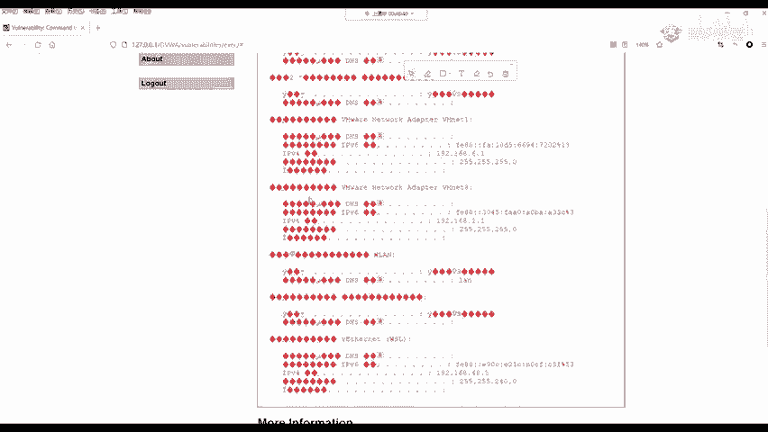

中级防御的核心代码如下：
```php
<?php
$substitutions = array(
    '&&' => '',
    ';'  => '',
);
$target = str_replace( array_keys( $substitutions ), $substitutions, $target );
?>
```

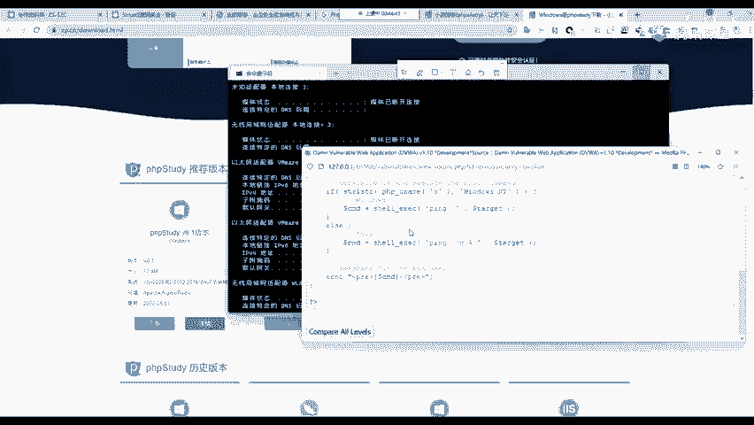

这段代码使用了 `str_replace` 函数，它的作用是字符串替换。以下是它的防御逻辑：

1.  定义了一个替换数组 `$substitutions`，指定要将 `&&` 和 `;` 这两个命令连接符替换为空字符串（即删除）。
2.  在拼接命令前，对用户输入的 `$target` 执行替换操作。

例如，如果用户输入 `127.0.0.1 && whoami`，经过替换后，`&&` 被删除，`$target` 变成了 `127.0.0.1  whoami`。最终执行的命令是 `ping 127.0.0.1  whoami`，这是一个无效的命令，因此 `whoami` 不会被执行。

**防御的缺陷与绕过**：中级防御只过滤了 `&&` 和 `;`，但命令连接符不止这两个。常见的还有 `&`、`|`、`||` 等。因此，攻击者可以轻松绕过。例如，输入 `127.0.0.1 & whoami`，其中的 `&` 并未被过滤，攻击依然可以成功。

在实际渗透测试中，这种通过尝试各种可能输入来探测防御规则的方法，被称为 **黑盒测试**。反之，如果能直接看到源代码（如本例），则称为 **白盒测试**。

---

## 高级（High）安全级别的防御与细微绕过

将DVWA安全级别调整为“High”，查看其源代码。高级别的防御试图过滤更多的危险字符：

```php
<?php
$substitutions = array(
    '&'  => '',
    ';'  => '',
    '| ' => '', // 注意这里：竖线后有一个空格
    '-'  => '',
    '$'  => '',
    '('  => '',
    ')'  => '',
    '`'  => '',
    '||' => '',
);
$target = str_replace( array_keys( $substitutions ), $substitutions, $target );
?>
```

可以看到，防御列表扩展了，包括了 `&`、`| `、`||` 等。粗看之下似乎无懈可击。但仔细观察，你会发现一个细微的差异：在过滤 `|`（管道符）时，代码中写的是 `’| ‘`（竖线加一个空格），而不是 `’|’`。

这意味着，它只会过滤“竖线后面紧跟一个空格”的情况。如果攻击者输入 `127.0.0.1|whoami`（竖线和命令之间没有空格），这个 `|` 就不会被过滤，攻击依然能够成功。这提醒我们，在编写安全代码时，必须非常严谨和细致。

---

## 不可能（Impossible）级别的典范防御

最后，我们将安全级别设置为“Impossible”。在这个级别下，无论我们尝试何种注入方式，攻击都会失败。查看其源代码，我们可以看到一种堪称典范的防御算法。

其核心思想是：**严格校验用户输入必须是一个合法的IP地址**。代码如下：

```php
<?php
// 将用户输入按“.”分割成4部分
$octet = explode( “.”, $target );
// 检查是否正好有4部分，且每一部分都是纯数字
if( ( is_numeric( $octet[0] ) ) && ( is_numeric( $octet[1] ) ) && ( is_numeric( $octet[2] ) ) && ( is_numeric( $octet[3] ) ) && ( sizeof( $octet ) == 4 ) ) {
    // 如果验证通过，再将这4部分用“.”重新拼接成IP地址
    $target = $octet[0] . ‘.’ . $octet[1] . ‘.’ . $octet[2] . ‘.’ . $octet[3];
    // 然后才执行Ping命令
    $cmd = shell_exec( ‘ping ‘ . $target );
}
?>
```

防御步骤如下：
1.  **分割**：使用 `explode(“.”, $target)` 将用户输入按点号分割成数组。例如，`“127.0.0.1”` 被分割成 `[“127”, “0”, “0”, “1”]`。
2.  **验证**：检查数组长度是否为4，并且数组中的每一个元素是否都是纯数字（`is_numeric`）。
3.  **重组**：只有全部验证通过，才将这四个数字用点号重新拼接成一个完整的字符串。
4.  **执行**：最后，将这个严格校验过的字符串用于命令拼接。

这种方法的精髓在于：它不再试图去“过滤”或“黑名单”各种攻击载荷，而是严格定义“什么是合法的输入”（即一个由4组数字构成的IP地址）。任何不符合此格式的输入（如包含 `&&`、`whoami` 等）都会在验证阶段被直接拒绝。从命令执行漏洞的角度看，这种防御是“不可能”被绕过的。

---

## 命令执行漏洞的巨大危害

通过前面的学习，我们看到了如何通过一个输入框执行简单的系统命令。但它的危害远不止于此。一个成熟的攻击者可以利用命令执行漏洞获得目标服务器的完整控制权。

例如，攻击者可以注入一个命令，让服务器主动连接攻击者控制的机器，从而建立一个“反向Shell”。一旦成功，攻击者就相当于在本地打开了一个连接到目标服务器的命令行窗口，可以执行任何操作：查看、复制、删除文件，安装软件，甚至以此服务器为跳板攻击内网其他机器。

**重要提示**：本节演示的反弹Shell涉及更高级的攻击技术，仅用于展示漏洞的潜在危害。在未经授权的系统上进行此类测试是非法行为。

---

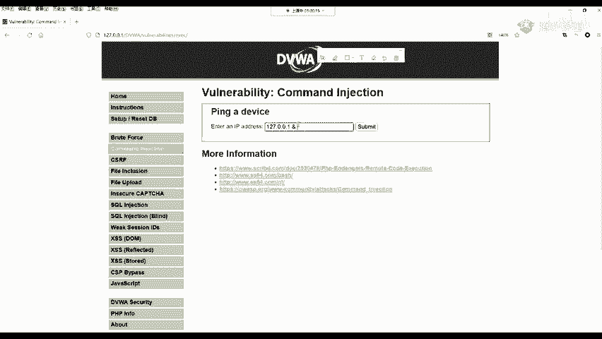

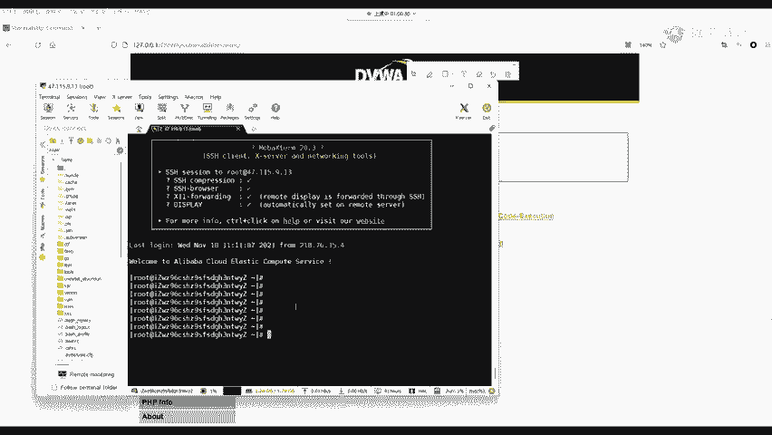

## 总结

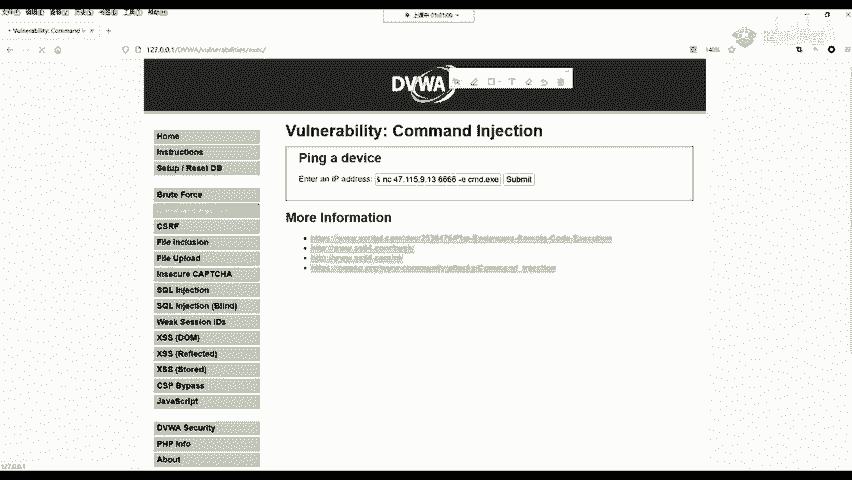

本节课中，我们一起学习了命令执行漏洞的完整知识链：

1.  **原理**：由于后端代码将用户输入未经处理地拼接到系统命令中执行，导致攻击者可以注入并执行任意命令。
2.  **利用**：我们使用DVWA靶场，从Low级别无防御的状态开始，利用 `&&`、`&`、`|` 等命令连接符成功执行了 `whoami`、`ipconfig` 等命令。
3.  **防御与绕过**：
    *   **中级防御**：通过黑名单过滤部分连接符（如`&&`, `;`），但可通过其他未过滤的连接符（如`&`）绕过。
    *   **高级防御**：扩大了黑名单，但因代码编写不严谨（如`| `后多空格）仍存在绕过可能。
    *   **典范防御**：采用白名单思想，严格验证用户输入必须为合法IP地址格式（4组数字），从根本上杜绝了命令注入的可能。

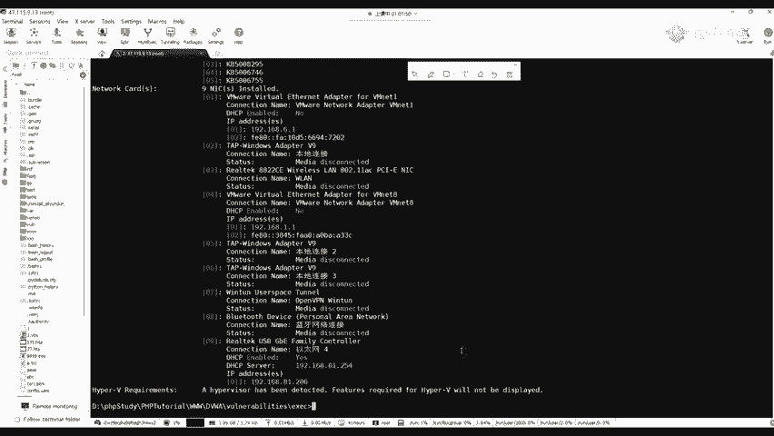

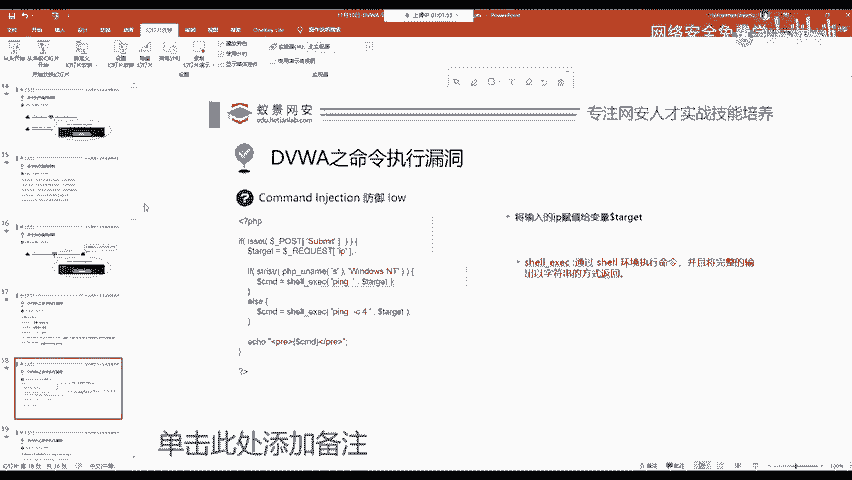

对于开发者而言，应学习“Impossible”级别的防御思路，采用白名单验证输入，而不是依赖不完善的黑名单过滤。对于安全爱好者，理解这些漏洞的利用与防御，能帮助我们更好地认识网络风险，提升安全意识。