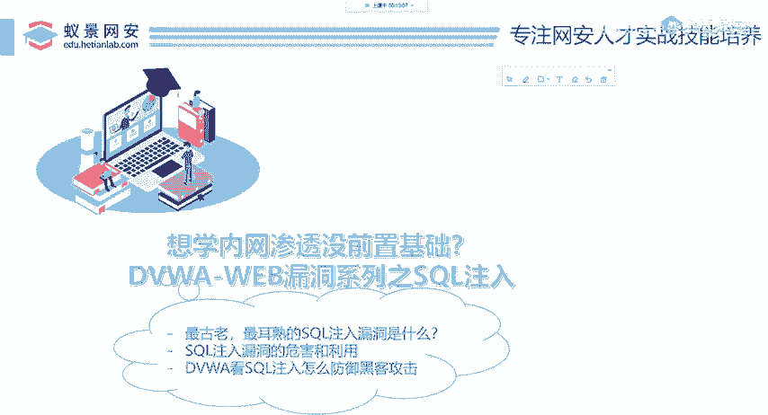
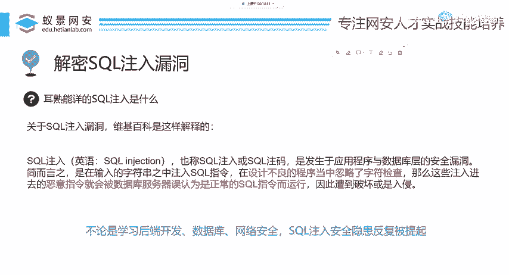
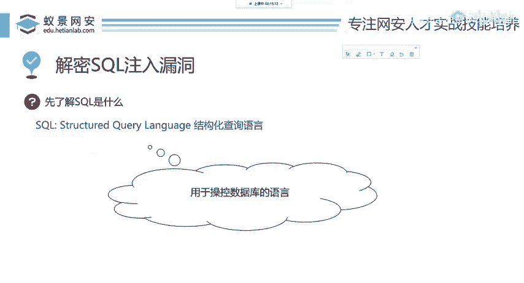

# 网络安全入门：P63：解密SQL注入漏洞 🔓

在本节课中，我们将要学习SQL注入漏洞的核心概念、攻击原理以及防御方法。无论你是否具备安全背景，通过本教程，你都能理解这一常见的网络安全威胁。

---

## 什么是SQL注入漏洞？

上一节我们介绍了课程目标，本节中我们来看看SQL注入到底是什么。

关于SQL注入漏洞，一个权威的解释是：SQL注入（英语：SQL injection）是指在开发者设计程序时，忽略了字符检查。黑客可以输入恶意指令，这些恶意指令会被数据库服务器误认为是正常的SQL指令而运行。于是，系统或网站就会遭遇破坏或入侵。

有同学可能不了解SQL到底是什么。下面做一个简单的介绍。

不论是在学习后端开发、数据库管理还是网络安全，SQL注入都是反复被提及的概念。SQL是一门语言，它的作用是用于操控数据库。就像人与人之间通过汉语或英语交流，开发人员编写网站需要使用后端脚本语言（如PHP、Java、Python）。如果开发者想操控SQL数据库，就需要使用SQL语言。SQL的全称是**结构化查询语言**（Structured Query Language）。很多数据库都使用这门语言进行操控。

我们今天并不讲解SQL数据库的具体用法，而是聚焦于如何攻击SQL注入漏洞。

---



## 如何攻击SQL注入漏洞？

了解了SQL注入的基本概念后，本节中我们来看看这个漏洞应该如何被利用，以及如何攻击并获取目标数据库。

以下是攻击SQL注入漏洞的一般步骤：

1.  **识别注入点**：寻找网站中可能与数据库交互的输入点，例如登录框、搜索框、URL参数等。
2.  **测试注入**：在输入点尝试提交特殊字符（如单引号 `‘`）或SQL代码片段，观察网站返回的错误信息或行为变化。
3.  **判断数据库类型**：根据错误信息或特定查询语句的成功/失败，推断后端数据库的类型（如MySQL、SQL Server、Oracle等）。
4.  **获取数据**：构造恶意的SQL查询语句，尝试绕过登录验证、查询数据库名、表名、列名，最终窃取敏感数据。
5.  **扩大战果**：在特定情况下，利用数据库功能执行系统命令或进行文件读写。

一个简单的攻击示例是绕过登录验证。假设登录验证的原始SQL语句是：
```sql
SELECT * FROM users WHERE username = ‘输入的用户名’ AND password = ‘输入的密码’
```
攻击者可以在用户名输入框中输入：`admin‘ --`。这会使SQL语句变为：
```sql
SELECT * FROM users WHERE username = ‘admin’ --’ AND password = ‘...’
```
其中 `--` 在SQL中是注释符，其后的语句会被忽略。这样，攻击者就能以管理员身份登录，而无需知道密码。

---

## 如何修复与避免SQL注入漏洞？

上一节我们介绍了攻击方法，本节中我们来讲解开发过程中如何修复这些漏洞，并避免其产生。



以下是防御SQL注入的核心方法：

1.  **使用参数化查询（预编译语句）**：这是最有效、最根本的防御手段。它将SQL代码与数据分离，确保用户输入永远被当作数据处理，而非代码执行。
    *   **示例（Python中使用sqlite3）**：
        ```python
        # 错误做法（存在注入风险）
        cursor.execute(“SELECT * FROM users WHERE username = ‘“ + user_input + “‘“)

        # 正确做法（使用参数化查询）
        cursor.execute(“SELECT * FROM users WHERE username = ?”, (user_input,))
        ```

2.  **对输入进行严格的验证与过滤**：对于已知的输入格式（如邮箱、电话号码），使用白名单机制进行严格校验。对于无法预知的输入，进行必要的转义处理。

3.  **使用安全的ORM框架**：对象关系映射（ORM）框架（如SQLAlchemy for Python, Hibernate for Java）通常内置了参数化查询机制，能有效防止SQL注入。

4.  **最小权限原则**：为数据库连接账户分配仅能满足应用需求的最小权限，避免使用具有高级权限（如`root`、`sa`）的账户连接数据库。

5.  **避免显示详细错误信息**：将生产环境的数据库错误信息进行通用化处理，防止攻击者通过错误信息获取数据库结构等敏感内容。



---

本节课中我们一起学习了SQL注入漏洞。我们首先了解了SQL注入的定义及其危害，然后探讨了攻击者如何利用此漏洞获取数据库信息，最后重点介绍了开发人员应如何通过参数化查询等最佳实践来修复和避免此类漏洞。理解并防范SQL注入是构建安全Web应用的基石。