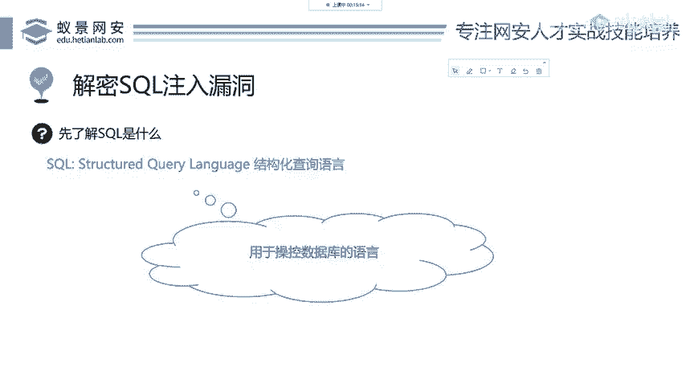
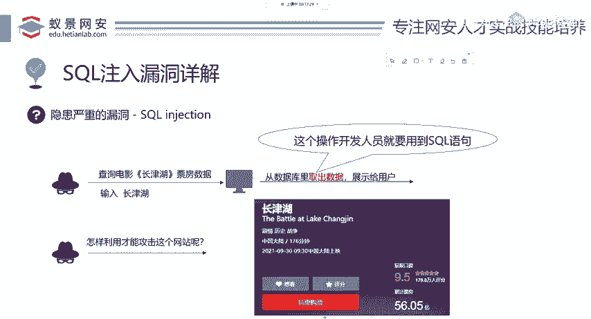
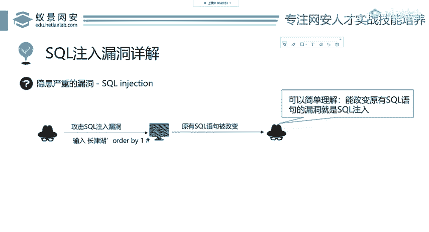

# 网络安全入门：P64：SQL注入漏洞详解

在本节课中，我们将要学习SQL注入漏洞的基本原理。我们将从一个简单的电影查询例子开始，逐步理解为什么会产生这种漏洞，以及攻击者是如何利用它的。课程内容将尽可能简单直白，确保初学者能够看懂。



## 正常操作流程

上一节我们介绍了命令执行漏洞，本节中我们来看看另一种常见的Web安全漏洞——SQL注入。首先，我们来看一个正常的网站操作流程。

假设有一个热门电影《长津湖》，用户可以通过网站（如美团电影、猫眼电影）查询它的实时票房数据。这些数据存储在网站后台的数据库中。

当用户在网页搜索框中输入“长津湖”并点击查询时，网站服务器会接收这个请求，然后从数据库中取出对应的票房数据并展示给用户。这个“从数据库取数据”的操作，是由网站开发人员编写的程序代码完成的，其中会使用到SQL语句。

## SQL查询语句基础

为了理解漏洞，我们需要先简单了解后台的SQL查询语句是如何工作的。如果你没有SQL基础，完全没关系，我们可以把它看作简单的英语。

以下是开发人员可能编写的查询语句：
```sql
SELECT ticket_number FROM movie_data WHERE movie_name = ‘长津湖’
```
我们来分解一下这个语句：
*   `SELECT ticket_number`：选择（查询）票房数据。
*   `FROM movie_data`：从“电影信息”数据库表中查询。
*   `WHERE movie_name = ‘长津湖’`：条件是电影名称等于“长津湖”。



所以，整句SQL的含义是：**从电影信息数据库中，查询电影名称为“长津湖”的票房数据**。这里的“长津湖”就是用户输入的数据。

## 攻击者的思路

作为一个渗透测试人员或安全研究者，思路与普通用户不同。我们不会“乖乖地”只输入电影名，而是会思考：**我能否输入一些特殊的内容，来改变后台原本要执行的SQL语句？**

这正是SQL注入攻击的核心。攻击者会尝试在输入中“注入”额外的SQL代码。

## SQL注入漏洞的产生

现在，我们来看攻击者是如何操作的。假设用户不再输入“长津湖”，而是输入了以下内容：
```
长津湖’ or 1=1 #
```
当网站后台程序将用户输入拼接到SQL语句中时，原本的语句就发生了变化：
```sql
-- 原语句
SELECT ticket_number FROM movie_data WHERE movie_name = ‘用户输入’

-- 注入后实际的语句
SELECT ticket_number FROM movie_data WHERE movie_name = ‘长津湖’ or 1=1 #’
```
我们来分析这个新语句：
1.  单引号 `‘`：用于闭合原SQL语句中电影名称前的引号。
2.  `or 1=1`：这是一个永远为真的条件。`WHERE` 子句变成了“电影名为‘长津湖’ **或者** 1等于1”。由于 `1=1` 恒成立，这个条件将匹配数据库中的**所有记录**。
3.  井号 `#`：在SQL中通常是注释符，它会让后面的所有内容（包括原语句末尾的引号）被忽略，从而保证语法正确。

于是，这条语句的执行结果不再是查询《长津湖》一部电影的票房，而是会返回`movie_data`表中**所有电影**的票房数据。攻击者通过注入`or 1=1`这段代码，成功地改变了原有SQL语句的逻辑。

## 漏洞定义与总结

本节课中我们一起学习了SQL注入漏洞的基础概念。

我们可以这样定义它：**SQL注入漏洞是指，攻击者通过将恶意的SQL代码插入到Web应用程序的输入参数中，从而欺骗后端数据库执行非预期查询的一种安全漏洞。**

其核心在于，**用户输入的数据被未经严格检查就直接拼接到SQL语句中执行**，导致攻击者可以“注入”并执行自定义的SQL命令，从而窃取、篡改或删除数据库中的数据。



简单理解：**能改变原有SQL语句执行逻辑的漏洞，就是SQL注入漏洞。** 在接下来的课程中，我们将学习如何发现和利用这类漏洞。