# 网络安全入门：P66：DVWA之SQL注入漏洞防御分析

在本节课中，我们将学习DVWA（Damn Vulnerable Web Application）中SQL注入漏洞的防御机制。我们将从低安全级别开始，逐步分析中级和高级别的防御手段，并最终探讨“不可能”级别如何通过多重验证和预处理技术来完全防御SQL注入攻击。课程内容将结合具体代码和原理，帮助初学者理解防御的核心思想。

---

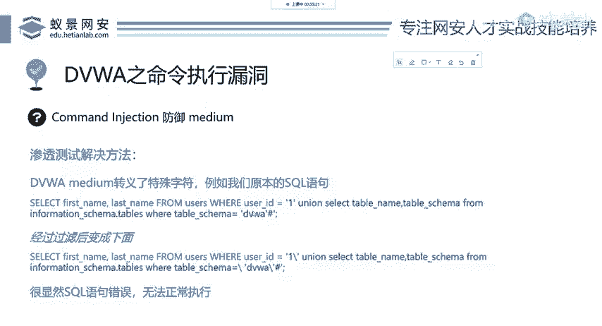

## 第一步：手工利用与初步分析

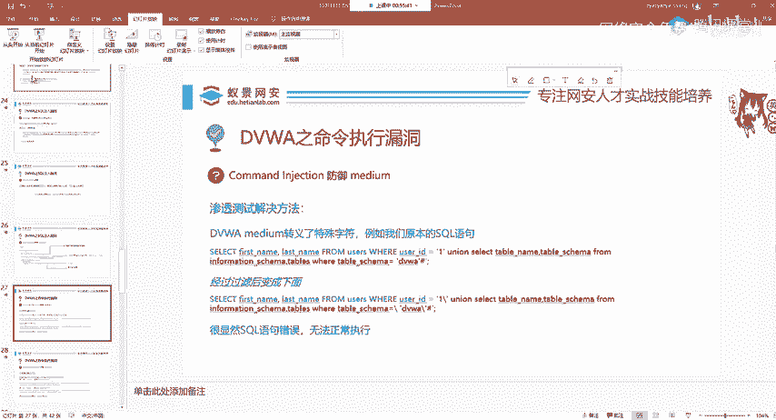

在手工利用SQL注入漏洞的第一步，我们输入了这样一条语句：
```sql
select first_name, last_name from users where user_id = ‘输入点’
```
然后通过联合查询来获取DVWA数据库中的表信息。

这个操作的作用是查询DVWA数据库的表结构。


## 第二步：中级防御机制分析

在上一节我们介绍了基本的注入语句，本节中我们来看看DVWA中级（Medium）安全级别是如何尝试防御的。

通过`addslashes()`函数的过滤之后，我们输入的SQL语句发生了变化。该函数会在每个单引号前添加一个反斜杠（\）。


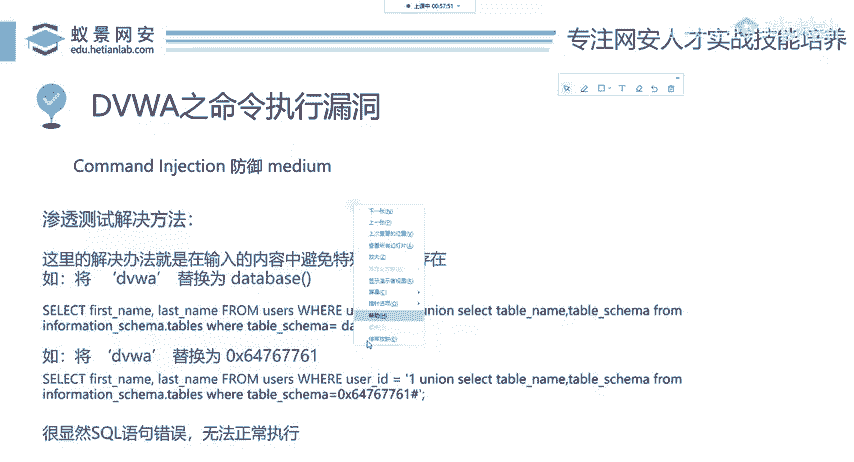


经过过滤后的语句如下，它还是一个有效的SQL语句吗？SQL语句中通常不包含这样的反斜杠，这意味着原语句的语法结构被破坏，因此无法成功查询到DVWA的表。这相当于一种对SQL注入漏洞的防御尝试。

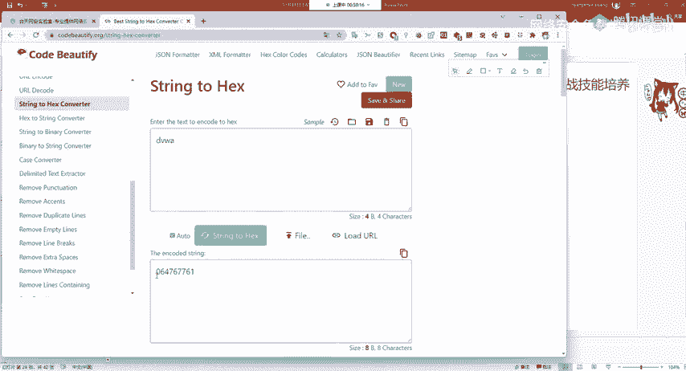

但它真的防住了吗？我们将其安全级别调至中级（Medium）进行测试，发现它并未完全防住。在渗透测试中，我们如何绕过这种防御呢？思路很简单：既然单引号被过滤了，我们可以尝试不输入单引号。

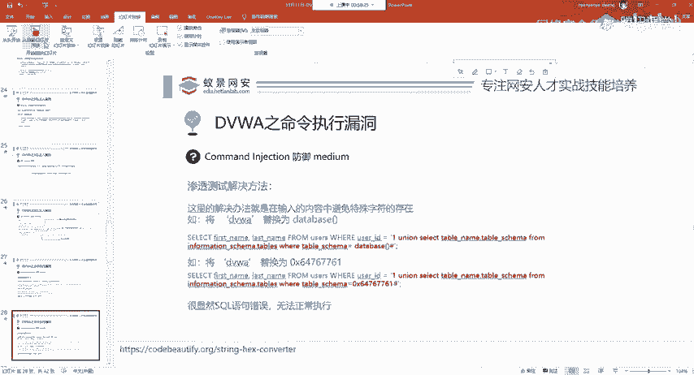

以下是两种绕过该防御的常用方法：

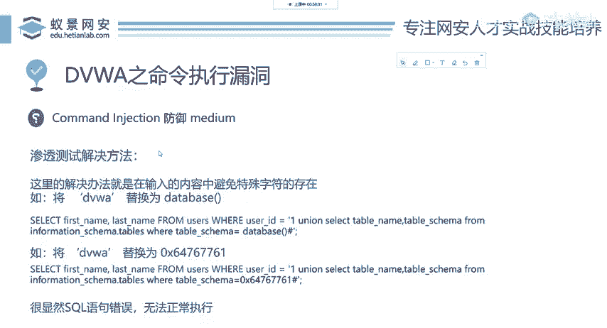

1.  **使用`database()`函数进行等价替换**：将原本由单引号包裹的数据库名‘DVWA’替换为返回数据库名的函数`database()`。
    ```sql
    select first_name, last_name from users where user_id = 1 union select 1, table_name from information_schema.tables where table_schema = database()
    ```

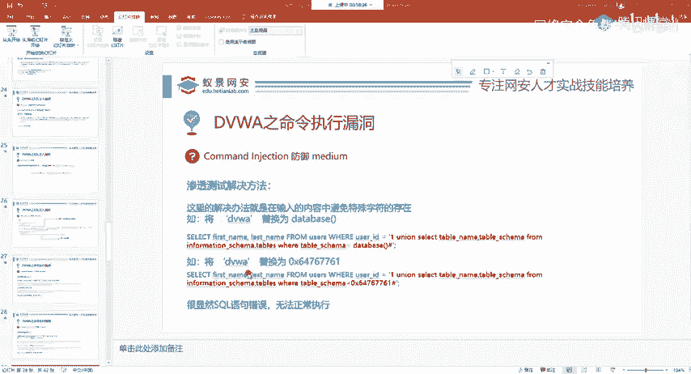

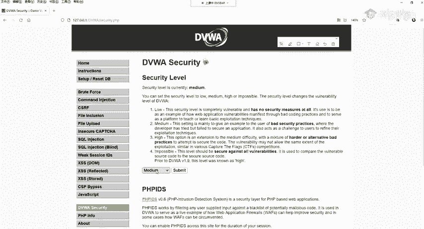

2.  **使用十六进制表示法**：在MySQL中，查询条件（如where子句的值）可以用十六进制表示。将字符串‘DVWA’转换为十六进制。
    *   转换方法：使用在线工具或函数，将“DVWA”转换为十六进制，得到`64767761`。
    *   在SQL语句中使用时，在前面加上`0x`前缀。
    ```sql
    select first_name, last_name from users where user_id = 1 union select 1, table_name from information_schema.tables where table_schema = 0x44565741
    ```
    这里的`0x44565741`就是‘DVWA’的十六进制形式，它与原字符串是等价的。


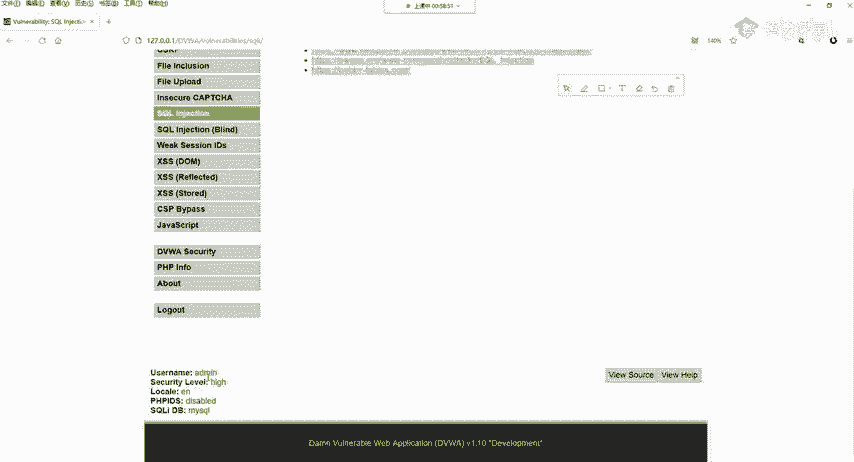


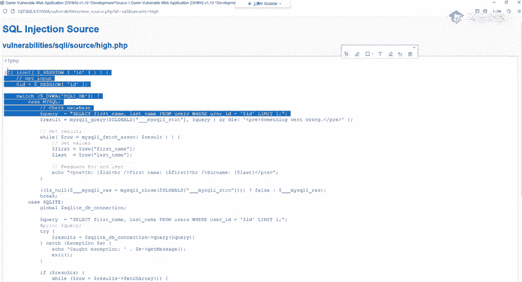

通过以上方法，我们成功绕过了中级（Medium）级别的防御。

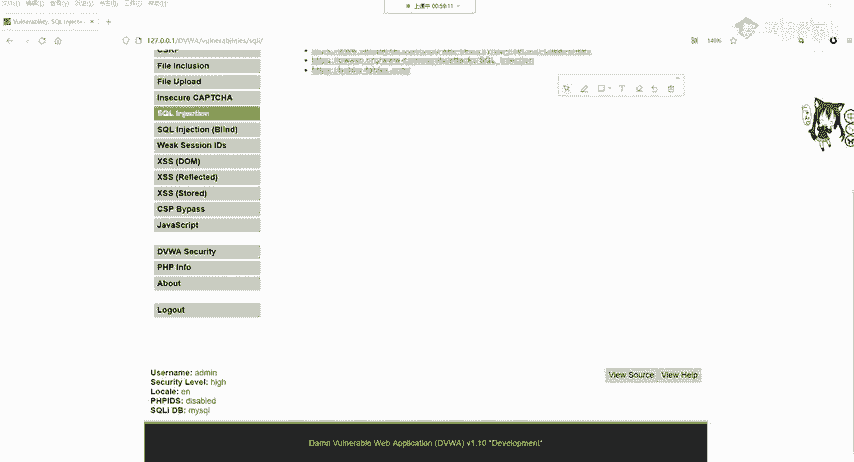

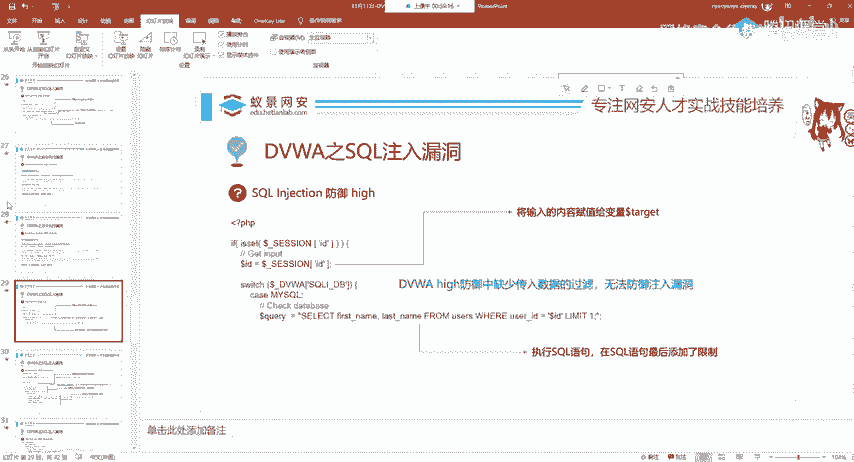

## 第三步：高级防御机制分析

解决了中级防御后，我们再来看看高级（High）级别是如何设置的。将DVWA的安全级别调至高级。


查看高级别的源代码，我们发现其防御思路有所不同。它没有对我们输入的内容（ID）进行过滤，而是修改了SQL语句本身，在查询语句的末尾添加了`LIMIT 1`。

在SQL中，`LIMIT 1`用于限制查询结果只返回一行。然而，这种防御方式存在缺陷。因为它缺少对传入数据的过滤，无法从根本上防御注入漏洞。使用SQL注入工具（如sqlmap）仍然可以正常进行探测和利用，只是利用的语法需要稍作调整。

这里需要强调的是，SQL注入的技巧非常丰富，本课程主要目标是厘清DVWA各等级的利用与防御逻辑，更深层次的学习需要大家自行探索。

## 第四步：“不可能”级别的终极防御

最后，我们来分析“不可能”（Impossible）级别，这可以被视为安全开发的典范。将DVWA安全级别调至Impossible。

其核心防御机制体现在源代码中，主要包含以下三层验证：

1.  **格式验证 (`is_numeric`)**: 使用`is_numeric()`函数判断输入内容是否为数字。如果输入包含`select`、`=`等非数字字符或字符串，则会被直接拒绝。
2.  **类型强制转换 (`intval`)**: 使用`intval()`函数将输入内容强制转换为整型。这再次确保了输入值是一个数字，并剥离了任何非数字部分。
3.  **PDO预处理**: 这是最关键的一步。使用PHP的PDO扩展进行数据库操作。
    *   **预处理 (`prepare`)**: 首先，SQL语句的模板被定义，参数使用占位符（如`:id`）表示，而不是直接拼接用户输入。
    *   **参数绑定 (`bindParam`)**: 然后，将用户输入的值（此处是经过`intval`转换后的整型）绑定到对应的占位符上。数据库引擎会严格区分代码和数据，确保输入的内容只会被当作参数值处理，而不会被解释为SQL代码的一部分。

以下是关键代码逻辑的概括：
```php
// 1. 检查是否为数字
if (!is_numeric($id)) { die(‘Invalid input’); }

// 2. 强制转换为整型
$id = intval($id);

// 3. PDO预处理与绑定
$stmt = $pdo->prepare(‘SELECT first_name, last_name FROM users WHERE user_id = :id‘);
$stmt->bindParam(‘:id‘, $id, PDO::PARAM_INT); // 绑定参数，并指定为整型
$stmt->execute();
```

通过“不可能”级别的这三重验证（特别是PDO预处理），可以说完全解决了SQL注入的隐患。其他后端语言（如Java的PreparedStatement，Python的sqlite3或MySQLdb的参数化查询）也都有类似的技术来实现SQL预处理和输入验证，原理都是相通的。


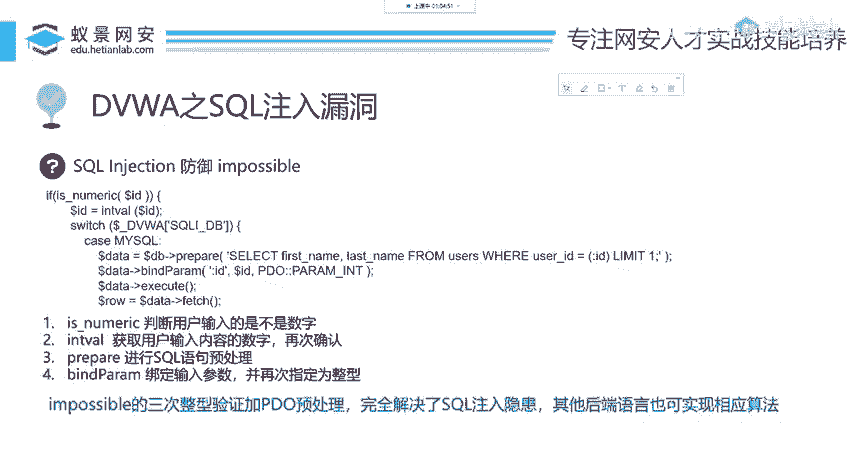

---

## 总结

本节课中，我们一起学习了DVWA中SQL注入漏洞的防御演进过程：
*   **中级防御**：通过转义单引号来破坏注入语句，但可通过等价替换（如使用函数、十六进制）绕过。
*   **高级防御**：通过修改SQL语句（如添加`LIMIT`）来限制输出，但缺乏输入过滤，防御不彻底。
*   **不可能级别防御**：采用了多重、深度的防御策略，包括**输入验证**（`is_numeric`）、**类型强制转换**（`intval`）以及最关键的**参数化查询/PDO预处理**。这三者结合，构成了目前防御SQL注入最有效、最根本的方法。


对于开发者而言，编写安全的SQL查询代码，应始终优先使用参数化查询（预处理语句），并对用户输入进行严格的类型和格式检查。