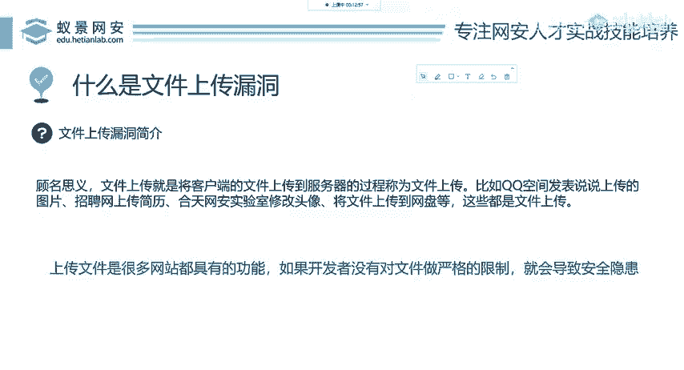

# 网络安全入门：P67：什么是文件上传漏洞 🔓

在本节课中，我们将要学习网络安全中一个常见且危险的漏洞——文件上传漏洞。我们将了解其基本概念、产生原因、利用方式以及可能造成的危害，并初步探讨如何防御此类漏洞。

---

## 什么是文件上传漏洞？

上一节我们介绍了课程概述，本节中我们来看看文件上传漏洞的具体定义。

文件上传与文件下载是相对的概念。下载是指从网站获取图片、音乐或视频等文件到本地磁盘。上传则相反，是指将本地磁盘上的内容传输到目标网站服务器。

因此，**文件上传**就是将我们本地的文件上传到服务器。例如：
*   QQ空间上传说说。
*   招聘网站上传个人简历。
*   各类网站或客户端修改、上传头像。
*   将文件上传到网盘。


在互联网中，许多网站都具备文件上传功能。如果网站开发者没有对用户上传的文件类型、内容等进行严格的验证和限制，就会导致**文件上传漏洞**，从而带来严重的安全隐患。

---

## 文件上传漏洞的危害

了解了基本概念后，我们来看看如果存在文件上传漏洞，攻击者可以做什么，会对网站产生什么样的危害。

攻击者可能利用此漏洞上传恶意文件。如果服务器没有正确处理这些文件，可能导致以下严重后果：

以下是攻击者可能实施的一些恶意操作：
1.  **上传WebShell**：攻击者上传一个特殊的脚本文件（如`.php`、`.jsp`文件），从而获得在服务器上执行命令的能力，完全控制网站服务器。
    *   **示例代码（PHP WebShell）**：
        ```php
        <?php system($_GET['cmd']); ?>
        ```
2.  **上传病毒或木马**：将恶意软件上传到服务器，进而感染访问网站的用户。
3.  **上传钓鱼页面**：在目标网站上伪造登录页面，窃取其他用户的账号密码。
4.  **消耗服务器资源**：上传超大文件或大量文件，导致服务器磁盘空间被占满，服务瘫痪。
5.  **作为攻击跳板**：将已控制的服务器作为发起进一步网络攻击的基地。

---

## 如何防御文件上传漏洞

我们已经看到了文件上传漏洞的巨大危害。那么，作为开发人员，应该如何防御呢？接下来，我们将参考OWASP（开放Web应用程序安全项目）提供的安全建议。

OWASP是一个致力于提高软件安全性的国际性非营利组织，它提供了许多安全解决方案。在DVWA（Damn Vulnerable Web Application）等靶场中，我们可以实践这些防御措施。



以下是针对文件上传漏洞的一些核心防御策略：
*   **文件类型白名单验证**：只允许上传明确安全的文件扩展名（如`.jpg`, `.png`, `.pdf`），而不是简单地阻止已知的危险扩展名。
    *   **核心逻辑**：`if (fileExtension in [“jpg”, “png”, “pdf”]) { allow; } else { deny; }`
*   **文件内容检查**：检查文件的真实类型（如通过文件头`Magic Number`），而不仅仅依赖文件扩展名，因为扩展名可以被轻易伪造。
*   **重命名上传文件**：为上传的文件生成一个随机的、无法预测的新文件名（如UUID），避免攻击者直接访问已上传的恶意文件。
*   **设置文件目录权限**：将上传目录设置为不可执行脚本，确保即使恶意文件被上传，也无法被服务器解析执行。
*   **使用安全组件/库**：采用经过安全审计的第三方文件上传处理库，避免自己编写存在缺陷的代码。


---

本节课中，我们一起学习了文件上传漏洞。我们明确了其定义：由于开发者对用户上传文件缺乏严格限制而导致的安全缺陷。我们探讨了攻击者如何利用该漏洞上传WebShell等恶意文件，从而控制服务器、传播恶意软件或发动进一步攻击。最后，我们介绍了OWASP推荐的一些关键防御措施，包括白名单验证、内容检查、文件重命名和权限控制等。理解这些原理是进行渗透测试和构建安全Web应用的基础。