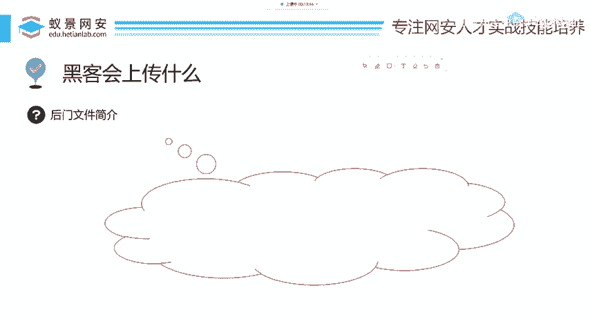
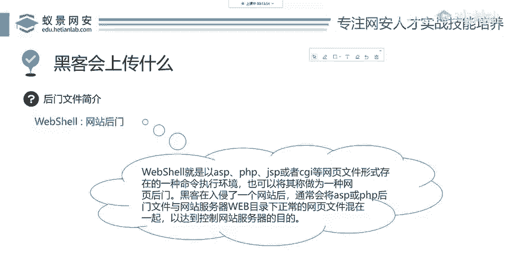
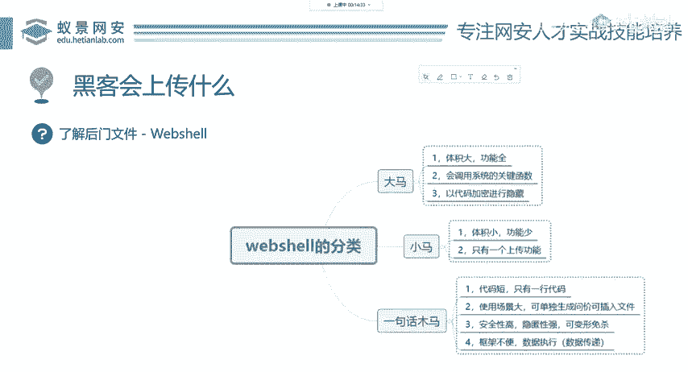
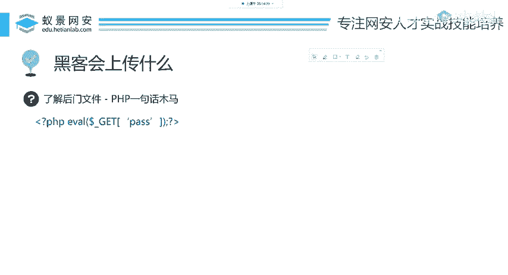
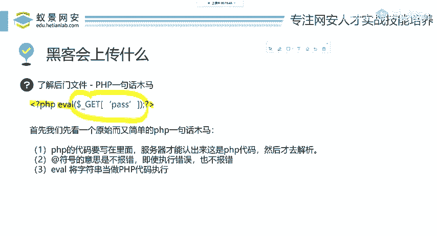

**网络安全入门：P68：黑客会上传什么**

在本节课中，我们将探讨黑客在利用文件上传漏洞时，通常会向目标服务器上传什么类型的文件。我们将学习一个核心概念——WebShell，并了解其不同类型和基本原理。

---

上一节我们介绍了文件上传漏洞的基本概念，本节中我们来看看黑客利用此漏洞时会采取的具体行动。首先，我们需要了解一个在渗透测试中至关重要的工具：WebShell。

**WebShell** 是黑客在成功渗透网站后，上传到服务器上的一个脚本文件。它本质上是一个用服务器端脚本语言（如PHP、JSP、ASP.NET等）编写的后门程序，为攻击者提供了一个远程命令执行环境，从而能够控制网站服务器。





下面，我们来了解WebShell的常见分类。

以下是WebShell的三种主要类型，通常根据其代码复杂度和功能进行划分：

1.  **一句话木马**：顾名思义，其核心代码通常只有一行。它体积小，隐蔽性强，依赖客户端（攻击者）提供的代码来执行具体功能。
2.  **小马**：代码量和功能比一句话木马更丰富，通常集成了文件管理、命令执行等基本功能，但体积仍然相对较小。
3.  **大马**：功能齐全的WebShell管理工具。代码行数多，体积大，通常拥有图形化界面，集成了文件管理、数据库操作、端口扫描、提权等大量渗透功能。



接下来，我们重点剖析最简单也最常用的一种——一句话木马。

一句话木马虽然代码极其简短，但威力巨大。我们以PHP语言为例进行说明。

一个典型的PHP一句话木马代码如下：
```php
<?php @eval($_GET[‘cmd’]); ?>
```
这段代码的含义如下：
*   `<?php ... ?>`：这是PHP语言的固定标记，表示其中的内容是PHP代码。
*   `eval()`：这是一个PHP函数，其作用是**将其括号内的字符串当作PHP代码来执行**。
*   `$_GET[‘cmd’]`：用于接收通过URL参数传递过来的值。例如，当访问 `http://target.com/shell.php?cmd=phpinfo();` 时，`$_GET[‘cmd’]` 的值就是 `phpinfo();`。
*   `@` 符号：用于抑制可能出现的错误提示，增加隐蔽性。



因此，整句话的意思是：**执行通过URL的 `cmd` 参数传递过来的任何PHP代码**。攻击者只需在客户端构造不同的代码字符串，通过这个后门发送给服务器，就能实现远程命令执行。

---



本节课中我们一起学习了黑客在文件上传漏洞中上传的核心工具——WebShell。我们了解了WebShell是网站的后门脚本，并将其分为一句话木马、小马和大马三类。最后，我们详细解析了PHP一句话木马 `<?php @eval($_GET[‘cmd’]); ?>` 的工作原理，理解了其通过 `eval()` 函数执行远程代码的机制。认识这些是理解后续攻防技术的基础。