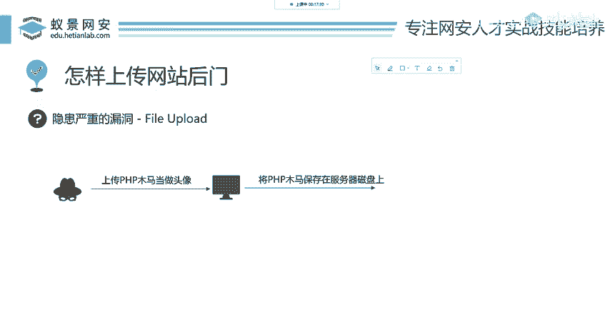
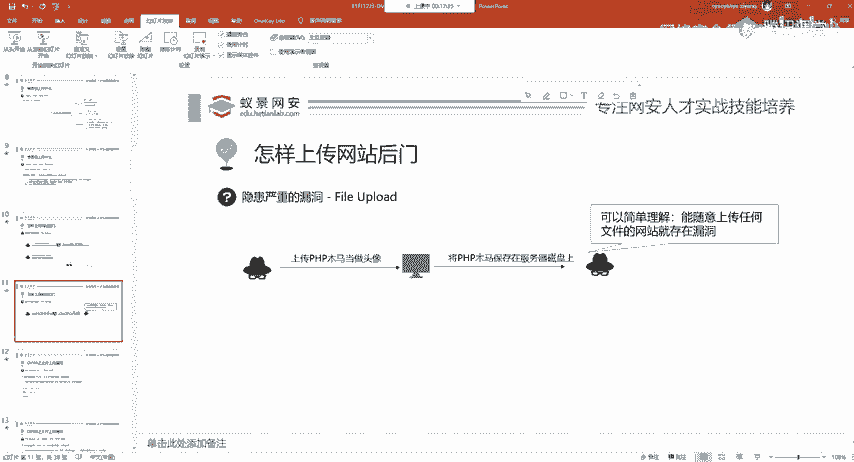
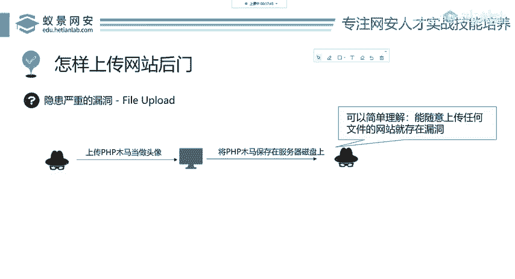
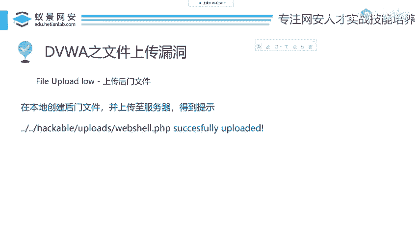
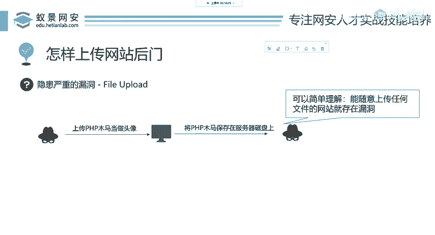

# 网络安全入门：P69：文件上传漏洞原理与利用

在本节课中，我们将要学习文件上传漏洞的基本原理。这是一种常见的Web安全漏洞，攻击者通过它可以将恶意文件（如网站后门）上传到目标服务器，从而获取控制权。我们将通过一个简单的例子来理解其核心概念，并介绍基本的攻击思路。

## 漏洞原理：正常流程与攻击思路

上一节我们介绍了网站后门的概念，本节中我们来看看攻击者如何将后门文件上传到目标网站。

我们来看一个正常的网站操作流程。以“合天网安实验室”的上传头像功能为例：

1.  用户从本地磁盘选择一张PNG格式的图片。
2.  用户将这张图片作为头像上传给网站服务器。
3.  网站服务器接收文件，并将其保存在自己的磁盘上。

这是一个在许多网站中都非常常见的功能。

那么，黑客会如何利用这个功能进行攻击呢？其攻击思路的核心是“反其道而行之”。回顾我们之前学过的命令执行漏洞，其本质是程序让你输入一个IP地址，你却输入了系统命令。文件上传漏洞也是类似的逻辑：网站功能让你上传图片，你就必须上传图片吗？

攻击者可以尝试上传其他类型的文件，例如我们上一节提到的PHP木马文件。如果网站的开发人员没有对上传的文件进行充分的验证（例如，只检查文件类型），那么服务器可能会将这个PHP木马文件像处理普通图片一样，保存到服务器的磁盘上。

此时，这个网站就被植入了后门木马。我们可以简单地总结为：**一个允许用户随意上传任意文件的网站，很可能存在文件上传漏洞。**

## 核心概念与公式

我们可以用以下方式概括文件上传漏洞的利用条件：

**存在漏洞的条件：**
`网站上传功能` + `缺乏有效过滤` = `文件上传漏洞`

**攻击成功的结果：**
`恶意文件被成功保存到服务器可访问路径` = `网站被植入后门`

## 后续步骤与总结

现在我们已经知道了攻击者要上传什么（木马文件），以及如何利用漏洞进行上传（绕过或利用薄弱的验证机制）。那么，文件成功上传之后，攻击者要做什么呢？这将是我们在后续课程中要探讨的内容，通常包括找到上传文件的访问路径，然后通过浏览器或工具去触发执行这个木马，最终获取服务器权限。

本节课中我们一起学习了文件上传漏洞的基本原理。我们了解到，当网站的文件上传功能缺乏对用户上传文件的严格验证时，攻击者就可以上传恶意脚本文件（如PHP木马），从而在服务器上植入后门。这是一种危害极大的漏洞，因为它可能直接导致服务器被完全控制。在接下来的实践中，我们将使用DVWA靶场来演示具体的攻击过程。