# 网络安全基础：P6：HTTP超文本传输协议—响应消息 📡

在本节课中，我们将要学习HTTP协议的另一半——响应消息。上一节我们介绍了客户端如何向服务器发送请求，本节中我们来看看服务器是如何回应客户端的。响应消息是服务器返回给客户端的数据，它包含了我们访问网站时看到的图片、文字、视频等内容。理解响应消息的结构和状态码，是分析网络通信和排查问题的基础。

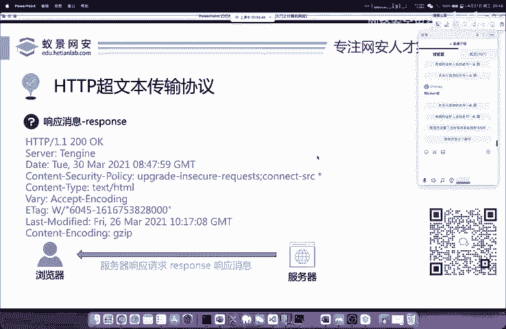

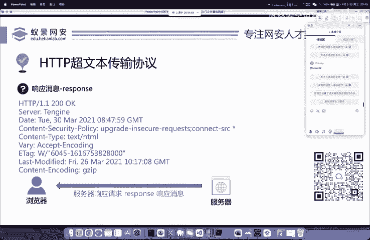

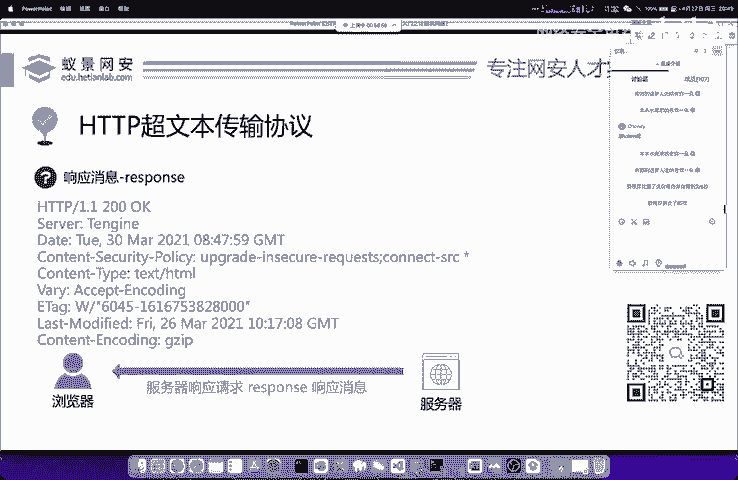

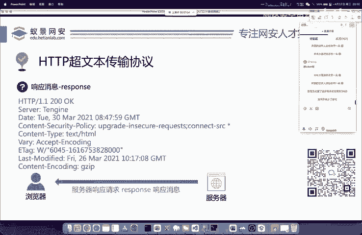

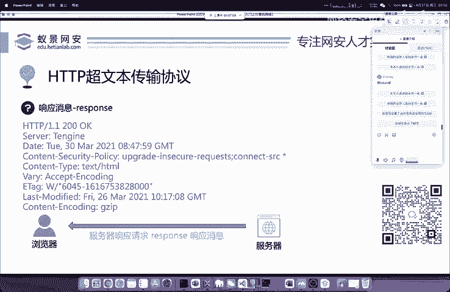

## 响应消息概述

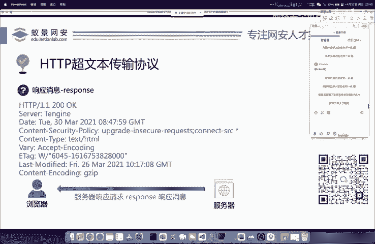

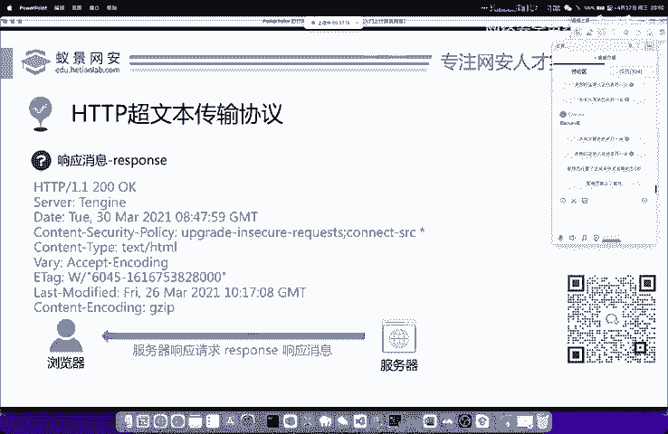

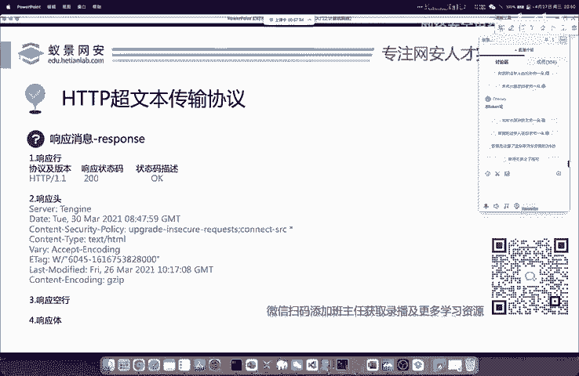


当我们向服务器（例如百度）发送请求后，服务器需要将网站内容返回给客户端。这个过程需要遵循一个规范的格式，这个格式被称为响应、响应消息或Response。响应消息的内容通常就是我们访问的网站内容，例如图片、视频流数据或新闻文本。

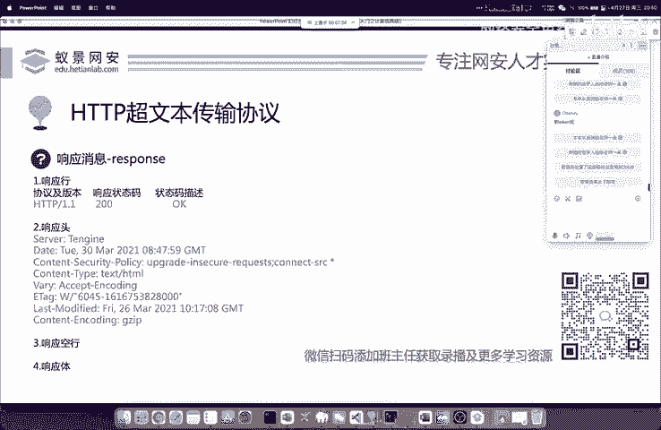

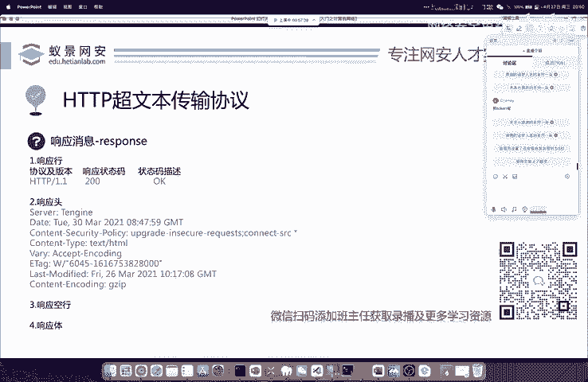

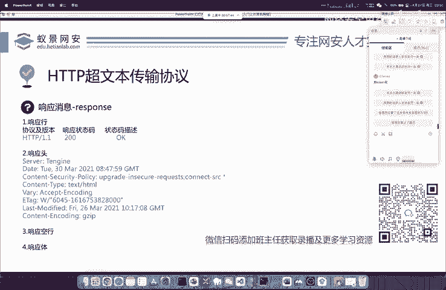

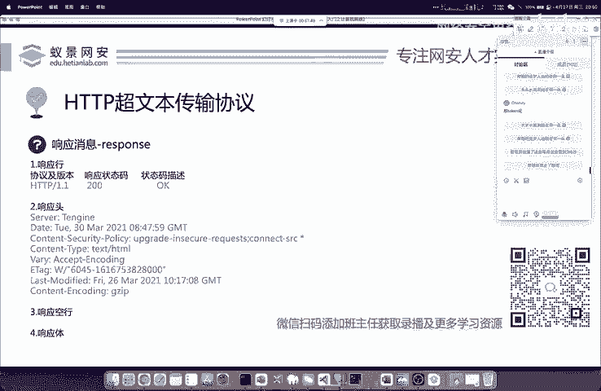

与请求消息相比，响应消息的结构更为简单。它主要分为几个部分：响应行、响应头、响应空行和响应体。

## 响应消息结构解析

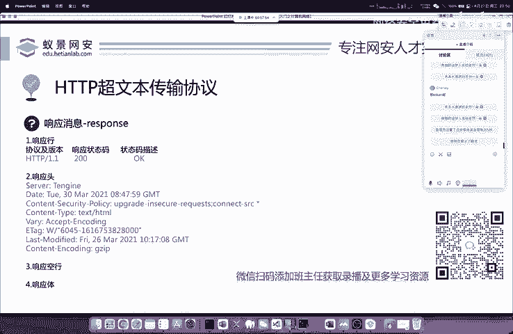


响应消息的结构清晰，每一部分都有其特定作用。以下是响应消息的主要组成部分：


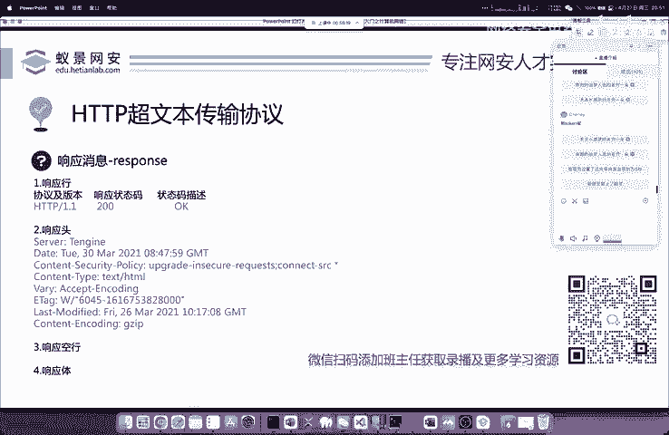

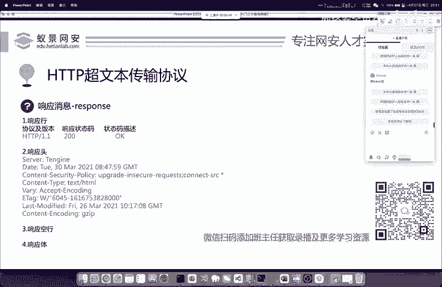

*   **响应行**：位于消息的第一行，包含协议版本和状态码。
*   **响应头**：包含一系列键值对，描述了服务器和响应体的元信息。
*   **响应空行**：用于分隔响应头和响应体。
*   **响应体**：服务器返回的实际数据内容，如HTML、图片等。

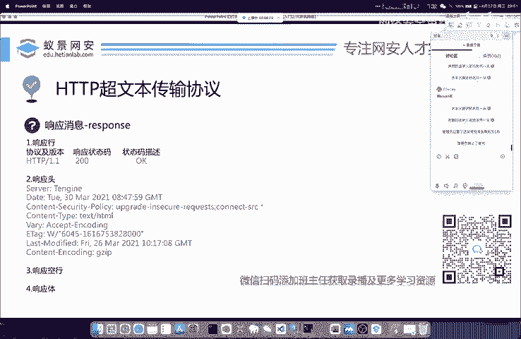


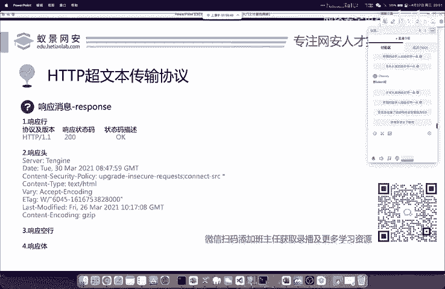

### 响应行详解

响应行是响应消息的开端，它提供了本次响应的核心状态信息。

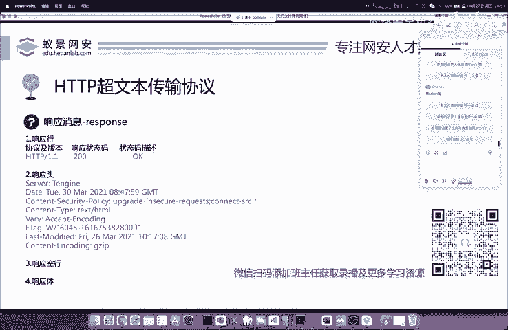

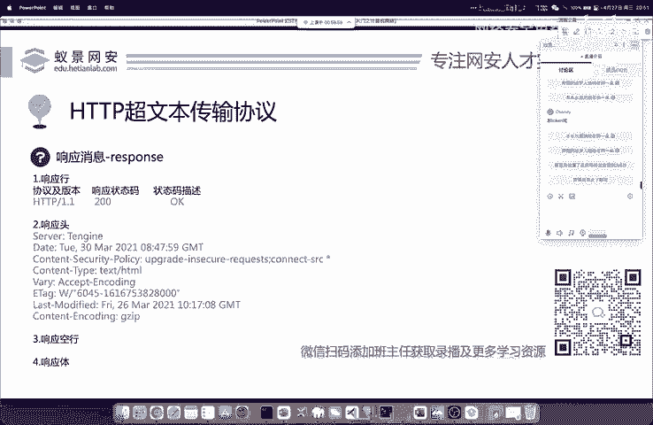

响应行的基本格式如下：
```
HTTP/1.1 200 OK
```
它包含三个部分：
1.  **协议及版本**：例如 `HTTP/1.1`，指明了使用的协议和其版本。
2.  **状态码**：例如 `200`，是一个三位数字代码，表示请求的处理结果。
3.  **状态描述**：例如 `OK`，是对状态码的简短文字说明。

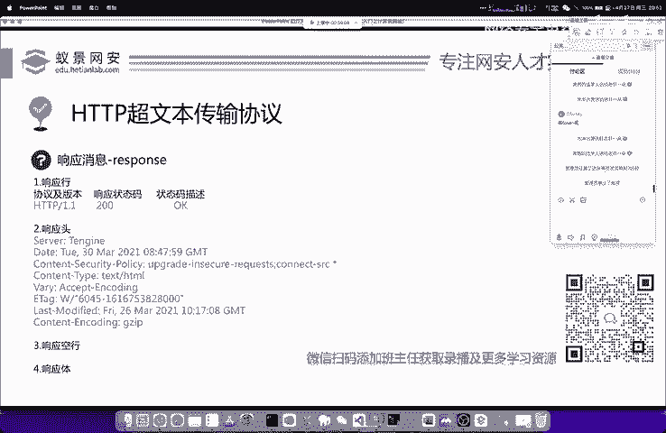

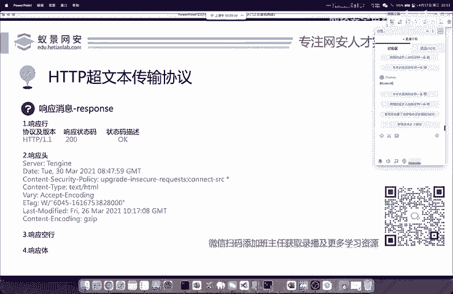

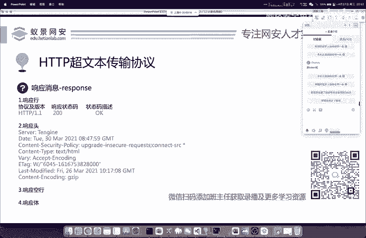

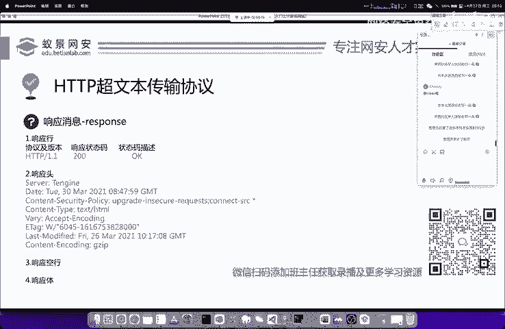

状态码 `200` 表示访问成功，这是最常见的正常状态码。


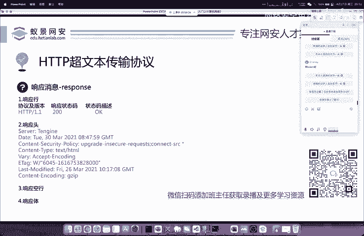

### 常见HTTP状态码解析

状态码是理解服务器响应的关键。它们被分为几个大类，每个大类以不同的数字开头。以下是初学者必须掌握的一些常见状态码：

*   **2xx - 成功**：表示请求已被服务器成功接收、理解并处理。
    *   **200 OK**：请求成功。这是最理想的状态。

*   **3xx - 重定向**：表示需要客户端采取进一步的操作才能完成请求。
    *   **302 Found**：临时重定向。例如，访问A网站，服务器告诉你去B网站获取资源。
    *   **304 Not Modified**：资源未修改。服务器告诉客户端，本地缓存的版本仍然有效，可以直接使用，无需重新下载。

*   **4xx - 客户端错误**：表示请求包含语法错误或无法被服务器理解。
    *   **404 Not Found**：服务器找不到请求的资源。通常是因为网址输入错误或链接已失效。
    *   **405 Method Not Allowed**：请求方法不被允许。服务器识别了请求，但禁止使用该方法（如用POST访问只允许GET的接口）。

*   **5xx - 服务器错误**：表示服务器在处理请求的过程中发生了错误。
    *   **500 Internal Server Error**：服务器内部错误，无法完成请求。通常是服务器端代码出现了bug。
    *   **502 Bad Gateway**：坏网关。作为网关或代理的服务器，从上游服务器收到了无效响应。
    *   **503 Service Unavailable**：服务不可用。服务器当前无法处理请求（由于超载或停机维护）。

**状态码应用举例**：
*   访问一个不存在的网页时，你会看到 **404** 错误。
*   在学校选课系统因访问人数过多而崩溃时，你可能会遇到 **503** 错误。
*   当你在APP中看到“已缓存”的广告时，背后可能是服务器返回了 **304** 状态码，告知客户端使用本地缓存。

## 响应头与响应体

响应头包含了关于响应的附加信息，例如服务器类型、内容类型、缓存策略等。响应体则是服务器返回的实际数据，例如网页的HTML代码、一张图片的二进制数据或一段JSON文本。

## 总结与学习建议

本节课中我们一起学习了HTTP响应消息的核心知识。我们了解了响应消息的基本结构，重点掌握了**响应行**和**HTTP状态码**的含义。记住 `200`（成功）、`404`（未找到）、`302/304`（重定向/缓存）和 `50x`（服务器错误）这几类常见状态码，对于日常上网、开发调试和网络安全学习都至关重要。

HTTP协议本身非常复杂和深入，但对于立志从事网络安全、渗透测试的初学者而言，掌握其基本的工作流程、请求与响应的结构以及关键状态码，已经足够为后续学习Web漏洞、流量分析等内容打下坚实的基础。未来若对协议底层有更深入的研究需求，可以再进行专项学习。