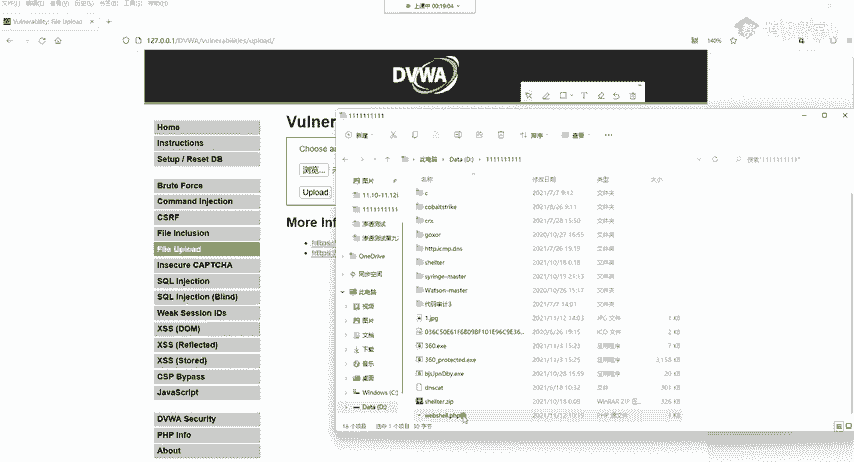
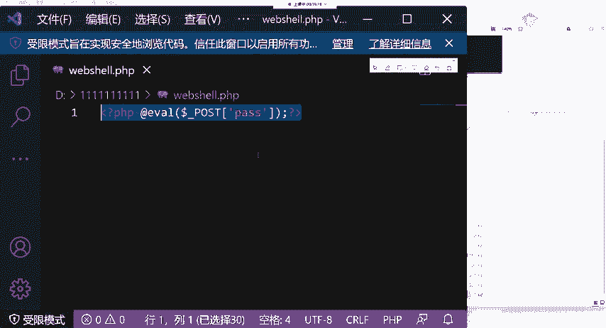
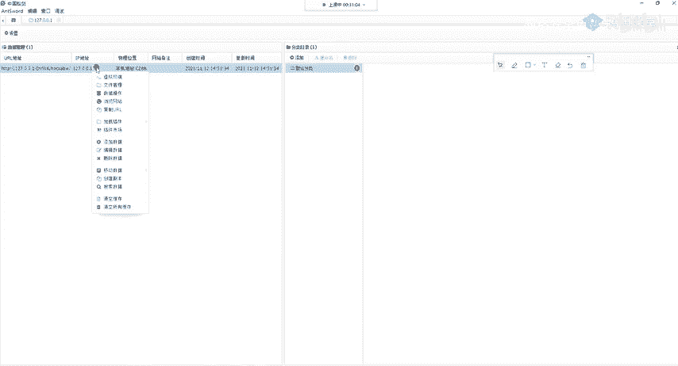
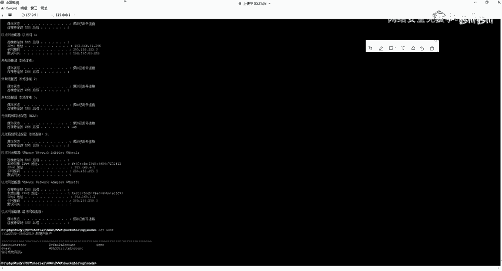
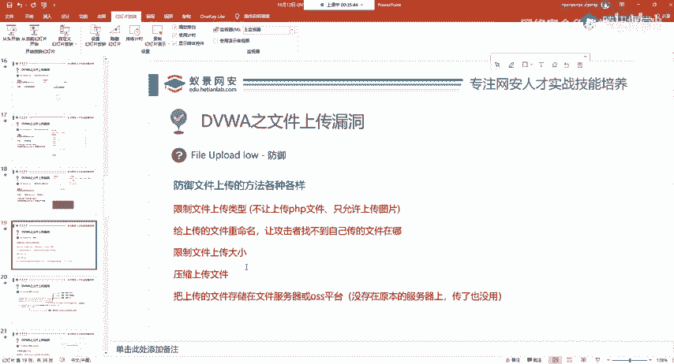
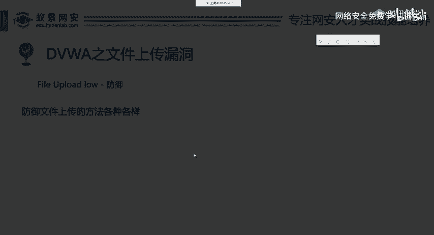
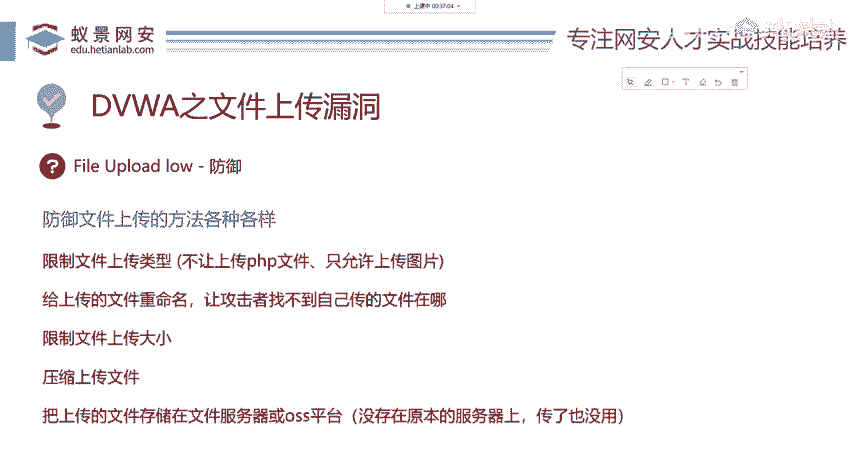

# 网络安全入门：P70：File Upload low

## 概述
在本节课中，我们将学习文件上传漏洞的基础知识。我们将从搭建环境开始，逐步演示如何创建一个简单的后门文件，将其上传到存在漏洞的网站，并利用两种不同的工具来获取对目标系统的控制权。最后，我们将探讨防御此类攻击的常见方法。

---



## 环境准备与漏洞访问



上一节我们概述了课程内容，本节中我们来看看如何访问存在漏洞的练习环境。

首先，打开DVWA（Damn Vulnerable Web Application）靶场。使用用户名 `admin` 和密码 `password` 登录。

登录成功后，在DVWA页面中找到“Security”选项，将安全级别设置为“Low”。

在安全级别设置为“Low”后，找到并点击“File Upload”模块，这就是我们今天要讲解的文件上传漏洞入口。

---

## 创建后门文件

了解了漏洞位置后，我们需要准备一个用于上传的后门文件。

在本地计算机上创建一个新的文本文件，并将其重命名为 `webshell.php`。文件名必须以 `.php` 结尾。

接下来，在该PHP文件中写入一句话木马代码。代码如下：
```php
<?php @eval($_POST['pass']); ?>
```
这段代码是后门核心，它允许我们通过POST请求传递命令并执行。

创建完成后，文件内容应如图所示：


---

## 上传后门文件

文件创建好后，下一步就是将其上传到目标网站。

在DVWA的“File Upload”页面，点击“浏览”按钮，选择刚才创建的 `webshell.php` 文件，然后点击“Upload”按钮。

如果上传成功，页面会显示提示信息，告知文件已上传至 `../hackable/uploads/` 目录下。

上传成功提示如图所示：


---

## 定位后门文件

上传成功后，我们必须知道后门文件的具体访问地址才能利用它。

网站提示文件路径为 `../hackable/uploads/webshell.php`。`../` 表示上级目录。

将完整的URL路径（例如 `http://靶场地址/vulnerabilities/upload/../hackable/uploads/webshell.php`）复制到浏览器地址栏并访问。

如果浏览器页面变为空白，说明后门文件存在且可访问。如果显示“Not Found”等错误，则可能是路径错误或上传失败。

成功访问后，真实的木马地址通常类似 `DVWA地址/hackable/uploads/webshell.php`。

---

## 利用方法一：使用HackBar插件

找到后门地址后，我们来看看如何利用它。第一种方法是使用浏览器插件HackBar。



以下是安装与使用HackBar的步骤：
1.  在浏览器（以Firefox为例）的扩展商店中搜索“HackBar”。
2.  找到“HackBar V2”（永久免费版本）并安装。
3.  安装完成后，在访问后门文件的页面按 `F12` 打开开发者工具。
4.  在开发者工具面板中找到并点击“HackBar”选项卡。
5.  点击“Load URL”按钮加载当前页面地址。
6.  在“Post data”输入框中，输入 `pass=要执行的PHP代码`。
    *   例如，输入 `pass=phpinfo();` 并点击“Execute”可以查看PHP配置信息。
    *   输入 `pass=system("whoami");` 并点击“Execute”可以执行系统命令 `whoami`。

通过此方法，我们可以执行任意系统命令，从而控制目标服务器。



---

## 利用方法二：使用蚁剑（AntSword）管理工具

除了浏览器插件，渗透测试中更常用的是专业的Webshell管理工具，例如蚁剑（AntSword）。

蚁剑是一个图形化的网站管理工具，能更方便地操作后门。

以下是使用蚁剑连接后门的步骤：
1.  **下载蚁剑**：在GitHub或搜索引擎中搜索“AntSword”或“蚁剑”下载对应操作系统的版本。
2.  **打开蚁剑**：运行蚁剑客户端。
3.  **添加数据**：在蚁剑界面右键空白处，选择“添加数据”。
4.  **配置连接**：
    *   **URL地址**：填写后门文件的完整访问地址（如 `http://靶场地址/hackable/uploads/webshell.php`）。
    *   **连接密码**：填写一句话木马中`$_POST[‘ ‘]`括号内的字符串，本例中为 `pass`。
    *   点击“测试连接”，成功后可添加。
5.  **连接管理**：双击添加的条目，即可管理目标服务器的文件系统（如浏览、上传、下载文件）。
6.  **执行命令**：右键该条目，选择“虚拟终端”，即可打开一个类似命令行的界面执行系统命令。

蚁剑管理界面如图所示：


通过蚁剑，我们可以直观地控制目标服务器。

---

## 文件上传漏洞的防御



学习了攻击方法后，我们来看看如何防御文件上传漏洞。



以下是几种常见的防御策略：
*   **限制上传文件类型**：只允许上传安全的文件类型（如图片`.jpg, .png`），禁止上传可执行脚本（如`.php, .jsp`）。
*   **重命名上传文件**：对上传的文件进行随机重命名，使攻击者无法直接访问到上传的后门文件。
*   **限制上传文件大小**：虽然对一句话木马效果有限，但可以防止上传大马或大型恶意文件。
*   **对文件进行压缩或转码处理**：例如对图片进行二次压缩或裁剪，破坏其中可能隐藏的恶意代码。
*   **使用独立的文件服务器或对象存储**：将上传的文件存放在与Web应用分离的存储服务上，即使上传了恶意脚本也无法在Web服务器上执行。

防御措施示意图：


---


## 总结
本节课中，我们一起学习了文件上传漏洞（Low级别）的完整利用流程。我们从创建一句话木马开始，成功将其上传至靶场，并分别使用HackBar插件和蚁剑工具来利用该后门，最终获得了对目标系统的命令执行权限。同时，我们也了解了通过限制文件类型、重命名文件、使用独立存储等方法来有效防御此类漏洞。理解这些原理是迈向网络安全更深领域的重要一步。