# 网络安全入门：P71：File Upload 防御 medium

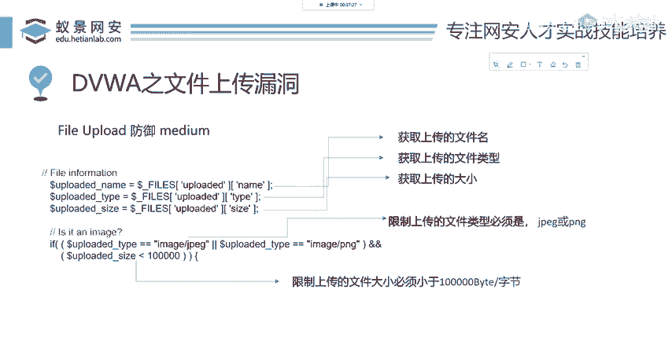

在本节课中，我们将学习如何分析并绕过DVWA（Damn Vulnerable Web Application）在中等（Medium）安全级别下对文件上传功能的防御机制。我们将通过解读服务器端代码逻辑，并利用抓包工具修改请求数据来实现绕过。

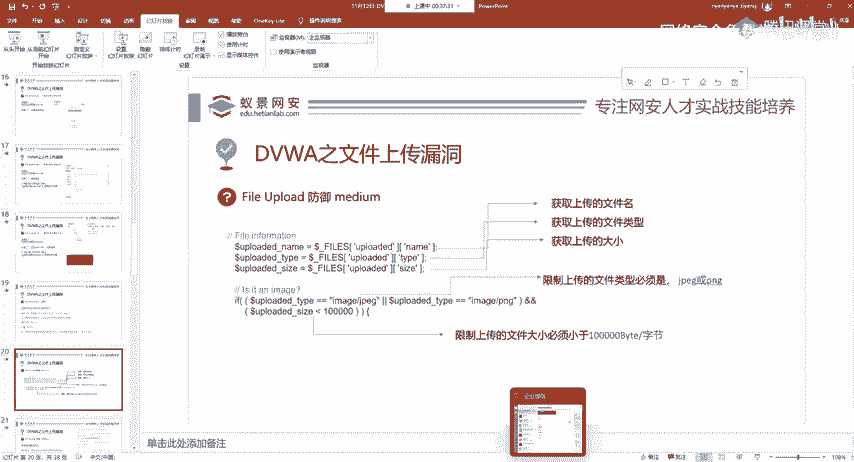

## 概述与目标设定

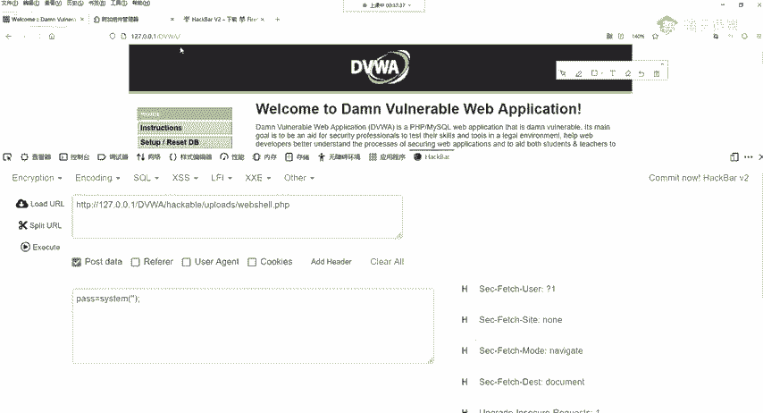

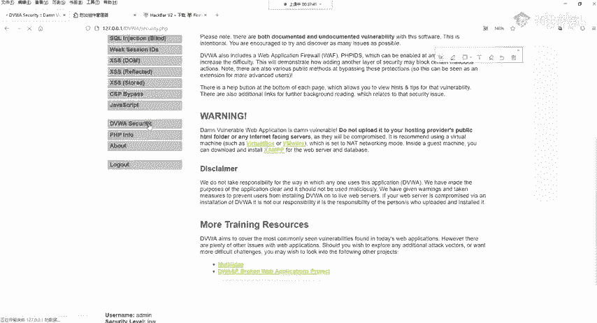

上一节我们介绍了文件上传漏洞的基础概念。本节中，我们来看看DVWA在中等安全级别下是如何尝试防御此类攻击的，并学习相应的绕过方法。

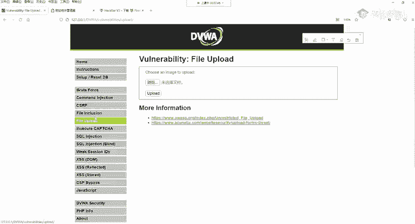

我们的目标是理解其防御原理，并成功上传一个Webshell（例如一个PHP文件）。

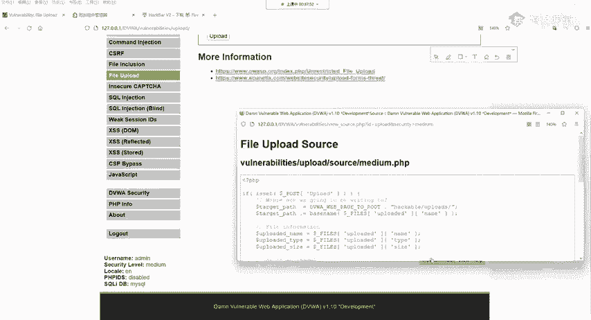

## 分析中等安全级别防御代码

首先，我们需要将DVWA的安全级别调整为“Medium”。

调整完成后，我们查看“File Upload”功能的源代码。防御的关键逻辑如下：

```php
$uploaded_name = $_FILES['uploaded']['name'];
$uploaded_type = $_FILES['uploaded']['type'];
$uploaded_size = $_FILES['uploaded']['size'];

if (($uploaded_type == "image/jpeg") || ($uploaded_type == "image/png")) {
    if ($uploaded_size < 100000) {
        // 文件类型和大小检查通过，执行上传
    }
}
```

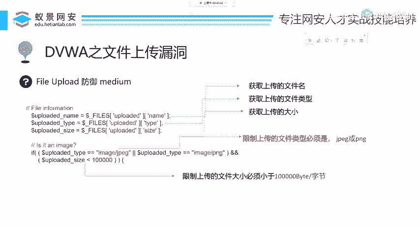

以下是这段代码执行的两个关键检查：

1.  **文件类型检查**：代码判断 `$uploaded_type` 变量的值是否为 `image/jpeg` 或 `image/png`。这限制了只能上传JPEG或PNG格式的图片文件。
2.  **文件大小检查**：代码判断 `$uploaded_size` 变量的值是否小于100000字节（约97.6KB）。这限制了上传文件的大小。

这种防御方式完全依赖于客户端或请求头中提交的数据，因此存在被绕过的可能。

## 使用抓包工具绕过防御

既然防御机制依赖于我们发送的请求数据，我们就可以在请求到达服务器之前拦截并修改它。以下是使用抓包工具Burp Suite进行绕过的步骤。

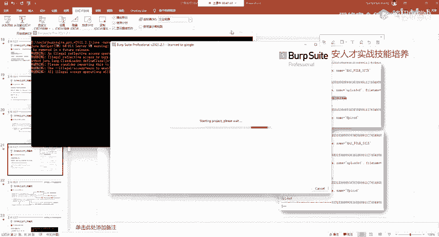

### 第一步：配置与拦截请求

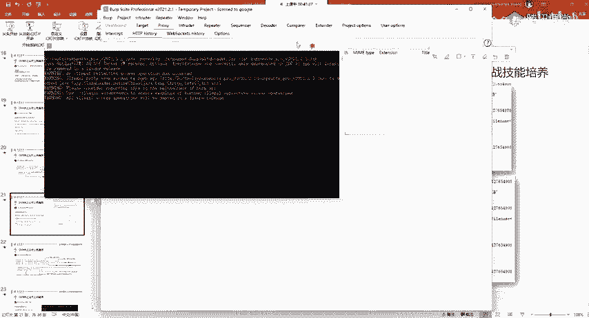

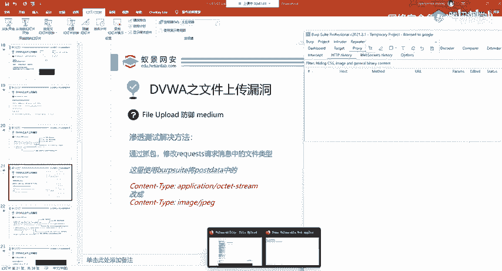

首先，确保Burp Suite已启动并正确配置了浏览器代理。然后，在DVWA的页面上尝试上传一个PHP文件（例如 `webshell.php`）。不出意外，上传会被拒绝。

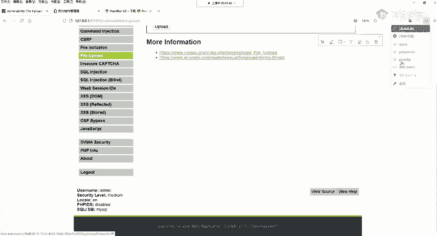

此时，这个被拒绝的HTTP请求已经被Burp Suite拦截下来。

### 第二步：修改拦截到的请求

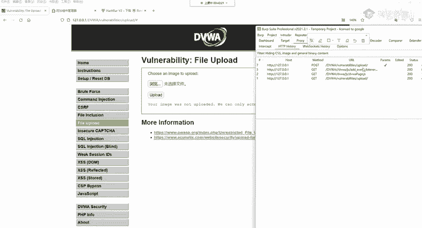

在Burp Suite的“Proxy” -> “Intercept”标签页中，找到被拦截的POST请求。我们需要修改请求体（Body）部分中的一个字段。

找到描述上传文件类型的 `Content-Type` 头部。它通常位于请求体中，格式如下：

```
Content-Disposition: form-data; name="uploaded"; filename="webshell.php"
Content-Type: application/octet-stream
```

我们需要将 `Content-Type` 的值从 `application/octet-stream`（通用二进制流）修改为服务器允许的图片类型，例如：

```
Content-Type: image/jpeg
```
或
```
Content-Type: image/png
```

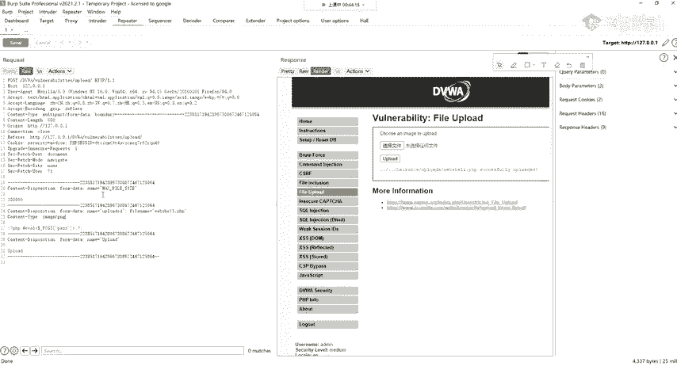

### 第三步：转发修改后的请求

修改完成后，点击“Forward”按钮，将修改后的请求发送给服务器。

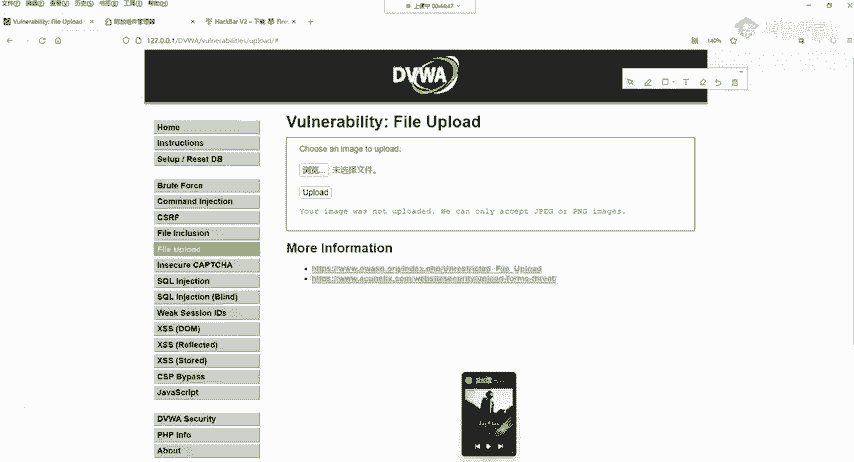

### 第四步：验证绕过结果

回到DVWA页面，如果操作成功，页面将显示文件上传成功的提示。我们可以通过访问上传文件的URL（如 `http://靶场地址/hackable/uploads/webshell.php` ）来验证文件是否已生效。

最后，可以使用中国菜刀、蚁剑等Webshell管理工具连接该地址，密码为Webshell文件中设置的密码（例如 `pass`），以确认获得了远程代码执行能力。

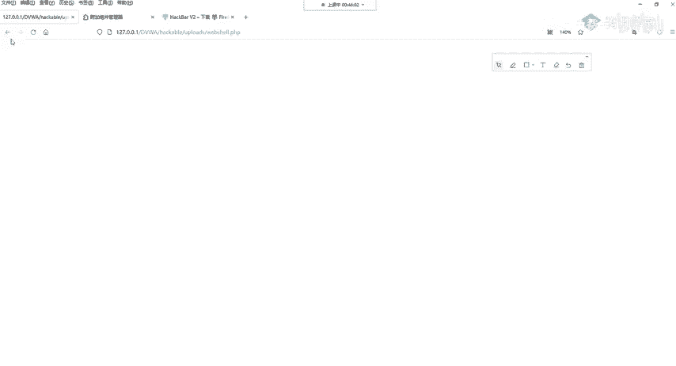

## 总结

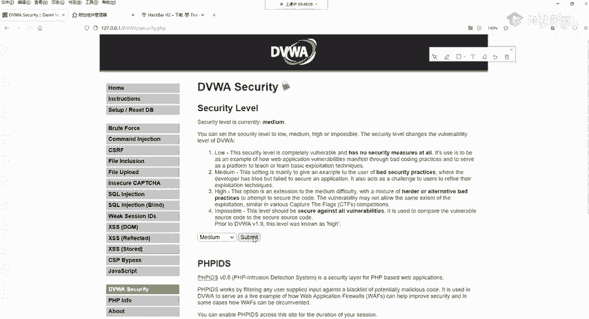

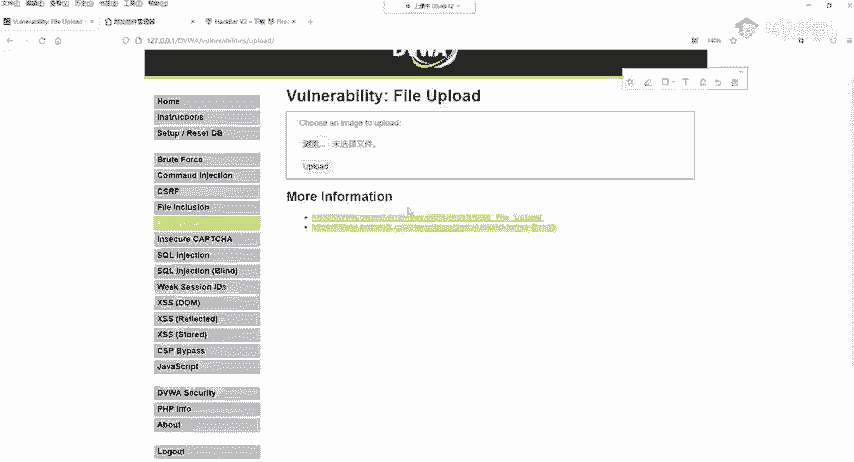

本节课中我们一起学习了DVWA中等安全级别的文件上传防御策略及其绕过方法。

*   **防御原理**：服务器检查客户端提交的 `Content-Type` 字段和文件大小，仅允许特定的图片类型和小文件通过。
*   **绕过原理**：该检查完全信任客户端提交的数据。通过抓包工具（如Burp Suite）拦截HTTP请求，将 `Content-Type` 伪造成允许的类型（如 `image/jpeg`），即可轻松绕过检查。
*   **核心要点**：这种仅在前端或请求头进行校验的防御方式是无效的，安全的文件上传功能必须在服务器端对文件内容进行更严格的验证。

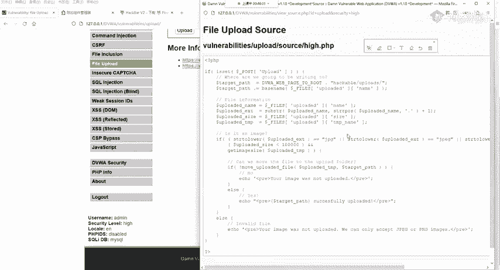

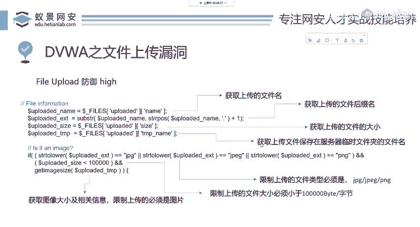

通过本次实践，我们理解了不能依赖客户端提供的数据进行安全决策，并为学习更高级别的防御与绕过打下了基础。下一节，我们将探讨更难绕过的高安全级别（High）防御机制。