# 网络安全：P72：File Upload 防御 high

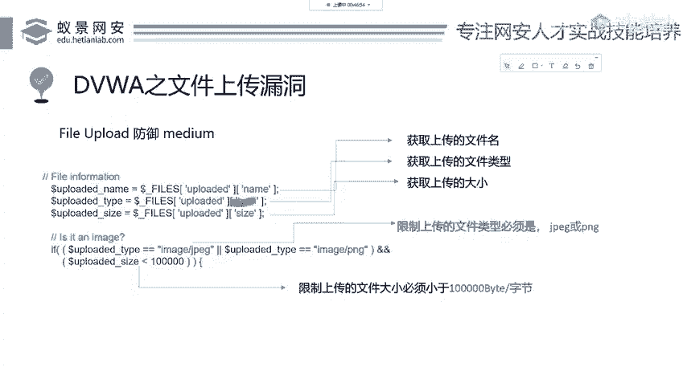

在本节课中，我们将学习DVWA中文件上传漏洞的“High”级别防御机制。我们将分析其代码逻辑，理解其如何通过更严格的检查来阻止恶意文件上传，并探讨一种可能的组合攻击绕过方法。

## 概述

“High”级别的防御在“Medium”级别的基础上进行了增强。它不再仅仅依赖客户端或简单的MIME类型检查，而是通过检查文件扩展名和验证文件是否为真实图片来加强防护。

## 防御代码分析

上一节我们介绍了“Medium”级别的防御，它主要检查了文件的MIME类型。本节中我们来看看“High”级别如何升级防御。

首先，代码获取上传文件的名称，这一点没有改变。关键的变化在于对文件类型的判断方式。

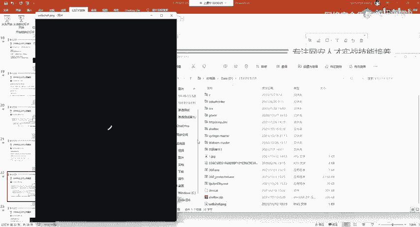

**代码示例：获取文件扩展名**
```php
$uploaded_ext = substr($uploaded_name, strrpos($uploaded_name, '.') + 1);
```
这段代码的作用是：从上传的文件名中，以最后一个点号`.`为分隔符，截取后面的部分，即**文件扩展名**（如 `php`, `jpg`, `png`）。

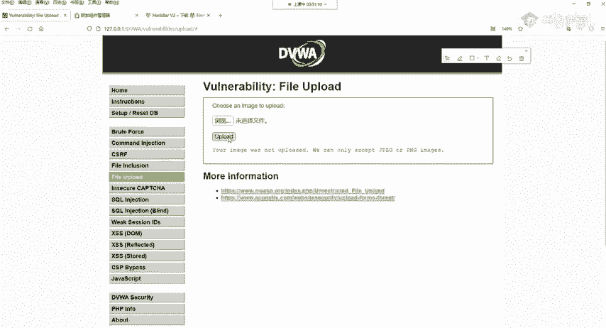

接下来，代码会判断这个扩展名是否在允许的列表内。

以下是允许的文件扩展名列表：
*   JPG
*   JPEG
*   PNG

如果文件扩展名不是以上三者之一，上传请求会被直接拒绝。这严格限制了可上传文件的类型。

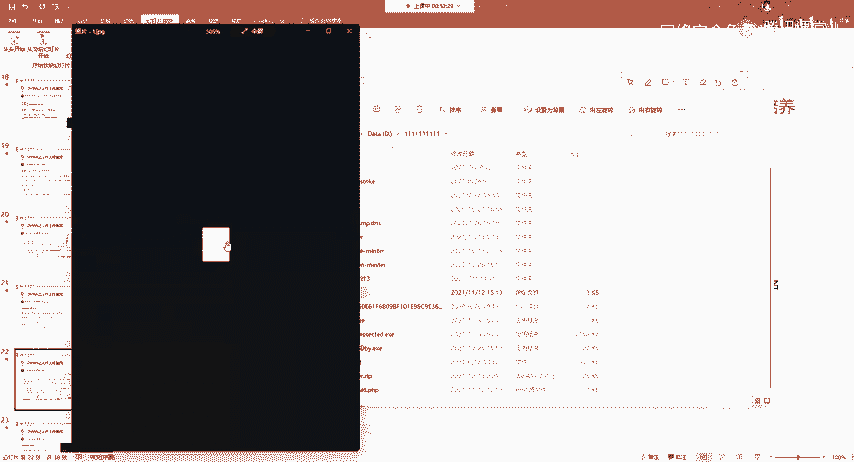

然后，代码使用了 `getimagesize()` 函数。有同学可能会问，前面不是已经获取过文件大小了吗？这里的关键区别在于：
*   之前获取的是**上传文件的大小**，任何文件（如图片、音乐、木马）都有大小。
*   `getimagesize()` 函数的作用是**获取图片的尺寸信息**。如果上传的不是一个真实的图片文件（例如一个被改名为 `shell.jpg` 的PHP木马），该函数将执行失败并返回 `False`。

因此，“High”级别的防御逻辑是：
1.  **检查扩展名**：必须是 `jpg`, `jpeg`, `png`。
2.  **验证图片真实性**：必须是一个可以被 `getimagesize()` 函数成功解析的真实图片文件。

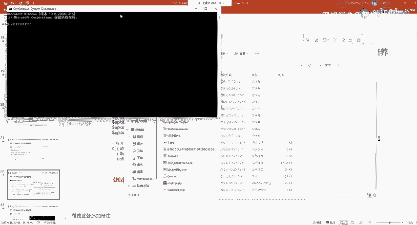

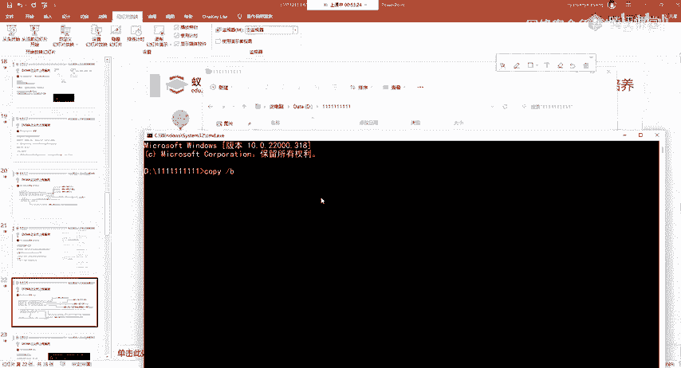

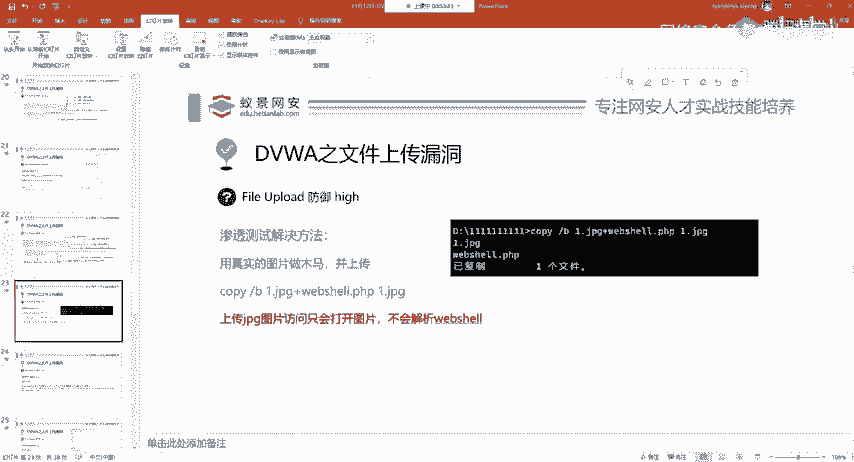

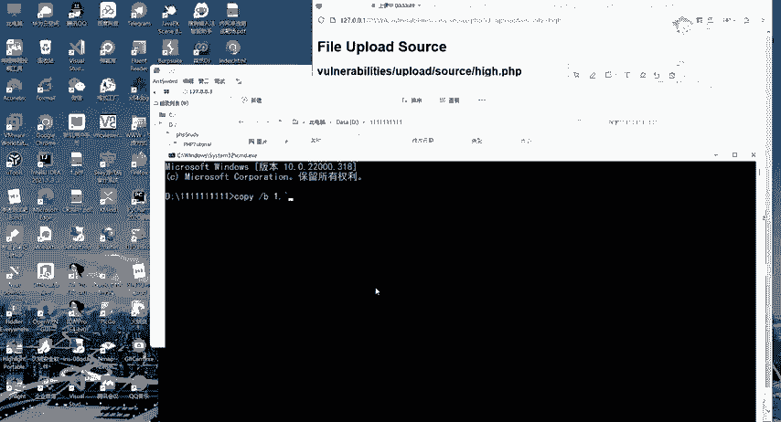

## 绕过尝试与原理

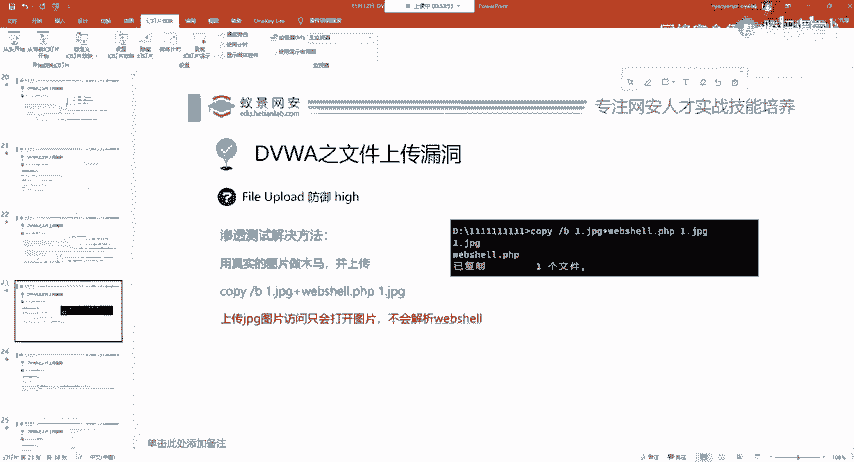

这种防御已经比较严格。简单地修改一个PHP木马文件的后缀名为 `.jpg` 是无法绕过的，因为文件的实际内容（二进制格式）并没有改变，`getimagesize()` 函数无法将其识别为图片。

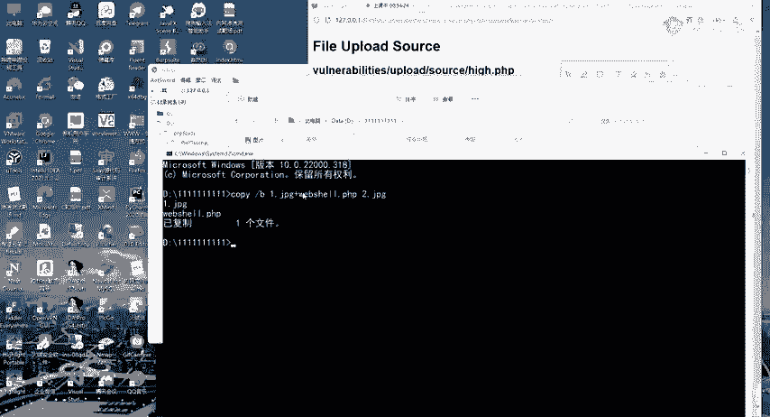

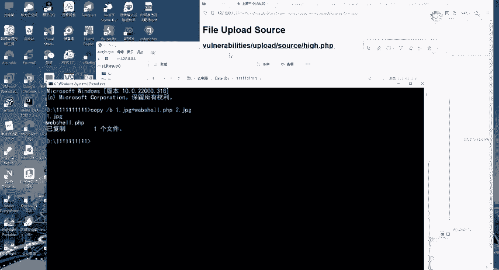

那么，如何绕过呢？核心思路是：**制作一个包含木马代码的真实图片文件**。

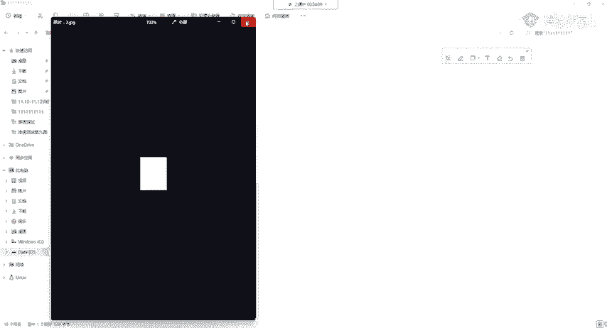

以下是制作图片木马的步骤：
1.  准备一张真实的图片（如 `1.jpg`）。
2.  准备你的木马文件（如 `webshell.php`）。
3.  在Windows系统下，使用 `copy` 命令的二进制合并功能，将图片和木马合并成一个新文件。

**命令示例：制作图片木马**
```cmd
copy /b 1.jpg + webshell.php 2.jpg
```
*   `/b` 参数代表以二进制模式进行合并。
*   这个命令将 `webshell.php` 的内容追加到 `1.jpg` 的末尾，生成新文件 `2.jpg`。

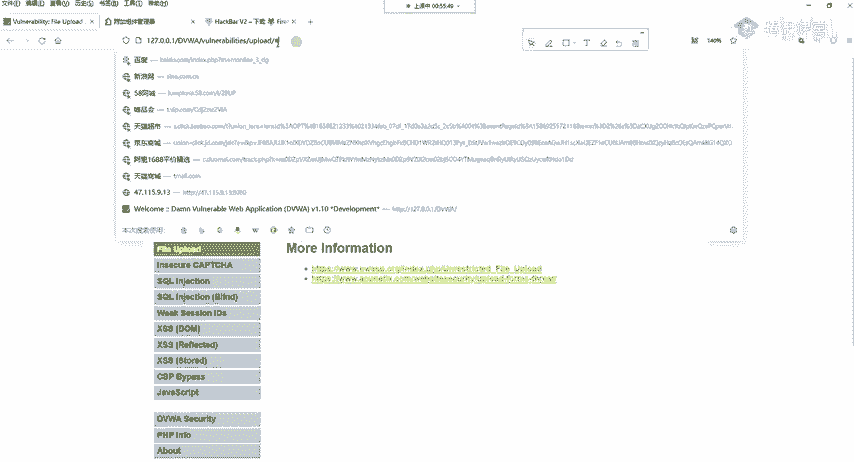

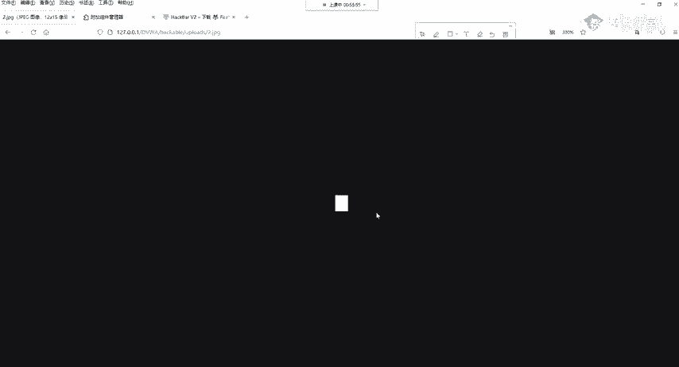

生成的 `2.jpg` 仍然是一个有效的图片文件，可以正常预览。同时，木马代码被隐藏在图片文件的末尾，不会影响图片的正常显示。此时，这个文件可以通过“High”级别的检查成功上传。

## 组合利用：文件包含漏洞

成功上传图片木马后，我们无法直接通过访问 `2.jpg` 来执行其中的PHP代码，因为服务器会把它当作普通图片处理。

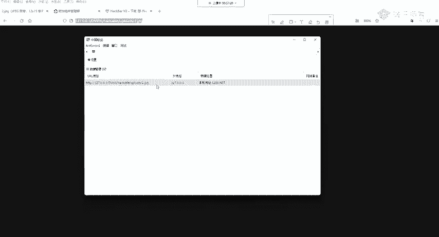

这时，我们需要利用另一个常见的漏洞——**文件包含漏洞**。如果目标网站存在文件包含漏洞（例如 `include.php?file=xxx`），我们就可以通过该漏洞去“包含”我们上传的图片文件。

**关键原理**：在文件包含漏洞的语境下，被包含的文件内容会被服务器当作**PHP代码来解析和执行**，无论其文件扩展名是什么。

假设存在一个文件包含点，我们可以这样构造请求：
```
http://target.com/include.php?file=./uploads/2.jpg
```
这样，服务器就会读取 `2.jpg` 的内容，并将其中的PHP木马代码执行。此时，我们就可以用中国菜刀等工具连接这个包含地址，从而获得Webshell。

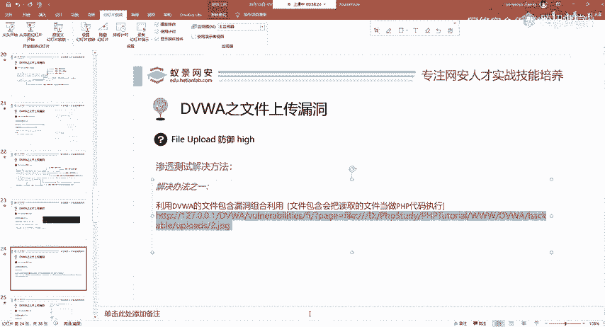

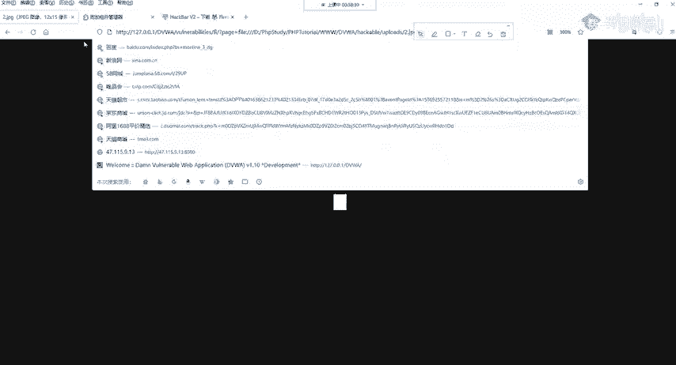

**连接要点**：由于DVWA需要登录会话，在使用连接工具时，需要将浏览器中已登录的Cookie信息添加到连接工具的请求头中，以通过身份验证。

## 终极防御：Impossible级别

在分析了“High”级别的防御与绕过后，我们来看看理论上更安全的“Impossible”级别是如何设计的。

“Impossible”级别集成了之前所有的防御思想，并增加了致命一击：

以下是“Impossible”级别采取的关键措施：
*   **重命名文件**：使用 `uniqid()` 函数为上传的文件生成一个随机的、无规律的新文件名，防止攻击者直接访问或预测文件路径。
*   **多重检查**：同时检查文件扩展名、MIME类型 (`$_FILES[‘uploaded’][‘type’]`) 和 `getimagesize()` 的结果。
*   **图片重制（关键）**：使用 `imagecreatefromjpeg()` / `imagecreatefrompng()` 和 `imagejpeg()` / `imagepng()` 等函数，将上传的图片在服务器端**重新编码、生成一张全新的图片**。这个过程会丢弃所有非图片数据的部分（即我们附加的木马代码），从根本上杜绝了图片木马。

**代码示例：图片重制**
```php
// 从上传的临时文件创建一个新的图像资源
$img = imagecreatefromjpeg($uploaded_temp);
// 以指定质量（如100）输出一张新的JPEG图片
imagejpeg($img, $target_path, 100);
// 销毁图像资源以释放内存
imagedestroy($img);
```

## 总结

本节课中我们一起学习了文件上传漏洞“High”级别的防御与绕过，并了解了“Impossible”级别的终极防护思路。

我们主要掌握了以下内容：
1.  “High”级别通过**校验文件扩展名**和**验证文件是否为真实图片**来防御。
2.  可以通过制作**图片木马**（将木马追加到真实图片末尾）来绕过扩展名和图片验证。
3.  绕过后，通常需要**组合利用文件包含漏洞**来执行图片中的木马代码。
4.  真正牢固的防御（“Impossible”级别）应包含：**多重校验、重命名文件、以及在服务器端对图片进行重编码**，以彻底清除嵌入的非图片数据。

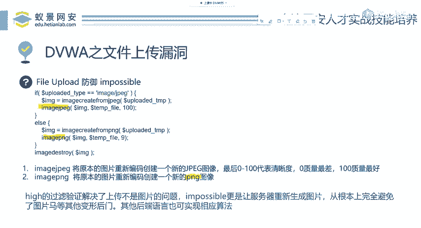

在开发中，应借鉴“Impossible”级别的思路，采用多重验证和服务端处理相结合的方式，才能有效防御文件上传漏洞。