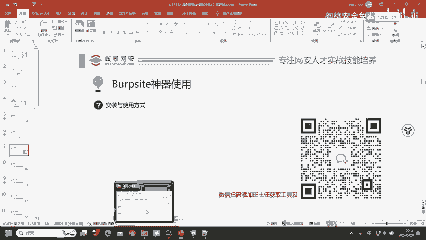
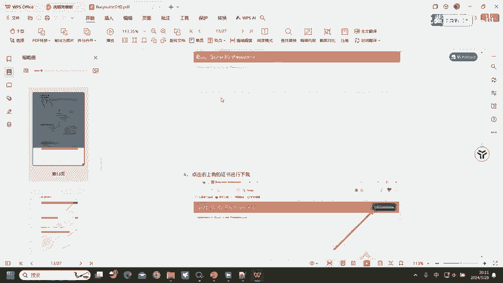
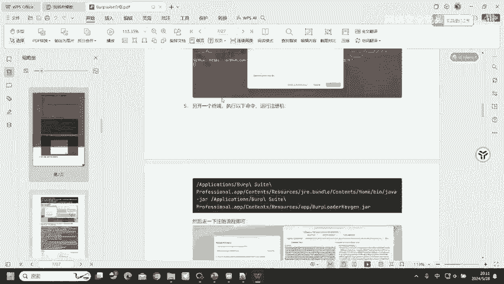
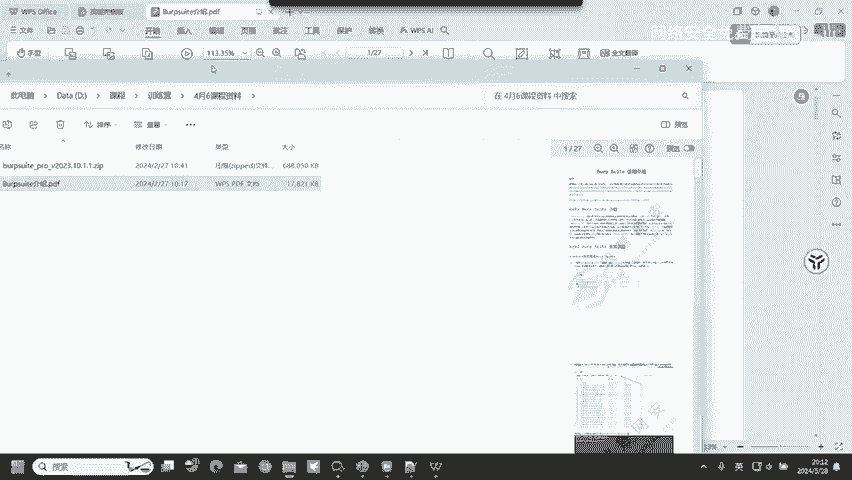
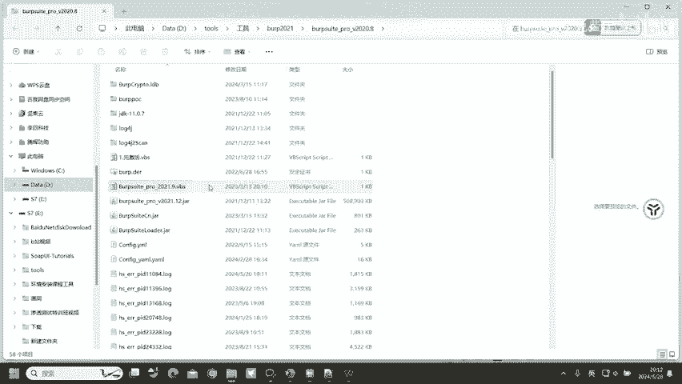
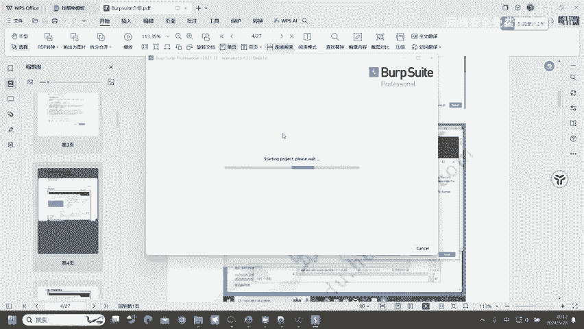
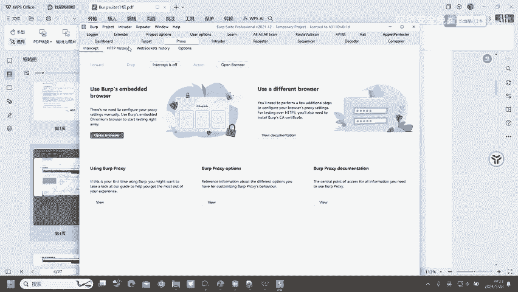
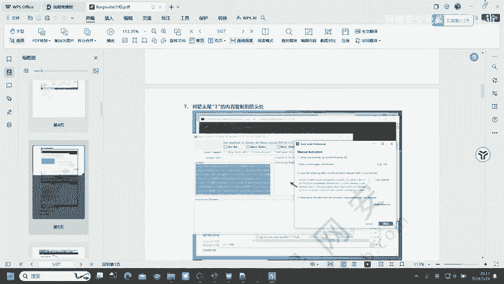

# 网络安全入门：P73：Burpsuite神器的使用 🔧

在本节课中，我们将要学习网络安全渗透测试中一个至关重要的工具——Burpsuite。我们将了解它的基本作用、安装方法以及初步的界面认识，为后续的漏洞挖掘与测试打下基础。

## 工具概述与重要性

首先，我们去了解对应的一个工具，也就是挖掘漏洞会用到的工具。Burpsuite是我们去挖掘Web漏洞必备的工具，基本上90%的漏洞都可以通过Burpsuite去进行发现和测试。

## 安装指引

那么Burpsuite该怎么安装呢？

这里有一个介绍文档，也是给大家去准备好的一个介绍文档。在这里面就有Burpsuite的安装与基础使用。因为今天的课程就只有一个多小时的时间。如果说把Burpsuite给大家讲一遍，然后再把HTTP协议给大家讲一遍，很明显时间就不够了，因为Burpsuite的安装也需要花费很长的一个时间。所以说，大家就跟着这样的一个文档去进行操作，基本上不会有任何问题。

## 文档获取方式

文档在哪里获取？在你们进群，或者说你们进入课堂的时候，会给大家发一个预习文档。在预习文档里面的百度网盘链接就存在有这一个Burpsuite文档，就有这个文档告诉大家怎么安装，以及里面存在有我们会用到的Burpsuite这一个工具也都会在里面。

然后我们就跟着这样的文档去进行安装使用就可以了。最后打开就是这样的一个界面。

## 关于安全证书的补充

如果说同学们想要这种CISP证书，其实很好获取的。CISP证书很好获取的，很简单。事件型、通用型都很简单。尤其是事件型，事件型就随便的挖几个漏洞，就有事件型证书了。

## 工具界面与总结

打开之后就是这样的一个界面，然后我们就可以去进行使用了。

这里的一个Burpsuite的安装，我就不做过多的讲解了。大家跟着文档去进行安装即可。

本节课中我们一起学习了Burpsuite工具在Web安全测试中的核心地位，明确了其安装需要遵循提供的详细文档，并初步认识了工具的启动界面。掌握工具的安装是进行实战操作的第一步。