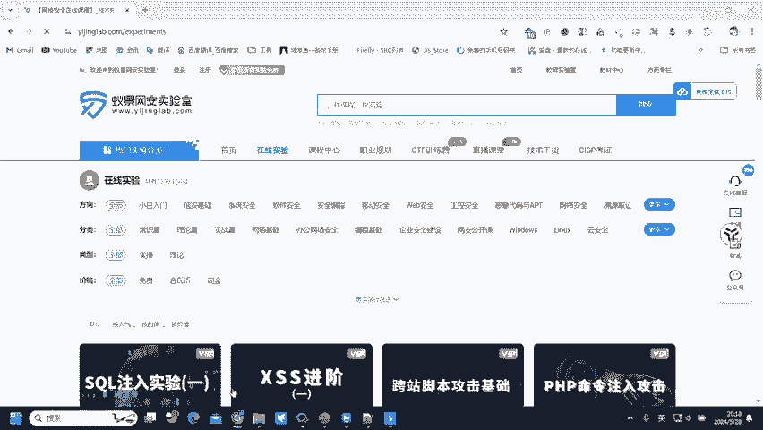
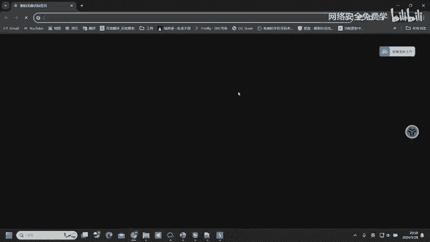
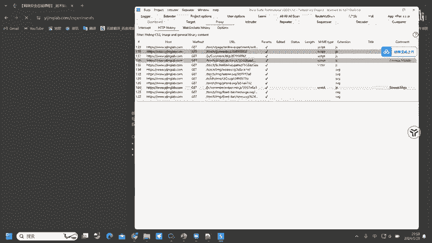
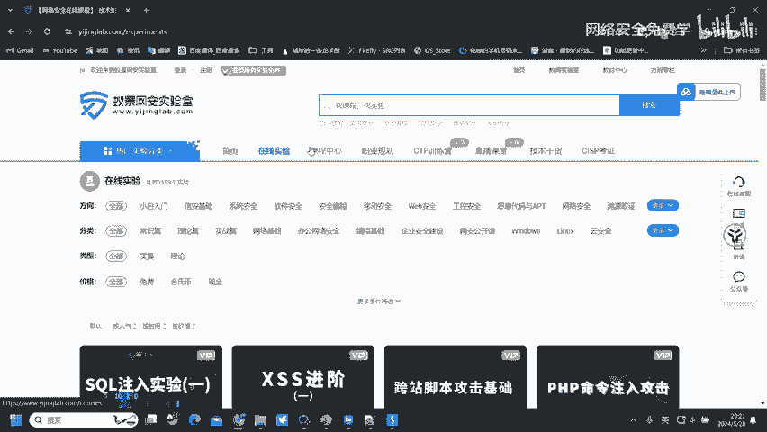

# 网络安全入门：P74：网站访问的实现 🔍

在本节课中，我们将要学习网站访问的基本原理。理解这个过程是进行Web漏洞挖掘的基础，因为绝大多数网络服务都基于网站。我们将从宏观流程讲到具体的数据交互协议，帮助你清晰地理解浏览器与服务器是如何“对话”的。

## 网站访问的重要性 🌐

上一节我们介绍了网络安全的大背景，本节中我们来看看为什么网站是漏洞挖掘的核心目标。

因为进行漏洞挖掘，最主要的对象是Web漏洞。网站服务覆盖了当前网络服务的大约80%。因此，网站漏洞挖掘永远是最主要的方向。例如，腾讯、美团、京东等大型平台都拥有数万乃至数百万个网站。所以，掌握网站漏洞挖掘是必备技能。

在网站漏洞挖掘中，最主要的工具之一是 **Burp Suite**。这个工具能够发现网站上90%以上的漏洞。因此，学习漏洞挖掘，很大程度上就是学习Burp Suite的使用。

## 网站访问的基本流程 🖥️➡️🌐

了解了目标的重要性后，我们来看看用户是如何访问一个网站的。

网站需要通过浏览器进行访问。例如，我们在浏览器地址栏输入 `www.example.com` 这样的域名，才能访问到对应的站点并看到网页内容。这就是网站访问的基本流程：通过**浏览器**（Browser）访问**服务器**（Server）的过程。

## HTTP协议：浏览器与服务器的“通用语言” 💬

在上一节我们看到了访问的起点和终点，本节中我们来看看连接两者的桥梁——通信协议。

在浏览器访问服务器的过程中，并非只是简单的“点击-显示”。这个过程会触发大量的网络流量和数据交换。那么，服务器如何知道是浏览器在访问它？又如何知道浏览器请求的是哪个具体资源（比如“在线实验”页面）？

答案是：浏览器告诉它的。为了让浏览器和服务器能够互相理解，它们必须使用统一的通信格式，即统一的“语言”。这个语言就是 **HTTP协议**（超文本传输协议）。



HTTP协议定义了浏览器和服务器之间传输数据的格式，使它们能够进行有效交流。这就像两个使用不同母语的人，如果都会中文，就能顺利沟通。HTTP协议就扮演了“中文”这个通用语言的角色。





## HTTP数据包详解：请求与响应 📦

既然HTTP协议是交流的桥梁，那么具体的数据是如何封装和传递的呢？我们通过实际数据包来分析。

在HTTP协议中，主要存在两种数据包：
1.  **Request（请求数据包）**：由浏览器发送给服务器，告知服务器“我想要什么”。
2.  **Response（响应数据包）**：由服务器返回给浏览器，内容是“这是你要的东西”。

以下是查看这些数据包的方法：

我们可以使用抓包工具（如Burp Suite）来捕获访问过程中的流量。在工具中，你会看到一系列请求记录。点击任意一条记录，通常可以清晰地看到被分为 **Request** 和 **Response** 两部分。

*   **请求数据包（Request）**：包含了浏览器想获取的资源路径、使用的HTTP方法（如GET、POST）、以及浏览器自身的一些信息（User-Agent）等。
    ```http
    GET /index.html HTTP/1.1
    Host: www.example.com
    User-Agent: Mozilla/5.0...
    ```
*   **响应数据包（Response）**：包含了服务器返回的状态码（如200表示成功）、响应内容类型以及网页的实际数据（通常是HTML代码）。
    ```http
    HTTP/1.1 200 OK
    Content-Type: text/html

    <html>...这里是网页的源代码...</html>
    ```

浏览器在收到服务器的响应数据包（即原始的HTML、CSS、JavaScript代码）后，会进行**渲染**，将代码转换成直观的、可视化的网页界面。如果没有浏览器的渲染，我们直接查看服务器返回的源代码，对于大多数人来说是无法直接阅读和理解的。

## 总结 📝

本节课中我们一起学习了网站访问的核心机制。我们首先明确了网站作为漏洞挖掘主要目标的重要性。接着，梳理了从浏览器输入网址到页面显示的基本流程。然后，我们深入探讨了使这个过程成为可能的HTTP协议，它如同浏览器与服务器之间的通用语言。最后，我们剖析了HTTP通信中的两个基本单元：**请求数据包（Request）** 和 **响应数据包（Response）**，并了解了浏览器如何将响应包中的代码渲染成我们看到的网页。



理解“请求-响应”模型是学习Web安全的基石，后续所有的漏洞分析、渗透测试工具的使用（如Burp Suite）都建立在对这个模型清晰认知的基础之上。