# HTTP协议详解：P75：HTTP请求消息详解

## 概述
在本节课中，我们将要学习HTTP请求消息的具体结构和组成部分。我们将拆解一个看似复杂的英文数据包，用简单直白的方式解释每一个部分的作用，特别是GET和POST这两种最常用的请求方法。即使你英语基础薄弱，也能轻松理解其核心概念。

---

## 请求数据包的结构拆分

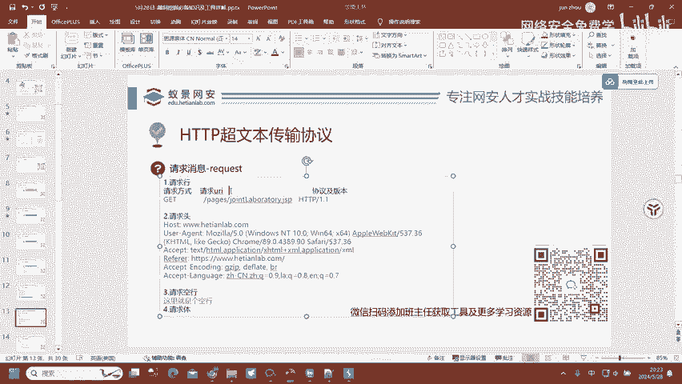

很多初学者看到全是英文的请求数据包会感到困惑，甚至怀疑自己是否适合学习。这种担忧是多余的。关键在于理解每个部分的功能，而非每个单词的含义。

上一节我们介绍了HTTP协议的基本概念，本节中我们来看看一个具体的HTTP请求消息由哪些部分构成。

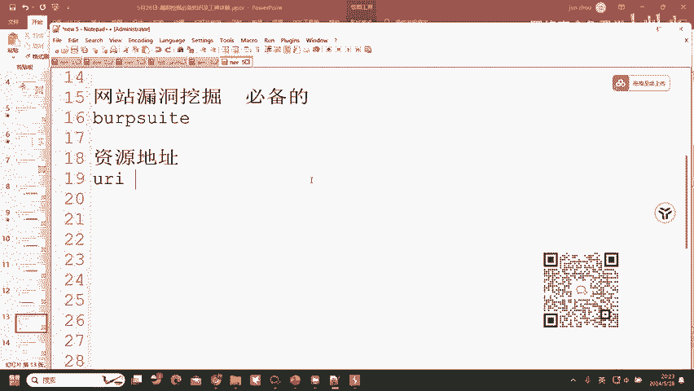

一个完整的HTTP请求数据包包含多行内容。我们可以将其拆分为四个主要部分来理解：
1.  请求行
2.  请求头
3.  空行
4.  请求体

这四行内容缺一不可，构成了HTTP协议的完整性格式。如果缺少任何一部分，请求将无法正常发送和处理。某些工具（如Burp Suite）会自动补全缺失的部分，但这并不意味着协议本身允许不完整的格式。

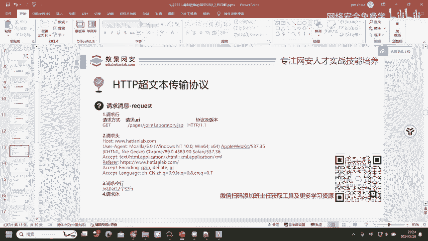

---

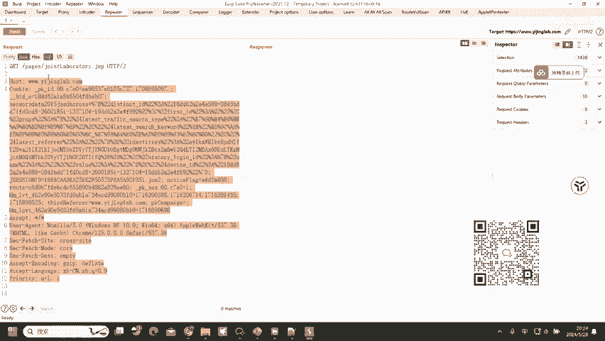

## 第一行：请求行详解

请求行是数据包的第一行，它包含了三个核心信息。

以下是请求行包含的三个要素：
*   **请求方法**：例如 `GET`。它告诉服务器客户端想要进行什么操作。
*   **请求URI**：例如 `/index.jsp`。这是**资源地址**，明确告诉服务器客户端想要访问网站上的哪个具体文件或页面。
*   **协议版本**：例如 `HTTP/1.1`。指明本次通信所使用的HTTP协议版本。

通过拆分，原本令人困惑的一行英文就变得清晰了：它指明了 **“怎么操作”** (`GET`)、**“操作什么”** (`/index.jsp`) 以及 **“用什么规则”** (`HTTP/1.1`)。

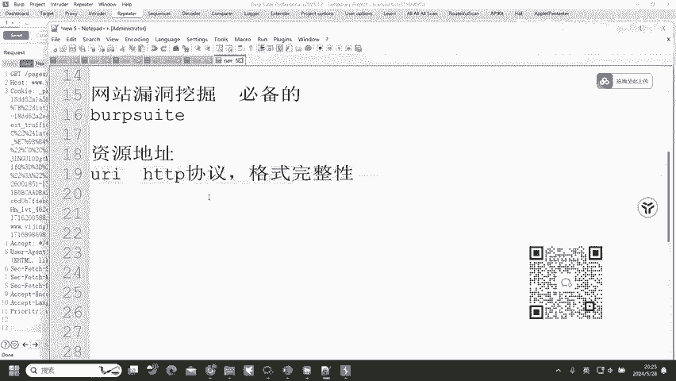

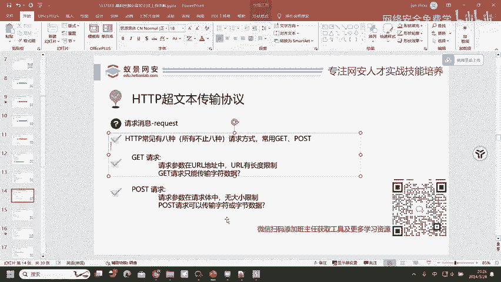

---

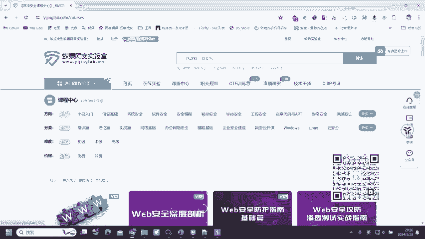

## 核心请求方法：GET vs. POST

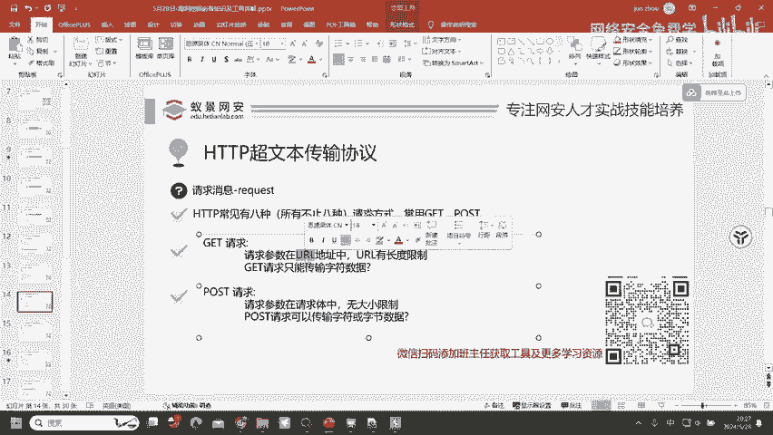

HTTP协议定义了多种请求方法，最常用的是GET和POST。理解它们的区别对后续学习至关重要。

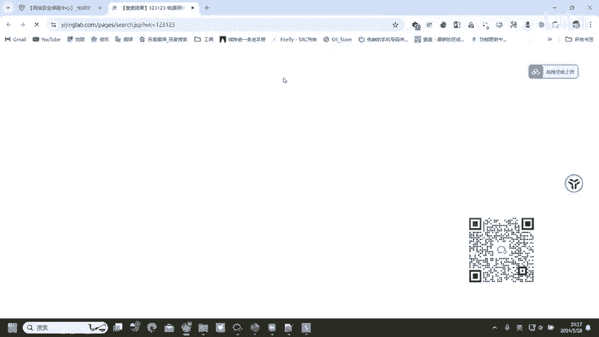

上一节我们解析了请求行，其中提到了`GET`方法。本节中我们来看看`GET`和它的兄弟`POST`有何不同。

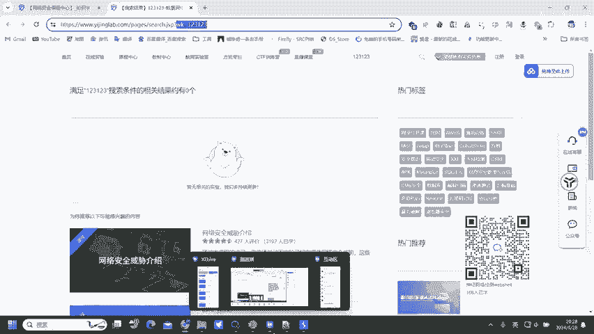

### GET 请求
GET请求用于从服务器获取数据。它的特点非常鲜明。

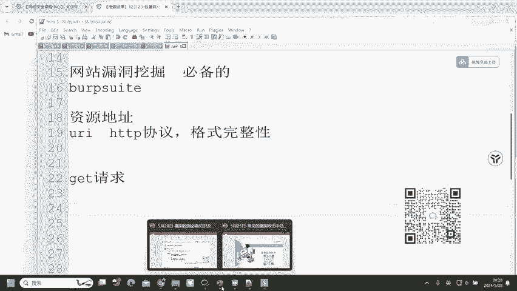

以下是GET请求的主要特征：
*   **请求参数在URL中**：提交的数据会附加在URL地址之后，格式为 `?key1=value1&key2=value2`。
*   **URL有长度限制**：由于参数在地址栏中，受浏览器和服务器对URL长度的限制，不能传输大量数据。
*   **只能传输字符数据**：即文本字符串，如数字、英文字母、汉字等。

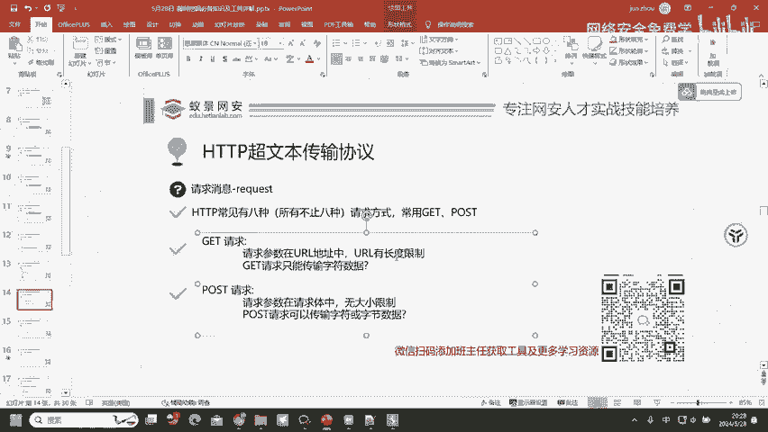

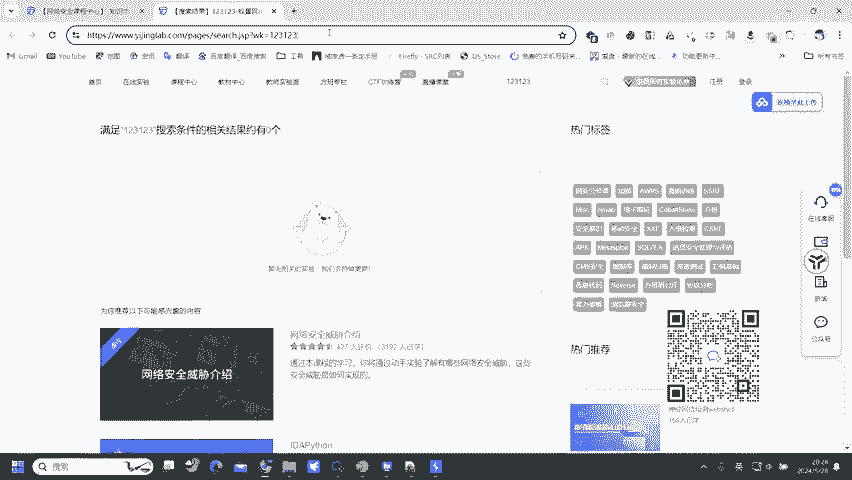

**示例**：当你在网站搜索框输入“123”并搜索时，URL通常会变成 `https://www.example.com/search?keyword=123`。这里的 `keyword=123` 就是通过GET请求发送的参数。

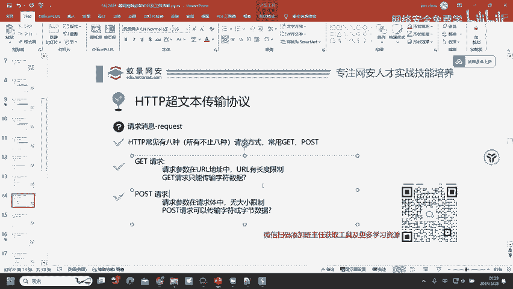

### POST 请求
POST请求用于向服务器提交数据，通常用于表单提交、文件上传等。

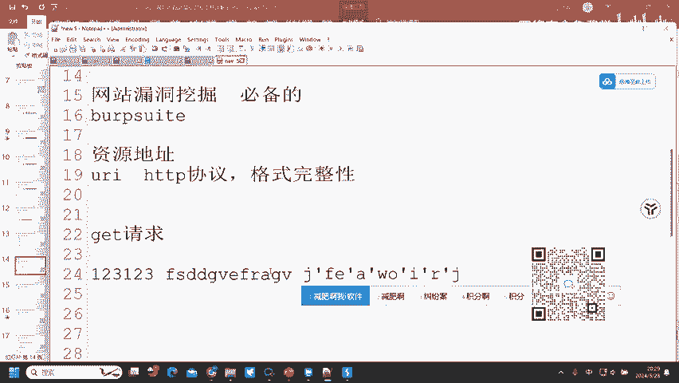

以下是POST请求的主要特征：
*   **请求参数在请求体中**：提交的数据放在HTTP请求的第四部分——请求体（Body）中，不会显示在浏览器地址栏。
*   **无大小限制**：理论上对传输的数据量没有限制，取决于服务器处理能力。
*   **可以传输任意类型数据**：包括字符数据（文本）和**字节数据**（如图片、文档、软件等二进制文件）。

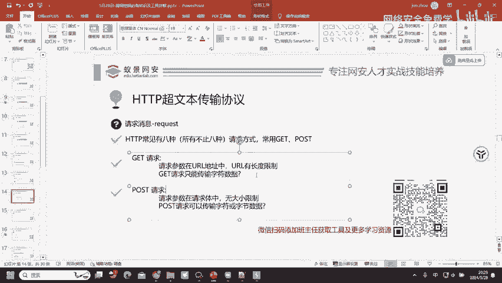

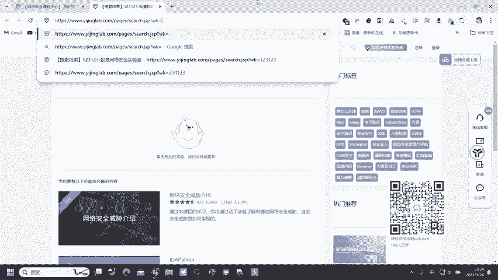

**示例**：更换QQ头像。头像文件（图片）无法通过URL传递，必须使用POST请求，将图片的二进制数据放在请求体中发送给服务器。

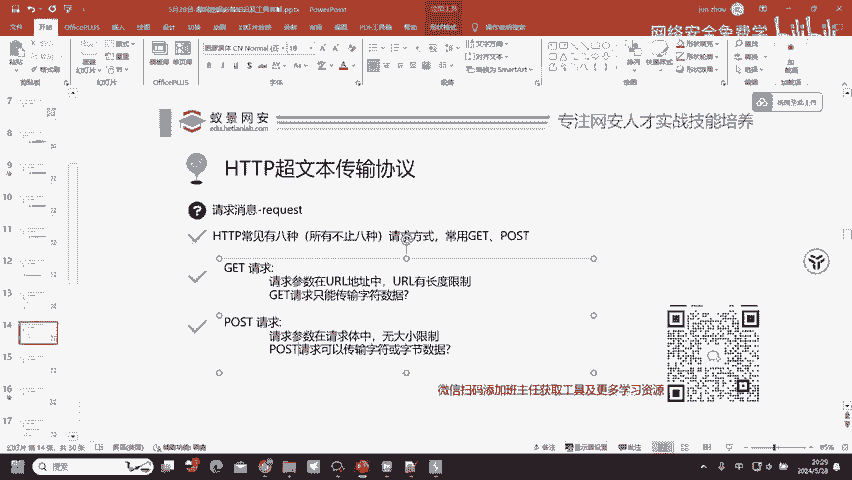

### 核心区别对比
我们可以通过一个简单的对比来总结：

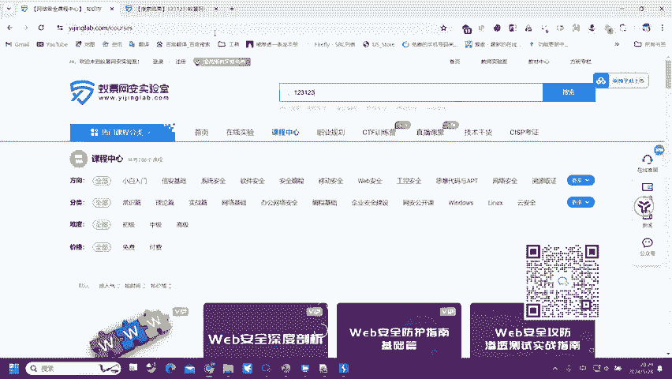

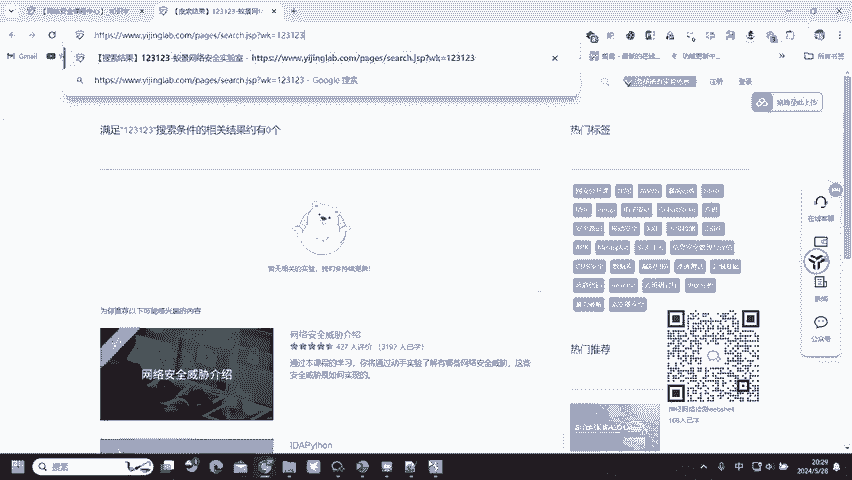

| 特性 | GET 请求 | POST 请求 |
| :--- | :--- | :--- |
| **参数位置** | URL (`?`之后) | 请求体 (Body) |
| **数据限制** | 有长度限制 | 无大小限制 |
| **数据类型** | 仅字符数据 | 字符数据 + **字节数据** |
| **安全性** | 较低（参数可见） | 较高（参数不可见） |
| **常见用途** | 获取页面、搜索 | 登录、提交表单、上传文件 |

---

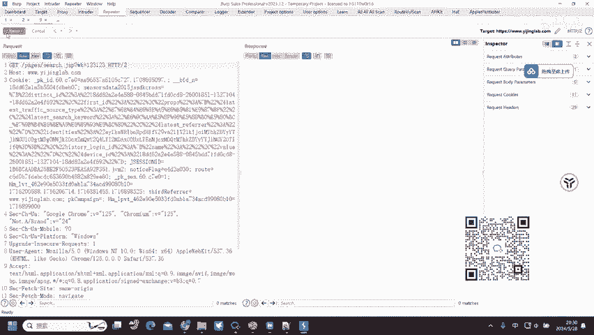

## 请求头中的关键字段：Content-Type

细心的同学可能会发现，POST请求的数据包通常比GET请求多一行头部信息。这多出来的一行，往往就是 `Content-Type`。

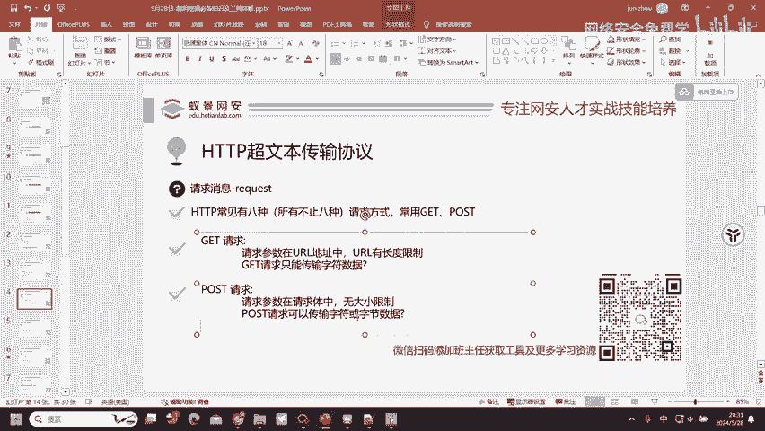

上一节我们比较了GET和POST请求体的不同，本节中我们来看看POST请求如何告知服务器它发送了什么类型的数据。

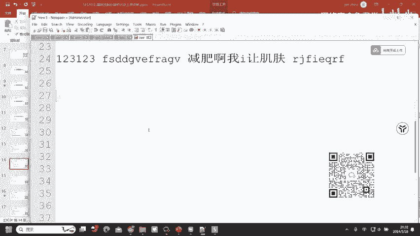

`Content-Type` 字段用于描述**请求体（Body）** 中内容的媒体类型（MIME类型）。服务器根据这个值来解析客户端发送过来的数据。

以下是常见的 `Content-Type` 值及其含义：
*   **`application/x-www-form-urlencoded`**：默认值。表示请求体是普通的表单键值对，格式如 `name=John&age=30`。
*   **`multipart/form-data`**：常用于表单中包含**文件上传**的情况。
*   **`application/json`**：表示请求体中的数据是JSON格式的字符串。
*   **`image/jpeg`**, **`application/pdf`** 等：直接传输特定类型的二进制文件时使用。

**代码示例**：一个典型的携带JSON数据的POST请求头可能包含：
```
POST /api/user HTTP/1.1
Host: www.example.com
Content-Type: application/json
Content-Length: 45

{"username": "testuser", "password": "123456"}
```
正是因为有了 `Content-Type: application/json` 这个声明，服务器才知道应该把请求体 `{"username": "testuser", "password": "123456"}` 当作JSON对象来解析。

而GET请求由于没有请求体，自然也就不需要 `Content-Type` 这个头部字段。

---

## 总结
本节课中我们一起学习了HTTP请求消息的完整结构。我们首先将复杂的数据包拆解为**请求行、请求头、空行和请求体**四个部分。然后，我们深入探讨了最核心的两种请求方法：**GET** 和 **POST**，明确了它们参数位置、数据限制和用途上的根本区别。最后，我们介绍了 `Content-Type` 头字段在POST请求中的关键作用，它像是一个“标签”，告诉服务器如何正确处理请求体中的数据。

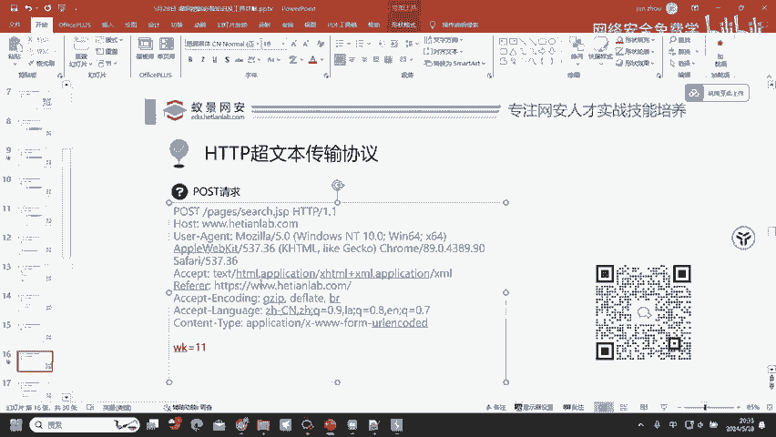

记住，理解这些基础概念不在于死记硬背英文单词，而在于掌握其设计逻辑和用途。GET用于“拿”数据，参数在地址栏；POST用于“送”数据，参数在体内，且能送任何格式。掌握了这个核心，你就已经跨过了理解HTTP协议的第一道门槛。