# 网络安全入门：P76：HTTP超文本传输协议—请求头

在本节课中，我们将学习HTTP协议中请求头（Request Headers）的关键组成部分。理解这些请求头不仅是网络通信的基础，更是发现和利用Web安全漏洞的起点。我们将逐一解析几个核心请求头，并探讨它们可能引发的安全风险。

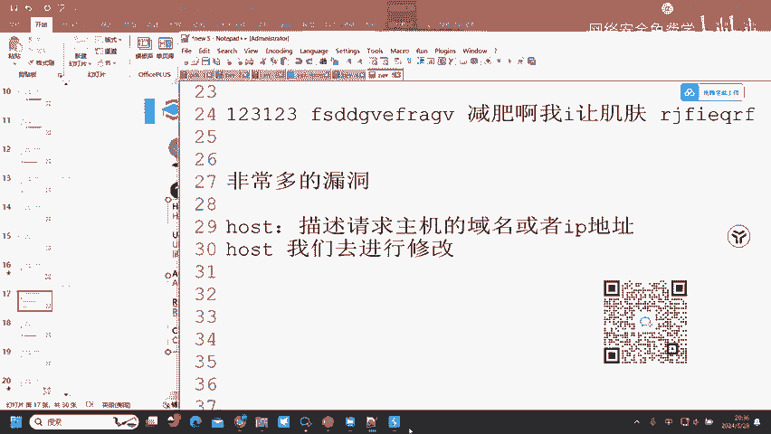

## Host头：站点的“门牌号”

上一节我们介绍了HTTP请求的基本结构，本节中我们来看看第一个关键请求头：`Host`。

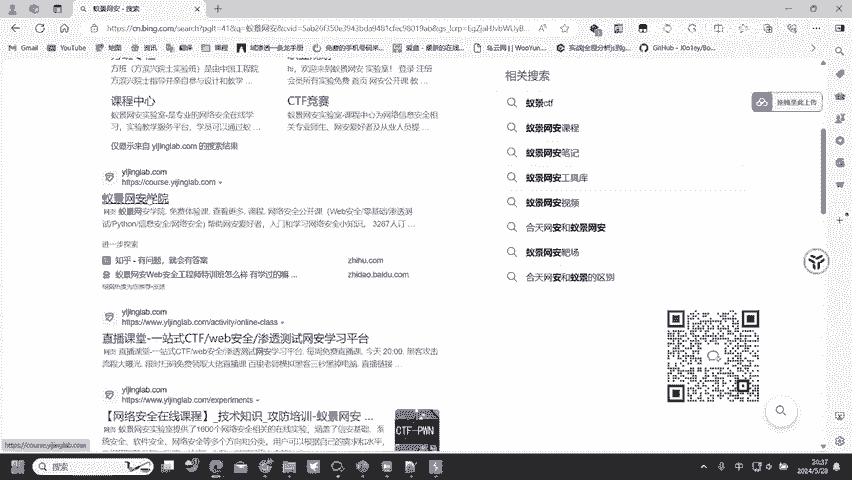

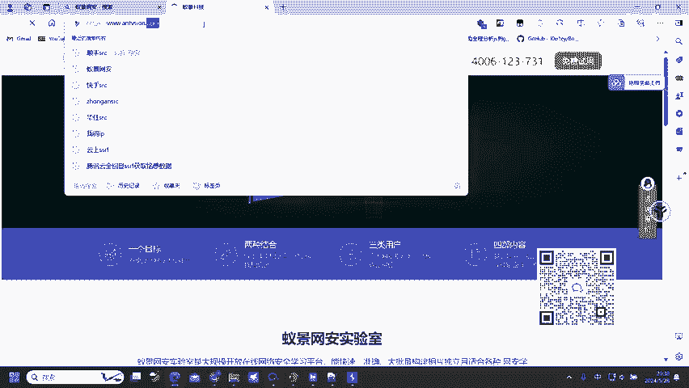

`Host`头的作用是描述请求主机的域名或IP地址。例如，当我们访问 `www.example.com` 时，`Host` 头的值就是 `www.example.com`。它告诉服务器我们想访问哪个网站。

一个IP地址上可能托管着多个网站（即虚拟主机）。服务器正是通过 `Host` 头来区分用户想访问的是哪个站点。例如，IP地址 `192.168.1.1` 上可能同时托管着 `www.site-a.com` 和 `www.site-b.com`。

以下是基于 `Host` 头的一个安全思路：
*   **思路**：如果攻击者将 `Host` 头修改为服务器同一IP下的其他（可能未公开的）内部站点域名，就有可能访问到这些本不该对外暴露的站点。
*   **漏洞概念**：这种攻击方式常被称为 **Host头碰撞** 或 **虚拟主机枚举**。许多内部管理站点防护较弱，一旦被发现就可能成为入侵入口。

> **核心概念**：服务器通过 `Host` 头值决定将请求路由到哪个虚拟主机。公式可表示为：`服务器响应 = 路由(Host头值, 请求路径)`。

## User-Agent头：浏览器的“身份证”

接下来，我们看看 `User-Agent`（简称UA）头。

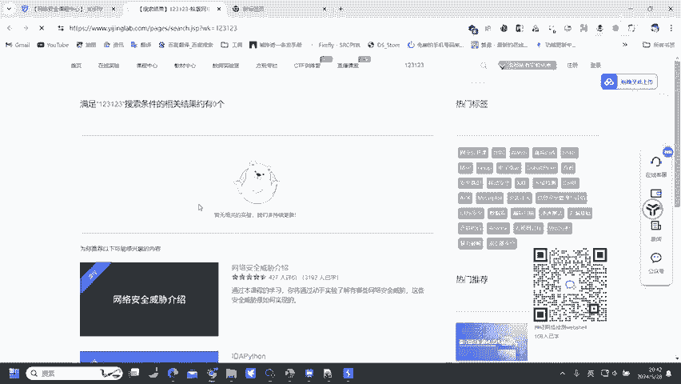

`User-Agent`头的作用是告诉服务器客户端的浏览器版本和操作系统信息，以便服务器返回兼容的页面内容。例如，`Mozilla/5.0 (Windows NT 10.0; Win64; x64) AppleWebKit/537.36` 表示来自Windows 10的Chrome内核浏览器。

修改UA头可能带来以下影响：
*   **UA欺骗**：攻击者可以修改UA头，让服务器误认为请求来自其他浏览器或设备，这可能用于绕过某些客户端检测。
*   **访问限制**：有些网站（如一些老式游戏网站）会检查UA头，只允许特定浏览器（如360安全浏览器）访问。通过修改UA头，可以绕过这种限制。

> **核心概念**：服务器可能根据 `User-Agent` 头值决定返回的内容或施加的规则。代码示例：`if (userAgent.contains("360SE")) { allowAccess(); }`。

## Referer头：来自何方的“引荐者”

现在，我们来探讨一个漏洞高发的请求头：`Referer`（或 `Referrer`）。

`Referer`头的作用是告诉服务器当前请求是从哪个页面链接过来的。例如，从百度搜索结果点击进入某个网站，请求头中就会包含 `Referer: https://www.baidu.com/`。

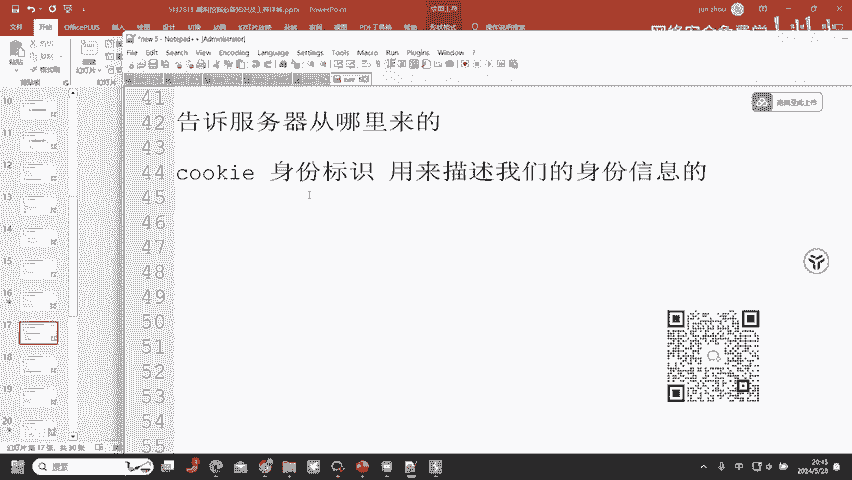

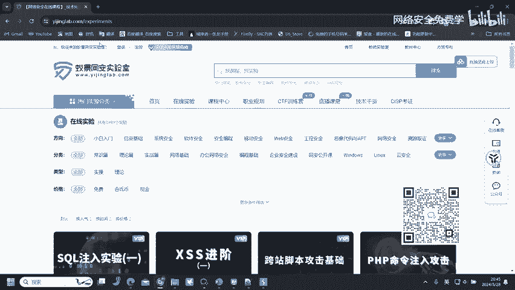

`Referer`头与身份验证机制（如Cookie）结合不当，可能引发严重漏洞。Cookie是服务器发给浏览器的一小段数据，用于标识用户身份（就像门禁卡）。用户登录后，后续请求会携带Cookie，服务器据此识别用户。

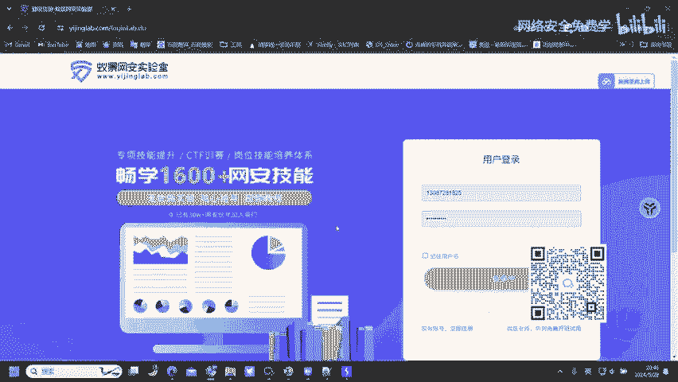

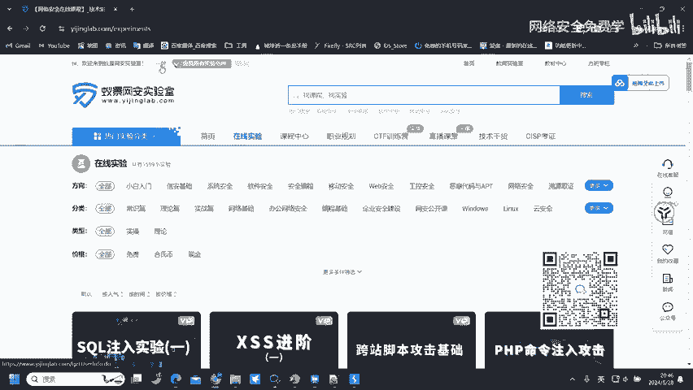

以下是 `Referer` 头可能涉及的一个经典漏洞：
*   **漏洞名称**：**跨站请求伪造（CSRF）**
*   **攻击原理**：
    1.  攻击者构造一个恶意网页，其中包含自动提交的表单或脚本，其目标是受害网站（如 `www.victim.com`）的敏感操作接口（如修改密码）。
    2.  攻击者诱骗已登录 `www.victim.com` 的用户访问这个恶意网页。
    3.  用户的浏览器在访问恶意页面时，会自动向 `www.victim.com` 发送带有用户合法Cookie的请求（包括修改密码的请求）。
    4.  服务器看到合法的Cookie，便执行操作（如修改密码），而 `Referer` 头可能显示请求来自攻击者的恶意页面。
*   **防御关键**：如果网站在处理敏感操作时，严格验证 `Referer` 头，只允许来自自身域名的请求，那么CSRF攻击将难以成功。

> **核心概念**：CSRF利用的是浏览器自动携带Cookie发起请求的机制。防御的关键在于验证请求的“来源”（`Referer`头或使用CSRF Token）。公式可简化为：`攻击成功 = 用户已登录 + 浏览器自动发起请求 + 服务器未验证请求来源`。

## Cookie头：安全问题的“重灾区”

最后，我们聚焦于 `Cookie` 头，它是许多攻击的核心目标。

正如之前所述，`Cookie` 是服务器用来识别用户会话的关键凭证。正因如此，它也成为攻击者的主要目标。

以下是 `Cookie` 相关的常见漏洞类型：
*   **Cookie伪造**：如果Cookie的生成规则有缺陷（如使用可预测的序列），攻击者可能伪造其他用户的Cookie，从而冒充其身份登录。
*   **Cookie窃取**：通过XSS（跨站脚本）等漏洞，攻击者可以窃取用户的Cookie。
*   **Cookie未加密传输**：如果Cookie在HTTP明文传输中未设置 `Secure` 和 `HttpOnly` 属性，容易被中间人窃取或被前端脚本读取。

大部分旨在接管用户账号的攻击，最终都会围绕 `Cookie` 做文章。

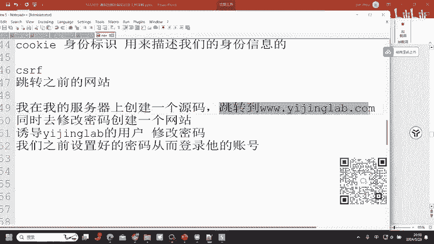

> **核心概念**：`Cookie` 是会话管理的核心。安全的Cookie应设置 `HttpOnly`（防止JS读取）、`Secure`（仅HTTPS传输）、`SameSite`（限制跨站发送）等属性。

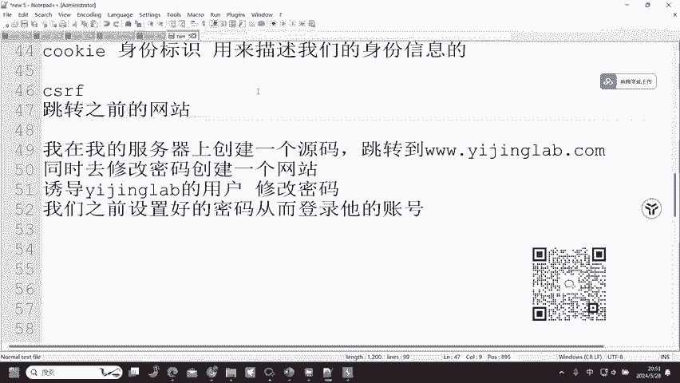

## 总结

本节课中我们一起学习了HTTP请求头中几个关键部分及其安全含义：
1.  **`Host` 头**：用于虚拟主机路由，不当配置可能导致内部站点暴露。
2.  **`User-Agent` 头**：标识客户端，可被伪造以绕过客户端检测。
3.  **`Referer` 头**：表明请求来源，缺乏验证是导致CSRF漏洞的重要原因之一。
4.  **`Cookie` 头**：用户身份的令牌，是会话管理的关键，也是伪造、窃取等攻击的主要目标。

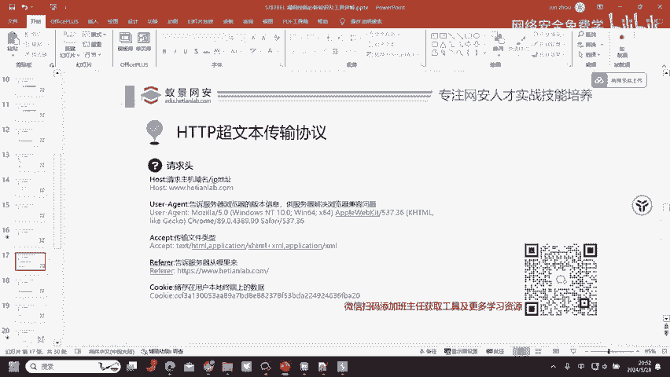

理解这些请求头不仅是网络基础，更是打开Web安全世界大门的钥匙。每一个头字段都可能因为设计或实现上的疏忽，成为安全漏洞的源头。在后续课程中，我们将深入演示和利用这些漏洞，请务必打好基础。