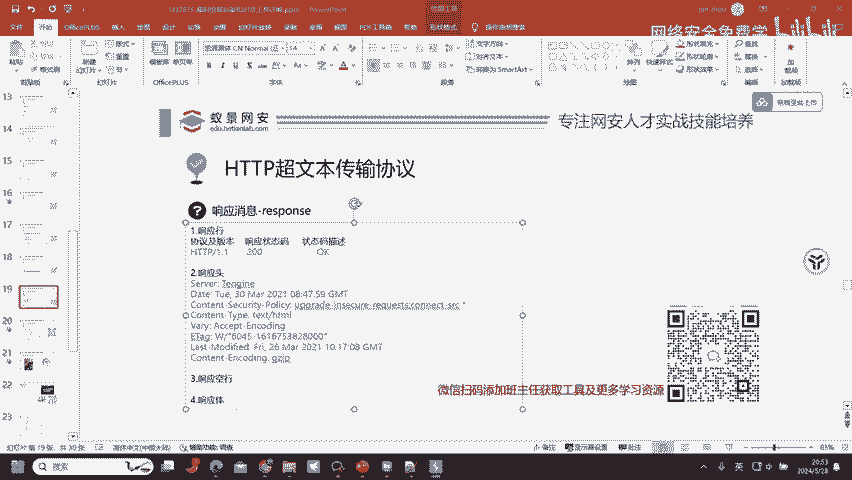
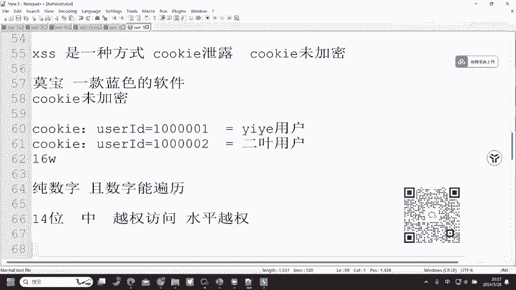
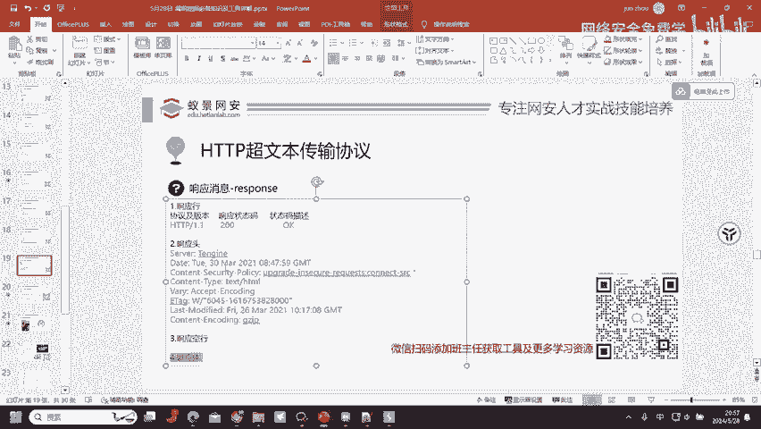
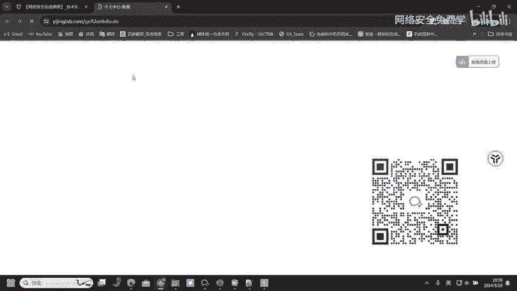
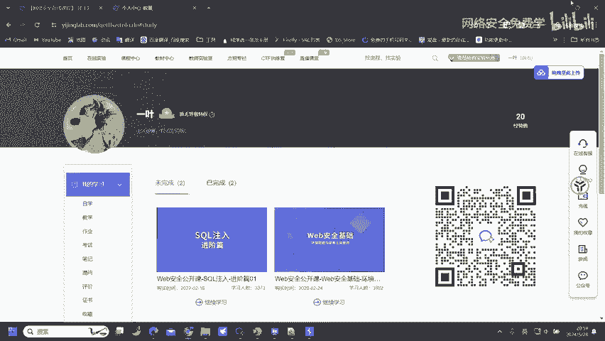

# 网络安全入门：P77：HTTP超文本传输协议—响应消息

在本节课中，我们将学习HTTP响应消息的核心组成部分，特别是响应状态码，并了解如何利用这些信息来判断和发现潜在的安全漏洞。

## 概述



上一节我们介绍了HTTP请求消息，本节中我们来看看服务器返回的HTTP响应消息。理解响应消息，尤其是状态码和响应体，是判断漏洞是否存在的关键。

## 响应消息的核心组成部分

一个HTTP响应消息主要包含以下几个部分，但我们只需要重点关注其中两项。

以下是响应消息的主要结构：
*   **协议及版本**：通常为HTTP/1.1，这部分我们无需深究。
*   **响应状态码**：这是服务器告知浏览器本次请求结果的核心代码，是我们判断漏洞的重要依据。
*   **状态码描述**：对状态码的简短文字说明，例如“OK”或“Not Found”。
*   **响应头**：包含服务器返回的元信息，由浏览器处理，我们通常无需关注。
*   **响应体**：服务器返回的实际内容（如网页HTML代码），是判断漏洞是否存在的主要数据来源。

对于安全测试而言，最需要关注的就是**响应状态码**和**响应体**。响应体用于判断漏洞的具体表现，而响应状态码则用于判断我们请求的内容是否被服务器正常处理。

## 深入理解响应状态码

响应状态码是服务器告诉浏览器本次请求和响应状态的三位数字代码。它们被分为几个类别，每个类别代表不同的含义。

以下是常见的状态码类别及其安全意义：



*   **1xx（信息性状态码）**：表示请求已被接收，需要继续处理。例如，`100 Continue`表示服务器已收到请求头，客户端可以继续发送请求体。这类状态码在常规渗透测试中较少直接利用。

*   **2xx（成功）**：表示请求已成功被服务器接收、理解并处理。最常见的 `200 OK` 表示请求成功，我们成功访问到了目标内容。这是最希望看到的状态码之一。

*   **3xx（重定向）**：表示需要客户端采取进一步的操作才能完成请求。例如，`302 Found` 表示资源被临时移动。攻击者有时会利用开放重定向漏洞。



*   **4xx（客户端错误）**：表示客户端可能出错，服务器无法处理请求。这是我们**需要重点关注**的类别。
    *   `401 Unauthorized`：请求要求身份验证。
    *   `403 Forbidden`：服务器理解请求，但拒绝执行。这可能意味着权限不足。
    *   `404 Not Found`：服务器找不到请求的资源。
    *   `405 Method Not Allowed`：请求行中指定的请求方法不能被用于请求相应的资源。例如，对某个URL用GET请求返回405，但换成POST请求可能成功。

    对于`401`和`403`，安全研究人员会尝试寻找**绕过认证或授权**的方法，以实现未授权访问。对于`405`，**更换请求方式**（如GET换POST）可能会绕过限制，发现意想不到的接口或漏洞。

*   **5xx（服务器端错误）**：表示服务器在处理请求的过程中有错误或异常状态。例如，`500 Internal Server Error` 表示服务器内部错误，可能暴露敏感信息或存在代码执行漏洞。

## 实战案例：Cookie与越权漏洞

了解了状态码，我们来看一个如何利用响应信息发现漏洞的实例。问题核心常在于如何获取或操纵认证凭证，例如Cookie。

假设我们发现某个网站的Cookie（如 `userID=10001`）是未加密的纯数字。那么，一个简单的测试思路就是尝试修改这个值。

**攻击思路伪代码**：
```http
# 原始请求（自己的账户）
GET /user/profile HTTP/1.1
Cookie: userID=10001

# 修改后的请求（尝试访问他人账户）
GET /user/profile HTTP/1.1
Cookie: userID=10002
```
如果服务器仅通过Cookie中的`userID`来判别用户身份，并且未做严格校验，那么将`userID`从`10001`改为`10002`后，若成功返回了用户`10002`的隐私信息（响应体变化），而状态码仍为`200`，则存在**水平越权访问**漏洞。



**关键点**：
1.  **如何获取他人Cookie？** 常见方式包括XSS（跨站脚本）攻击、中间人攻击或利用其他漏洞。
2.  **漏洞认定**：并非所有未加密的Cookie都是漏洞。关键在于这个值是否可被**预测、枚举或爆破**。例如，一个14位的纯数字ID，如果前7位固定，攻击者能通过爆破后7位访问到其他真实用户，漏洞就可能成立。
3.  **参数不固定**：标识用户的参数不一定是`userID`，也可能是`uid`、`id`等其他名称，需要具体网站具体分析。



## 总结

本节课中我们一起学习了HTTP响应消息的核心知识。我们了解到，在安全测试中，应重点关注**响应状态码**和**响应体**。特别是`4xx`和`5xx`状态码，它们常常是发现漏洞的入口点，通过绕过`401/403`或转换`405`的请求方法，可能发现未授权访问漏洞。同时，我们通过Cookie越权的案例，明白了如何利用简单的参数修改，并观察服务器响应（状态码为200且响应体变化）来验证水平越权漏洞的存在。记住，保持好奇心，细致观察请求与响应，是发现安全问题的第一步。