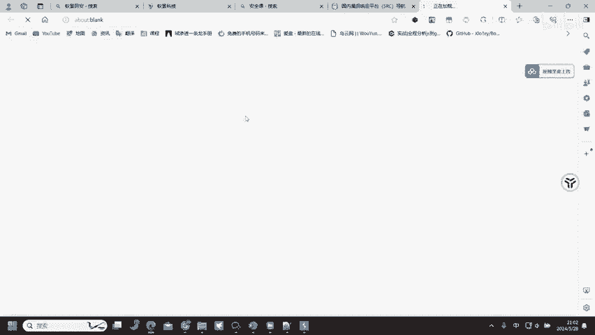
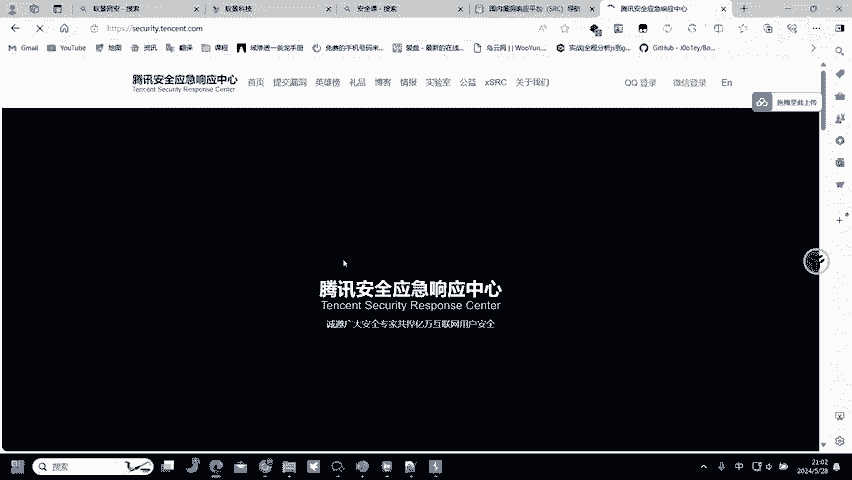
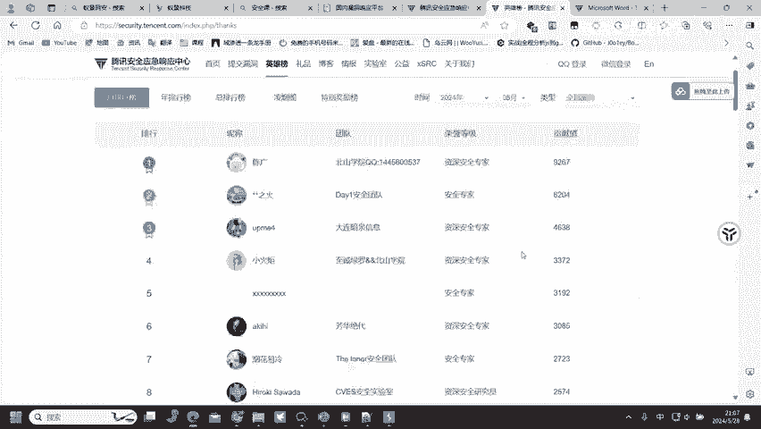
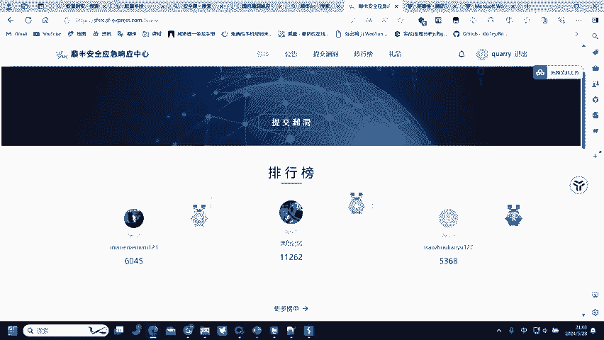

# 网络安全入门：P78：如何通过挖掘漏洞获得收入

在本节课中，我们将学习如何将网络安全技能转化为实际收入，核心途径是通过各大公司的安全应急响应中心提交所发现的漏洞。我们将了解相关平台、提交流程以及如何开始你的漏洞挖掘之旅。

上一节我们介绍了常见的漏洞类型及其基本概念。本节中我们来看看如何将这些知识应用于实践并创造价值。

## 漏洞响应代码解析

在开始挖掘之前，需要正确理解服务器的响应。某些响应代码与漏洞挖掘者无关。

*   **500 内部服务器错误**：此错误表示服务器端出现问题，例如代码错误或服务崩溃。作为外部测试者，我们通常没有权限修改服务器代码。因此，遇到 500 错误时，通常可以忽略并转向其他测试点。
    *   **核心概念**：`HTTP 500` 错误属于服务端问题，测试者通常无法利用。
*   **404 页面未找到**：此错误表示请求的资源不存在。这通常意味着访问路径错误，需要更换请求的目标地址或参数。
    *   **核心概念**：`HTTP 404` 错误指示资源路径无效。

理解了哪些响应与我们无关后，接下来我们进入正题：如何通过发现漏洞获得回报。

## 🎯 漏洞提交平台：安全应急响应中心

所有提到的漏洞都可能带来收益，关键是通过 **安全应急响应中心** 提交。

以下是主要的漏洞提交平台入口，你可以通过“安全客”等网站的SRC导航页面找到它们：
*   补天漏洞响应平台
*   腾讯安全应急响应中心
*   美团安全应急响应中心
*   顺丰安全应急响应中心

几乎所有开设了安全应急响应中心的网站都接受漏洞提交，除了少数受法律特殊保护的顶级域名。

## 📝 漏洞提交与报告撰写

进入平台后，例如腾讯安全应急响应中心，点击“在线提交漏洞”并撰写漏洞报告。

撰写报告前，必须仔细阅读平台的规则：
1.  **遵守测试规范**：每个SRC都有详细的漏洞处理、评分规则和测试范围说明。务必在规则允许的范围内进行测试。
2.  **目标一致性**：只能向对应公司提交在其自身产品和服务中发现的漏洞。例如，在顺丰发现的漏洞不能提交给腾讯。
3.  **明确提交范围**：平台会列出接收漏洞的具体域名列表，例如 `qq.com`， `tencent.com` 等。只测试这些范围内的资产。

## 💼 漏洞挖掘的实战价值

挖掘到的漏洞具有很高的实战价值，可以显著提升个人简历的竞争力。

*   **写入简历**：无论漏洞是否被公开收录，都可以将挖掘经历作为项目经验写入简历，例如描述“发现并报告了某类型漏洞”。
*   **榜单排名**：如果在大型SRC（如阿里、腾讯）的年度榜单上进入前十，其证明力远超多个普通项目经验甚至多张CNVD证书。这直接展示了你的实战能力和漏洞挖掘数量。

## 💰 漏洞奖励机制

提交漏洞后，平台会根据漏洞严重程度给予积分或安全币奖励。

以下是奖励兑换的一个例子：
*   在腾讯SRC，安全币可以按比例兑换现金，例如 `400安全币 ≈ 2000元`，`20000安全币 ≈ 5000元`。
*   假设一名研究者获得了9264贡献值（安全币），仅基础奖励就可能兑换超过4万元。
*   此外，**严重漏洞**通常有额外高额奖金。因此，一个月内提交多个严重漏洞，总收入达到6万至10万元是可能的。
*   这仅是单一平台的收入。研究者可以同时在多个SRC平台（如美团、顺丰等）提交漏洞，多渠道获得奖励。

## 🚀 如何开始漏洞挖掘赚钱

知道了平台和奖励机制后，接下来是具体的行动步骤。

以下是开始漏洞挖掘的三个关键步骤：
1.  **注册平台账号**：在目标SRC平台使用手机号、身份证等信息完成注册。这个过程没有学历或专业门槛。
2.  **学习安全知识与挖掘思路**：这是核心。你需要掌握网络安全知识和各种漏洞的挖掘方法，才能发现有效漏洞。
3.  **持续挖掘与实践**：漏洞不会越挖越少。因为业务不断更新、系统持续迭代，新的漏洞会不断产生。一个系统修复后，可能因更新而引入更多新问题。

本节课中我们一起学习了如何通过安全应急响应中心将漏洞挖掘技能转化为实际收入。我们了解了主要提交平台、报告撰写要点、漏洞的简历价值、丰厚的奖励机制以及入门的三个步骤。记住，关键在于掌握技术并付诸实践。现在，你可以选择一个SRC平台注册账号，开始你的探索之旅了。