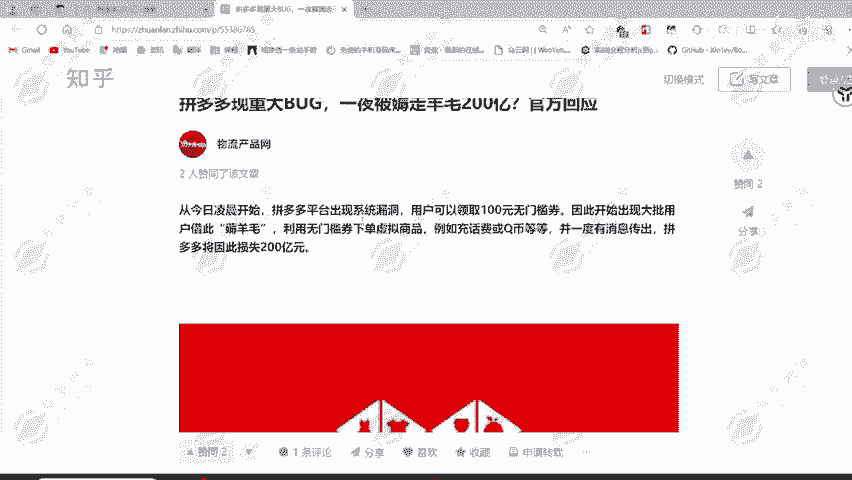

# 网络安全入门：P79：逻辑漏洞概述

在本节课中，我们将要学习网络安全中一个非常关键且常见的漏洞类型——逻辑漏洞。我们将通过生活中的例子和真实的案例，帮助你理解什么是逻辑漏洞，它的危害有多大，以及它为何难以被传统安全工具发现。

## 什么是逻辑漏洞？ 🤔

逻辑漏洞，顾名思义，是程序或业务流程在设计上存在的逻辑缺陷。它并非代码层面的技术性错误，而是业务规则、流程控制或判断逻辑上的疏忽。这种漏洞在生活中也随处可见。

上一节我们介绍了逻辑漏洞的基本概念，本节中我们来看看一个生活中的类比。

例如，几年前非常流行的“狼人杀”游戏。游戏的核心玩法是通过分析玩家的发言逻辑，找出逻辑存在矛盾或问题的玩家，并将其指定为“狼人”投票出局。这个过程本身就是基于“逻辑”进行判断和攻击的体现。

## 业务逻辑漏洞 💼

我们的渗透测试工作，同样会遇到这类问题。因为我们访问的网站或APP，都是基于明确的业务需求开发的。

以下是业务逻辑漏洞的一个典型场景：

假设我们开发一个商城APP。其核心业务包括：商家入驻、上架商品、用户购买商品。在这个流程中，就可能存在逻辑问题。

例如，商城上架了一个售价55元的商品。为了促销，业务部门设计了一张价值30元的“无门槛优惠券”来吸引客户。这里的逻辑缺陷在于：这张优惠券没有限定使用范围。

如果这张30元优惠券可以用于购买55元的商品，用户实际只需支付25元。如果用于购买31元的商品，用户甚至只需支付1元。若商家还需承担邮费，那么每成交一单都在亏本。长期下去，没有商家愿意入驻，最终导致整个业务失败。

这个问题的根源在于，业务设计时没有考虑到“无门槛优惠券”与“低价商品”组合时产生的逻辑缺陷，从而被攻击者利用，实现低价“薅羊毛”。

## 逻辑漏洞的危害案例 ⚠️

逻辑漏洞造成的损失可能极其巨大，且由于其特殊性，往往难以被自动化扫描工具发现。

一个著名的案例是“拼多多无门槛优惠券漏洞”。该平台因业务逻辑缺陷，导致用户可以无限领取100元无门槛优惠券。大量用户利用此漏洞充值话费、购买虚拟商品，据估算给平台造成了高达200亿元的损失。

对于大型公司，这样的损失或许尚可承受。但对于中小型平台，一次严重的逻辑漏洞就可能导致直接倒闭。这凸显了逻辑漏洞的巨大危害性。

## 任意密码重置漏洞 🔑

刚才我们讲解的是“业务逻辑漏洞”。现在，我们来看看另一种高危的逻辑漏洞——任意密码重置漏洞，也可称为任意账号接管漏洞。

试想一下，如果你的社交账号（如QQ、微信）被他人盗取，攻击者可以向你的所有好友发送诈骗信息，或者窃取你账户中的所有敏感资料。现实中，大量电信诈骗的源头正是各类平台泄露的用户手机号、身份证等敏感信息。

任意密码重置漏洞的危害在于，攻击者无需知道你的原密码，即可通过业务流程上的逻辑缺陷，将你的账户密码重置为自己设定的密码，从而完全接管你的账户。这不仅危及个人隐私与财产安全，也成为了信息泄露和网络诈骗的温床。

## 如何挖掘逻辑漏洞？ 🕵️

由于逻辑漏洞深植于业务流中，无法被传统的漏洞扫描器有效发现。挖掘这类漏洞的核心方法是：**理解业务**。

安全研究人员需要深入体验产品的正常业务流程，在多处环节进行尝试和思考，从“正常”中寻找“异常”。需要反复问自己：这个判断条件是否充分？这个操作步骤是否可以绕过？这个状态校验是否严谨？

---

本节课中我们一起学习了逻辑漏洞的概念。我们了解到，逻辑漏洞是业务流程设计上的缺陷，它可能造成巨大的经济损失和安全风险，例如拼多多的百亿损失案例和任意账号接管带来的隐私泄露问题。由于其独特性，发现逻辑漏洞需要测试人员深入理解业务逻辑，进行手动分析与测试。在后续的学习中，我们将深入各类具体的逻辑漏洞场景，掌握其测试方法。