# 网络安全入门：P7：搭建渗透测试攻击环境 🛠️

在本节课中，我们将要学习如何为渗透测试搭建一个安全、可控的本地攻击环境。我们将重点介绍虚拟机的概念、作用以及如何安装和配置VMware Workstation Pro软件。

## 网络安全与渗透测试概述

网络安全是一个笼统的概念。渗透测试是网络安全领域中的一个具体岗位或行业。学习网络安全的人，基本上都会接触渗透测试。

网络安全还包括其他岗位，例如安全运维、物联网安全、车联网安全、汽车安全、软件安全、移动应用安全等。这些都属于网络安全的相关方向和岗位，它们的学习路径和内容各不相同。

渗透测试是其中最热门、需求量最大，同时也是相对入门较简单的一个岗位。如果从事人工智能安全或汽车安全等领域，学习成本可能会更高。

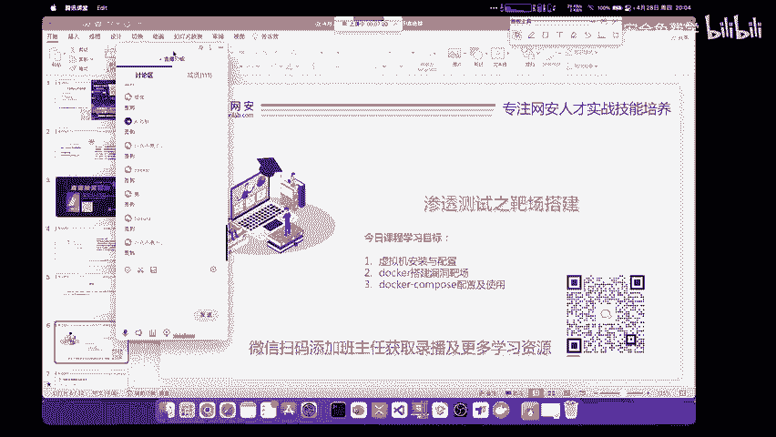

## 本节学习目标

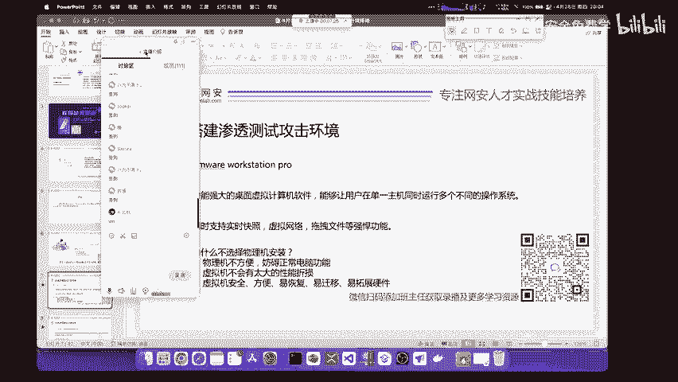

今天主要解决三个学习目标：
1.  讲解虚拟机在渗透测试中应如何配置和使用。
2.  介绍如何下载和安装虚拟机软件。
3.  提供虚拟机软件的激活方法。

## 虚拟机的作用与重要性

相信来听课的同学对虚拟机都有大致了解。虚拟机是在我们自己电脑上虚拟出一个或多个操作系统。

现在虚拟机经常被使用。就像在电脑上安装安卓模拟器玩手游一样。安卓模拟器就是在Windows操作系统上虚拟出一个安卓操作系统。这个虚拟操作系统与宿主机互不影响，并且可以运行相关的安卓应用程序。

我们今天要讲的不是安卓模拟器，而是在计算机上模拟出其他操作系统。例如在IT工作中经常使用的Windows、Linux，甚至苹果的macOS操作系统。

## 虚拟机软件：VMware Workstation Pro

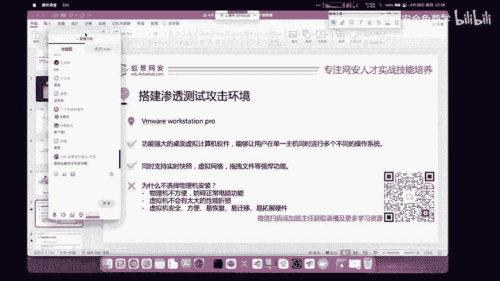

我们今天使用的软件叫做VMware Workstation Pro。这个软件功能非常强大。在VMware里安装虚拟机，性能表现很好，不会有特别多的性能折损。

如果把虚拟机完整配置好，安装了相关驱动，在虚拟机里打游戏都是完全可以的，因为虚拟机也有相关的显卡驱动。虚拟机对于我们正常使用来说非常方便。

## 渗透测试为何需要虚拟机

我们进行渗透测试就必须掌握使用虚拟机搭建靶场环境。原因有两点：
1.  攻击实际网站可能存在法律风险。
2.  攻击实际网站可能不利于学习，因为实际网站可能有各种防御措施，其存在的漏洞可能不符合你的学习流程和需求。

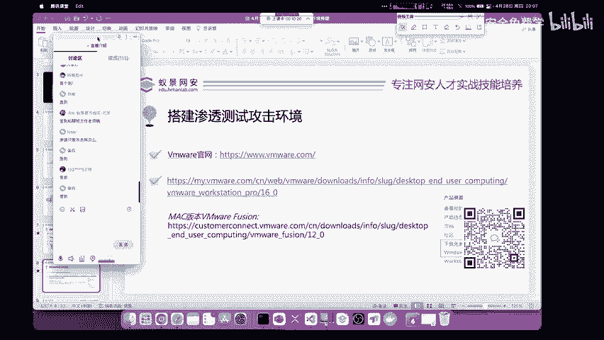

因此，你需要自己搭建一个靶场。就像军队训练士兵，不可能一开始就上战场，而是通过不停地打靶练习来锻炼实战能力。

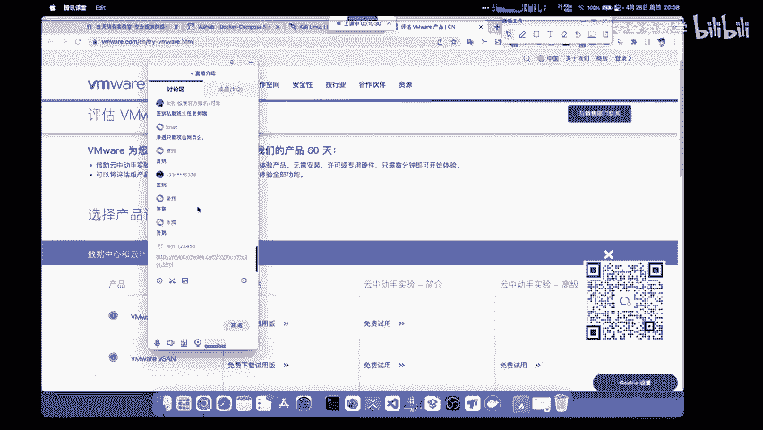

渗透测试的功能不局限于攻击网页。关于渗透测试和攻击网页的区别，在之前的课程中已经讲解过。

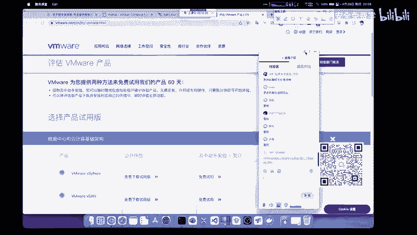

## 如何下载虚拟机软件

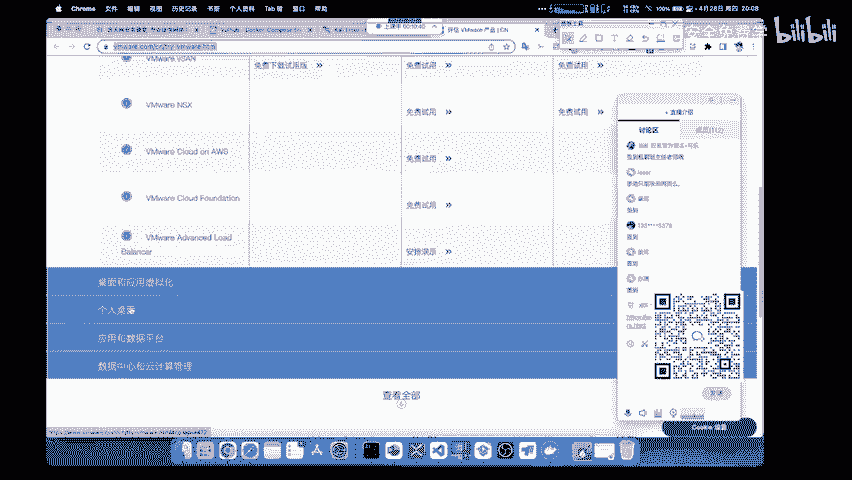

首先，VMware软件应该如何下载？大家下载软件一定要去官方网站下载。

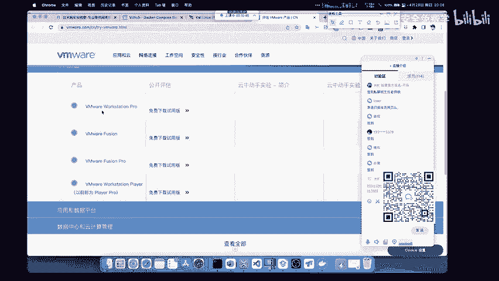

我见过很多同学去网络上的不明下载站下载应用，例如某些下载站或软件应用商店。这样下载软件有几个弊端：
1.  可能下载到盗版软件，其中捆绑了木马、病毒或广告。
2.  下载的软件版本可能太低，无法使用最新最好的功能。

我推荐大家下载任何软件都要去官网。VMware的官网是VMware Workstation网站。我已经将链接发到讨论区，大家可以点开查看。

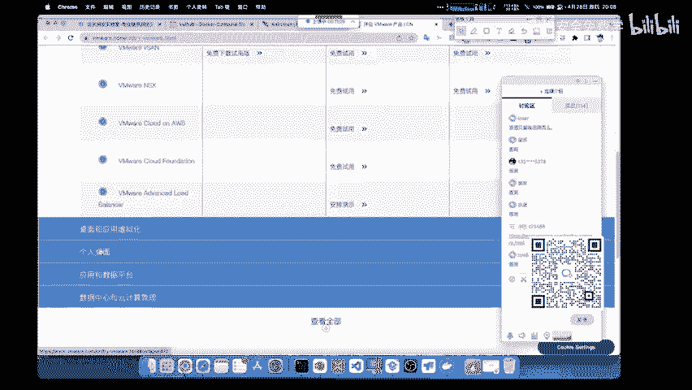

在VMware官方网站中，我们能够找到VMware Workstation的几乎所有产品。我们需要点击“个人桌面”或“个人产品”分类。

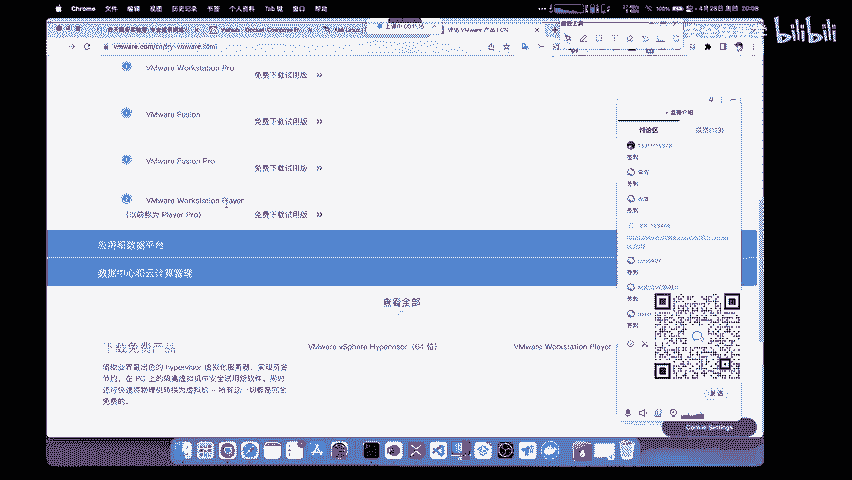

这里有3个主要产品。我们需要的是VMware Workstation Pro。我们可以点击下载免费试用版。

点击下载“VMware Workstation 16 Pro for Windows”操作系统版本，然后点击“Download Now”即可开始下载。

## 安装与激活VMware

安装VMware是非常简单的事情。大家只需要依次点击“下一步”，选择自己的安装路径即可完成安装。既然你能打开学习平台听课，安装VMware对你来说应该不是大问题。

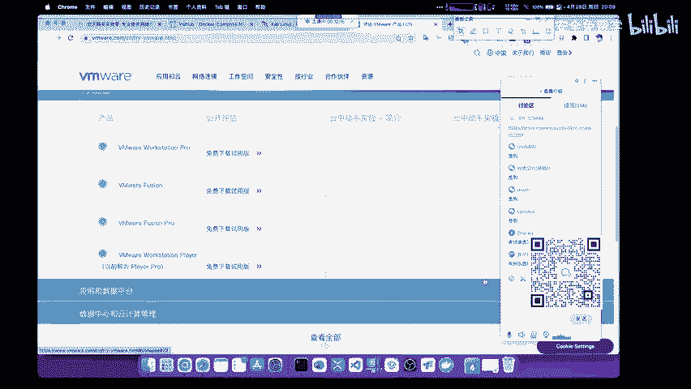

下面介绍另外几个相关软件。首先是VMware Fusion Pro。这个软件是针对macOS操作系统的。不过，Fusion只能支持两年前的英特尔芯片Mac。对于新版本的M1、M2等ARM架构的Mac，已经不能使用VMware Fusion了，需要下载ARM架构专有的虚拟化软件。使用苹果电脑的同学应该很清楚这一点。使用Windows系统的同学下载Windows版本即可。

不过，VMware Workstation Pro并不是一个免费的开源软件，我们需要对它进行激活。激活它的方式与激活Windows操作系统类似。在百度搜索“激活密钥”，可以找到大量可用的密钥，随便选用一个即可。

为了防止大家搜索不到或觉得麻烦，我这里提供三个可用的许可证密钥，大家可以直接复制其中任意一个进行激活。这个操作是非常基础的。

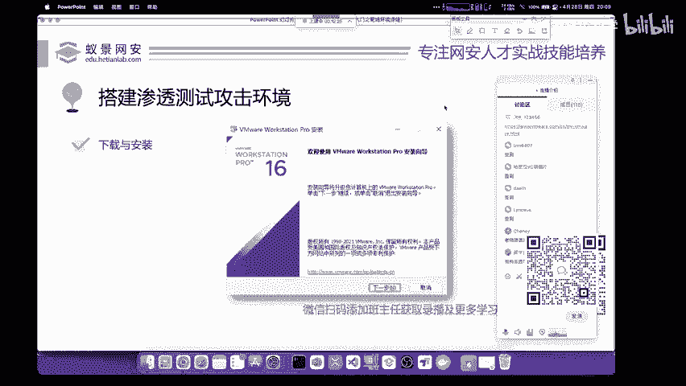

---

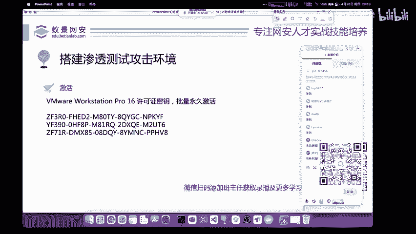

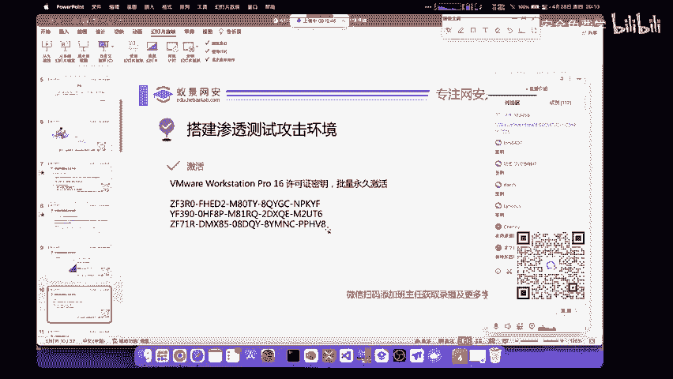

**本节课总结**

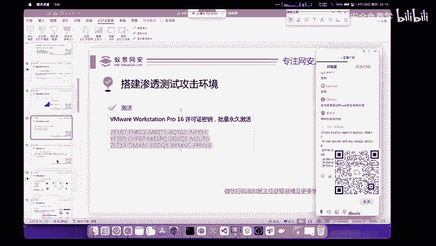

本节课我们一起学习了搭建渗透测试环境的基础知识。我们明确了网络安全与渗透测试的关系，理解了虚拟机在安全学习中的核心作用——即搭建安全的本地靶场。我们详细介绍了如何从官网下载、安装并激活VMware Workstation Pro软件，为后续创建攻击机和靶机虚拟机做好了准备。下一节课，我们将开始学习如何在虚拟机中安装我们的核心渗透测试系统。