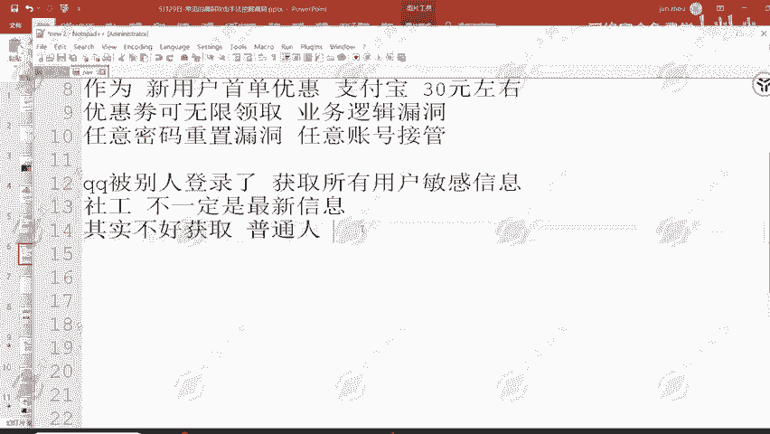
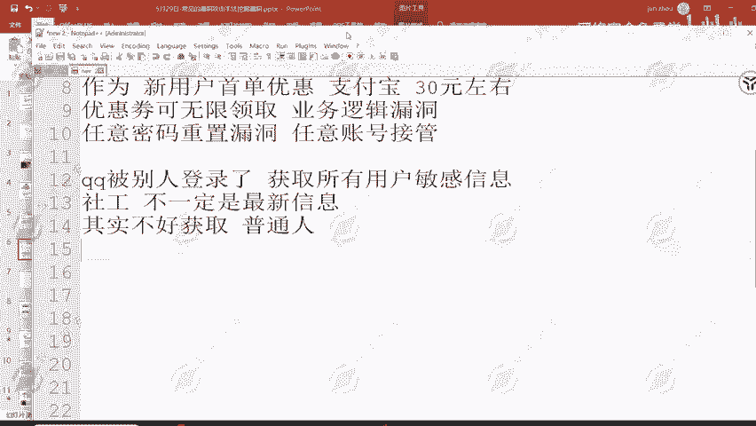

# 网络安全：P80：任意密码重置漏洞举例

在本节课中，我们将通过一个真实案例——美团曾出现的任意密码重置漏洞，来学习逻辑漏洞的原理、危害以及如何从业务设计层面进行防范。我们将剖析漏洞的成因，并理解为什么它对公众人物和普通用户的影响不同。

## 漏洞背景与影响

上一节我们介绍了逻辑漏洞的基本概念，本节中我们来看看一个具体的、影响广泛的实例。

2019年，公众人物王思聪的微博账号被盗，其关联的美团账户也受到影响。攻击者获取了他在美团上的敏感信息，包括地址、住过的酒店、购买过的优惠券及消费记录。

这个安全事件的根源，是美团当时存在的“任意密码重置”逻辑漏洞。

## 漏洞原理分析

那么，为什么会出现这样的问题呢？其核心在于账户安全验证逻辑存在缺陷。

根据当时“疯凰科技网”发布的文章分析，美团当时存在一个功能：只要能够提供用户的**手机号**和**生日**，就可以换绑该账户的手机号，从而间接控制账户。





以下是该漏洞的简单逻辑表述：
```
漏洞触发条件：已知目标用户的手机号 + 生日
漏洞操作：通过“找回账户/换绑手机”功能，输入以上信息
漏洞结果：成功将账户绑定手机更换为攻击者控制的手机号，从而接管账户
```

## 信息获取的难易度

现在我们来思考一下，获取他人的手机号和生日是否容易？

对于**普通人**而言，这两项信息同时被准确获取的难度较高。虽然存在“社工库”（社会工程学数据库）可能泄露部分信息，但信息可能过时，且通常需要已知姓名、身份证号等前置条件才能精准查询。全国重名者众多，精准定位某一个“张三”的信息并不容易。

然而，对于**公众人物**（如明星、网红）则完全不同。他们的生日通常是公开信息。例如，搜索“王思聪 百度百科”，即可直接获得其出生日期（1988年1月3日）。同时，历史上其他平台的漏洞（如当时微博的漏洞可能导致用户手机号泄露）可能让攻击者获取其手机号。两者结合，就满足了漏洞的利用条件。

因此，这个漏洞对普通用户威胁有限，但对公众人物危害极大。这也是该漏洞在影响王思聪之后才被美团高度重视并紧急修复的原因。


## 业务逻辑设计缺陷

这个功能本身的设计初衷是正常的：为了帮助**更换了手机号的用户**找回自己的账号。在互联网时代，这是一个合理的用户需求。

问题出在验证“是否为本人操作”的逻辑上。美团当时采用的验证方式是：
**验证因子 = 生日 + 手机号**

这种验证方式的强度不足，尤其是当攻击目标的信息易于获取时。它未能充分考虑不同用户群体（如公众人物）信息暴露程度的差异。


相比之下，腾讯（QQ/微信）的账号找回验证逻辑就更严谨。它会通过多维度信息来综合判断是否为本人操作，例如：
*   识别常用登录设备
*   验证历史好友关系
*   确认曾绑定的其他安全信息

这种方式能更有效地确认操作者身份，从而避免了类似的逻辑漏洞。

## 总结与启示


本节课我们一起学习了美团“任意密码重置”逻辑漏洞的案例。我们了解到：

1.  **漏洞本质**：业务逻辑设计缺陷，将“生日+手机号”这种低强度信息组合作为账户所有权验证的唯一凭证。
2.  **影响差异**：逻辑漏洞的危害性常因用户身份而异。对信息高度公开的公众人物，低强度验证的危害会被放大。
3.  **设计原则**：核心安全原则是确保“操作者为账户本人”。应设计多因素、多维度的验证机制，而不仅仅依赖一两种可能被公开或泄露的信息。
4.  **普遍性**：即使是美团这样的大型公司，在其核心业务上也可能出现逻辑漏洞。对于安全测试人员而言，中小型或业务逻辑复杂的系统，可能存在更多未被发现的类似问题。

这个案例提醒我们，在安全测试中，除了关注技术漏洞（如SQL注入、XSS），更需要深入理解业务逻辑，从攻击者的角度思考如何滥用正常功能，从而发现潜在的逻辑漏洞。