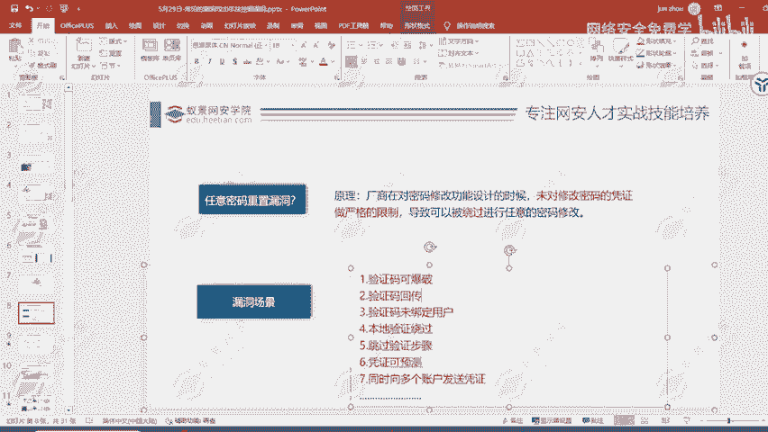
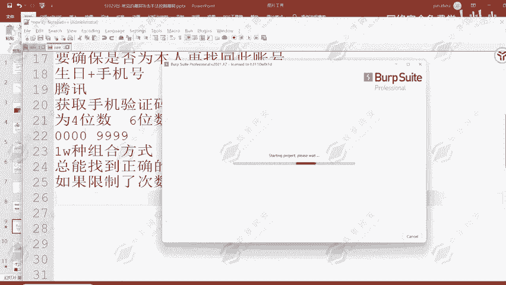

# 网络安全：P81：任意用户密码重置漏洞详解

在本节课中，我们将要学习一种常见的Web安全漏洞——任意用户密码重置。我们将深入探讨其原理、典型场景以及挖掘方法，并通过具体案例帮助初学者理解。

## 概述

任意密码重置漏洞并不常见，通常只在特定的业务逻辑中存在。其核心原理在于，厂商在设计密码修改功能时，未对修改密码所需的凭证（如验证码）进行严格的校验或次数限制，导致攻击者可以绕过正常流程，非法修改任意用户的密码。

## 漏洞原理与场景

上一节我们介绍了漏洞的基本概念，本节中我们来看看具体的漏洞场景。漏洞场景非常多，无法逐一详细讲解，但很多是大家日常可能遇到过的。

以下是几种常见的漏洞场景及其原理分析。

### 场景一：四位验证码可爆破

我们在使用网站注册或找回密码时，常需要通过手机验证码进行身份验证。如果系统发送的验证码仅为4位数字，就可能存在风险。

**原理分析**：
4位验证码的范围是从`0000`到`9999`，总共只有1万种组合。如果服务端没有对验证码的尝试次数进行限制，攻击者就可以通过自动化工具（如Burp Suite的Intruder模块）快速枚举（爆破）所有可能的组合。理论上，在短时间内即可找到正确的验证码。

**漏洞利用条件**：
1.  验证码为4位数字。
2.  服务端未对验证码的错误尝试次数进行限制。
3.  验证码的有效期足够长，以完成爆破过程。

**修复方法**：
1.  使用6位或更长的验证码，增加爆破难度（组合数达到100万种）。
2.  严格限制单位时间内验证码的错误尝试次数（例如，最多允许错误输入5次）。
3.  确保验证码具有合理的较短有效期。

---

### 场景二：六位验证码的潜在风险

即使使用6位验证码，在某些特定条件下也可能存在风险。

**原理分析**：
6位验证码的组合数为100万种（`000000` 到 `999999`）。如果验证码**永不过期**，且服务端**完全没有尝试次数限制**，攻击者理论上仍有可能通过长时间爆破（例如，持续请求数小时）来命中正确的验证码。

**关键点**：
漏洞是否成立，取决于“验证码有效期”与“完成爆破所需时间”的对比。如果有效期远长于爆破所需时间，则风险依然存在。

---

### 工具辅助：Burp Suite 爆破演示

在上述场景中，我们提到了使用工具进行爆破。这里简要介绍如何利用Burp Suite的Intruder模块实现。

**操作简述**：
1.  拦截发送验证码或提交验证码的HTTP请求。
2.  将请求发送到Burp Suite的Intruder模块。
3.  将验证码参数（如 `code=1234`）设置为攻击载荷（Payload）位置。
4.  配置Payload类型为数字，并设置从`0000`到`9999`的范围。
5.  开始攻击，观察返回包长度或内容的不同，以识别正确的验证码。

**代码/公式示意**：
爆破的本质是遍历所有可能性。对于4位数字验证码，其搜索空间S可以表示为：
**S = {x | x ∈ Z, 0 ≤ x ≤ 9999}**
攻击就是依次尝试集合S中的每一个元素。

---

### 关于漏洞挖掘的补充说明

在挖掘此类漏洞（尤其是针对SRC-安全应急响应中心）时，授权测试是关键。获得授权后，可以合法地进行安全测试，包括尝试爆破验证码等操作，无需过度担心被拦截或追究责任。发现漏洞后应及时提交给厂商。

## 总结

本节课中我们一起学习了任意用户密码重置漏洞。
1.  我们理解了其核心原理：**服务端对密码重置凭证的校验逻辑存在缺陷**。
2.  我们分析了两种典型场景：**四位验证码可被快速爆破** 以及 **六位验证码在无限制条件下仍存在理论风险**。
3.  我们了解了利用 **Burp Suite** 等工具进行自动化测试的基本思路。
4.  我们明确了修复方向：**增加验证码长度、严格限制尝试次数、设置合理有效期**。

对于初学者而言，在遇到密码重置功能时，可以首先观察验证码的长度，并尝试触发几次错误，测试系统是否有次数限制，这是挖掘此类漏洞的起点。