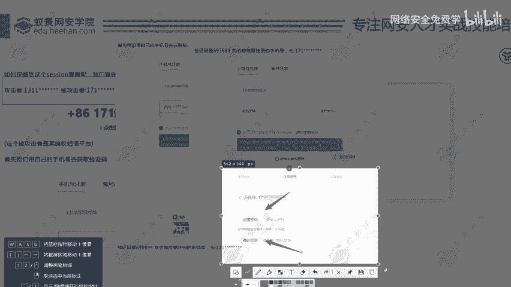

# 网络安全入门：P83：验证凭证未绑定用户漏洞详解

在本节课中，我们将学习一种在Web应用程序中常见的逻辑漏洞——“验证凭证未绑定用户”。这种漏洞危害性高，且在实际业务中（如金融、证券类应用）时有发生。我们将通过一个模拟案例，深入浅出地理解其原理、发现过程及危害。

## 漏洞概述与背景

上一节我们介绍了其他类型的逻辑缺陷，本节中我们来看看“验证凭证未绑定用户”问题。该漏洞的核心在于，系统在验证用户身份（如注册、重置密码）时，发放的验证凭证（如短信验证码、Token）没有与发起请求的特定用户账号进行强绑定。

笔者曾在某证券基金站点的核心业务APP中发现此漏洞，这说明了该问题在重要业务系统中出现的可能性，其危害不容小觑。

## 漏洞原理与复现演示

为了理解这个漏洞，我们模拟一个用户注册场景。关键在于，系统错误地允许将一个账号获取到的验证凭证，用于另一个账号的操作。

以下是漏洞复现的核心步骤：

1.  **准备前置条件**：我们需要两个手机号（例如131xxxx和171xxxx），这是测试此类漏洞的基础设施。

2.  **正常获取凭证**：使用第一个手机号（131）请求注册，并获取短信验证码。假设收到的验证码是 `695994`。此时，系统在后台生成了一个对应于131账号的临时凭证（即验证码 `695994`）。


3.  **关键攻击步骤**：在提交验证码的环节进行抓包拦截。将数据包中要注册的手机号参数从 `131` 修改为第二个手机号 `171`，而填写的验证码依然是 `695994`（即131号收到的凭证）。



4.  **漏洞触发**：提交修改后的数据包。有漏洞的系统仅校验验证码 `695994` 是否正确，却没有校验这个验证码是否属于正在尝试注册的 `171` 手机号。因此，系统错误地允许为 `171` 手机号设置密码，从而成功注册了本不属于你的账号。

**核心逻辑缺陷的伪代码表示**：
```python
# 有漏洞的验证逻辑
def verify_and_register(phone_number, verification_code):
    if verification_code == get_stored_code(): # 只检查验证码是否正确
        create_user(phone_number) # 未检查验证码与phone_number的绑定关系
        return “注册成功”
    else:
        return “验证码错误”

# 正确的验证逻辑应包含绑定检查
def verify_and_register_secure(phone_number, verification_code):
    stored_code = get_stored_code_for_phone(phone_number) # 根据手机号获取对应的验证码
    if verification_code == stored_code:
        create_user(phone_number)
        return “注册成功”
    else:
        return “验证码错误或手机号不匹配”
```

## 漏洞的变体与扩展

验证凭证不限于短信验证码，也可能是其他形式的Token。其攻击原理完全一致。

例如，在某些业务流程中：
1.  用户输入手机号和验证码后，服务端校验通过，会返回一个**会话Token**作为下一步（如设置密码）的凭证。
2.  攻击者用自己的账号获取到这个有效的Token。
3.  攻击者拦截另一个账号（如1888）的“设置密码”请求，将请求中的Token替换为自己获取到的有效Token。
4.  系统仅验证Token有效性，未验证Token与目标账号（1888）的归属关系，导致攻击者成功为他人账号设置密码，完成账户劫持。

**公式化描述漏洞条件**：
`验证通过` = `验证凭证有效` **且** `凭证未与目标用户绑定`
攻击者利用的正是后半部分条件的缺失。

## 漏洞危害与总结

本节课中我们一起学习了“验证凭证未绑定用户”漏洞。这是一个典型的**业务逻辑漏洞**和**越权访问**问题。

其危害等级通常为**高危**，因为它允许攻击者：
*   **任意账户注册**：占用他人手机号注册账号，可能用于诈骗、垃圾注册。
*   **账户劫持**：在密码重置等功能中，可接管任意用户账户。
*   **造成业务损失与数据泄露**：特别是在金融、证券类应用中，直接威胁用户资产与隐私安全。


发现此漏洞的关键在于测试时**尝试“张冠李戴”**，即思考是否能把A环节获取的凭证，用在B用户或B操作上。保持这种质疑和测试思维，是挖掘逻辑漏洞的核心能力。