# 网络安全：P85：同时向多个账户发送凭证漏洞详解

## 概述
在本节课中，我们将学习一种名为“同时向多个账户发送凭证”的漏洞。这种漏洞通常出现在网站的密码找回或验证码发送功能中。我们将详细解释其原理、利用方法、潜在危害以及相关的漏洞赏金信息。

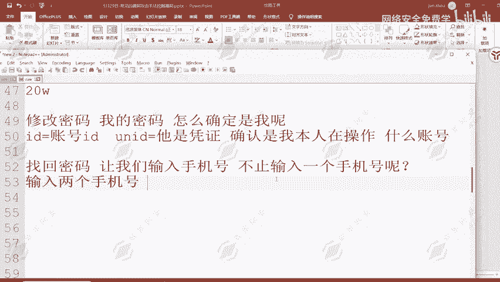

## 漏洞原理与场景
上一节我们介绍了漏洞挖掘的基本概念，本节中我们来看看这个具体的漏洞是如何工作的。

该漏洞的核心场景是网站的“找回密码”功能。通常，该功能要求用户输入手机号以获取验证码，从而修改账户密码。

**漏洞原理**在于，当应用程序在处理发送验证码的请求时，没有对接收方（如手机号）的数量进行严格校验。攻击者可以通过抓包工具拦截请求，修改其中的手机号字段，添加多个手机号。如果后端服务器未经验证就向所有提供的手机号发送验证码，漏洞便产生了。

更关键的是，有时所有手机号收到的验证码可能是**同一个**。这就意味着，攻击者可以用自己的手机号，同时接收到目标账户（如管理员）的验证码。

## 漏洞利用步骤
以下是利用此漏洞的典型步骤：

1.  **定位功能点**：找到目标网站或应用的密码找回、手机验证码登录或修改绑定手机等功能。
2.  **正常操作并抓包**：在输入框中填写自己的手机号，点击“发送验证码”，同时使用抓包工具（如Burp Suite）拦截该HTTP请求。
3.  **修改请求包**：在拦截到的请求数据包中，找到标识手机号的参数（例如 `phone`、`mobile`）。将参数值修改为包含多个手机号的格式，例如：
    ```json
    {"phone": "13800138000,13900139000"}
    ```
    或通过数组形式：
    ```json
    {"phones": ["13800138000", "13900139000"]}
    ```
4.  **转发请求**：将修改后的数据包发送给服务器。
5.  **观察结果**：检查自己的手机是否收到了多条验证码短信。如果成功，则证明漏洞存在。尝试使用收到的验证码（特别是非自己手机号对应的那个）去登录或重置目标账户。


## 漏洞危害与影响
这个漏洞的危害可大可小。

*   **危害大**：攻击者可以借此接管任意用户账户，包括高权限的管理员、企业老板账号，导致敏感信息泄露、业务数据被篡改等严重后果。
*   **影响“小”**：从某些厂商的角度看，该漏洞直接影响的是用户信息安全，而非厂商自身的核心系统，因此他们评估的威胁等级和愿意支付的赏金可能相对较低。

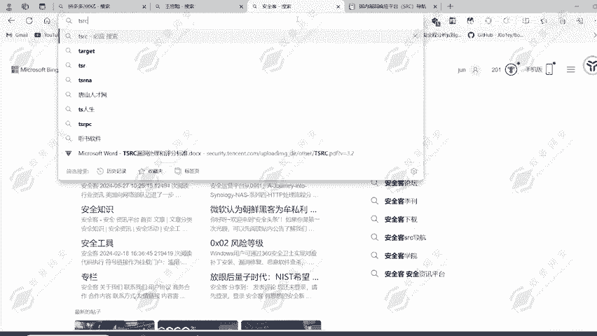

## 漏洞赏金参考
挖到此类漏洞后，可以向厂商的“安全应急响应中心”（SRC）提交以获取奖金。奖金数额差异很大，主要取决于厂商的规模和漏洞评级。

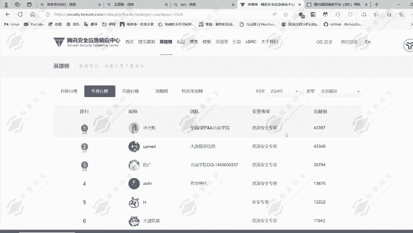

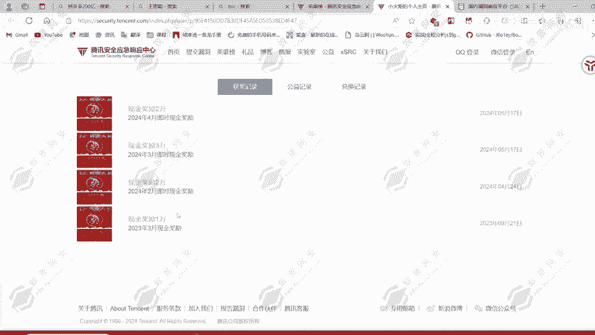

以下是国内主流厂商对此类高危漏洞的典型赏金范围：

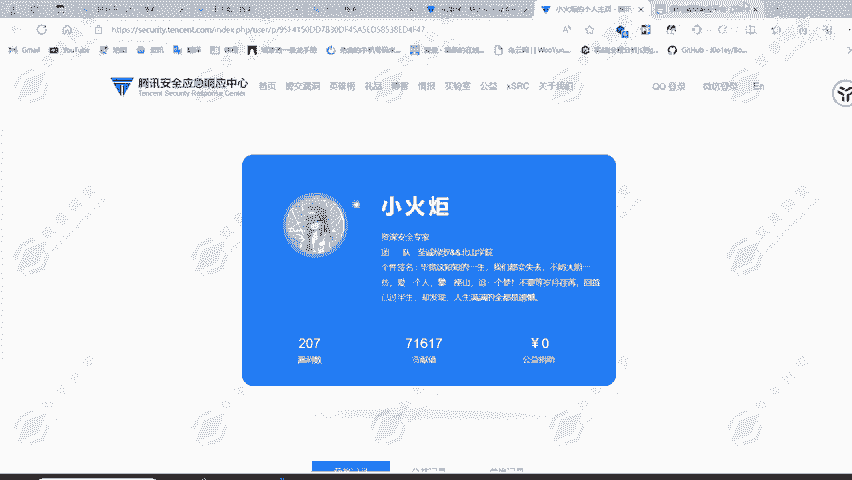

*   **大型厂商**（如字节跳动、腾讯、阿里）：赏金可能高达数万元甚至十万元以上。
*   **一般主流厂商**（如360、小米、VIVO、平安、顺丰等）：赏金范围通常在 **2000元至10000元** 人民币之间。例如，有案例显示在平安SRC提交类似漏洞获得了4500元赏金。
*   **少数厂商**：赏金可能低于2000元，但一个被评定为“高危”的漏洞，赏金通常不会低于1000元。

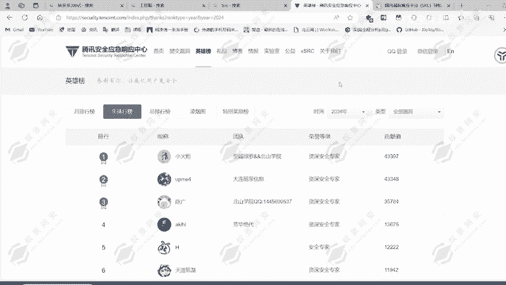

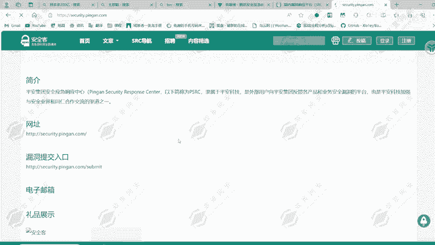

漏洞挖掘的收入潜力可以很高。例如，有安全研究员在腾讯SRC持续挖掘，五个月内累计获得了约40万元的奖金和激励。


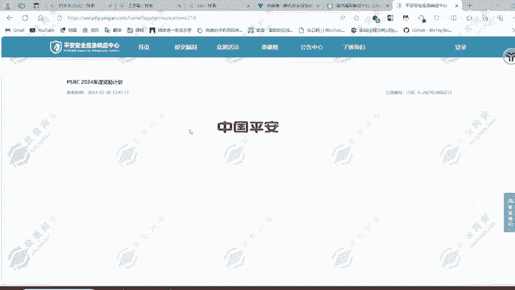

## 总结
本节课中我们一起学习了“同时向多个账户发送凭证”漏洞。

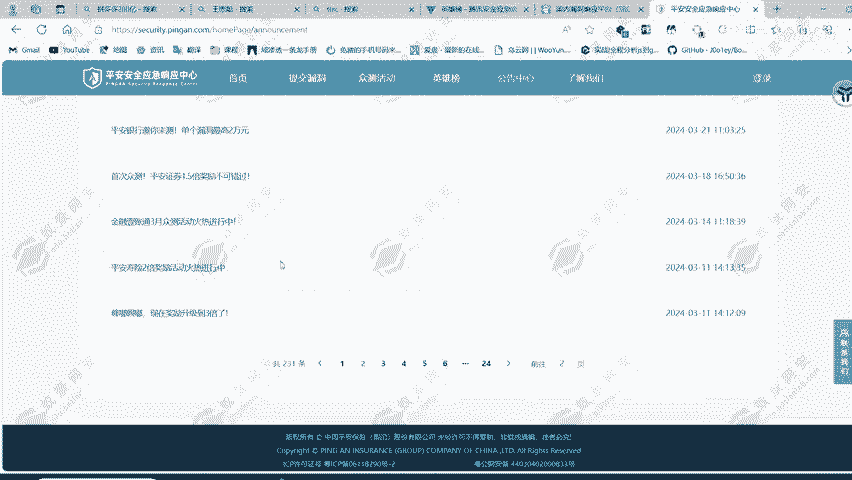

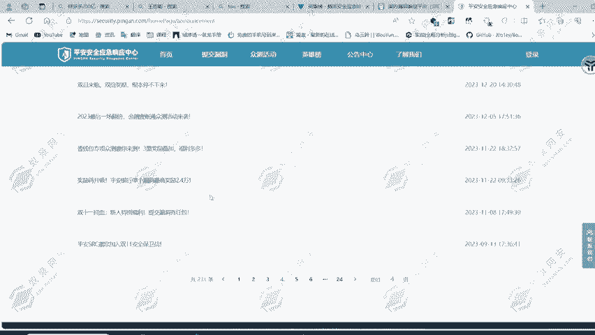

我们了解了其原理是服务器未校验验证码请求中的接收方数量，导致可被篡改并批量发送。我们掌握了通过抓包修改参数来测试该漏洞的步骤。最后，我们也认识了该漏洞的危害性以及它在漏洞赏金平台中的价值定位。

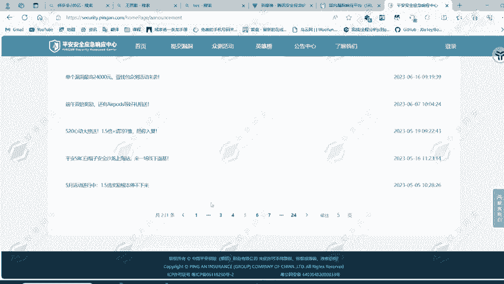

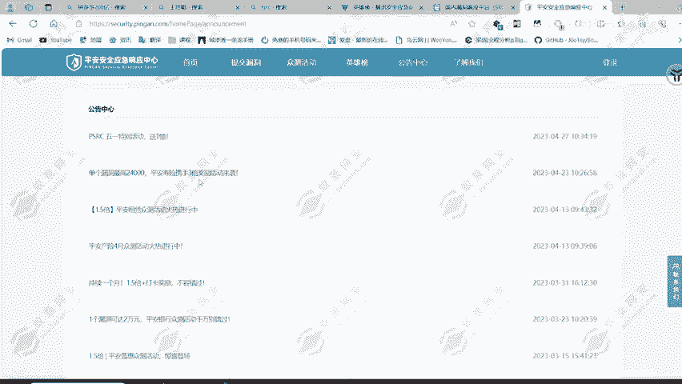

对于安全测试人员而言，理解并掌握此类逻辑漏洞的挖掘方法，是提升实战能力和获取收益的重要途径。