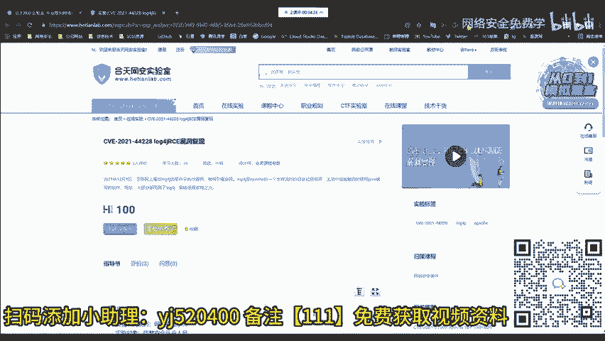
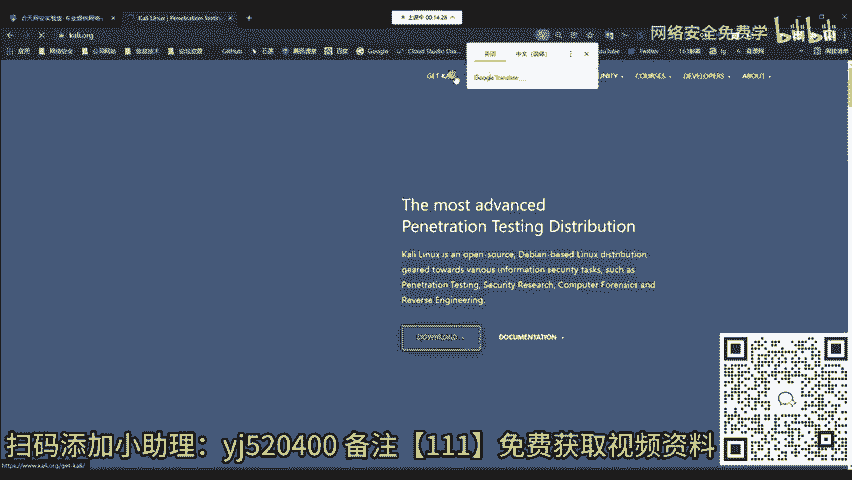
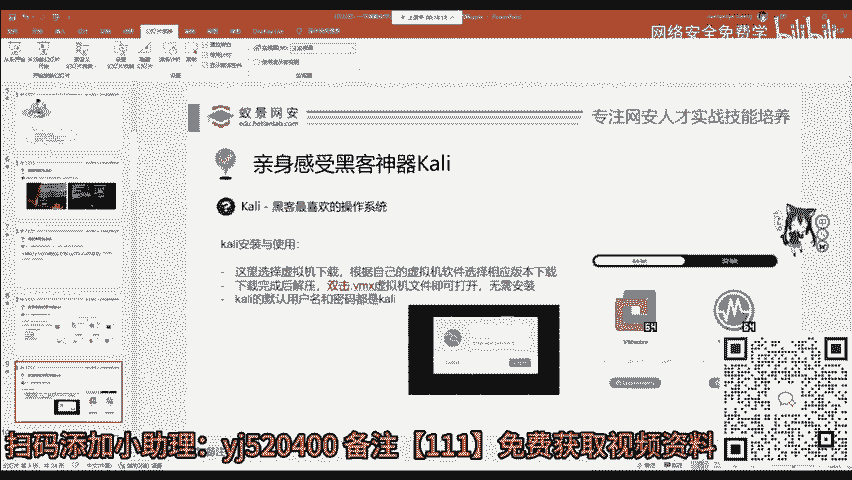
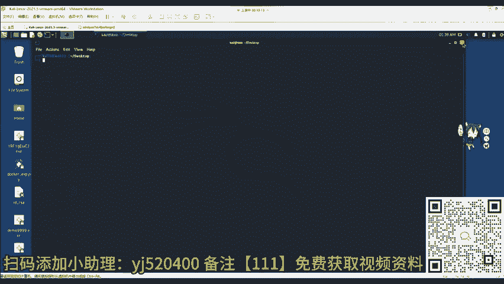
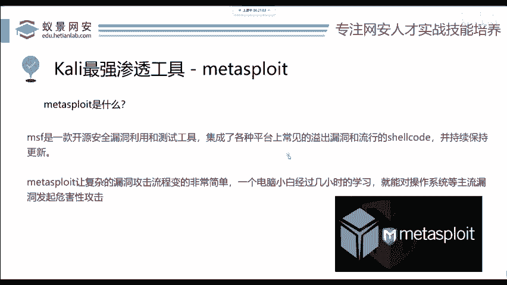

# 网络安全入门：P86：揭秘黑客攻击机

在本节课中，我们将学习如何配置一个基础的渗透测试环境，即“攻击机”。我们将以 Kali Linux 操作系统为例，介绍其版本选择、快速安装方法，并初步了解其核心工具。

## 配置攻击机环境 🛠️

攻击机环境通常使用一个名为 **Kali Linux** 的操作系统。下面将讲解 Kali Linux 的版本以及如何快速安装。

首先，访问 Kali Linux 的官方网站：`https://www.kali.org`。

在网站上点击“Get Kali”以获取 Kali。可以看到，Kali 为不同平台提供了多种操作系统版本。

以下是主要的版本类型：

*   **ARM 架构**：适用于手机、移动设备或基于 M1 CPU 的 MacBook Pro 等设备。
*   **虚拟机版本**：这是我们今天要使用的版本。它无需安装，官方已预先配置好，下载后即可使用。
*   **移动端**：可安装在手机上。但请注意，华为、小米、OPPO 等品牌手机通常无法解锁并刷入第三方系统。如需测试，可选择一加、谷歌 Pixel 或三星等手机。
*   **其他版本**：还包括针对云服务、容器、U盘启动盘以及 Windows 的 Linux 子系统版本。

对于新手而言，最友好的方式是使用虚拟机版本。它主要支持两种虚拟机软件：VMware 和 VirtualBox。

如果你使用 VMware，请直接点击对应链接下载。下载完成后，你将得到一个约 2.4GB 的压缩包。解压后，会看到一个后缀为 `.vmx` 的虚拟机文件。

**重要前提**：在打开 Kali 虚拟机之前，请确保你的电脑上已安装 VMware 软件。其安装过程与普通软件无异，若不清楚可搜索相关教程。

双击 `.vmx` 文件，即可将 Kali 虚拟机导入 VMware 并启动。启动后，你将看到登录界面。

最新版 Kali 的默认用户名和密码均为：`kali`。

输入凭据登录后，你将进入 Kali 的图形化桌面环境。

## 初识 Kali Linux 界面 🖥️

Kali Linux 提供了图形化界面，操作方式与常见操作系统类似。同时，作为 Linux 发行版，命令行终端是其核心操作方式。

打开命令行终端有两种方法：
1.  点击屏幕左上角的下拉菜单，选择第六个选项 “Terminal”。
2.  在桌面空白处右键，选择 “Open Terminal Here”。

Kali 集成了 300 多个安全工具，涵盖渗透测试的各个阶段。你可以在 “Applications” 菜单中查看这些工具。

对于初学者，无需尝试学习所有工具。高效的方法是：**用到什么，再学什么**。关键在于理解漏洞原理和工具的开发思路，做到举一反三。

如果你需要查询某个工具的具体用法，Kali 提供了官方工具文档网站：`https://www.kali.org/tools/`。

## 核心工具：Metasploit Framework (MSF) ⚔️

上一节我们介绍了 Kali 的界面和工具集，本节中我们来看看一个至关重要的核心工具。

在渗透测试领域，**Metasploit Framework** 是一个你必须熟练掌握的工具，它简称为 **MSF**。无论是面试渗透测试岗位还是安全服务岗位，精通 MSF 通常都是一项基本要求。

Metasploit 是一个开源的渗透测试框架，它集成了大量漏洞利用模块、辅助模块和攻击载荷，为安全专业人员提供了一个强大的漏洞验证与攻击模拟平台。

**本节课中我们一起学习了**：如何选择并安装 Kali Linux 虚拟机版本，初步熟悉了 Kali 的图形界面与命令行终端，并了解了其庞大的工具集及高效的学习方法。最后，我们认识了渗透测试的核心框架工具——Metasploit。在后续课程中，我们将深入探索这些工具的具体应用。