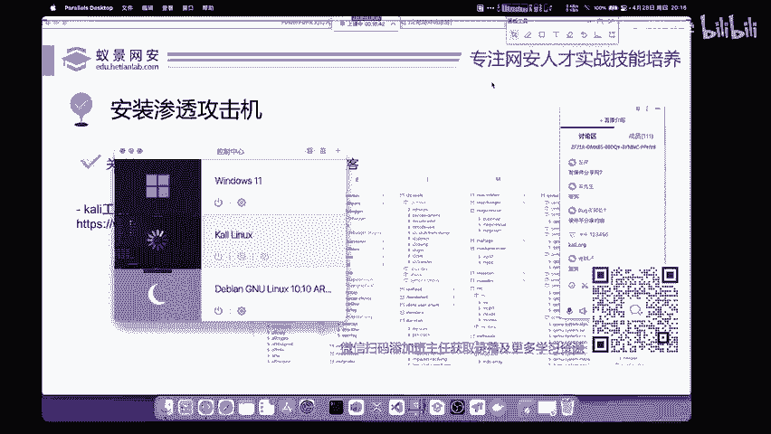
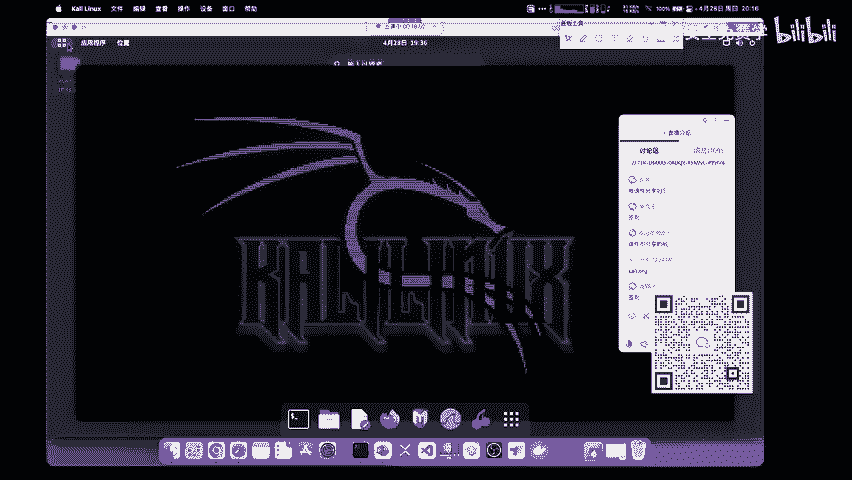
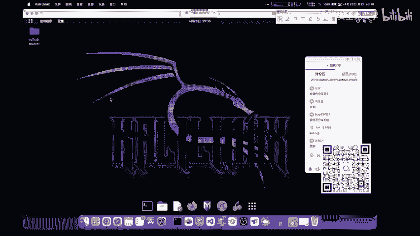
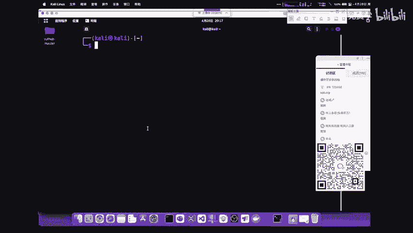

# 网络安全入门：P8：安装渗透攻击机

在本节课中，我们将学习如何安装渗透测试的核心工具——Kali Linux虚拟机。这是成为安全研究者的第一步，你将拥有一个集成了几乎所有必要工具的专用操作系统。

上一节我们介绍了虚拟机软件VMware Workstation Pro的安装，本节中我们来看看如何获取并导入Kali Linux虚拟机镜像。

## 获取Kali Linux虚拟机镜像

Kali Linux是一个基于Linux的操作系统，它预装了大量的渗透测试和安全审计工具。对于初学者而言，直接使用官方提供的虚拟机镜像是最便捷的方式。

以下是下载Kali Linux虚拟机镜像的步骤：

1.  **访问官方网站**：打开浏览器，访问Kali Linux的官方网站：`https://www.kali.org`。
2.  **进入下载页面**：在网站左上角找到并点击“Get Kali”按钮，进入下载页面。
3.  **选择虚拟机版本**：在下载页面中，找到“Virtual Machines”选项并点击。
4.  **选择虚拟机平台**：你将看到两个虚拟机软件的图标。根据上一节的安装，我们选择“VMware”版本。
5.  **下载镜像**：点击“VMware 64-Bit”下方的下载链接，将得到一个压缩包文件（例如 `.7z` 或 `.zip` 格式）。

## 导入并启动Kali Linux

下载完成后，你无需像安装普通系统一样进行复杂的配置。Kali Linux官方镜像已经预配置好，可以直接导入使用。

以下是导入并启动虚拟机的步骤：

1.  **解压文件**：将下载好的压缩包解压到一个你容易找到的文件夹中。
2.  **找到配置文件**：在解压后的文件夹里，找到一个后缀名为 **`.vmx`** 的文件。这是VMware虚拟机的配置文件。
3.  **导入虚拟机**：双击这个 **`.vmx`** 文件。VMware Workstation Pro会自动启动并将该虚拟机导入到你的虚拟机库中。
4.  **启动Kali Linux**：在VMware的库中选中新导入的Kali Linux虚拟机，点击“开启此虚拟机”。

> **关于虚拟机配置**：默认导入的虚拟机配置（如2GB内存）已足够日常学习和大多数渗透测试练习使用。无需在初期过度调整资源分配。

## 初识Kali Linux环境

虚拟机启动后，你将看到Kali Linux的桌面环境。它的界面可能与常见的Windows不同，但核心操作将在“终端”中进行。

*   **默认用户名**：`kali`
*   **默认密码**：`kali`

登录系统后，你可以通过点击桌面上的终端图标或使用快捷键 `Ctrl + Alt + T` 来打开终端（Terminal）。在Linux中，命令行是高效操作的核心，后续大部分工具的使用和学习都将在这里进行。

## 如何开始学习使用工具

Kali Linux内置了数百个安全工具，初学者无需感到 overwhelmed（不知所措）。有效的学习方法是跟随一个清晰的路径。

以下是给初学者的学习建议：

1.  **跟随实战流程学习**：最好的方式是结合具体的渗透测试流程或靶场练习来学习。当你在实践某个步骤（例如信息收集、漏洞扫描）时，再去学习和使用该步骤所需的特定工具。
2.  **理解渗透测试方法论**：掌握一个完整的渗透测试流程（如PTES渗透测试执行标准）的思路，比孤立地记忆工具命令更重要。这能帮助你在面对新目标时知道该从何入手。
3.  **靶场练习**：在安全的实验环境（如DVWA、Metasploitable等靶场）中反复练习，是巩固知识和工具使用的最佳途径。

本节课中我们一起学习了如何获取并导入Kali Linux虚拟机镜像，完成了渗透测试实验环境的搭建。我们了解到，直接使用官方预制的镜像可以省去复杂的安装步骤，并且默认配置已能满足学习需求。同时，我们确立了“在实战流程中学习工具”的核心学习思路。从下一节开始，我们将利用这个准备好的环境，正式踏上网络安全实战探索之旅。