# 网络安全入门：P91：网站的暴力破解 🔓

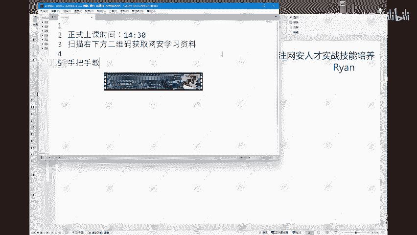

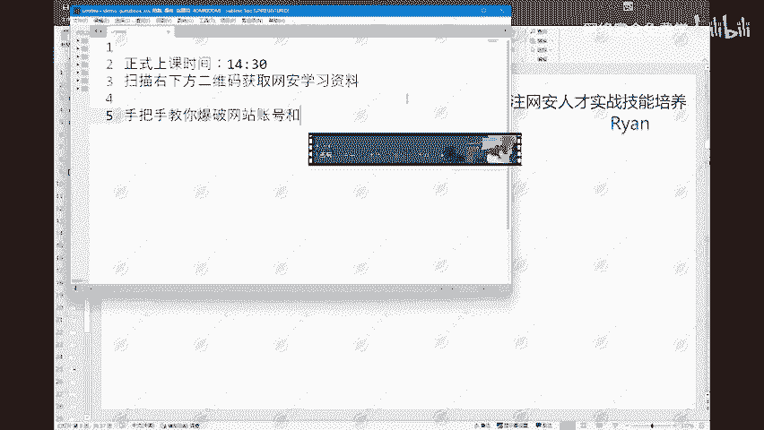

在本节课中，我们将要学习网络安全中一个基础且重要的概念——暴力破解。我们将了解其定义、目的、网站权限划分，以及进行暴力破解前需要做的准备工作。

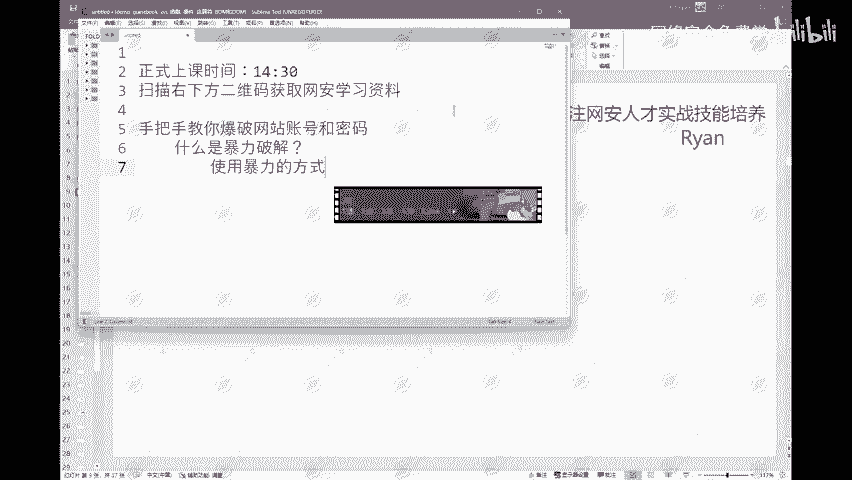

## 什么是暴力破解？🤔

上一节我们介绍了课程主题，本节中我们来看看暴力破解的核心概念。

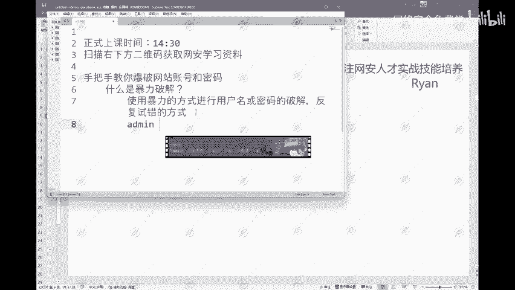

暴力破解是指使用**暴力方式**进行**用户名**或**密码**的破解。其核心原理是通过**反复试错**的方式来尝试破解用户名或密码。

这个“反复试错”的过程非常容易理解。例如，当我们面对一个网站的登录页面却不知道其用户名和密码时，可以尝试使用网络上现成的密码字典。我们会逐个尝试字典中的条目，例如 `admin`、`root`、`password` 等常见弱口令。第一个不行就试第二个，第二个不行就试第三个，直到尝试成功为止。这个过程就是反复试错。

如果仅依靠人工手动尝试，这个过程将耗费大量时间。因此，后续我们会介绍使用工具来快速自动化地进行暴力破解。

## 为什么要进行暴力破解？🎯

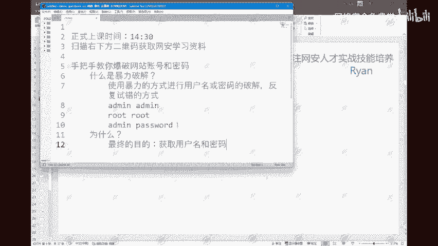

了解了暴力破解是什么之后，我们来看看它的目的和意义。

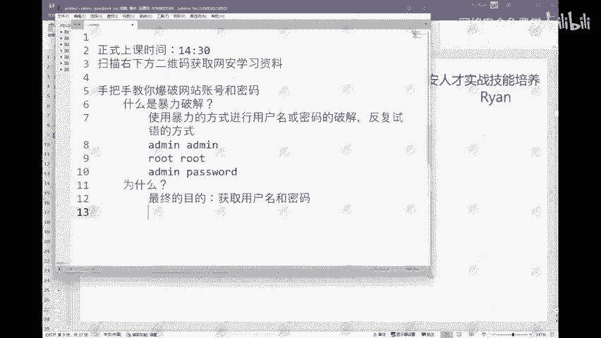

进行暴力破解的**最终目的**是**获取用户名和密码**。当然，获取网站凭据的方式不止暴力破解一种，还包括通过SQL注入漏洞获取数据库信息、数据监听、钓鱼网站、键盘记录等多种方式。

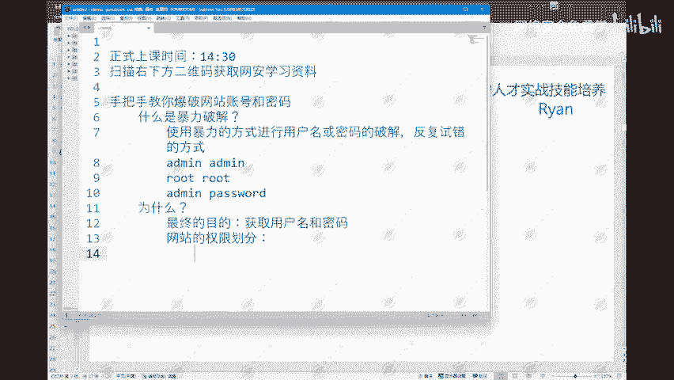

成功获取用户名和密码后，我们需要理解网站的权限划分。以下是目前主流的网站权限层级：

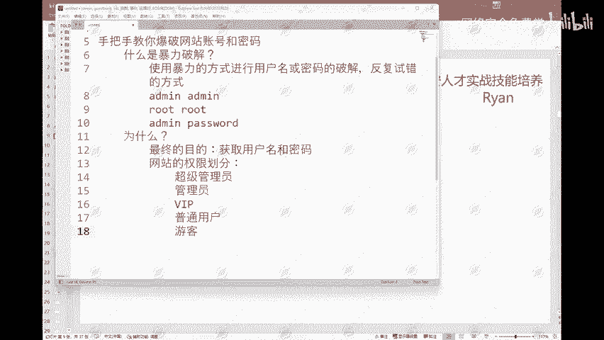

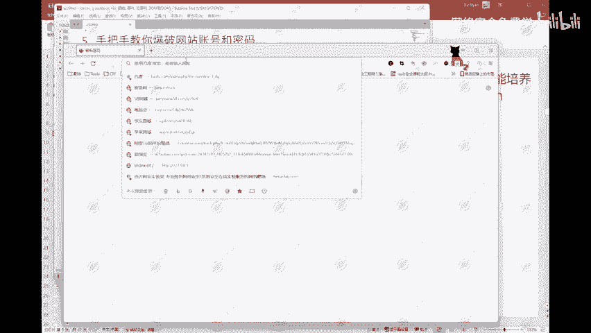

*   **超级管理员**
*   **普通管理员**
*   **VIP用户**
*   **普通用户**
*   **游客**

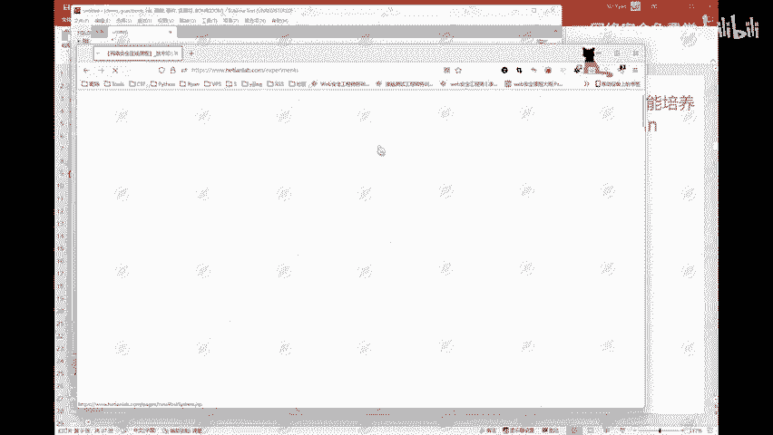

不同的权限对应着不同的功能。例如，游客可能只能浏览公开内容；普通用户可以访问基础功能；VIP用户能使用专属服务；管理员可以管理内容和用户；超级管理员则拥有最高控制权。

如果我们通过暴力破解获取的只是一个**普通用户**的权限，在安全测试（如SRC漏洞挖掘）中，我们可能会进一步寻找**逻辑漏洞**，尝试进行**越权**操作。

*   **水平越权**：指相同权限等级的用户之间的越权。例如，用户A越权操作用户B的数据。
*   **垂直越权**：指低权限用户越权获得高权限用户的功能。例如，普通用户越权获得了管理员的操作权限。

通过发现越权漏洞，可以实现类似“提权”的效果，将普通用户权限提升至更高等级。

## 暴力破解的准备工作 🛠️

在开始实际操作之前，充分的准备工作至关重要。以下是进行暴力破解前需要准备的核心要素：

1.  **目标信息**：明确要攻击的网站登录接口地址（URL）。
2.  **用户名字典**：一个包含可能用户名的列表文件。例如：`admin`, `root`, `test`, `administrator`。
3.  **密码字典**：一个包含可能密码的列表文件。例如：`123456`, `password`, `admin123`, `qwerty`。
4.  **攻击工具**：用于自动化发起登录请求并尝试字典组合的工具，例如 `Burp Suite Intruder`、`Hydra` 等。
5.  **合法测试授权**：**最重要的一点**，必须在拥有明确书面授权的环境中进行测试，例如在自己的实验环境、授权的渗透测试项目或CTF比赛中。

---

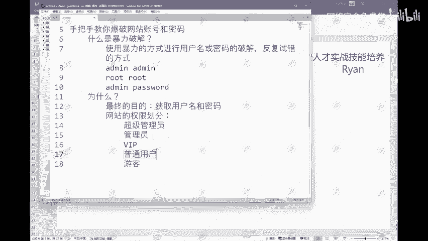

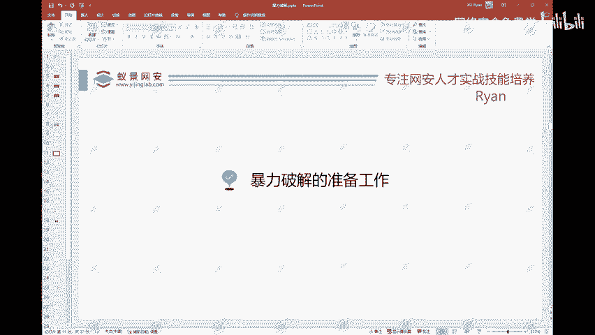

本节课中我们一起学习了暴力破解的基本概念、目的、网站权限体系以及实施前的准备工作。暴力破解是一种通过系统化试错来获取访问凭据的技术，理解其原理是学习Web安全的重要一步。请务必牢记，所有安全测试都应在合法合规的前提下进行。