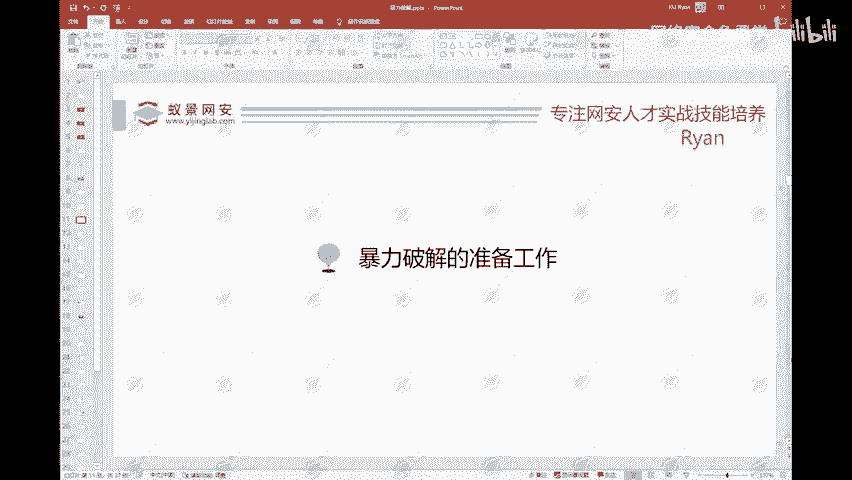
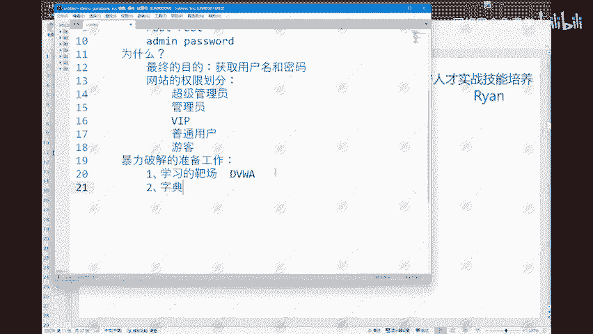
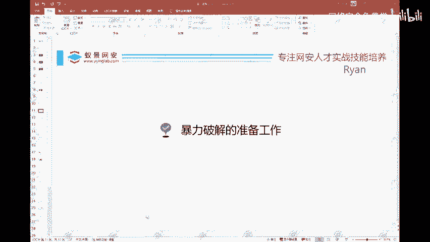

# 网络安全入门：P92：暴力破解实战准备



## 概述
在本节课中，我们将学习进行暴力破解攻击前必须完成的准备工作。我们将了解靶场、字典和核心工具的重要性，并介绍如何获取和使用它们。

## 准备工作清单
进行暴力破解攻击前，需要准备以下三样核心物品。

### 1. 学习靶场 🎯
首先，也是最重要的一点，是拥有一个合法的学习靶场。之所以需要靶场，是因为我们是在未获得授权的情况下进行学习。没有授权，我们不能对互联网上的公开网站或服务器发起攻击。如果你随意找一个网站进行爆破测试，可能导致其业务瘫痪。若网站管理员追溯到你，你将承担法律责任。因此，使用专用靶场是安全且合法的学习方式。

学习靶场有很多选择，可以自行搭建。例如，DVWA等知名靶场都是不错的选择。在本教程中，我将使用自己编写的一个小项目进行演示。如果大家没有这个靶场，可以联系课程助教获取其源码和搭建教程。

### 2. 密码字典 📚
第二项准备工作是字典。这里所说的字典并非《新华字典》，而是指存储了大量用户名或密码的文档文件，我们称之为“密码字典”。





我收集了许多不同类型的字典，例如：
*   1位数字字典
*   400万常用密码字典
*   入口令字典
*   超级综合字典

网络上经常公布近十年仍被高频使用的弱口令，这些密码通常在一秒钟内就能被爆破出来。因此，一个强大且全面的字典是成功进行暴力破解的关键。

### 3. 核心工具 🛠️
第三项是工具，这里特指 **Burp Suite**。这是一款功能极其强大的工具，也是网络安全从业者或爱好者必须掌握的工具。它的使用频率非常高，无论是在进行SRC漏洞挖掘还是实际工作中，都经常需要用到。

Burp Suite 最常用的功能包括抓包、修改数据包、重放请求，当然也包括我们本节重点要讲的暴力破解。掌握它的用法至关重要。

## 一个有趣的扩展：社工密码生成器
除了常规字典，还有一个好玩的工具值得介绍：社工密码生成器。这是一个基于社会工程学原理的工具。

它的原理是：如果你获得了某个人的个人信息（如姓名、生日、邮箱等），你可以将这些信息填入工具。工具会根据这些信息，智能组合生成一个专门针对此人的个性化密码字典。

**使用示例**：
假设目标人物姓“张”，名“三”，出生日期为2000年11月24日。我们将这些信息填入工具相应字段。

```java
// 这是一个简化的逻辑示例，并非实际工具代码
String firstName = "张";
String lastName = "三";
int birthYear = 2000;
int birthMonth = 11;
int birthDay = 24;
// 工具会调用算法，组合生成如 Zhang2000, San1124, Zs1124 等可能的密码
```

填写完毕后，点击生成，工具便会输出一个包含数百个可能密码的TXT文档。你可以课后尝试将自己的信息填入，看看生成的列表中是否包含你正在使用的密码。如需此工具，可向课程助教获取。

## 总结
本节课我们一起学习了进行暴力破解攻击前的三项核心准备工作：**合法的学习靶场**、**全面的密码字典**以及**强大的Burp Suite工具**。我们还了解了一个基于社会工程学的密码生成工具。做好这些准备，我们就能在安全、合法的环境下，正式开始探索暴力破解的实战技术。